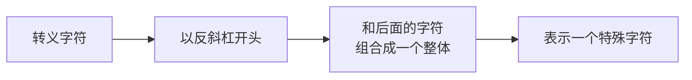
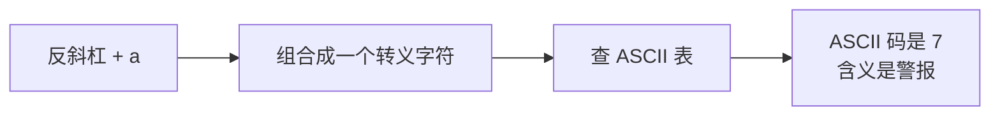
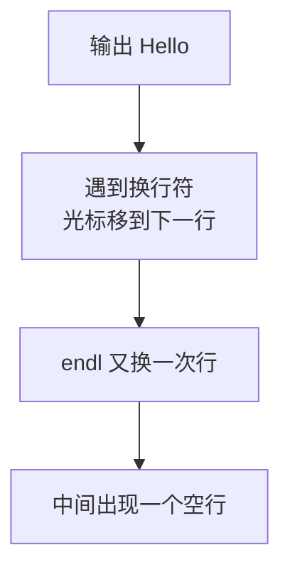
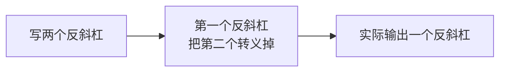

## 什么是转义字符

先回顾一下字符：`char a = 'y';` 里的 y 就是一个字符。

而**转义字符**，是在字符前面加上一个反斜杠，由反斜杠和后面的字符**组合成一个整体**，共同表示一个特殊的字符。



也就是说，反斜杠在这里不是单独的一个字符，而是一个"开关"，它会告诉编译器：我和后面这个字符要合在一起看，含义由这张表决定。



## 用 ASCII 码验证：`\a`

上一节学过字符可以和整数互相转换，那就用这个办法看看 `\a` 到底是什么。

```cpp
#include <iostream>

using namespace std;

int main() {
    char a = '\a';
    cout << (int)a << endl;
    return 0;
}
```

运行结果：

```text
7
```

也就是说，`\a` 是一个 ASCII 码为 7 的字符，它在 ASCII 表里的含义是**警报**。

## `\n`：换行符

`\n` 是最直观也最常用的一个转义字符。看下面这段代码：

```cpp
#include <iostream>

using namespace std;

int main() {
    char a = '\n';
    cout << "Hello";
    cout << a << endl;
    cout << "C++" << endl;
    return 0;
}
```

这里输出 Hello 的时候**没有加 endl**，中间却空出了一行：

```text
Hello

C++
```

原因是 `\n` 本身就是一个**换行符**。输出到它的时候，光标就移到下一行去了；后面又跟了一个 endl，于是再换一次行，中间就空出了一行。



`\n` 的 ASCII 码是 10。

## `\t`：制表符

`\t` 也很直观。在字符串里插入一个 `\t`：

```cpp
#include <iostream>

using namespace std;

int main() {
    cout << "Hello\tC++" << endl;
    return 0;
}
```

运行结果中，两个词之间多出了一段空白：

```text
Hello   C++
```

`\t` 代表 **tab**，也就是制表符，效果是让光标跳到下一个制表位。它显示出来大约相当于 4 个空格，具体宽度取决于终端的设置。

## `\\`：输出一个反斜杠

如果直接在字符串里写一个反斜杠，比如想输出 `Hello\C++`：

```cpp
#include <iostream>

using namespace std;

int main() {
    cout << "Hello\C++" << endl;
    return 0;
}
```

编译时就会出现波浪线警告，运行时后面的内容会乱码。因为反斜杠会和后面的字符 C 组合起来，试图构成一个转义字符，而 `\C` 并不是一个合法的转义字符。

那要输出反斜杠本身怎么办？**写两个反斜杠**：

```cpp
#include <iostream>

using namespace std;

int main() {
    cout << "Hello\\C++" << endl;
    return 0;
}
```

运行结果：

```text
Hello\C++
```



所以记住：**两个反斜杠代表一个反斜杠**。

## `\0`：字符串结束符

再看一个特别的：`\0`。

```cpp
#include <iostream>

using namespace std;

int main() {
    cout << "Hello\0C++" << endl;
    return 0;
}
```

运行结果只有：

```text
Hello
```

后面的 C++ 不见了。原因是 `\0` 表示**字符串到这里就结束了**，它后面的所有内容都会被忽略掉。


这个转义字符在讲字符串的时候会重点介绍，这里先记住它的效果就行。

## 八进制转义：`\077`

转义还有另一种写法：反斜杠加 0，再加两位数字，这种形式表示的是一个**八进制数**。

比如 `\077`，就是八进制下的 77。把它换算成十进制：7 乘 8 再加 7，等于 63。ASCII 码 63 对应的字符是问号。

```cpp
#include <iostream>

using namespace std;

int main() {
    cout << "Hello\077C++" << endl;
    return 0;
}
```

运行结果：

```text
Hello?C++
```

输出里真的出现了一个问号。

那为什么写成 `\088` 就不行呢？因为**八进制里没有数字 8**，所以编译器不会把 8 当成八进制的一部分，只把 `\0` 当作一个整体，也就是字符串结束符。于是后面的内容全部被截掉了：

```cpp
#include <iostream>

using namespace std;

int main() {
    cout << "Hello\088C++" << endl;
    return 0;
}
```

运行结果只有 Hello，后面的 88 和 C++ 都没有了。

## `\"`：输出引号

还有一个常见需求：字符串里面要显示引号。如果直接这么写：

```cpp
#include <iostream>

using namespace std;

int main() {
    cout << "Hello "C++"" << endl;
    return 0;
}
```

整个字符串的配对就错乱了，编译通不过。

正确的做法是给引号也加上一个反斜杠：

```cpp
#include <iostream>

using namespace std;

int main() {
    cout << "Hello \"C++\"" << endl;
    return 0;
}
```

运行结果：

```text
Hello "C++"
```

外面那对引号是字符串本身的引号，**不会显示出来**；里面那对是被转义后的引号，是真正要显示的内容。

## 经典转义字符一览

| 转义字符 | 含义 | ASCII 码 |
| --- | --- | --- |
| `\a` | 警报（响铃） | 7 |
| `\n` | 换行 | 10 |
| `\t` | 制表符（tab） | 9 |
| `\\` | 一个反斜杠 | 92 |
| `\"` | 双引号 | 34 |
| `\0` | 字符串结束符 | 0 |
| `\077` | 八进制 77 对应的字符 | 63（问号） |

其中 `\n` 是必须记住的，它非常常用；`\t`、`\\`、`\0` 也比较经典。

> [!TIP]
> 转义字符这个概念的"反直觉"之处在于：反斜杠改变了后面字符的含义，而不是它自己。看到反斜杠，就要把它和后面的字符**当成一个整体**来理解。

## 本章小结

**其一**，转义字符由反斜杠加上后面的字符组合而成，两者要当成一个整体来看，它表示一个特殊的字符。

**其二**，`\a` 的 ASCII 码是 7，含义是警报，可以用 `(int)a` 验证出来。

**其三**，`\n` 是换行符，ASCII 码是 10。输出到它时光标移到下一行，如果再跟一个 endl，就会出现一个空行。

**其四**，`\t` 代表 tab（制表符），效果是跳到下一个制表位，大约相当于 4 个空格，具体宽度取决于终端设置。

**其五**，直接写一个反斜杠会让它和后面的字符组合，导致编译警告和乱码；要输出反斜杠本身必须写两个反斜杠，即两个反斜杠代表一个反斜杠。

**其六**，`\0` 是字符串结束符，它后面的内容会被全部忽略。反斜杠加 0 再加两位数字表示八进制转义，如 `\077` 是八进制的 77，等于十进制 63，即问号；而 `\088` 里的 8 不是八进制数字，所以只按 `\0` 处理，后面内容全被截掉。

**其七**，字符串里要显示引号，需要写成 `\"`，外面那对引号不显示，里面转义后的引号才是真正输出的内容。