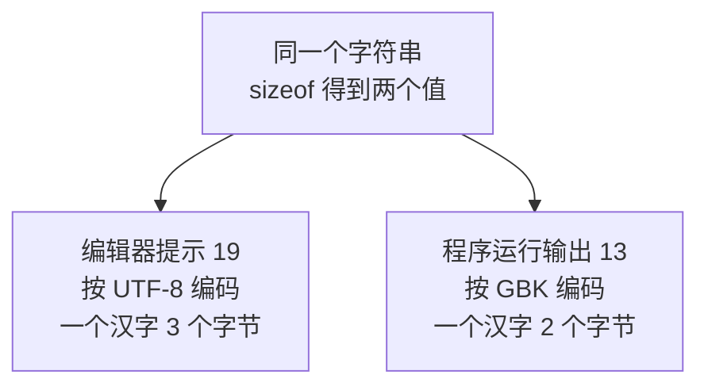
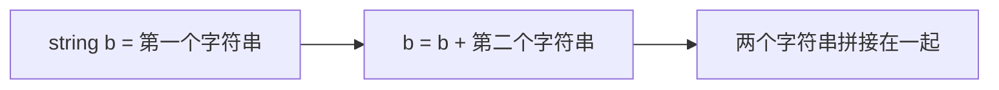
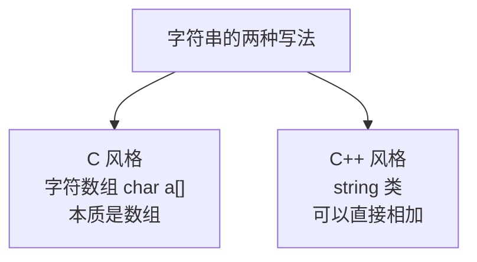

## 字符串是什么

字符串可以理解成**一串字符拼成的串**，并且在最后面自动加上一个**结束符**——就是上一节讲过的 `\0`。


正因为末尾有这个结束符，系统才知道这个串到哪里就结束了。这也是上一节里 `\0` 后面的内容会被忽略的原因。

另外，字符串本质上是一个**字符数组**。数组后面会专门讲，这里先了解写法就够了——编程语言里很多东西是相通的，不必因为还没学数组就先跳过字符串。

## C 风格字符串

C 风格的字符串写法是：char、变量名、一对中括号、等号、双引号括起来的字符串，最后加分号。

```cpp
#include <iostream>

using namespace std;

int main() {
    char a[] = "我爱学习编程";
    cout << a << endl;
    return 0;
}
```

运行结果：

```text
我爱学习编程
```

这里的双引号表示这是一个字符串常量，中括号则表明它是一个数组。这套符号组合记住就行。

## 用 sizeof 看字符串占多少字节

一个字符占一个字节，所以用 sizeof 看字符串占了多少字节，就能知道它包含了多少个字符。

```cpp
#include <iostream>

using namespace std;

int main() {
    char a[] = "我爱学习编程";
    cout << sizeof(a) << endl;
    return 0;
}
```

运行结果是：

```text
13
```

这个 13 是怎么来的？字符串里有 6 个汉字，每个汉字占 2 个字节，就是 12 个字节；末尾还有一个结束符占 1 个字节，加起来正好 13。

```text
6 × 2 + 1 = 13
```

## 为什么编辑器和运行结果不一样

有意思的是，把鼠标移到这个字符串上，编辑器给出的提示是 19，和运行结果 13 对不上。

原因在于**编码方式不同**：



按 UTF-8 算，一个汉字占 3 个字节，6 个汉字就是 18，再加结束符就是 19；按 GBK 算，一个汉字占 2 个字节，结果就是 13。

这只是编码方式的差别，不用纠结。如果想了解，可以去查一下 UTF-8 编码和 GBK 编码，这是计算机里的基础知识，在 C++ 里不需要展开。

> [!NOTE]
> 上面算出的 13 是**这个编译器当前使用的编码**下的结果。换一个编译器或换一种编码设置，同样的字符串 sizeof 出来的值可能不同，这是正常的。

## C++ 风格的 string

C++ 里还提供了另一种更省事的写法：标准库已经把字符串封装成了一个**类**，名字叫 string。

```cpp
#include <iostream>
#include <string>

using namespace std;

int main() {
    string b = "Hello";
    cout << b << endl;
    return 0;
}
```

运行结果：

```text
Hello
```

写法上简单很多：直接写 string、变量名、等号、双引号字符串即可，不需要中括号。这里的 b 就是 string 这个类的一个**对象**，类和对象后面会专门讲。

需要注意的是，使用 string 必须额外引入一个头文件：

```cpp
#include <string>
```

原本只需要引入 `<iostream>`，用 string 就要再加上 `<string>`。

## string 可以直接相加

string 最大的好处是**方便**。最直观的一点是：两个字符串可以直接相加。

```cpp
#include <iostream>
#include <string>

using namespace std;

int main() {
    string b = "Hello";
    b = b + " C++";
    cout << b << endl;
    return 0;
}
```

运行结果：

```text
Hello C++
```



字符串之间可以直接相加拼接，这是 C 风格字符串做不到的，所以在 C++ 里用 string 会方便得多。

## 两种写法的对比



C++ 完全兼容 C 语言的语法，所以 C 风格的写法在 C++ 里也能用，两种方式都是可以的，只是 C++ 的 string 更方便。

## 本章小结

**其一**，字符串就是一串字符拼成的串，末尾会自动加上一个结束符 `\0`，系统靠它判断字符串到哪里结束。字符串本质上是一个字符数组，数组后面会专门讲。

**其二**，C 风格字符串的写法是 `char a[] = "...";`，即 char、变量名、一对中括号、等号、双引号字符串，最后加分号。

**其三**，一个字符占一个字节，所以 `sizeof(a)` 就能算出字符串占多少字节。`"我爱学习编程"` 的结果是 13，即 6 个汉字乘 2 字节加上 1 个结束符。

**其四**，编辑器提示的值（19）和运行结果（13）可能不一致，这是编码方式不同造成的：UTF-8 下一个汉字占 3 字节，GBK 下一个汉字占 2 字节。这属于编码的基础知识，不必纠结，算出的结果取决于当前编译器使用的编码。

**其五**，C++ 里可以用标准库封装的 string 类，写法是 `string b = "...";`，比 C 风格简单，但必须额外引入头文件 `<string>`。b 是 string 类的一个对象。

**其六**，string 可以直接用加号拼接，例如 `b = b + " C++";`，这是它比 C 风格字符串方便的地方。C++ 兼容 C 语法，两种写法都能用。