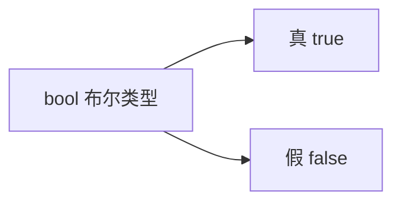
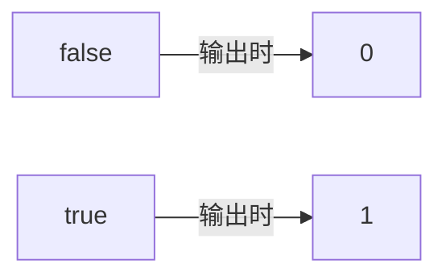
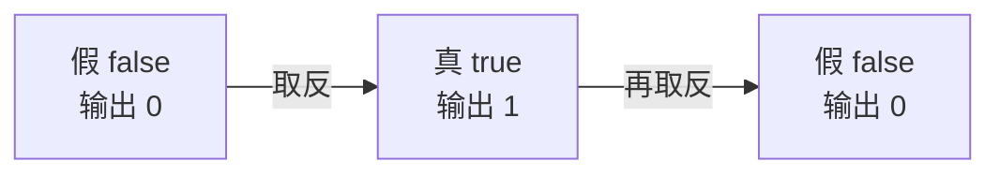
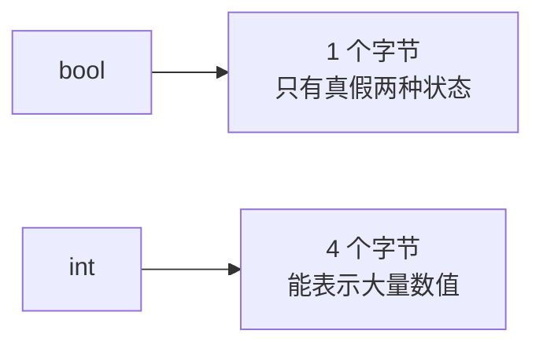

## 布尔类型是什么

布尔类型是一个新的数据类型，它的特点非常单一：**只有两种状态，一种是真，一种是假**。



记住"真"和"假"这两个字就够了。

## 两个关键字：true 和 false

布尔类型的关键字是 bool，它有两个取值，也各是一个关键字：**false** 表示假，**true** 表示真。

定义两个布尔变量，一个赋假，一个赋真：

```cpp
#include <iostream>

using namespace std;

int main() {
    bool flag1 = false;
    bool flag2 = true;
    cout << flag1 << endl;
    cout << flag2 << endl;
    return 0;
}
```

## 输出的是整数

运行结果：

```text
0
1
```

flag1 是 false，输出 0；flag2 是 true，输出 1。

也就是说，虽然 true 和 false 是关键字，但输出的时候得到的其实是**整数**：false 用 0 表示，true 用 1 表示。



真假互为反面：真的反面就是假，假的反面就是真。

## 取反运算

布尔值可以取反，用的符号是**感叹号**。把它写在布尔变量前面，就能把真假颠倒过来。

```cpp
#include <iostream>

using namespace std;

int main() {
    bool flag1 = false;
    bool flag2 = true;
    cout << flag1 << endl;
    cout << flag2 << endl;
    cout << !flag1 << endl;
    cout << !flag2 << endl;
    return 0;
}
```

运行结果：

```text
0
1
1
0
```

前两个数还是原来的 0 和 1。后两个是取反后的结果：flag1 本来是 0，加了感叹号变成 1；flag2 本来是 1，加了感叹号变成 0。



所以取反的规律就是：**本来是 0 就变成 1，本来是 1 就变成 0**。布尔值主要用在逻辑运算里，这里先掌握取反。

## 布尔类型占几个字节

用 sizeof 看一下：

```cpp
#include <iostream>

using namespace std;

int main() {
    cout << sizeof(bool) << endl;
    return 0;
}
```

运行结果是：

```text
1
```

布尔类型占 **1 个字节**。

为什么 1 个字节就够了？因为它只有两种状态，用 1 个字节来存放完全够用；如果给它 2 个字节，那就浪费了。

## 用 int 代替 bool 可以吗

用整数来当布尔值用也是可以的，两种写法都能表达真假。

区别在于占用的空间：



用 sizeof 验证一下就很清楚：

```cpp
#include <iostream>

using namespace std;

int main() {
    cout << sizeof(bool) << endl;
    cout << sizeof(int) << endl;
    return 0;
}
```

运行结果：

```text
1
4
```

bool 占 1 个字节，int 占 4 个字节。既然只需要表达真假两种状态，用 bool 就够了，也更省空间。

## 本章小结

**其一**，布尔类型的关键字是 bool，只有真和假两种状态，对应两个关键字：false 表示假，true 表示真。

**其二**，输出布尔变量时得到的是整数：false 输出 0，true 输出 1。真假互为反面。

**其三**，用感叹号可以对布尔值取反，规律是"本来是 0 就变成 1，本来是 1 就变成 0"。布尔值主要用于逻辑运算，取反是其中最基础的一种。

**其四**，布尔类型占 1 个字节。因为它只有两种状态，1 个字节完全够用，给 2 个字节就是浪费。

**其五**，用 int 也能表示真假，两种写法都可以；区别在于 bool 只占 1 个字节，而 int 占 4 个字节，表达真假时用 bool 更省空间。