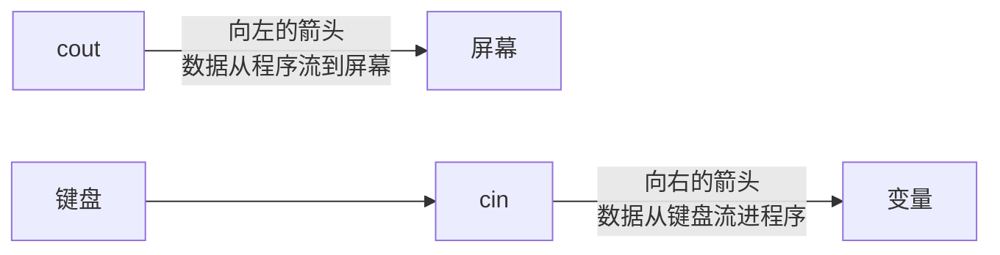
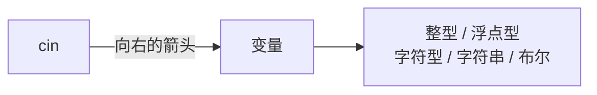
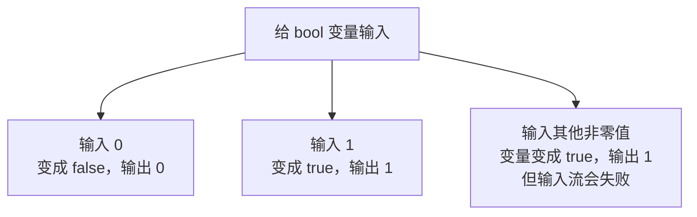
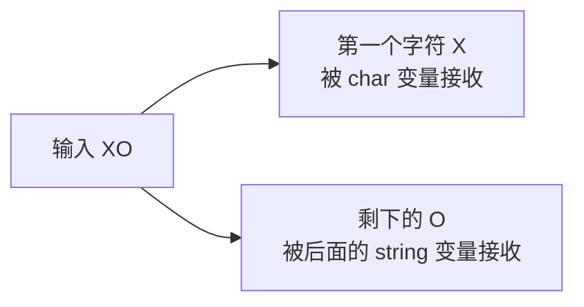

## 输入和输出的区别

前面学的都是**输出**：计算机把结果给我们人看。

这一节讲**输入**：人把数据交给计算机。


## iostream 里的 i 和 o

到这里就能解释之前那个头文件的名字了：`<iostream>` 里的 i 指的是 **input**，也就是输入；o 指的是 **output**，也就是输出。

既然前面讲了输出，这一节就把输入补齐。每种数据类型都过一遍：整型、浮点型（也叫实型）、字符型、字符串型，以及布尔类型。

## cin 与 cout：箭头的方向

输出用的是 cout，输入用的是 **cin**。

两者的箭头方向刚好相反，也很好记：



cout 配的是向左的箭头，cin 配的是向右的箭头。可以理解成一条流水，水往右流动，从键盘流进程序里。

## 五种类型的输入

先看整型。定义一个整型变量并初始化，然后接收输入：

```cpp
#include <iostream>

using namespace std;

int main() {
    int a = 5;
    cin >> a;
    cout << "a = " << a << endl;
    return 0;
}
```

运行之后程序**不会立刻结束**，因为它正在等你输入。这时输入 7 再回车：

```text
7
```

输出结果：

```text
a = 7
```

可以看到 a 原来的值 5 被输入的内容**覆盖**掉了。

浮点型、字符型、字符串型的写法完全一样，只是变量的类型不同：

```cpp
#include <iostream>
#include <string>

using namespace std;

int main() {
    int a = 5;
    double b = 7;
    char c = 'x';
    string d = "";
    cin >> a;
    cout << "a = " << a << endl;
    cin >> b;
    cout << "b = " << b << endl;
    cin >> c;
    cout << "c = " << c << endl;
    cin >> d;
    cout << "d = " << d << endl;
    return 0;
}
```

按顺序输入 `56`、`6.789`、`X`、`hello`，回车分隔：

```text
a = 56
b = 6.789
c = X
d = hello
```



用 cin 接收输入时，**所有类型都是同一个模式**：cin、向右的箭头、变量名。只是变量类型不同而已。

两个细节要注意：字符串用 string 时需要引入头文件 `<string>`；它不能像整数那样初始化为 7，一般初始化为一个空串 `""`。

short、long long 这些整数类型的输入方式也一样，可以自己动手试。

## 布尔类型的输入

布尔类型的输入稍微特殊一点，它只认 0 和 1。

```cpp
#include <iostream>

using namespace std;

int main() {
    bool e = false;
    cin >> e;
    cout << "e = " << e << endl;
    return 0;
}
```

输入 0，e 变成 false，输出 0；输入 1，e 变成 true，输出 1。



如果输入 4 这样的非零值，变量会变成 true，输出 1——因为对布尔类型来说，非零就是真。但这时**输入流会进入失败状态**，后面的输入就全部失效了，这一点下一小节会看得更清楚。

## 非法输入会怎样

如果输入的内容不符合变量的类型，会出问题。比如给一个整型变量输入一串字符：

```cpp
#include <iostream>

using namespace std;

int main() {
    int a = 5;
    cin >> a;
    cout << "a = " << a << endl;
    return 0;
}
```

输入 `hello` 之后，a 会变成 0，而不是保持 5。


更麻烦的是最后一步：一旦输入流进入失败状态，**后面所有的输入都会失效**。如果程序里有一连串的输入，第一个错了，后面就"全错了"。

所以输入的内容至少要在变量的**数据类型范围之内**：给整型就得输整数，给浮点型就得输浮点数，不能乱来。

## 字符型输入的坑

有一个很有意思的现象，和字符型有关。看下面这段代码：

```cpp
#include <iostream>
#include <string>

using namespace std;

int main() {
    char c = 'x';
    string d = "";
    cin >> c;
    cout << "c = " << c << endl;
    cin >> d;
    cout << "d = " << d << endl;
    return 0;
}
```

这里不分开输入，而是连着输入 `XO`：

```text
c = X
d = O
```

结果是 X 被字符变量 c 接收了，而剩下的 O 被后面的字符串变量 d 接收了。



这说明：**字符型只接收一个字符**，多出来的部分会留在输入流里，被后面的输入操作接手。理解这一点，就能明白很多"输入错位"的问题是怎么来的。

## 关于布尔类型的建议

既然布尔类型输入非 0 和 1 的值会导致输入流失效，实际写代码时一般**不用布尔类型直接接收输入**。

更稳妥的做法是：先输入一个整数，再根据整数的值去判断真假。

## 本章小结

**其一**，输出是计算机给人看的结果，输入是人交给计算机的数据。`<iostream>` 里的 i 是 input（输入），o 是 output（输出）。

**其二**，输出用 cout 配向左的箭头，输入用 cin 配向右的箭头。箭头方向可以理解成数据流动的方向。

**其三**，所有类型的输入都是同一个模式：cin、向右的箭头、变量名。整型、浮点型、字符型、字符串、布尔类型的区别只在于变量的类型。字符串用 string 时要引入 `<string>`，一般初始化为空串。输入的值会覆盖变量原来的值，程序运行到输入语句时会停下来等待输入。

**其四**，布尔类型只认 0 和 1：输入 0 变成 false 输出 0，输入 1 变成 true 输出 1；输入其他非零值（如 4）时变量会变成 true 输出 1，但输入流会进入失败状态。

**其五**，非法输入会出问题：内容不符合变量类型时提取失败，变量会被写成 0，同时输入流进入失败状态，导致后面所有的输入全部失效。所以输入的内容必须在数据类型的范围之内。

**其六**，字符型只接收一个字符。连着输入 XO 时，X 被 char 变量接收，剩下的 O 会被后面的输入操作接手，这是"输入错位"类问题的根源。

**其七**，由于布尔类型接收非 0、1 的值会导致输入流失效，实际编码时一般不直接用布尔类型接收输入，而是先输入整数再判断真假。