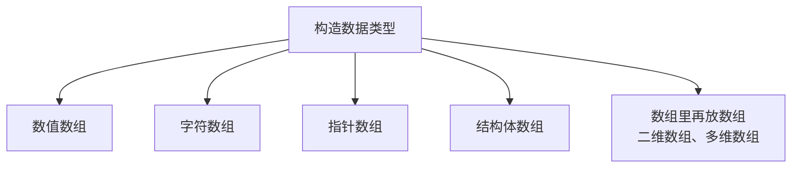
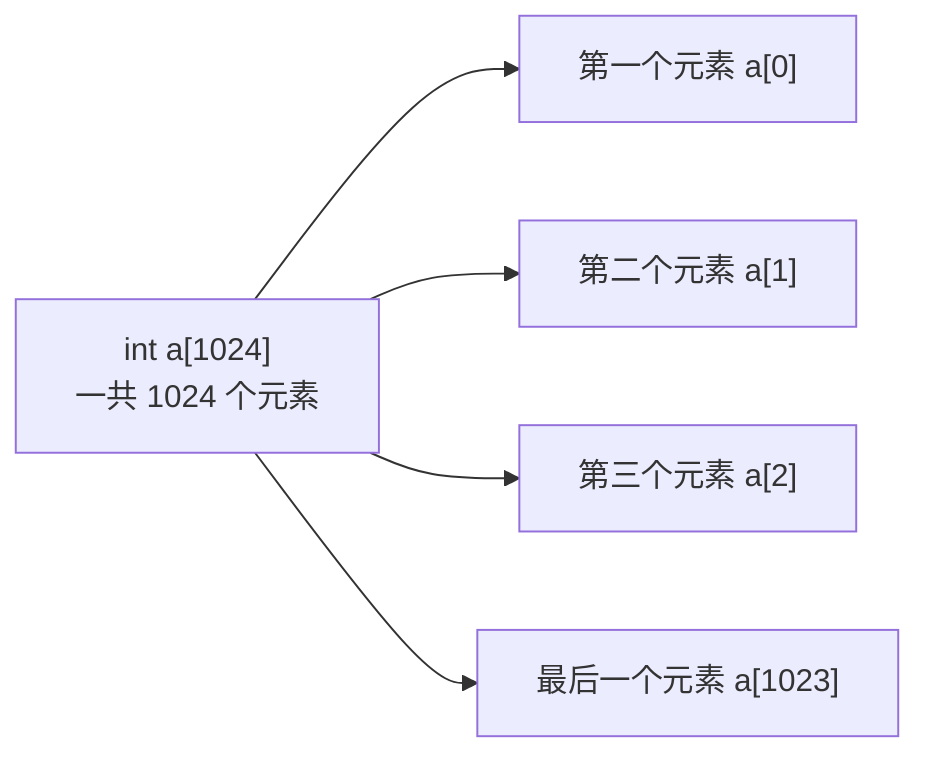
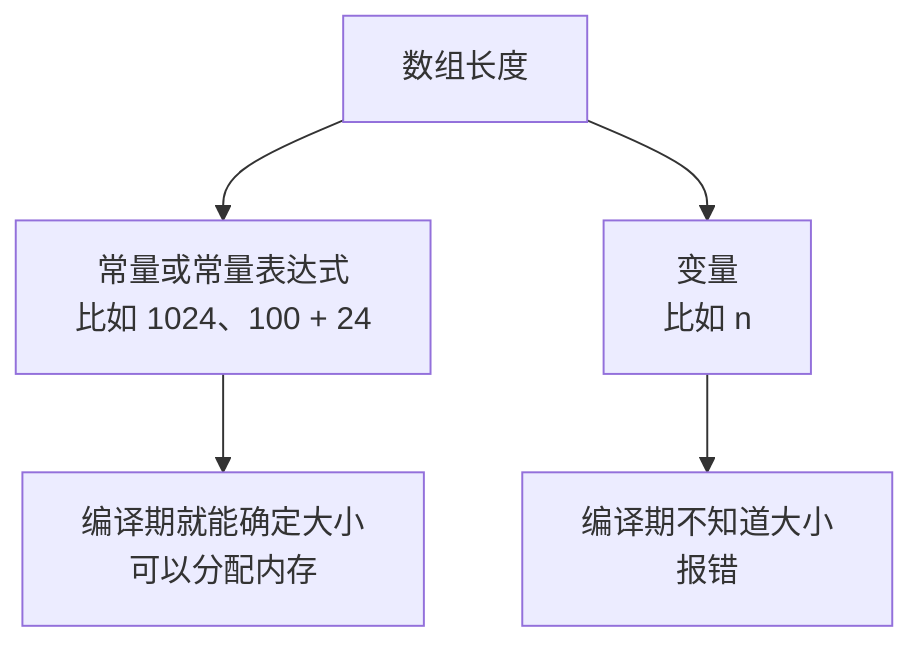
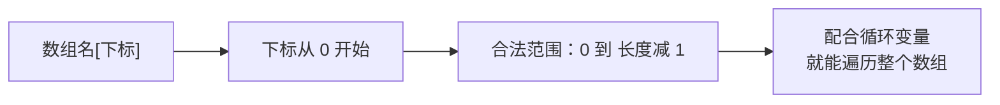
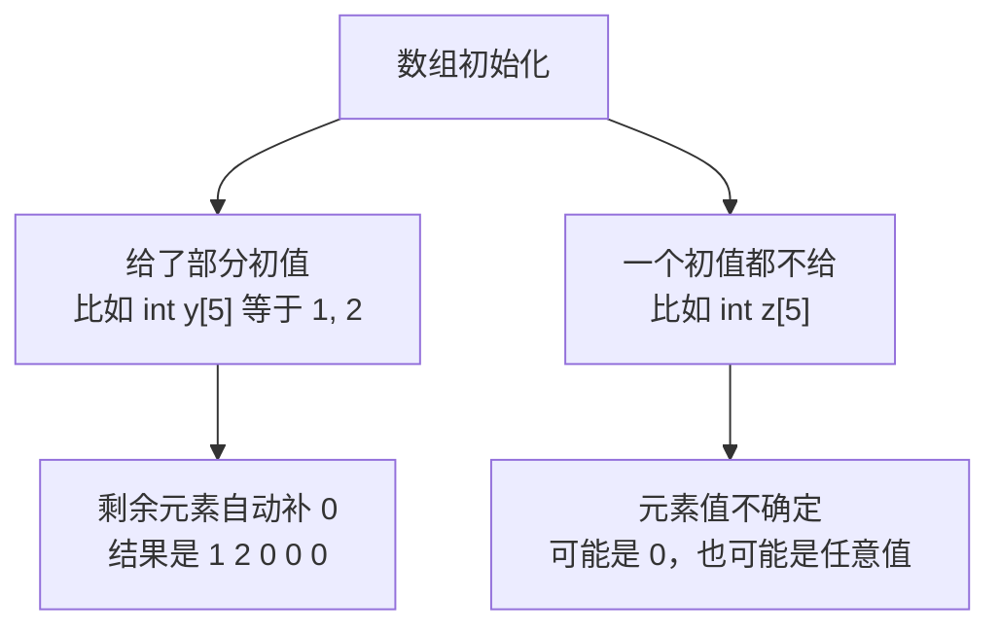
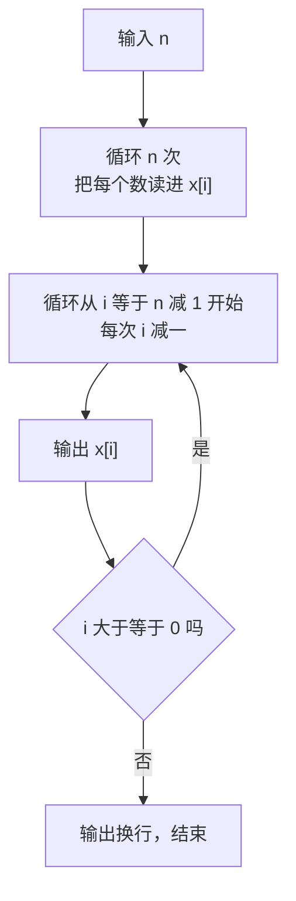

## 数组是什么

写程序时经常会遇到这样的情况：需要处理一批**类型相同**的数据。比如要存 1024 个整数，如果老老实实定义 1024 个变量，光是起名字就够头疼了，更别提后面还要一个个去用。

为了解决这个问题，C++ 提供了一种把**相同类型的变量有序地组织在一起**的方式，组织起来的这一批数据元素就叫**数组**。

数组在 C++ 里属于**构造数据类型**，也就是由基本类型组合出来的类型。按里面元素的类型不同，可以分成数值数组、字符数组、指针数组、结构体数组等等；数组里还可以再放数组，也就是二维数组、多维数组。



这一节先看最简单的一维数组。

## 一维数组的定义

### 定义格式

一维数组的定义格式是：

```text
数据类型 数组名[元素个数];
```

三个部分分别是：**数据类型**决定这个数组里所有元素是什么类型，**数组名**是这个数组的名字，**方括号里的数字**表示这个数组有多少个元素。方括号里除了写数字，也可以写一个**常量表达式**。最后别忘了分号。


### 几个例子

照着这个格式套进去，就能定义出各种数组：

```cpp
#include <iostream>

using namespace std;

int main() {
    int a[1024];
    double b[520];
    char c[1314];
    return 0;
}
```

这三行分别定义了：`a` 是一个具有 1024 个元素的整型数组，`b` 是一个具有 520 个元素的浮点型数组，`c` 是一个具有 1314 个元素的字符数组。

### 定义数组的四条规则

定义数组时有四条规则要记住。

**第一，数组里所有元素的类型都是相同的。** `int a[1024]` 里的 1024 个元素全是整型，`double b[520]` 里全是浮点型，`char c[1314]` 里全是字符型。数组不能混着放不同类型的数据，想放不同类型得用结构体。

**第二，数组名本身也是一个变量名。** 所以它不能和其他变量重名，也要满足标识符的命名规则（只能用字母、数字、下划线，不能以数字开头，不能是关键字）。比如上面已经定义了 `a`，再写一句 `int a[1024];` 就会报错，提示**变量名重复**。

**第三，数组下标是从 0 开始的。** 这一点非常重要，后面访问元素全靠它。`int a[1024]` 虽然有一千零二十四个元素，但它们的下标是从 0 数到 1023 的：第一个元素是 `a[0]`，第二个是 `a[1]`，……最后一个元素是 `a[1023]`。



**第四，方括号里的元素个数必须是常量。** 也就是说，定义数组时那个数字必须能在编译阶段就确定下来。

### 长度必须是常量

为什么必须写常量？因为编译器要在编译阶段就知道这个数组要占多大内存，好提前把空间分配好。如果长度是个变量，编译器就不知道该分配多少了。

所以下面这种写法是**错误的**：

```cpp
    int n = 1000;
    int d[n];
```

这里 `n` 是一个变量，用变量当数组长度，编译器会直接报错。这种在定义时就确定好大小的数组叫**静态数组**。



> [!NOTE]
> 标准 C++ 要求数组长度必须是编译期常量。个别编译器会把"用变量当长度"当成自己的扩展而放行，但这不符合标准，换一个编译器可能就编不过了，所以不要依赖这种写法。长度必须提前确定时，可以用后面会学的动态内存分配。

### 一行定义多个数组

如果几个数组类型相同，可以把它们写在同一行里，用逗号隔开：

```cpp
#include <iostream>

using namespace std;

int main() {
    int x1[10], x2[20], x3[30];
    return 0;
}
```

也可以和普通变量混在一起定义：

```cpp
#include <iostream>

using namespace std;

int main() {
    int x4[10], x5 = 100, x6[30];
    return 0;
}
```

这两种写法都是允许的，不过一次定义太多变量可读性会变差，实际写代码时不建议堆在一行里。

## 数组元素的访问

### 访问格式与下标范围

访问数组元素的格式是：

```text
数组名[下标]
```

比如要访问 `a` 的第 0 个元素就写 `a[0]`，访问第 1023 个元素就写 `a[1023]`。中括号里的下标可以是常量，也可以是变量，甚至是一个表达式：

```cpp
#include <iostream>

using namespace std;

int main() {
    int a[1024];
    a[0] = 1;
    a[1023] = 2;
    int i = 5;
    a[i] = 3;
    a[i + 1] = 4;
    return 0;
}
```

`a[i]` 表示"访问第 i 个元素"，`a[i + 1]` 表示"访问第 i 加 1 个元素"。正是因为这个特点，数组才能和循环配合得这么好——用循环变量当下标，就能一次性把整个数组遍历一遍。



> [!WARNING]
> 数组下标合法范围是 **0 到长度减一**。对于 `int a[1024]`，能用的最大下标是 1023。如果写了 `a[1024]` 或 `a[2000]`，就属于**越界访问**——C++ 不会自动检查这个错误，程序可能读到一段莫名其妙的数据，或者直接崩溃，而且不报错，很难排查。所以用下标时一定要想清楚边界。

### 数组的初始化

定义数组的时候可以顺便给它一些初始值，用一对花括号把值列出来：

```cpp
#include <iostream>

using namespace std;

int main() {
    int x[5] = {1, 2, 3, 4, 5};
    for (int i = 0; i < 5; i++) {
        cout << x[i] << " ";
    }
    cout << endl;
    return 0;
}
```

花括号里的值会**按顺序**依次赋给数组元素：1 给 `x[0]`，2 给 `x[1]`，3 给 `x[2]`，4 给 `x[3]`，5 给 `x[4]`。运行结果：

```text
1 2 3 4 5
```

这就是数组最常用的使用方式：**初始化好数据，再用循环配合下标把它们一个个取出来处理。**

### 未初始化元素的处理

如果花括号里的值**比数组长度少**，那么前面这些元素按顺序拿到初值，**剩下的元素会被自动补成 0**：

```cpp
#include <iostream>

using namespace std;

int main() {
    int y[5] = {1, 2};
    for (int i = 0; i < 5; i++) {
        cout << y[i] << " ";
    }
    cout << endl;
    return 0;
}
```

只给了两个初值，所以 `y[0]` 是 1、`y[1]` 是 2，后面三个元素被补成 0。运行结果：

```text
1 2 0 0 0
```

但如果**一个初值都不给**，情况就不一样了。局部数组（定义在函数内部的数组）里没有初始化的元素，值是不确定的，可能是 0，也可能是任意一个奇怪的数字，具体是多少取决于编译器、运行环境等等，**不能想当然地认为它一定是 0**。



> [!TIP]
> 既然没初始化的元素值不确定，规范的做法就是**只访问已经初始化过的元素**，不要去读那些没赋过值的元素。如果确实需要一个全 0 的数组，可以写 `int z[5] = {0};`，这样所有元素都会被初始化为 0。

## 应用：逆序输出

数组最典型的应用之一，就是**把数据先存起来，再按需要的方式处理**。下面用一道经典题目来练手：输入一个 N 和 N 个数，把它们**逆序**输出。

```cpp
#include <iostream>

using namespace std;

int main() {
    int n;
    cin >> n;
    int x[100];
    for (int i = 0; i < n; i++) {
        cin >> x[i];
    }
    for (int i = n - 1; i >= 0; i--) {
        cout << x[i] << " ";
    }
    cout << endl;
    return 0;
}
```

因为题目说 N 的范围小于 100，所以定义一个 100 个元素的数组 `x` 就够用了。

程序分三步走：第一步读入 N，也就是接下来要输入几个数；第二步用一个 for 循环把这 N 个数依次读进数组，第 0 个数放进 `x[0]`，第 1 个数放进 `x[1]`，以此类推，读完以后 `x[0]` 到 `x[n-1]` 这些位置上都有数了；第三步再用一个 for 循环**从后往前**遍历，从 `x[n-1]` 一直输出到 `x[0]`，自然就实现了逆序。



运行结果，输入 `6` 和 `6 7 8 4 5 6`：

```text
6 5 4 8 7 6
```

输入的六个数是 6、7、8、4、5、6，输出时从最后一个数开始倒着取，正好得到 6、5、4、8、7、6，完全逆序。

这里有个细节值得注意：逆序输出的那个 for 循环，**初始值是 `n - 1` 而不是 `n`**。因为数组下标最大只到 `n - 1`，如果从 `n` 开始就属于越界访问了。循环的终止条件也要用 `i >= 0`，因为下标 0 是有效的，要输出到它为止。

## 本章小结

**其一**，数组是把**一批相同类型的变量有序地组织在一起**的数据结构，在 C++ 里属于构造数据类型。按元素类型可分为数值数组、字符数组、指针数组、结构体数组等，数组里还可以再放数组构成二维数组。

**其二**，一维数组的定义格式是 `数据类型 数组名[元素个数];`，方括号里除了数字也可以写常量表达式，末尾要有分号。比如 `int a[1024]` 是 1024 个整型元素的数组，`double b[520]` 是 520 个浮点型元素的数组。

**其三**，定义数组有四条规则：数组里**所有元素的类型必须相同**；数组名本身是变量名，**不能和其他变量重名**，且要满足标识符规则；**下标从 0 开始**，`int a[1024]` 的有效下标是 0 到 1023；方括号里的元素个数**必须是常量**。

**其四**，数组长度必须是常量，因为编译器要在编译阶段就知道数组占多大内存、好提前分配。用变量当长度（比如 `int n = 1000; int d[n];`）是不符合标准的，编译器会报错。这类大小在定义时就定好的数组叫**静态数组**。

**其五**，类型相同的多个数组可以写在同一行用逗号隔开，也可以和普通变量混在一起定义，但不建议堆在一行里，可读性差。

**其六**，访问数组元素的格式是 `数组名[下标]`，下标可以是常量、变量或表达式，所以能配合循环变量来遍历整个数组。**下标合法范围是 0 到长度减一**，越界访问 C++ 不会检查、也不报错，可能读到莫名其妙的数据甚至崩溃，用下标时一定要留意边界。

**其七**，数组可以在定义时用花括号初始化，值会按顺序依次赋给各个元素。如果初值个数比长度少，**剩余元素会被自动补成 0**；如果一个初值都不给，局部数组的元素值是**不确定的**，不能认为它一定是 0。

**其八**，规范的做法是**只访问初始化过的元素**。需要一个全 0 的数组时可以写 `int z[5] = {0};`，这样所有元素都会被初始化为 0。

**其九**，数组的经典用法是"先把数据存起来，再按需要的方式处理"，比如逆序输出：先用循环把 N 个数读进数组，再从 `n - 1` 倒着遍历到 0 依次输出。要注意逆序循环的起点是 `n - 1` 而不是 `n`，否则就越界了。