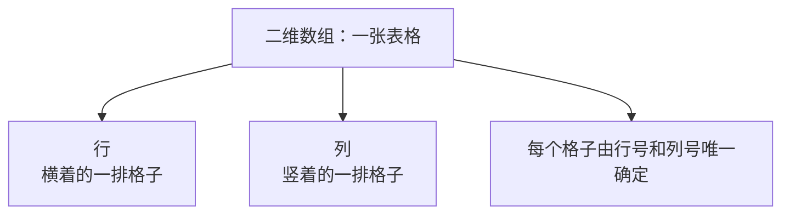
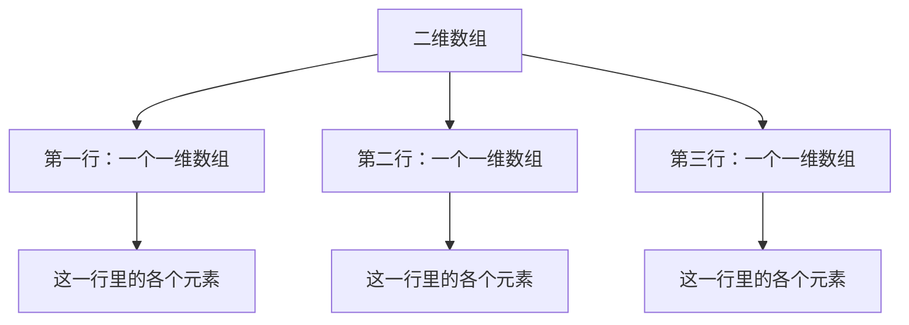
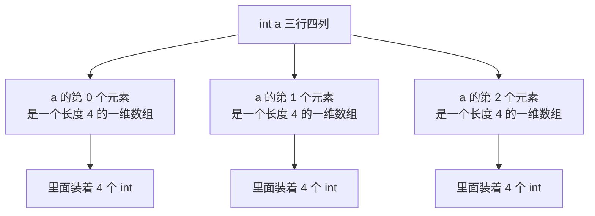
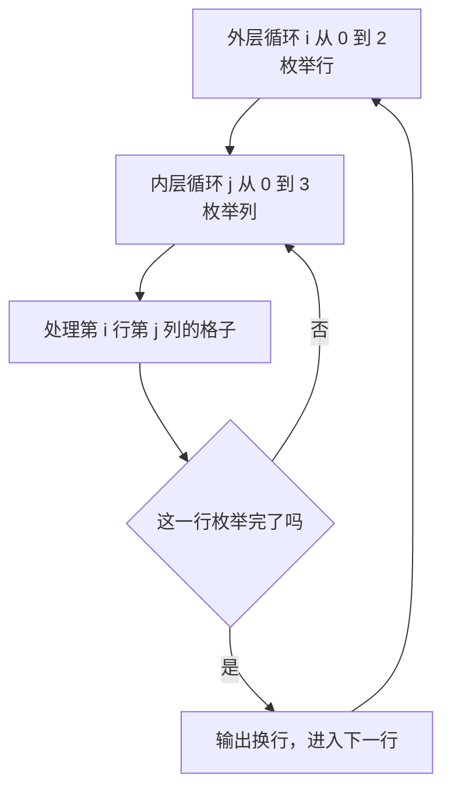
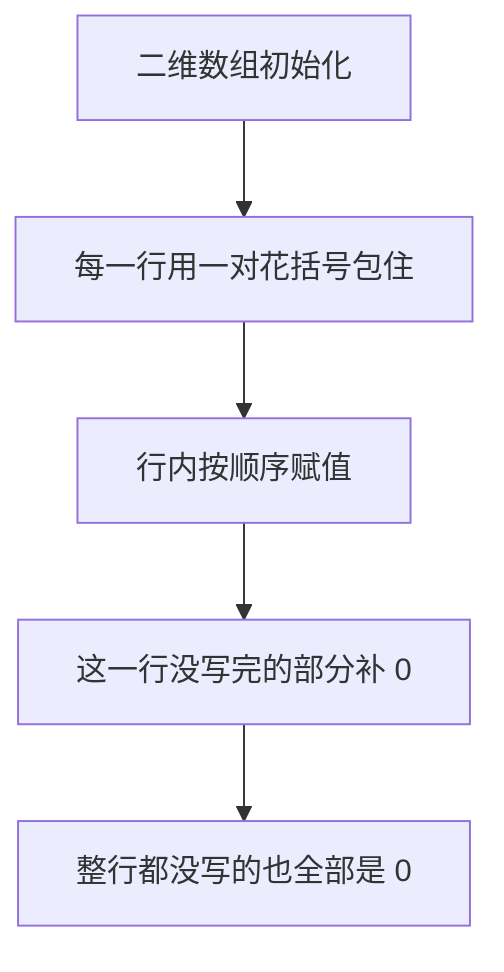
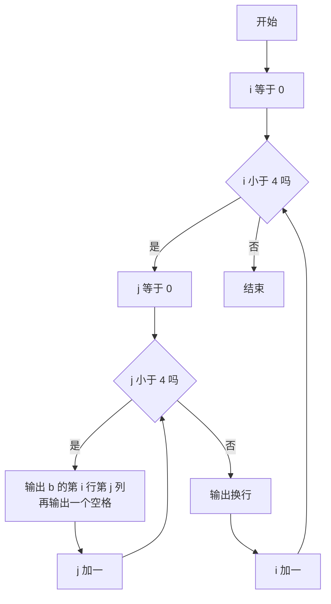

## 从一维数组到二维数组

一维数组可以理解成数据结构里的**顺序表**：一批相同类型的元素挨着排放，靠下标就能定位到某一个。不过 C++ 里的数组是**静态**的，定义好之后长度就固定了，不能扩容，所以必须提前知道一共要放多少个元素。一旦放的元素超过了定义的长度，就会造成**下标越界**。

如果数据不是排成一条线，而是排成一个**表格**——有行有列，那该怎么办？比如一张成绩表，每行是一个学生，每列是一门科目；再比如一张棋盘，每个格子要记录状态。这种"有行有列"的结构，就需要用**二维数组**来存。

二维数组其实是一种特殊的数组，它可以用来**存储表格**，具有行和列的竖结构。最常见的类比就是 Excel 表格：每个格子都有一个行号和一个列号，横着看是一行，竖着看是一列，这正是一个二维数组的样子。



换个角度看：**一个二维数组其实是由若干个一维数组组成的**，每个一维数组又包含了若干个元素。这些元素按照行和列的方式存储和索引。



因为这种"有行有列"的样子，二维数组也常和线性代数里的**矩阵**联系起来，很多矩阵相关的题目都是用二维数组来做的。

## 二维数组的定义

### 定义格式

二维数组的定义格式是：

```text
数据类型 数组名[行数][列数];
```

和一位数组相比，多了一对方括号。三个部分分别是：**数据类型**决定每个元素是什么类型，**数组名**是这个数组的变量名，**第一个方括号**是行数（有多少行），**第二个方括号**是列数（每一行上有多少个元素）。


### 例子：三行四列

比如要定义一个**三行四列**的整型二维数组：

```cpp
#include <iostream>

using namespace std;

int main() {
    int a[3][4];
    return 0;
}
```

`a` 一共能放 3 乘 4 等于 12 个整型元素。可以把它想象成三行、每行四个格子：

```text
第 0 行：a[0][0]  a[0][1]  a[0][2]  a[0][3]
第 1 行：a[1][0]  a[1][1]  a[1][2]  a[1][3]
第 2 行：a[2][0]  a[2][1]  a[2][2]  a[2][3]
```

可以看到，**行号和列号同样是从 0 开始的**，所以三行的行号是 0、1、2，四列的列号是 0、1、2、3。这和一维数组下标从 0 开始是完全一致的。

### 行和列必须是常量

和一维数组一样，**行和列也必须是常量，不能使用变量**：

```cpp
    int n = 3, m = 4;
    int a[n][m];
```

这样写编译器会报错，因为编译阶段不知道要给这个数组分配多大内存。所以定义二维数组时，行数和列数都要写成确定的常量。

### 二维数组本质上还是一维数组

前面说过二维数组是由若干个一维数组组成的，这句话不只是个比喻，在 C++ 里它是**字面上的事实**。

`int a[3][4]` 这个定义，读法应该从右往左：首先它是一个有 3 个元素的数组，而这 3 个元素**每一个又是一个"有 4 个 int 的一维数组"**。也就是说，二维数组本身就是一个一维数组，只不过它的每个元素恰好是一维数组。



正因为这样，**二维数组满足一维数组的所有特性**：下标从 0 开始、长度固定、越界不报错、元素类型必须相同、行和列必须是常量。理解了这一点，二维数组就没有新东西了，它只是一维数组套了一层。

## 二维数组的访问

### 访问格式

访问二维数组元素的格式是：

```text
数组名[行下标][列下标]
```

要访问第 i 行第 j 列的元素，就写 `a[i][j]`。这里的行下标和列下标都可以是常量、变量或者表达式，所以同样能配合循环来遍历。

### 用双层循环遍历

既然每个元素要靠"行 + 列"两个下标来定位，遍历整个二维数组自然就需要**两层嵌套的循环**：外层循环枚举行，内层循环枚举列。

下面这个程序用两层循环给三行四列的数组赋值，赋值规则是 `a[i][j] = i * j`：

```cpp
#include <iostream>

using namespace std;

int main() {
    int a[3][4];
    for (int i = 0; i < 3; i++) {
        for (int j = 0; j < 4; j++) {
            a[i][j] = i * j;
        }
    }
    for (int i = 0; i < 3; i++) {
        for (int j = 0; j < 4; j++) {
            cout << a[i][j] << " ";
        }
        cout << endl;
    }
    return 0;
}
```

外层 `i` 从 0 到 2 枚举行，内层 `j` 从 0 到 3 枚举列。对于每个格子，把行号和列号相乘的结果放进去。赋值完成后再用同样的两层循环把它打印出来，每打印完一行就输出一个换行符，这样屏幕上显示的就是一张表格的样子。

运行结果：

```text
0 0 0 0
0 1 2 3
0 2 4 6
```

第一行是第 0 行，行号是 0，所以每个格子 0 乘任何列号都是 0；第二行行号是 1，于是列号依次是 1、2、3；第三行行号是 2，于是列号乘 2 得到 2、4、6。



### 数组的初始化

二维数组也可以在定义时初始化。写法是**用一对花括号包住整体，每一行再用一对花括号包住自己那一行的初值**：

```cpp
#include <iostream>

using namespace std;

int main() {
    int b[4][4] = {
        {1, 2},
        {2, 3},
        {6, 7, 8},
        {9, 1}
    };
    return 0;
}
```

这是一个四行四列的数组，每一行都只给了一部分初值：第一行给了 1 和 2，第二行给了 2 和 3，第三行给了 6、7、8，第四行给了 9 和 1。

### 部分初始化的处理

那么没有给初值的那些格子是什么值呢？**和一维数组一样，未初始化的部分默认就是 0。**

把上面这个数组打印出来就能看到：

```cpp
#include <iostream>

using namespace std;

int main() {
    int b[4][4] = {
        {1, 2},
        {2, 3},
        {6, 7, 8},
        {9, 1}
    };
    for (int i = 0; i < 4; i++) {
        for (int j = 0; j < 4; j++) {
            cout << b[i][j] << " ";
        }
        cout << endl;
    }
    return 0;
}
```

运行结果：

```text
1 2 0 0
2 3 0 0
6 7 8 0
9 1 0 0
```

给过初值的位置就是给的值，分别是 1、2、2、3、6、7、8、9、1；**没有赋值的那些位置全部是 0**。所以只要初始化时后面没写，那些格子的值就应该是 0。



> [!TIP]
> 花括号可以嵌套，也可以不嵌套。如果写成一整串 `{1, 2, 2, 3, 6, 7, 8, 9, 1}`，编译器会**按行优先**依次填进去：先填满第一行的四列，再填第二行，以此类推。不过嵌套花括号能直观地看出每一行的边界，可读性更好，建议用嵌套的写法。

## 应用：打印表格

上面那个程序其实就是二维数组最典型的用法：**先初始化或赋值，再用两层循环按行列打印成表格**。

因为数组是四列的，所以内层循环枚举四列；一共四行，所以外层循环枚举四行。每打印一个元素跟一个空格，一行打印完就换行。外层循环负责"一行一行地走"，内层循环负责"把一行里的格子一个个走完"，两层配合起来，屏幕上显示的就是一张表格的样子。

这里有个细节：**换行符要放在外层循环里面、内层循环外面**，也就是"内层循环结束后才输出换行"。因为内层循环才是"走完一行"的标志，它结束了说明这一行打印完了，这时才该换行。如果换行符放错位置——比如放进内层循环里——表格就会变成一整列，每行只有一个元素；如果放到外层循环外面，所有数据会挤在一行里拉到底。



## 数组名是首地址

最后提一个很关键、但留到后面才会展开的点：**数组名其实代表了这个数组元素的首地址。**

也就是说，`a` 这个名字本身不只是一个"标签"，它还携带着"这批数据从内存的哪里开始"这个信息。一维数组的数组名是第一个元素的首地址，二维数组的数组名是第一行的首地址。理解这一点之后，才能明白为什么数组能直接传给函数、为什么数组和指针关系那么密切——这部分内容会在讲指针的时候详细展开，现在先记住这句话就够了。

## 本章小结

**其一**，一维数组可以理解成数据结构里的顺序表，但 C++ 的数组是**静态**的，定义好长度就固定、不能扩容，必须提前知道要放多少个元素，放超了就会**下标越界**。

**其二**，**二维数组**用来存储有行有列的表格结构，可以类比成 Excel 表格，也常和线性代数里的矩阵联系起来。每个元素由"行号 + 列号"唯一确定。

**其三**，**一个二维数组是由若干个一维数组组成的**，每个一维数组又包含若干元素，元素按行和列的方式存储和索引。

**其四**，二维数组的定义格式是 `数据类型 数组名[行数][列数];`，比如 `int a[3][4]` 是一个三行四列的整型数组。**行号和列号同样从 0 开始**，三行四列的合法行下标是 0 到 2、列下标是 0 到 3。

**其五**，和一位数组一样，**行数和列数必须是常量，不能使用变量**（如 `int a[n][m]` 会报错），因为编译器要在编译阶段确定数组占多大内存。

**其六**，二维数组在本质上是"**元素为一维数组的一维数组**"：`int a[3][4]` 首先是一个有 3 个元素的数组，而这 3 个元素每一个又是"有 4 个 int 的一维数组"。所以二维数组满足一维数组的所有特性——下标从 0 开始、长度固定、越界不报错、元素类型相同、长度必须是常量。

**其七**，访问二维数组元素的格式是 `数组名[行下标][列下标]`，比如 `a[i][j]`。因为要靠两个下标定位，遍历二维数组需要**两层嵌套循环**：外层枚举行，内层枚举列。输出换行符要放在外层循环里面、内层循环外面，否则表格会变形。

**其八**，二维数组可以在定义时初始化，写法是用花括号包住整体、每一行再用花括号包住自己那一行的初值。**部分初始化时，未赋值的格子默认是 0**（如四行四列只给部分初值，打印出来没给的位置全是 0）。也可以不嵌套花括号、把初值写成一整串，编译器会按**行优先**依次填充，但嵌套写法可读性更好。

**其九**，**数组名代表这个数组元素的首地址**。一维数组的数组名是第一个元素的首地址，二维数组的数组名是第一行的首地址。这一点是后面理解"数组与指针的关系""数组作为函数参数"的关键，先记住这个结论。