## 分支结构是什么

前面写的程序都是**顺序结构**：语句一行一行往下走，没有任何分叉，也没有任何选择。比如让 a 等于 1、b 等于 a 加 1、c 等于 a 加 b，再把三个数依次输出，程序就会老老实实从前往后执行。

这种单条的语句叫**简单语句**。如果把好几条语句用一对花括号括起来，就构成了**复合语句**：

```cpp
#include <iostream>

using namespace std;

int main() {
    int a = 1;
    {
        int b = a + 1;
        int c = a + b;
        cout << a << endl;
        cout << b << endl;
        cout << c << endl;
    }
    return 0;
}
```

内容和平铺直叙时一模一样，但花括号把它们打包成了一个整体，在花括号内部还可以定义变量（比如这里的 b 和 c 就只在这个花括号里有效）。这种把多条语句打包的写法，正是分支语句要用到的基础。

**分支结构**就是让程序在岔路口做选择：条件成立就走这条路，不成立就走另一条路。C++ 里的分支结构主要有四种：`if`、`if else`、`else if` 链、`switch case`，另外还有一个专门用来写简单分支的**条件运算符**。

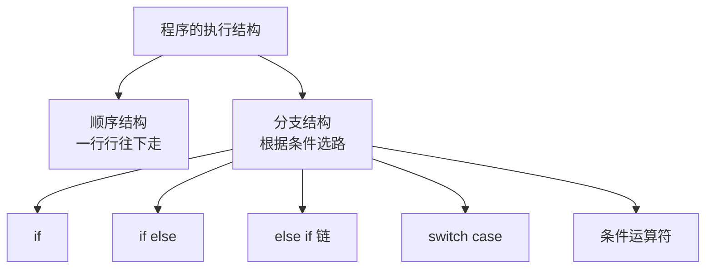

## if 语句

### if 的语法

if 语句的格式是这样的：

```text
if (表达式) {
    语句;
}
```

含义很直白：**如果括号里的表达式条件成立，就执行花括号里的语句；不成立，就跳过整段花括号。**

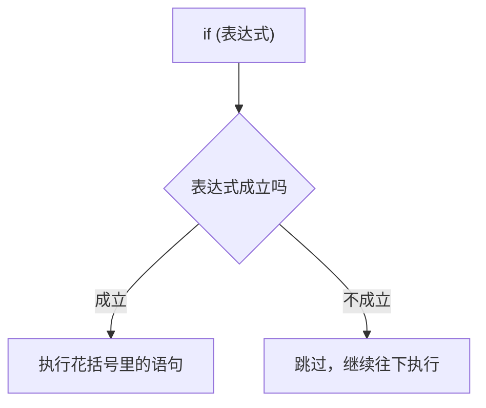

### 一个判断奇数的例子

写一个最简单的 if 语句，判断一个数是不是奇数：

```cpp
#include <iostream>

using namespace std;

int main() {
    int a = 7;
    if (a % 2 == 1) {
        cout << "a 是一个奇数" << endl;
    }
    return 0;
}
```

`a` 是 7，7 模 2 等于 1，条件成立，所以输出：

```text
a 是一个奇数
```

这里有一个细节：字符串必须用**双引号**包起来，不能用单引号。单引号在 C++ 里表示的是单个字符，写错了编译器会直接报错。

也可以不让 a 写死，而是让程序运行时输入：

```cpp
#include <iostream>

using namespace std;

int main() {
    int a;
    cin >> a;
    if (a % 2 == 1) {
        cout << "a 是一个奇数" << endl;
    }
    return 0;
}
```

输入 7，程序就会说出"a 是一个奇数"；输入 8，条件不成立，程序什么都不输出。

### 条件表达式不用写 == 1

上面的 `a % 2 == 1` 其实可以把 `== 1` 省略掉，写成 `a % 2`：

```cpp
    if (a % 2) {
        cout << "a 是一个奇数" << endl;
    }
```

效果完全一样。因为放在 if 括号里的表达式，**只关心它的值是不是非零**：非零当作真，零当作假。`a % 2` 在 a 是奇数时结果是 1（非零，成立），在 a 是偶数时结果是 0（假，不成立），正好就是我们要的判断，所以那个 `== 1` 是多余的。

### 一定要加花括号

写 if 语句时，**即使花括号里只有一条语句，也建议把花括号带上**。不带会有什么问题呢？看这个例子：

```cpp
#include <iostream>

using namespace std;

int main() {
    int a = 9;
    if (a % 2)
        cout << "a 是一个奇数" << endl;
        a = 100;
    cout << a << endl;
    return 0;
}
```

本来想让"输出提示"和"把 a 改成 100"这两件事都在条件成立时才做，但因为漏了花括号，**if 只管住了紧跟着的第一条语句**：

```text
if (a % 2)
    cout << "a 是一个奇数" << endl;     ← 只有这一句受 if 控制
a = 100;                               ← 这一句在 if 外面，一定会执行
```

于是不管 a 是奇数还是偶数，`a = 100` 都会执行。运行结果：

```text
a 是一个奇数
100
```

如果 a 是 8，情况就更明显了：条件不成立，提示不打印，但 `a = 100` 照样执行，最后只输出一个 100——这显然不是我们想要的效果。

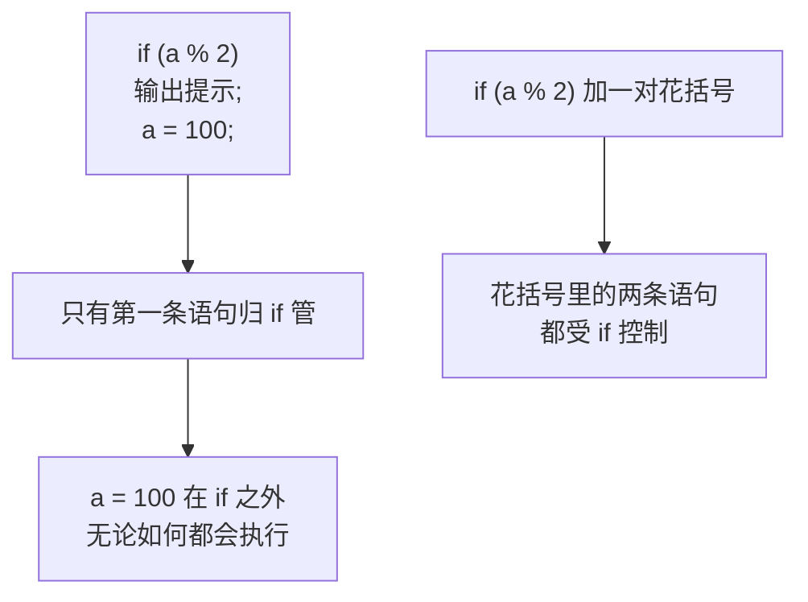

> [!TIP]
> 写 if 语句最好"**一个 if 配一对花括号**"，即使里面只有一句话。只有当你非常确定永远只有一条语句、并且不打算再加时，才可以省略花括号。

## if else 语句

### if else 的语法

if 只能处理"条件成立就做某事"，如果想处理"成立做一件、不成立做另一件"，就要用 **if else**：

```text
if (表达式) {
    语句一;
} else {
    语句二;
}
```

含义是：**表达式成立就执行语句一，否则执行语句二。** 两个分支必定走其中一个，不会都不走。

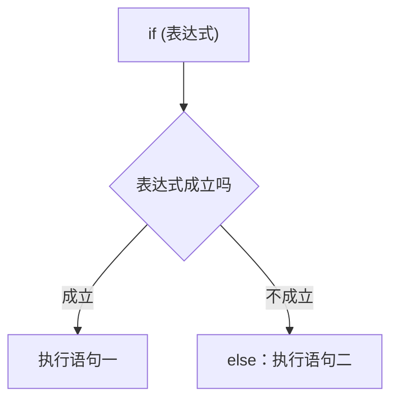

### 判断奇偶的例子

```cpp
#include <iostream>

using namespace std;

int main() {
    int x;
    cin >> x;
    if (x & 1) {
        cout << "x 是一个奇数" << endl;
    } else {
        cout << "x 是一个偶数" << endl;
    }
    return 0;
}
```

这里用位与 `x & 1` 来判断奇偶，和取模是等价的：结果非零说明最低位是 1，也就是奇数；结果是 0 说明最低位是 0，也就是偶数。

输入 7，条件成立，输出：

```text
x 是一个奇数
```

输入 8，条件不成立，走 else 分支，输出：

```text
x 是一个偶数
```

### 在分支里定义变量

if 和 else 后面的花括号是复合语句，所以可以在里面定义变量，让它只在对应的分支里有效：

```cpp
#include <iostream>

using namespace std;

int main() {
    int x;
    cin >> x;
    if (x & 1) {
        string tip = "x 是一个奇数";
        cout << tip << endl;
    } else {
        string tip = "x 是一个偶数";
        cout << tip << endl;
    }
    return 0;
}
```

两个分支里各自定义了一个 `tip`，互不干扰。因为它们在各自的花括号内有效，出了花括号就失效了，所以同名也不会冲突。

> [!NOTE]
> 用 `string` 需要额外包含 `<string>` 头文件。在多数编译器上 `iostream` 会顺带把它带进来，但规范的写法是显式写 `#include <string>`。

## else if 语句

### else if 的语法

如果分支不止两个，就要用 **else if** 把它们串成一条链：

```text
if (表达式一) {
    语句一;
} else if (表达式二) {
    语句二;
} else if (表达式三) {
    语句三;
} else {
    语句四;
}
```

程序会**从上往下依次判断**：谁的条件先成立，就执行谁的语句，执行完立刻跳出整条链，后面的条件不再判断。如果全都不成立，才走最后的 else。

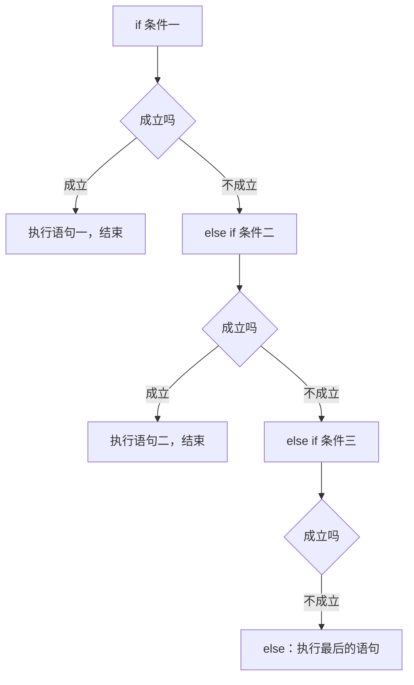

最后那个 else 是可以省略的。如果省略了，那么所有条件都不成立时，整条链什么都不做。

### 根据输入输出不同的内容

```cpp
#include <iostream>

using namespace std;

int main() {
    int a;
    cin >> a;
    if (a == 0) {
        cout << "零" << endl;
    } else if (a == 1) {
        cout << "一" << endl;
    } else if (a == 2) {
        cout << "二" << endl;
    } else if (a == 3) {
        cout << "三" << endl;
    } else {
        cout << "其他数字" << endl;
    }
    return 0;
}
```

输入 0 输出"零"，输入 1 输出"一"，输入 2 输出"二"，输入 3 输出"三"，输入一个很大的数（比如 100）或者一个负数（比如 -1），都不满足前面四个条件，于是走 else 输出"其他数字"。

这里的 else 是**兜底**：它表示"既不是 0、也不是 1、也不是 2、也不是 3"的所有情况。可以把它理解成把前面所有的条件全部取反之后再合起来。

### 应用：根据分数判断等级

else if 链最典型的用法，就是**按区间判断**。因为它是从上往下依次判断、命中就停，所以可以只写区间的下界：

```cpp
#include <iostream>

using namespace std;

int main() {
    int score;
    cin >> score;
    if (score >= 90) {
        cout << "优秀" << endl;
    } else if (score >= 80) {
        cout << "良好" << endl;
    } else if (score >= 70) {
        cout << "中等" << endl;
    } else if (score >= 60) {
        cout << "及格" << endl;
    } else {
        cout << "不及格" << endl;
    }
    return 0;
}
```

输入 95，第一个条件 `>= 90` 成立，输出"优秀"就结束了；输入 85，第一个不成立、第二个 `>= 80` 成立，输出"良好"。

注意这里的写法很省事：`else if (score >= 80)` 不需要写成 `score >= 80 && score < 90`。因为能走到这一句，就说明前面的 `score >= 90` 已经不成立了，也就是分数一定小于 90，所以"小于 90"这个条件是**隐含**的。

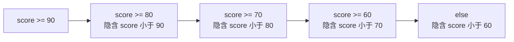

> [!TIP]
> 用 else if 判断区间时，**条件要从严格到宽松、从上往下排列**。如果把 `score >= 60` 写在最前面，那么所有 60 分以上的分数都会命中它，后面的 `>= 90` 永远轮不到，逻辑就错了。

## 条件运算符

### 三目运算符

C++ 里有一个专门用来写简单分支的运算符，叫**条件运算符**，也叫**三目运算符**——因为它是 C++ 里**唯一一个带三个操作数**的运算符。

它的语法是：

```text
表达式一 ? 表达式二 : 表达式三
```

判断规则是：**表达式一成立（为真）就取表达式二的值，否则取表达式三的值。**

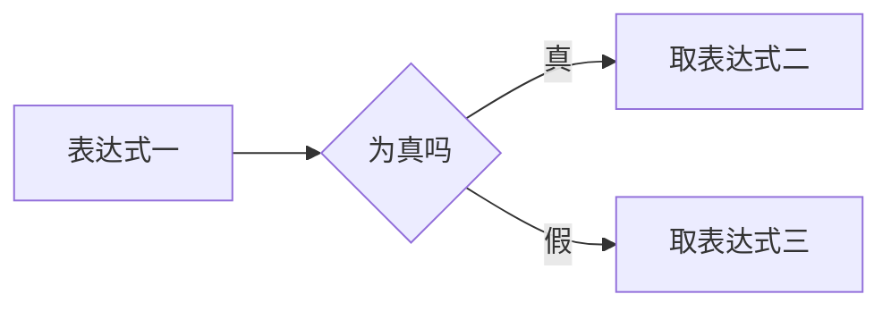

### 把 if else 写成一行

先看用 if else 求两个数较大值的写法：

```cpp
#include <iostream>

using namespace std;

int main() {
    int a = 3;
    int b = 4;
    int x = -1;
    if (a > b) {
        x = a;
    } else {
        x = b;
    }
    cout << x << endl;
    return 0;
}
```

运行结果：

```text
4
```

同样的事情，用条件运算符一行就能写完：

```cpp
#include <iostream>

using namespace std;

int main() {
    int a = 3;
    int b = 4;
    int x = a > b ? a : b;
    cout << x << endl;
    return 0;
}
```

运行结果同样是：

```text
4
```

对照着看就很好理解：`a > b` 对应 if 括号里的条件，问号后面的 `a` 对应 if 分支，冒号后面的 `b` 对应 else 分支。条件成立就把 `a` 交给 `x`，不成立就把 `b` 交给 `x`。

由条件运算符组成的这个式子叫**条件表达式**。

### 嵌套的条件表达式

条件表达式里还可以再套条件表达式。比如想求三个数里的最大值：

```cpp
#include <iostream>

using namespace std;

int main() {
    int a = 3;
    int b = 4;
    int c = 5;
    int x = a > b ? (a > c ? a : c) : b;
    cout << x << endl;
    return 0;
}
```

`a` 是 3、`b` 是 4、`c` 是 5。程序先判断最外层的 `a > b`：3 大于 4 不成立，所以直接走冒号后面的 `b`，结果是 4。

如果换成 `a = 6`，最外层的 `a > b` 成立，就去算括号里的 `a > c ? a : c`：6 大于 5 成立，取 `a`，结果是 6。

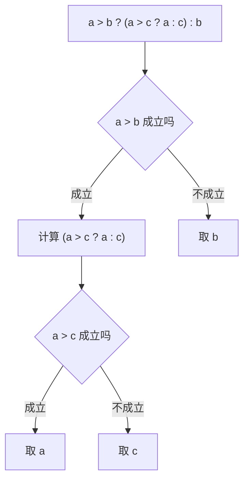

嵌套的时候**括号要写清楚**，不然读起来很费劲，也容易算错。

### 条件表达式的类型

条件表达式的结果是什么类型？**取决于两个分支表达式的类型**。看这个例子：

```cpp
#include <iostream>

using namespace std;

int main() {
    int a = 3;
    int b = 4;
    double c = 1.6;
    cout << (a > b ? a : c) << endl;
    cout << (a < b ? a : c) << endl;
    return 0;
}
```

运行结果：

```text
1.6
3
```

第一行：`a > b` 不成立，取 `c`，也就是 1.6。第二行：`a < b` 成立，取 `a`，也就是整数 3。

两个分支一个是 `int`、一个是 `double`，编译器会把它们**统一成共同的类型 double**，所以第二行取出来的 3 其实是 `3.0`，只是输出时按默认格式显示成了 3。这说明条件表达式的类型不是固定的，而是由两个分支的类型共同决定的。

> [!TIP]
> 输出条件表达式时记得加括号，写成 `cout << (a > b ? a : b) << endl;`。因为条件运算符的优先级很低，不加括号容易和 `<<` 混在一起被算错。

### 三个要注意的地方

第一，它是 C++ 里**唯一的三目运算符**，三个操作数缺一不可，中间的 `?` 和 `:` 都要写。

第二，条件运算符是**右结合**的，也就是遇到多个条件运算符连写时，从右往左结合。

第三，条件运算符的**优先级非常低**，只比赋值运算符和逗号运算符高。所以它和别的运算符混在一起时，很容易出错。


优先级记不住是常态，实战里最省事的做法就是**加括号**。拿不准的地方套一对括号，含义立刻就清楚了。

## switch case 语句

### 从 if else 改造而来

先看一个用 else if 链写出来的分支：

```cpp
#include <iostream>

using namespace std;

int main() {
    int a;
    cin >> a;
    if (a == 0) {
        cout << "zero" << endl;
    } else if (a == 1) {
        cout << "one" << endl;
    } else if (a == 2) {
        cout << "two" << endl;
    } else if (a == 3) {
        cout << "three" << endl;
    } else {
        cout << "other" << endl;
    }
    return 0;
}
```

输入 0 输出 zero，输入 1 输出 one，输入 3 输出 three，输入 -1 或 100 输出 other。

这段逻辑可以改写成 **switch case** 语句，代码会更整齐：

```cpp
#include <iostream>

using namespace std;

int main() {
    int a;
    cin >> a;
    switch (a) {
        case 0:
            cout << "zero" << endl;
            break;
        case 1:
            cout << "one" << endl;
            break;
        case 2:
            cout << "two" << endl;
            break;
        case 3:
            cout << "three" << endl;
            break;
        default:
            cout << "other" << endl;
            break;
    }
    return 0;
}
```

运行效果和上面的 if else 完全一样。

### switch 的结构

switch 语句的结构是：`switch` 后面跟一对括号，括号里放**要判断的那个变量**；花括号里是一堆 `case`，每个 `case` 后面跟一个**常量**，用来和变量的值比对；所有 case 都不匹配时，走最后的 `default`。

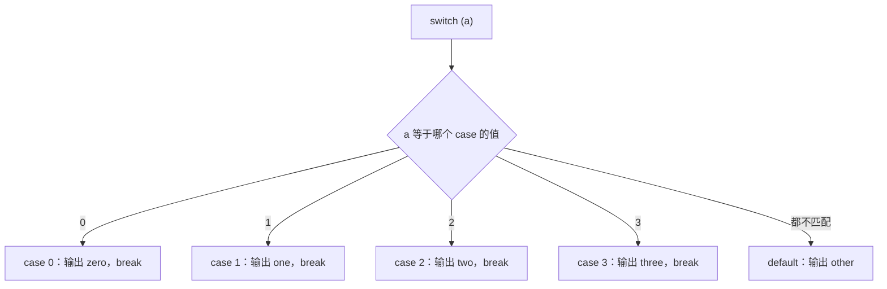

`default` 的作用就相当于 if else 里的那个 else：**兜底**，处理所有 case 都没命中的情况。它也是可以省略的，省略时如果没有任何 case 匹配，switch 就什么都不做。

### break 的作用：穿透

每个 case 后面都要写 `break`，它的作用是**跳出整个 switch 语句**。如果漏掉 break，就会发生"**穿透**"。

把上面的 break 全部去掉试试：

```cpp
#include <iostream>

using namespace std;

int main() {
    int a;
    cin >> a;
    switch (a) {
        case 0:
            cout << "zero" << endl;
        case 1:
            cout << "one" << endl;
        case 2:
            cout << "two" << endl;
        case 3:
            cout << "three" << endl;
        default:
            cout << "other" << endl;
    }
    return 0;
}
```

输入 1，本来只想输出 one，结果输出：

```text
one
two
three
other
```

为什么会这样？因为 switch 的执行方式是：**先找到匹配的那个 case，然后从这里开始，一路往下执行，直到遇到 break 或者走到花括号末尾才停。** 输入 1 匹配到 `case 1`，从这里进去，输出 one 之后没有 break，就继续往下"掉"进 `case 2`、`case 3`、`default`，把它们的内容也执行了一遍。

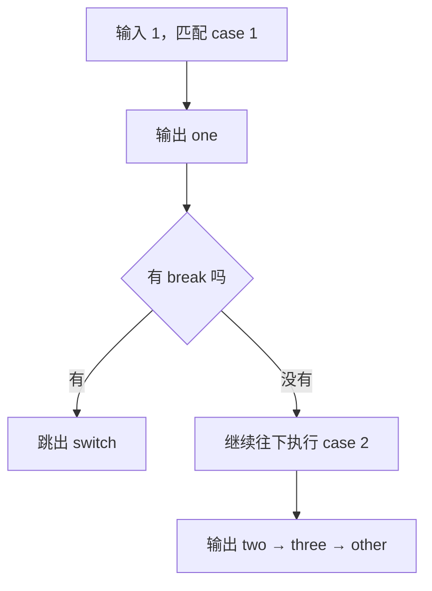

所以**每个 case 执行完都要加 break**，否则会把后面 case 的内容也一起执行。

> [!NOTE]
> 穿透并不总是错误，偶尔会故意利用它：比如想让 `case 0` 和 `case 1` 做同一件事，可以只在 `case 1` 后面写 break，让 `case 0` 穿透下来。但初学阶段记住"每个 case 都加 break"更稳妥。

### case 后面必须是整型常量表达式

case 后面的值有两个要求：**必须是常量，而且必须是整型**。

先看常量这一点。case 后面不能放变量，因为编译器需要在编译阶段就知道所有分支的取值。

再看整型这一点。写一个浮点数试试：

```cpp
    case 6.6:
```

这样会直接报错，提示"此表达式类型为 double，但这里的类型一定是整型"。switch 判断的值必须是整数类型，**不能是浮点数**。

不过字符是可以的，因为字符在计算机内部最终就是一个整数：

```cpp
#include <iostream>

using namespace std;

int main() {
    char ch;
    cin >> ch;
    switch (ch) {
        case 'a':
            cout << "a" << endl;
            break;
        case '1':
            cout << "1" << endl;
            break;
        default:
            cout << "other" << endl;
            break;
    }
    return 0;
}
```

`'1'` 在计算机里解析出来是数字 49，`'a'` 是 97，它们都是整型常量，所以能当 case 的值。

case 后面甚至可以写常量表达式：

```cpp
    case '1' - '0':
```

`'1' - '0'` 就是字符 `'1'` 相对于 `'0'` 的偏移量，等于 1，所以这等价于 `case 1:`。只要最终能算出一个整型常量，就可以放在 case 后面。

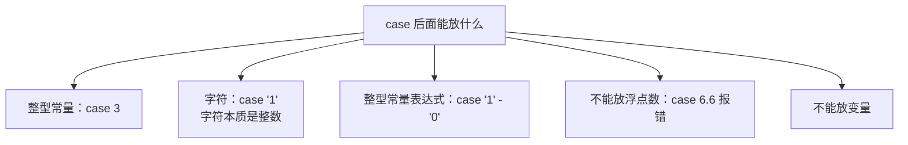

## 本章小结

**其一**，前面写的都是顺序结构，语句一行行往下执行。单条语句叫简单语句，用一对花括号把多条语句包起来叫复合语句。分支结构让程序根据条件选择执行路径，主要有 `if`、`if else`、`else if` 链、`switch case` 四种，另外还有条件运算符。

**其二**，if 语句的格式是 `if (表达式) { 语句 }`，表达式成立就执行花括号里的内容，不成立就跳过。放在 if 括号里的表达式只关心值是不是非零，所以 `a % 2 == 1` 可以直接写成 `a % 2`。字符串必须用双引号，不能用单引号。

**其三**，写 if 语句建议**即使只有一条语句也带上花括号**。因为不带花括号时 if 只管住紧跟的第一条语句，后面同缩进的语句其实在 if 之外，一定会执行，很容易埋下 bug。

**其四**，if else 的格式是"成立执行语句一，否则执行语句二"，两个分支必走其一。if 和 else 后面的花括号都是复合语句，可以在里面各自定义变量，出了花括号就失效，所以同名也不冲突。

**其五**，else if 链会**从上往下依次判断，谁先成立就执行谁，执行完立刻跳出**，全都不成立才走最后的 else。最后的 else 是兜底，可以省略。判断区间时条件要从严格到宽松排列，而且因为命中就停，后一个条件的前面那些界限是隐含的，比如 `score >= 90` 之后写 `score >= 80` 就够了，不用再写 `&& score < 90`。

**其六**，条件运算符也叫三目运算符，语法是 `表达式一 ? 表达式二 : 表达式三`，成立取表达式二，否则取表达式三，能把简单的 if else 压缩成一行。它支持嵌套，但嵌套时括号要写清楚。它的结果类型由两个分支的类型共同决定（比如 int 和 double 混用时结果类型是 double）。

**其七**，条件运算符有三个要注意的地方：它是 C++ 里唯一的三目运算符，它是右结合的，它的优先级非常低、只高于赋值和逗号运算符。优先级拿不准时，加括号是最省事的做法。

**其八**，switch case 用来替代"对一个变量做多个等值判断"的 else if 链，格式是 `switch (变量)` 加若干 `case 常量`，都不匹配时走 `default`（相当于 else）。**每个 case 执行完都要写 break**，否则会穿透下去，把后面 case 的内容也执行一遍。

**其九**，case 后面的值必须是**整型常量表达式**，不能是变量，也不能是浮点数（写 `case 6.6` 会报错）。字符可以作为 case 的值，因为字符本质上是整数；`case '1' - '0'` 这样的常量表达式也可以，它等价于 `case 1`。