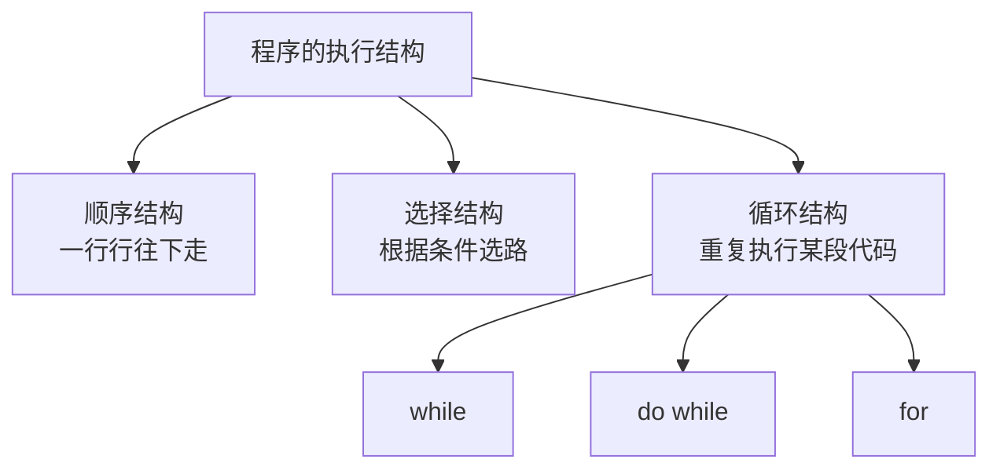
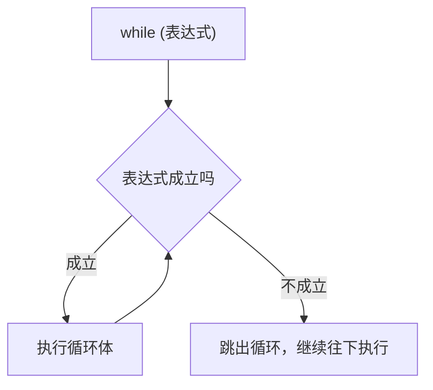
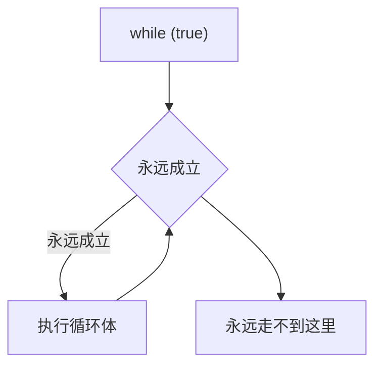
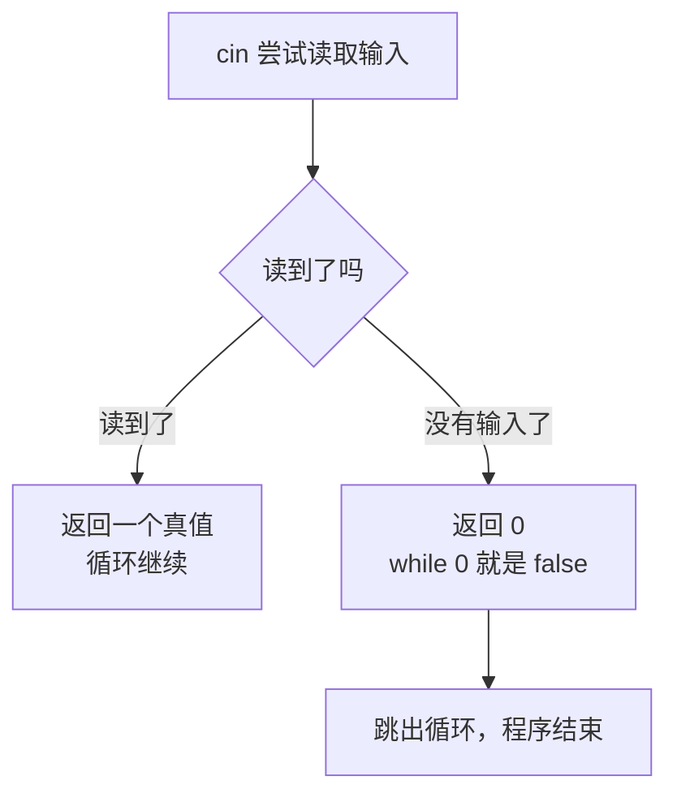
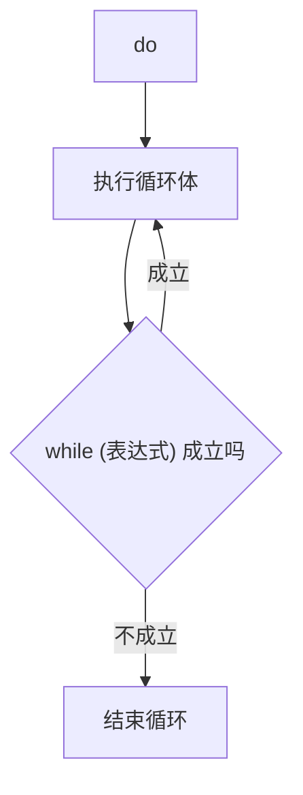
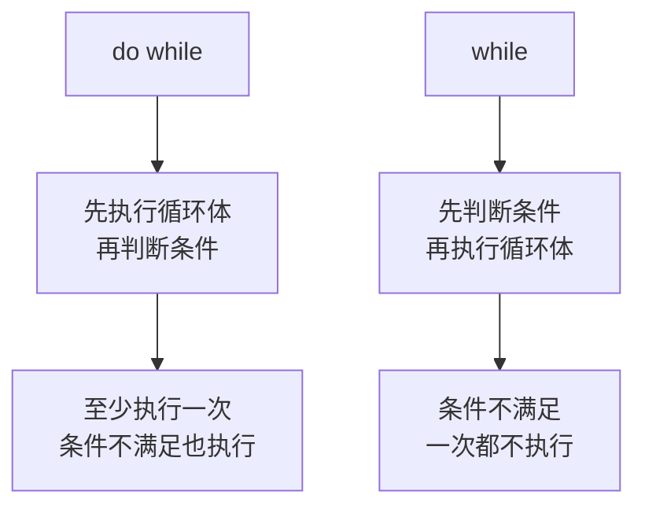
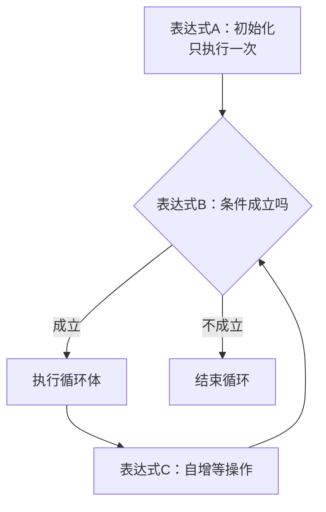
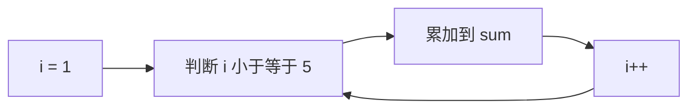
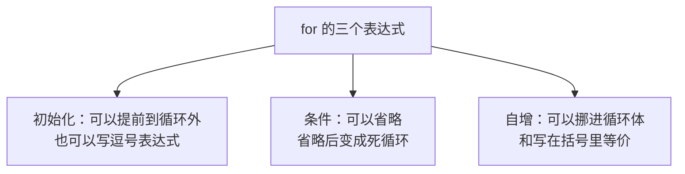
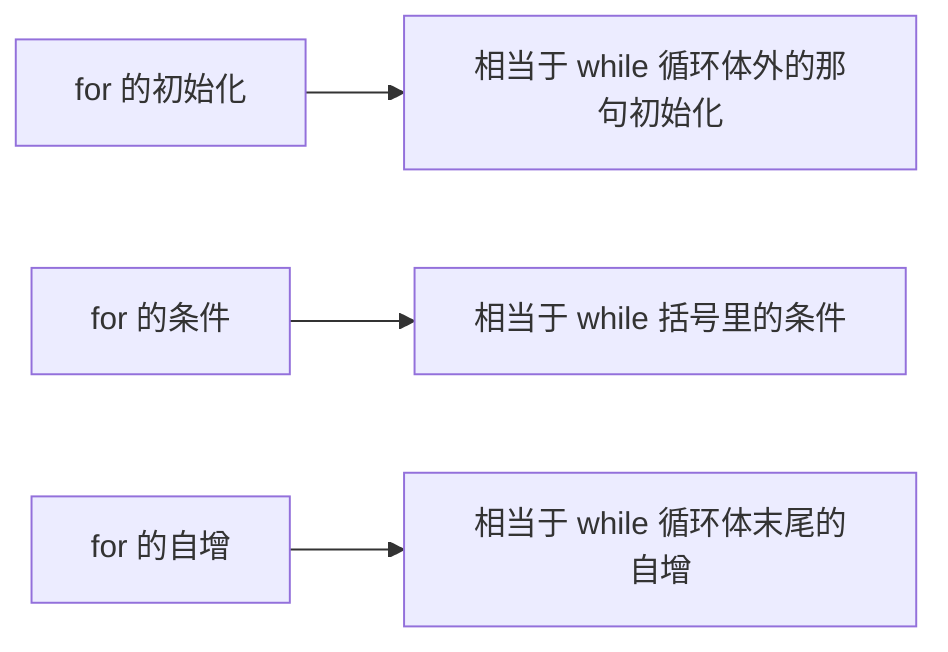

## 循环结构是什么

前面已经见过两种程序结构：**顺序结构**是从前往后一行行执行、没有任何跳转；**选择结构**（也叫分支）是根据条件选路，比如 if else、switch、条件运算符。这一节要学的是第三种——**循环结构**。

循环结构的作用就是**重复执行某一段代码**。C++ 里有三种常用的循环语句：`while`、`do while`、`for`。



为什么需要循环？假设想输出十句问候语，可以老老实实写十行输出语句：

```cpp
#include <iostream>

using namespace std;

int main() {
    cout << "Hello World" << endl;
    cout << "Hello World" << endl;
    cout << "Hello World" << endl;
    cout << "Hello World" << endl;
    cout << "Hello World" << endl;
    cout << "Hello World" << endl;
    cout << "Hello World" << endl;
    cout << "Hello World" << endl;
    cout << "Hello World" << endl;
    cout << "Hello World" << endl;
    return 0;
}
```

这样确实能跑，但如果要输出一百句、一千句呢？手写显然不现实。这时候就该循环登场了。

## while 语句

### while 的语法

while 语句的格式是：

```text
while (表达式) {
    语句;
}
```

含义是：**先判断表达式，成立就执行花括号里的语句，执行完再回来重新判断，如此反复；一旦表达式不成立，就跳出循环，继续往下执行。**



注意这里的关键点：**判断在每次执行之前都会做一遍**。所以循环体里必须想办法改变条件相关的变量，让它最终能不成立，否则就会一直转下去。

### 输出一百句

用 while 来输出一百句问候语：

```cpp
#include <iostream>

using namespace std;

int main() {
    int count = 0;
    while (count < 100) {
        cout << "Hello World" << endl;
        count++;
    }
    return 0;
}
```

这里定义了一个计数器 `count`，一开始等于 0。条件是 `count < 100`：只要小于 100 就输出一句问候语，然后让 count 自增一。count 从 0 一路涨到 99，一共输出 100 句；等到 count 变成 100 时，条件 `count < 100` 不成立，循环结束。

运行结果就是整整一百行 `Hello World`。短短十来行代码就输出了上百行内容，把条件里的 100 改成 1000，立刻就变成一千行——这就是循环的威力。

### 死循环

如果循环条件**永远成立**，循环就会一直执行下去，停不下来。这种循环叫**死循环**：

```cpp
#include <iostream>

using namespace std;

int main() {
    while (true) {
        cout << "Hello World" << endl;
    }
    return 0;
}
```

`true` 永远是 true，所以这个程序会不停地输出，进程一直不结束，只能手动把它强制关掉。



> [!WARNING]
> 一般情况下不要写死循环。写循环时一定要检查：循环体里有没有让条件最终变得不成立的语句？如果忘了写 `count++` 这类改变条件的语句，本来想循环 100 次，结果变成了死循环，程序就卡住不动了。

### 应用一：输入字符串并拼接

while 有一个很好用的地方：**它可以用来读取任意多组输入**。因为 `cin >> 变量` 这个操作本身是有"返回值"的，它返回的就是输入是否成功。

```cpp
#include <iostream>
#include <string>

using namespace std;

int main() {
    string a;
    while (cin >> a) {
        cout << "Hello " << a << endl;
    }
    return 0;
}
```

运行之后程序会等待输入，输入一个字符串它就输出一句带问候的回应，然后再等着下一次输入。比如依次输入 `World`、`Trae`、`C++`，就会依次输出：

```text
Hello World
Hello Trae
Hello C++
```

这里的 `a` 是 `string` 类型，它是标准库提供的字符串类，用 `+` 或者像上面这样连续输出，就能把内容拼在一起。`cin >> a` 放在 while 的条件里，意思是"只要还能读到输入就继续循环"。

### 应用二：多组数据求和

上面的写法在处理**多组数据**的题目时特别有用。比如一道经典题目：输入两个数 a 和 b，输出它们的和，而且要不间断地处理很多组。

```cpp
#include <iostream>

using namespace std;

int main() {
    int a, b;
    while (cin >> a >> b) {
        cout << a + b << endl;
    }
    return 0;
}
```

运行之后，输入一组就输出一组结果，可以一直输下去：

```text
4 5
9
8 9
17
10 12
22
```

`4` 和 `5` 输出 `9`，`8` 和 `9` 输出 `17`，`10` 和 `12` 输出 `22`，每组都对得上。这就是最简单的多组数据求和，很多在线评测系统上的入门测试题就是它。

### cin 的结束条件

上面两个程序有个共同的问题：**怎么让它停下来？**

答案就在 `cin` 身上。`cin` 的结束条件是"**再也没有任何输入了**"。在终端里手动运行时，无论怎么敲键盘都不算"没有输入"，因为程序永远在等着你继续敲。这时候可以按 `Ctrl + C`，它会向程序发送一个信号，相当于告诉操作系统"别再让它等输入了，赶紧结束进程"。



`cin` 读不到输入时会返回 0，而 `while (0)` 就是 `while (false)`，条件不成立，于是跳出循环、程序退出。所以这类循环的结束条件，本质上就是"输入被耗尽"。另外，如果程序是在文件里读数据，读文件读到末尾时也会自动触发这个条件，循环就会正常结束，不需要手动干预。

## do while 语句

### do while 的语法

do while 是另一种循环语句，格式是：

```text
do {
    语句;
} while (表达式);
```

含义是：**先执行一次花括号里的语句，然后再判断表达式；成立就回去再执行一遍，不成立就结束。**



有两个容易写错的地方要留意：一是 `do` 后面先跟花括号，`while` 写在花括号**外面**；二是 `while (表达式)` 的末尾**一定要写分号**，因为整条 do while 语句到这里才算结束。

### 输出 0 1 2

```cpp
#include <iostream>

using namespace std;

int main() {
    int a = 0;
    do {
        cout << a << endl;
        a++;
    } while (a < 3);
    return 0;
}
```

`a` 一开始是 0。先进入循环体，输出 0，然后 a 变成 1；判断 `1 < 3` 成立，回去输出 1，a 变成 2；判断 `2 < 3` 成立，回去输出 2，a 变成 3；判断 `3 < 3` 不成立，结束。

运行结果：

```text
0
1
2
```

### do while 和 while 的区别

看起来 do while 和 while 结果一样，那区别在哪？把两种循环放在一起对比，让 `a` **一开始就等于 3**：

```cpp
#include <iostream>

using namespace std;

int main() {
    int a = 3;
    cout << "do while:" << endl;
    do {
        cout << a << endl;
        a++;
    } while (a < 3);

    cout << "----" << endl;

    a = 3;
    cout << "while:" << endl;
    while (a < 3) {
        cout << a << endl;
        a++;
    }
    return 0;
}
```

运行结果：

```text
do while:
3
----
while:
```

分隔线上面打印了一个 3，分隔线下面**什么都没有**。原因就在于两者的执行顺序不同：

`do while` 是**先执行循环体、再判断条件**。所以它不管条件成不成立，第一遍都会先把循环体跑一次，打印出 3，然后判断 `4 < 3` 不成立才结束。

`while` 是**先判断条件、再执行循环体**。`a` 一开始是 3，`3 < 3` 不成立，所以循环体一次都不执行，什么都没打印。



所以一句话总结两者的区别：**do while 至少会执行一次，就算条件一开始就不满足也会执行一次；而 while 如果条件一开始就不满足，就一次都不执行。**

> [!TIP]
> 面试里经常问"do while 和 while 有什么区别"，答"do while 至少执行一次"就抓住了要点。

## for 语句

### for 的语法

for 是比 while 更常用的循环语句，而且它完全能实现 while 的所有功能。它的格式是：

```text
for (表达式A; 表达式B; 表达式C) {
    语句;
}
```

括号里有**三个表达式，用两个分号隔开**，含义分别是：**表达式A 是初始化，只在循环开始前执行一次；表达式B 是终止条件，每次执行循环体之前都要判断；表达式C 是每次循环体执行完之后要做的事。**



把三个表达式和 while 对照一下就清楚了：表达式A 相当于 while 循环体**外面**的初始化，表达式B 相当于 while 括号里的条件，表达式C 相当于 while 循环体**末尾**的自增。for 只是把这三件事集中写到了一行里，看起来更紧凑。

### 求 1 到 5 的和

```cpp
#include <iostream>

using namespace std;

int main() {
    int sum = 0;
    for (int i = 1; i <= 5; i++) {
        sum += i;
    }
    cout << sum << endl;
    return 0;
}
```

这段代码的意图是：让 i 从 1 开始，每次把 i 累加到 sum 上，直到 i 超过 5 为止。执行过程是这样的：

```text
i = 1，判断 1 <= 5 成立，sum 加上 1 得 1，i 变成 2
i = 2，判断 2 <= 5 成立，sum 加上 2 得 3，i 变成 3
i = 3，判断 3 <= 5 成立，sum 加上 3 得 6，i 变成 4
i = 4，判断 4 <= 5 成立，sum 加上 4 得 10，i 变成 5
i = 5，判断 5 <= 5 成立，sum 加上 5 得 15，i 变成 6
i = 6，判断 6 <= 5 不成立，跳出循环
```

运行结果：

```text
15
```

也就是 1 加 2 加 3 加 4 加 5 等于 15。执行流程可以概括成：**先做初始化，再判断条件，成立就执行循环体，循环体结束后执行自增，然后回头再判断条件**，如此反复，直到条件不成立才跳出来。



### 应用：求 1 到 N 的和

把上面的 5 换成运行时输入的 N，再加上多组输入，就是一道完整的题目：

```cpp
#include <iostream>

using namespace std;

int main() {
    int n;
    while (cin >> n) {
        int sum = 0;
        for (int i = 1; i <= n; i++) {
            sum += i;
        }
        cout << sum << endl;
    }
    return 0;
}
```

外层用 `while (cin >> n)` 实现多组输入，内层用 for 求 1 到 N 的和。运行结果：

```text
4
10
32
528
3
6
```

输入 4 输出 10，输入 32 输出 528，输入 3 输出 6。其实 1 到 N 的和有现成的公式 `N * (N + 1) / 2`（高斯求和公式），输入 32 时 32 乘 33 除以 2 正好等于 528。不过这里我们是在练习循环，用循环一步步累加出来更直观。

### for 的五种写法

for 括号里的三个表达式都是**普通表达式**，所以写法很灵活，下面五种写法效果完全一样。

**写法一**是最标准的形式，三个表达式各就各位：

```cpp
    int sum = 0;
    for (int i = 1; i <= n; i++) {
        sum += i;
    }
```

**写法二**把初始化提到循环外面。因为初始化只执行一次，放在外面和放在括号里区别不大：

```cpp
    int sum = 0;
    int i = 1;
    for (; i <= n; i++) {
        sum += i;
    }
```

**写法三**把两个变量的初始化都放进括号，用逗号表达式连起来。因为括号里既然是"一个表达式"，那它当然也可以是一个逗号表达式：

```cpp
    int sum, i;
    for (sum = 0, i = 1; i <= n; i++) {
        sum += i;
    }
```

**写法四**把终止条件也省略掉，就成了死循环。因为中间没有条件，循环会一直转下去：

```cpp
    int sum, i;
    for (sum = 0, i = 1; ; i++) {
        sum += i;
    }
```

**写法五**把自增从括号里挪进循环体。把 `i++` 写在循环体末尾，和写在括号里效果一样：

```cpp
    int sum, i;
    for (sum = 0, i = 1; i <= n; ) {
        sum += i;
        i++;
    }
```

这五种写法里，写法一最清楚，日常写代码就用它；写法三在需要初始化多个变量时很方便；写法四那种省略条件的死循环偶尔会用来配合内部的跳出语句；写法二和写法五知道可以这么写就行，实际用起来反而不如写法一直观。



> [!NOTE]
> 三个表达式**都可以省略**，但两个分号必须留着，`for (;;)` 就是一个合法的死循环。

### for 和 while 的关系

把 for 和 while 摆在一起看，对应关系很明确：for 的**初始化**是 while 里没有的，它对应的是 while 循环体**外面**那句初始化；for 的**循环体**和 while 的循环体是一样的；for 的**条件**对应 while 括号里的条件；for 的**自增**可以放在括号里，也可以放在循环体的最后面，所以可以认为它和循环体是一体的。



也就是说，**任何 for 循环都能改写成 while 循环，反过来也一样**。判断该用哪个的经验是：**循环次数明确时用 for**（比如从 1 到 N），**循环次数不明确、靠某个条件结束时用 while**（比如一直读到没有输入为止）。

## 本章小结

**其一**，C++ 有三种程序结构：顺序结构、选择结构、循环结构。循环结构的作用是重复执行某段代码，C++ 里有 `while`、`do while`、`for` 三种循环语句。用循环输出一百句问候语只需要十来行代码，把条件里的数字改大就能输出更多，手写是无法做到的。

**其二**，while 的格式是 `while (表达式) { 语句 }`，**先判断再执行**：条件成立就执行循环体，执行完再回来重新判断，直到条件不成立才跳出。循环体里一定要有让条件最终变得不成立的语句（比如 `count++`），否则会变成死循环。

**其三**，如果循环条件永远成立（比如 `while (true)`），循环就会一直执行下去，这叫**死循环**，进程停不下来，只能强制关闭。写循环时务必检查有没有忘记写改变条件的语句。

**其四**，`cin >> 变量` 这个操作本身有返回值，所以可以直接放进 while 的条件里，写成 `while (cin >> a)` 或 `while (cin >> a >> b)`，用来**读取任意多组输入**。它的结束条件是"没有输入了"：读不到输入时 cin 返回 0，`while (0)` 就是假，循环就跳出。在终端手动运行时可以用 `Ctrl + C` 强制结束进程。

**其五**，do while 的格式是 `do { 语句 } while (表达式);`，**先执行再判断**。要注意 while 写在花括号外面，并且末尾一定要写分号。

**其六**，do while 和 while 的区别是：**do while 至少会执行一次**，就算条件一开始就不满足也会执行一次；而 while 是先判断再执行，如果条件一开始就不满足，循环体一次都不执行。面试常考这个区别。

**其七**，for 的格式是 `for (表达式A; 表达式B; 表达式C) { 语句 }`，括号里三个表达式用两个分号隔开，分别是初始化（只执行一次）、终止条件（每次执行循环体前判断）、循环体执行完后的操作（通常是自增）。执行流程是：初始化，然后"判断条件、执行循环体、执行自增"不断循环，直到条件不成立。

**其八**，for 的三个表达式都是普通表达式，所以写法很灵活：初始化可以提到循环外，也可以用逗号表达式在括号里初始化多个变量；自增可以挪进循环体；条件可以省略，省略后就成了死循环（`for (;;)`）。三个表达式都可以省略，但两个分号必须留着。

**其九**，for 和 while 可以互相改写：for 的初始化相当于 while 循环体外的那句初始化，for 的条件相当于 while 的条件，for 的自增相当于 while 循环体末尾的操作。经验做法是**循环次数明确时用 for**（如从 1 到 N），**循环次数不明确时用 while**（如一直读到没有输入为止）。