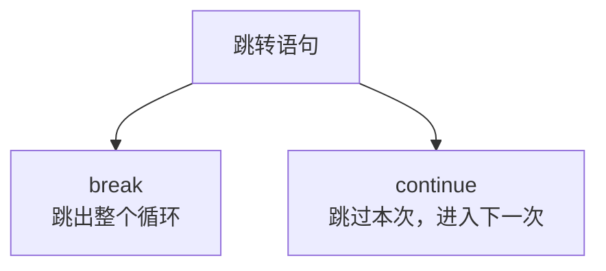
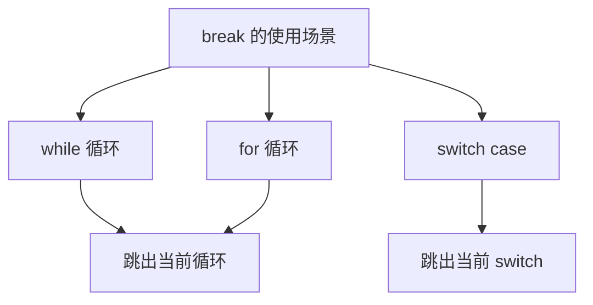
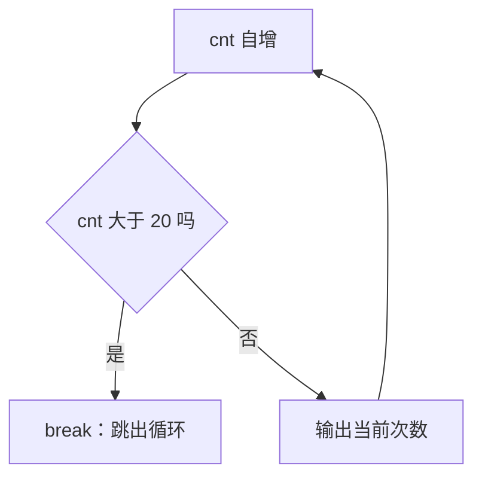
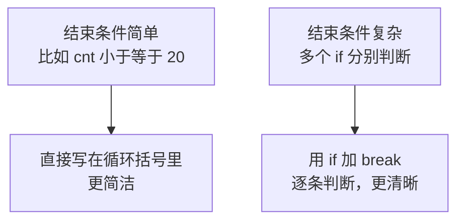
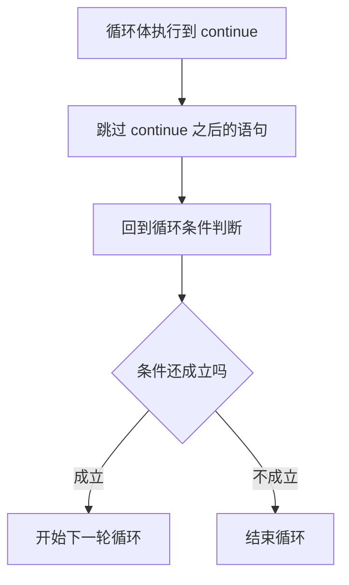
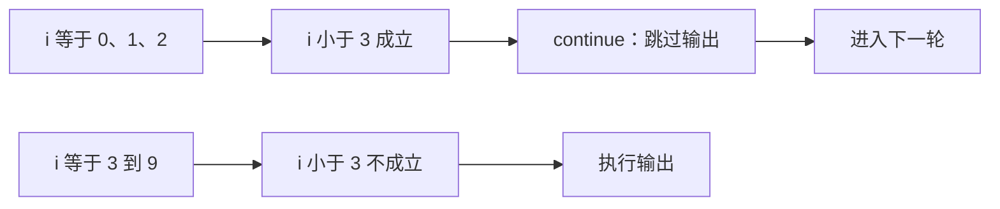
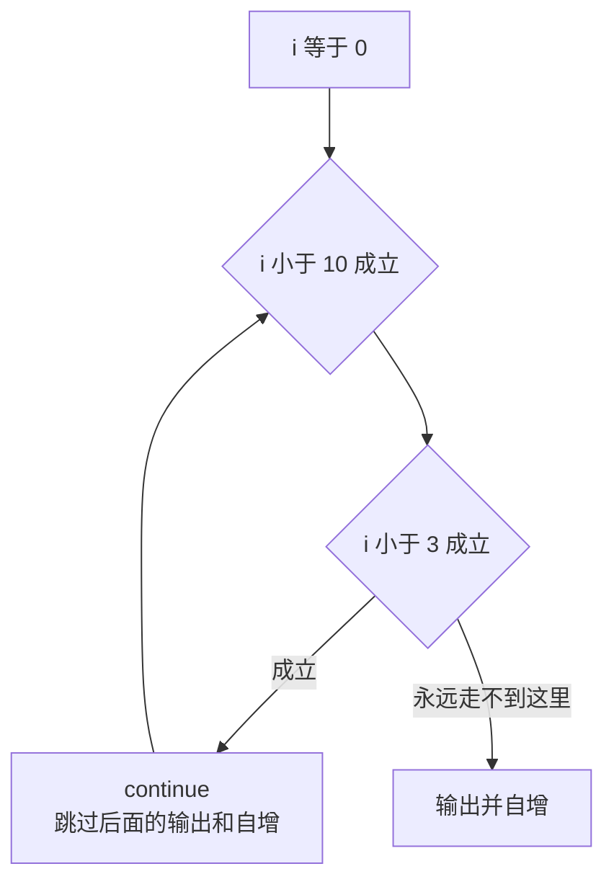
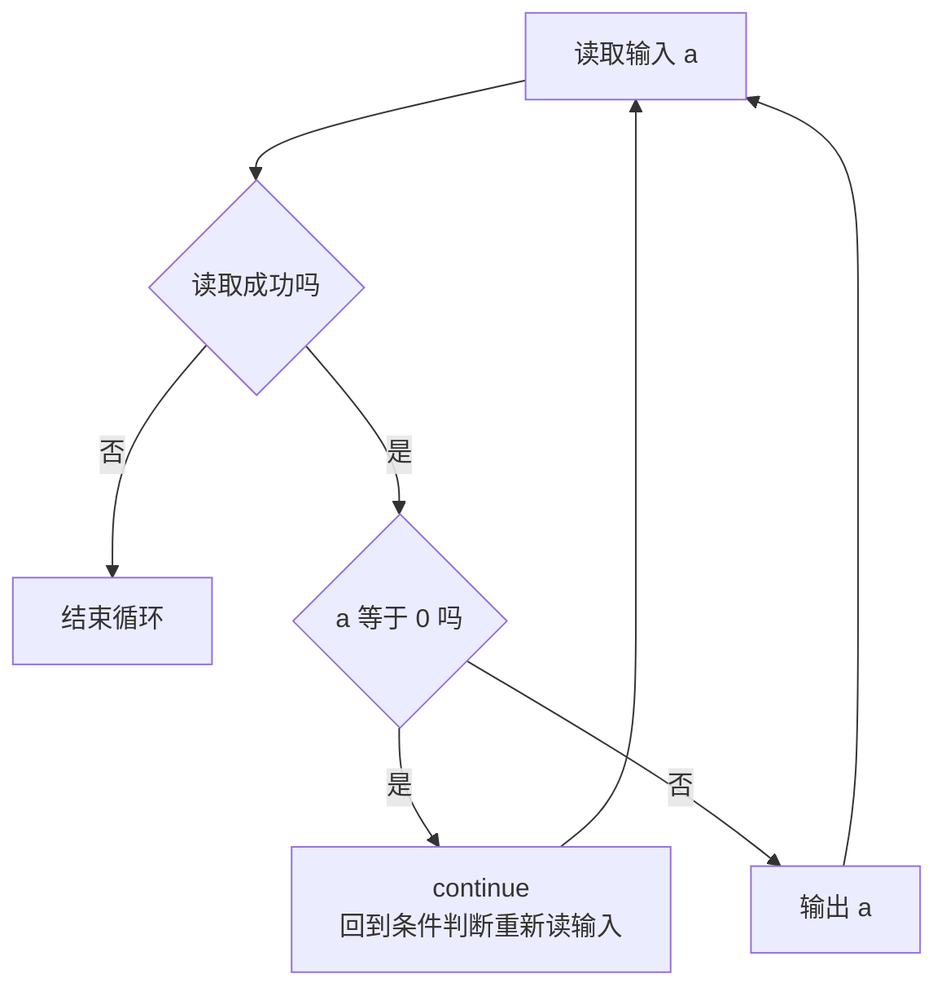
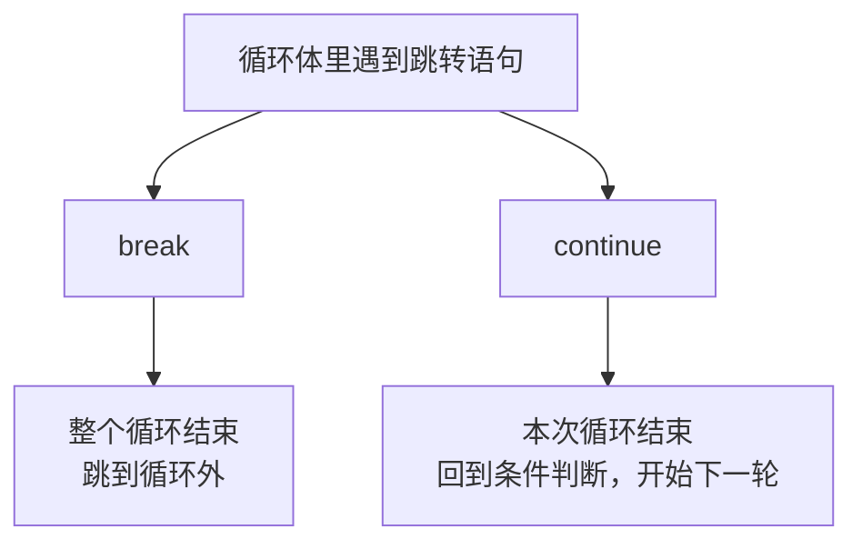

## 跳转语句是什么

前面学过循环结构，循环会一直执行到条件不成立为止。但实际写代码时经常遇到两种情况：一种是**还没等到条件不成立，就想提前结束整个循环**；另一种是**这一次不想处理，但循环还要继续往下走**。

C++ 用两个关键字来处理这两件事，它们叫**跳转语句**：`break` 用来**跳出**当前的循环（或 switch），`continue` 用来**跳过本次循环的剩余部分，直接进入下一次**。



两者的区别可以用一句话概括：**break 是"我不玩了，整个循环到此为止"，continue 是"这一次不算，下一轮接着来"。**

## break 语句

### break 的三个使用场景

`break` 可以出现在三个地方：`while` 循环里、`for` 循环里、以及 `switch case` 里。它的作用是**立刻跳出当前所在的循环或 switch**，后面的语句一律不执行，直接跳到循环（或 switch）之后继续往下。



### while 中的 break

先看 while 循环里的 break。下面这个程序本来想让循环一直转下去，但数到一定次数就主动退出：

```cpp
#include <iostream>

using namespace std;

int main() {
    int cnt = 0;
    while (true) {
        cnt++;
        if (cnt > 20) {
            break;
        }
        cout << "当前次数为 " << cnt << endl;
    }
    return 0;
}
```

`cnt` 一开始是 0。每轮先自增一，然后判断有没有超过 20：没超过就输出当前次数，超过了就执行 `break` 跳出循环。

运行结果：

```text
当前次数为 1
当前次数为 2
...
当前次数为 20
```

一共输出 20 行，当 cnt 变成 21 时条件成立，循环被 break 掉，程序结束。这里的 while 条件写的是 `true`，如果没有这个 break，它就是个死循环，永远停不下来。



### for 中的 break

同样的逻辑用 for 循环来写。这里故意把 for 的终止条件**留空**，让循环没有自己的结束条件，完全靠 break 来收尾：

```cpp
#include <iostream>

using namespace std;

int main() {
    for (int i = 1; ; i++) {
        if (i > 20) {
            break;
        }
        cout << "当前次数为 " << i << endl;
    }
    return 0;
}
```

运行结果和上面完全一样，也是输出 1 到 20，然后在 i 变成 21 时 break 跳出。

要注意 for 括号中间那个位置留空，表示"没有终止条件"，所以它本身是个死循环，全靠里面的 if 加 break 来结束。这也说明 **break 的作用和循环的终止条件在效果上可以互相替代**。

### switch case 中的 break

switch case 里的 break 前面已经见过，作用是一样的：**执行完当前 case 就跳出整个 switch**。回顾一下：

```cpp
#include <iostream>

using namespace std;

int main() {
    int a = 1;
    switch (a) {
        case 1:
            cout << "one" << endl;
            break;
        case 2:
            cout << "two" << endl;
            break;
        default:
            cout << "other" << endl;
            break;
    }
    return 0;
}
```

运行结果：

```text
one
```

`a` 是 1，匹配到 `case 1`，输出 one 之后遇到 break，直接跳出 switch。如果把 case 后面的 break 去掉，就会发生**穿透**，把后面 case 的内容也一起输出，结果变成：

```text
one
two
other
```

所以 switch 里的 break 是用来"**到站就下车**"的，少了它就会一路坐到底。

### 为什么不直接把条件写进括号

看到这里可能会有一个疑问：既然 break 的效果和终止条件一样，那直接写成 `while (cnt <= 20)` 或者 `for (int i = 1; i <= 20; i++)` 不是更短吗？为什么还要绕一圈用 break？

短确实短，但实际写代码时，**结束条件往往不是一个简单的表达式能说清楚的**。它可能是好几个条件叠加起来的，需要用一堆 if 一点点去判断：

```text
if (条件一) break;
if (条件二) break;
if (条件三) break;
```

这种情况下，如果非要把这些条件全部塞进 while 或 for 的括号里，那个表达式会变得非常长，读起来费劲，而且特别容易写错、漏掉某种情况。



所以经验是：**结束条件能用一句简单表达式说清楚，就写在循环括号里；条件复杂、需要逐条判断时，用 if 加 break 反而更清楚、更不容易出错。**

> [!TIP]
> `break` 只能跳出**一层**循环。如果循环嵌套了多层，break 只会结束它所在的那一层，外层的循环还会继续。想跳出多层得用别的办法（比如设置标志位）。

## continue 语句

### continue 的作用

`continue` 一定出现在**循环内部**。它的作用是**结束本次循环，直接进入下一次循环**：continue 后面的语句在这一轮里全部跳过不执行，但循环本身并不结束，而是回到条件判断那里开始下一轮。



注意 continue 本身是个关键字，**加上一个分号才构成一条语句**，也就是要写成 `continue;`。

### for 中的 continue

先看一个不加 continue 的普通循环：

```cpp
#include <iostream>

using namespace std;

int main() {
    for (int i = 0; i < 10; i++) {
        cout << i << endl;
    }
    return 0;
}
```

运行结果：

```text
0
1
2
3
4
5
6
7
8
9
```

现在加一个条件：i 小于 3 的时候跳过不输出。

```cpp
#include <iostream>

using namespace std;

int main() {
    for (int i = 0; i < 10; i++) {
        if (i < 3) {
            continue;
        }
        cout << i << endl;
    }
    return 0;
}
```

运行结果：

```text
3
4
5
6
7
8
9
```

从 3 开始输出，一直到 9。为什么 0、1、2 没有输出？因为当 i 等于 0、1、2 时，`i < 3` 成立，执行了 `continue`，直接跳到下一轮，`cout` 那一句被跳过了。等到 i 变成 3 时，条件不成立，才执行到输出语句。



### continue 跳过自增会死循环

这里有一个**非常容易踩的坑**。看下面这段代码，它把 for 括号里的自增挪到了循环体内部，并且放在了 continue 后面：

```cpp
#include <iostream>

using namespace std;

int main() {
    for (int i = 0; i < 10; ) {
        if (i < 3) {
            continue;
        }
        cout << i << endl;
        i++;
    }
    return 0;
}
```

这段代码运行之后**没有任何输出，而且程序结束不了**——它变成了死循环。

原因就在于 continue 的跳转目标：在 for 循环里，**continue 会跳到括号里的第三个表达式**（也就是自增那一句）去执行。但这里自增被挪进了循环体，而且排在 continue 后面，于是当 i 等于 0 时：

```text
i = 0，判断 i < 10 成立，进入循环体
判断 i < 3 成立，执行 continue
continue 跳到括号的第三个表达式，但那里是空的，没有 i++
回到条件判断，i 还是 0
判断 i < 10 成立，又进来，i < 3 还是成立，又 continue
```

i 永远是 0，永远小于 3，所以永远在 continue 和条件判断之间来回打转，永远走不到输出，也永远走不到 `i++`。



所以结论是：**有 continue 存在时，改变循环变量的语句千万不能放在 continue 后面**。把自增写在 for 括号的第三个表达式里是最安全的，因为 continue 一定会跳到那里，不会漏掉。

> [!WARNING]
> 这个坑在 while 循环里同样存在，而且更隐蔽。因为 while 的 continue 是跳到条件判断，如果改变变量的语句写在 continue 之后，一样会被跳过，一样会死循环。写带 continue 的循环时，先问自己一句：**这条 continue 会不会把改变循环变量的语句跳过去？**

### while 中的 continue

再看 while 循环里的 continue。这个程序要求输入一个整数，但**输入 0 就跳过不处理**：

```cpp
#include <iostream>

using namespace std;

int main() {
    int a;
    while (cin >> a) {
        if (a == 0) {
            continue;
        }
        cout << a << endl;
    }
    return 0;
}
```

运行之后依次输入几个数，看它的反应：

```text
56
56
89
89
0
45
45
```

输入 56 输出 56，输入 89 输出 89，输入 0 时执行了 continue，这一轮什么都不输出，然后继续等下一次输入；再输入 45，又正常输出 45。

这里之所以不会死循环，是因为**改变循环状态的 `cin >> a` 写在 while 的括号里**，也就是在条件判断的位置，而不是在 continue 后面。continue 跳过去之后，下一轮依然会重新执行 `cin >> a` 读取新的输入，所以循环能正常推进。



### break 和 continue 的区别

把两者放在一起对比，区别就很清楚了。

`break` 是**跳出整个循环**，循环彻底结束，后面的循环一次都不会再执行，直接跳到循环之外继续往下。

`continue` 是**只跳过本次循环剩下的部分**，循环并没有结束，而是立刻开始下一轮。



打个比方：break 就像排队排到一半直接离队走人，continue 就像这一轮轮到你但你说"这个我不要"，然后继续排队等下一次。

## 本章小结

**其一**，实际写循环时经常需要"提前结束整个循环"或者"跳过某一次"，C++ 用 `break` 和 `continue` 这两个关键字来处理，它们叫**跳转语句**。一句话概括区别：break 是"我不玩了，整个循环到此为止"，continue 是"这一次不算，下一轮接着来"。

**其二**，`break` 可以用在 `while` 循环、`for` 循环和 `switch case` 三个地方，作用是**立刻跳出当前所在的循环或 switch**，后面的语句一律不执行。在 while 里配合 `while (true)`、在 for 里配合留空的终止条件，就能实现"靠 break 来收尾"的循环。

**其三**，switch 里的 break 作用是"到站就下车"：执行完当前 case 就跳出整个 switch。少了它就会发生穿透，把后面所有 case 的内容一起输出。

**其四**，既然 break 的效果和终止条件一样，为什么还要用 break？因为**实际的结束条件往往不是一句简单表达式能说清楚的**，可能需要用一堆 if 逐条判断。这种情况下硬塞进循环括号里会又长又容易错，用 if 加 break 反而更清晰。

**其五**，`break` 只能跳出**一层**循环。多层嵌套时，它只结束自己所在的那一层，外层循环照常继续。

**其六**，`continue` 一定在循环内部，作用是**结束本次循环、直接进入下一次**：它后面的语句在这一轮全部跳过，但循环本身继续。要写成 `continue;`，加个分号才是完整语句。

**其七**，`continue` 有一个非常容易踩的坑：**改变循环变量的语句不能放在 continue 后面**，否则会被跳过，导致循环变量永远不变，变成死循环（既没有输出，程序也结束不了）。在 for 循环里，continue 会跳到括号的第三个表达式，所以把自增写在括号里最安全；在 while 循环里，continue 会跳到条件判断，所以读取输入这类改变状态的语句要写在 while 的括号里。

**其八**，两者的最终区别：`break` 让**整个循环结束**，跳到循环之外继续执行；`continue` 只让**本次循环结束**，回到条件判断立刻开始下一轮。