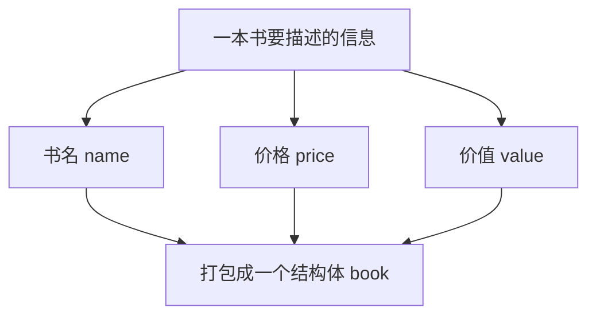
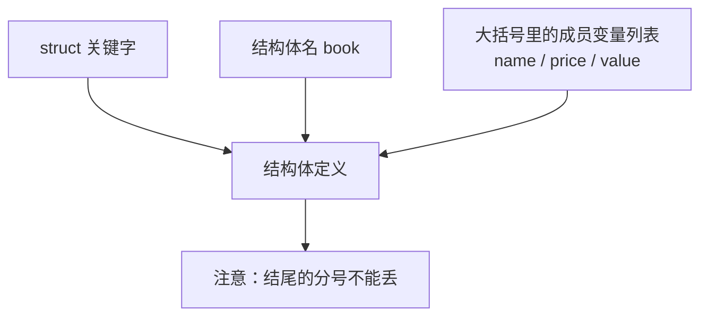
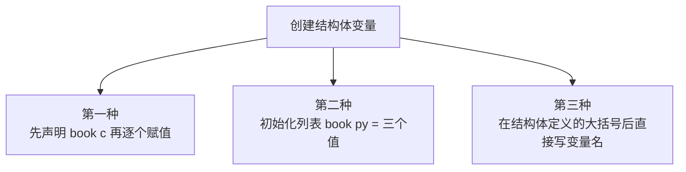
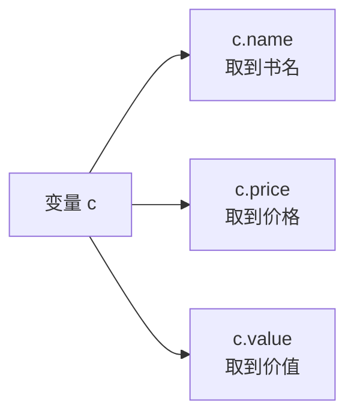
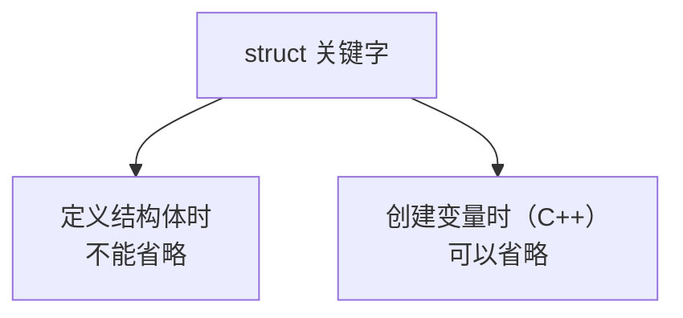

## 什么是结构体

前面学过的数据类型——`int`、`double`、`char`、`string`——都是**系统自带的类型**，它们一次只能表示**一个值**：一个整数、一个小数、一个字符、一串文本。

可现实中的事物往往不是单个值能描述清楚的。就拿一本书来说，它同时有**书名**、**价格**、**价值**这些信息。如果拆成一个个独立变量来存，一本书要三个变量，三本书就要九个变量——写起来乱，管起来更乱，而且这些变量之间"它们属于同一本书"的关系也表达不出来。

**结构体**（`struct`）就是为了解决这个问题而出现的：它是一种**用户自定义的数据类型**，可以把若干个**不同类型的变量打包成一个整体**，用一份数据来描述一个完整的对象。



打包之后，一本书就对应一个变量，书名、价格、价值都收在这一个变量里面。结构体可以用在很多地方，能表示很多东西——只要一个对象由好几样数据组成，就可以用结构体来描述它。

## 结构体的定义

要使用结构体，第一步是**定义结构体**，也就是先描述清楚"这个结构体长什么样、包含哪几样数据"。

定义结构体要用一个关键词 **`struct`**，后面跟上**结构体名**，再跟一对**大括号**，大括号中间写**成员变量列表**：

```cpp
struct 结构体名 {
    成员变量列表
};
```

一个经典的结构体定义由**三个部分**组成：`struct` 关键字、结构体名、大括号里的成员变量列表。这里要特别注意，**大括号后面那一句分号不能少**。



### 定义一本书的结构体

下面就来定义一个描述书的结构体，结构体名叫做 `book`。

一本书要有什么内容呢？首先是**书名**，用一个 `string` 来存，成员名就叫 `name`。因为用到了 `string`，所以需要**包含头文件 `<string>`**。然后是**价格**，用一个 `double` 来存，成员名叫做 `price`。最后再给它加一个**价值**，同样用 `double`，成员名叫做 `value`。

```cpp
#include <string>

using namespace std;

struct book {
    string name;
    double price;
    double value;
};
```

这样一个结构体就定义完毕了。它里面有三个**成员变量**：`name`、`price`、`value`。这里只是描述了"一本书应该长什么样"，还没有产生任何一本具体的书。

## 创建结构体变量

结构体定义好之后，它只是一个**模板**。要想得到一本真正的书，还要**创建结构体变量**。创建结构体变量总共有三种方式。

### 第一种：结构体名加变量名

最直接的方式，就是用**结构体名加上变量名**来声明一个变量：

```cpp
book c;
```

这一句就创建出了一个 `book` 类型的变量，名字叫 `c`。不过光创建出来还不够，里面的成员还没有值，接下来要一个一个给它赋值：

```cpp
c.name = "C语言程序设计";
c.price = 39.99;
c.value = 10;
```

这里的 `c.name`、`c.price`、`c.value`，就是拿到了这个变量的三个成员变量，分别给它们赋上了书名、价格、价值。像这样，第一种创建方式就完成了。

> [!TIP]
> 在 C++ 里，创建结构体变量时 `struct` 关键字是**可以省略**的。也就是说写成 `book c;` 或者 `struct book c;` 都是可以的，习惯上我们都会省略掉 `struct`，直接写 `book c;`。

### 第二种：用初始化列表

第二种方式，是用**初始化列表**在创建的同时把值一起给进去。写法是变量名后面跟一个**等号**，再跟一对**大括号**，大括号里按成员顺序依次写上初始值：

```cpp
book py = {"Python编程", 1999, 10};
```

这样一来，`py` 这个变量在创建出来的那一刻，`name` 就是"Python编程"，`price` 就是 1999，`value` 就是 10。比第一种方式少写好几行，初始化顺序就是结构体里成员定义的顺序。

### 第三种：定义的同时声明变量

第三种方式，是在**结构体定义的同时**就把变量声明出来。也就是在定义结构体的大括号后面、分号前面，直接写上变量名：

```cpp
struct book {
    string name;
    double price;
    double value;
} cpp;
```

这里的 `cpp` 就是在定义结构体的同时声明出来的一个变量，它是 `book` 类型。之后照样可以给它赋值：

```cpp
cpp.name = "C++零基础编程";
cpp.price = 99999;
cpp.value = 999999999999;
```

三种创建方式的区别，可以这样对比着看：第一种是**先创建、再逐个赋值**，适合值后面才知道的情况；第二种是**创建时就按顺序给值**，适合一开始就知道所有值的情况；第三种是**定义和声明一起写**，适合这个结构体只打算创建少数几个变量、顺手就定义掉的情况。



## 访问结构体的成员

不管是哪种方式创建的变量，访问它里面的成员都用同一个符号：**点号 `.`**。

写法就是**变量名点成员名**，比如 `c.name`、`c.price`、`c.value`。这个点号的作用，就是从这一整个结构体里，把某一个成员单独取出来——取出来之后，它就和普通的 `string`、`double` 变量没什么两样，可以读、可以改、可以参与运算。



## 把结构体打印出来

把上面三种创建方式合到一个完整程序里，并且把每本书都打印出来看一看：

```cpp
#include <iostream>
#include <string>

using namespace std;

struct book {
    string name;
    double price;
    double value;
} cpp;

int main() {
    book c;
    c.name = "C语言程序设计";
    c.price = 39.99;
    c.value = 10;
    cout << c.name << " " << c.price << " " << c.value << endl;

    book py = {"Python编程", 1999, 10};
    cout << py.name << " " << py.price << " " << py.value << endl;

    cpp.name = "C++零基础编程";
    cpp.price = 99999;
    cpp.value = 999999999999;
    cout << cpp.name << " " << cpp.price << " " << cpp.value << endl;

    return 0;
}
```

运行结果：

```text
C语言程序设计 39.99 10
Python编程 1999 10
C++零基础编程 99999 1e+12
```

前面两行都很正常，第三行的价值却变成了 `1e+12`。这不是出错，而是**科学计数法**：当 `double` 的数值很大时，`cout` 默认会用科学计数法来显示，`1e+12` 就是 10 的 12 次方。这里的 `value` 只是随手填了一个很大的数，并不影响结构体本身的用法。

> [!TIP]
> 如果希望大数值也按普通小数形式打印，可以在输出前加上 `fixed`，比如 `cout << fixed << cpp.value << endl;`。日常练习里遇到科学计数法不用担心，它只是 `cout` 的一种显示方式。

## 定义和创建的区别：struct 关键字能不能省

这一节有一个很容易混淆的地方，就是 **`struct` 关键字什么时候能省、什么时候不能省**。

**定义结构体的时候，`struct` 关键字是不能省略的。** 写 `struct book { ... };` 才对，直接写 `book { ... };` 是不行的——因为这时编译器还不知道 `book` 是一个类型，必须靠 `struct` 来告诉它"我要定义一个结构体"。

**创建结构体变量的时候，在 C++ 里 `struct` 是可以省略的。** 也就是说 `book c;` 和 `struct book c;` 都合法，只是习惯上会省略掉 `struct`。



## 本章小结

**其一**，**结构体是一种用户自定义的数据类型**，它可以把若干个不同类型的变量打包成一个整体，用一份数据来描述一个完整的对象。系统自带的 `int`、`double`、`char`、`string` 一次只能表示一个值，而结构体可以描述由多组数据组成的事物。

**其二**，定义结构体要用 **`struct` 关键字**，语法是 `struct 结构体名 { 成员变量列表 };`。一个经典的结构体定义由三部分组成：`struct` 关键字、结构体名、大括号里的成员变量列表，**大括号后面的分号不能少**。

**其三**，定义 `book` 结构体时用了三个成员变量：`string name` 存书名、`double price` 存价格、`double value` 存价值。因为用到了 `string`，所以要**包含头文件 `<string>`**。定义结构体只是描述了模板，还没有产生具体的数据。

**其四**，创建结构体变量有三种方式。**第一种**是先用结构体名加变量名声明，比如 `book c;`，再逐个给成员赋值；**第二种**是用初始化列表，比如 `book py = {"Python编程", 1999, 10};`，创建的同时按成员顺序给值；**第三种**是在结构体定义的大括号后面直接写变量名，定义和声明一起完成。

**其五**，访问结构体的成员用**点号 `.`**，写法是变量名点成员名，比如 `c.name`、`c.price`、`c.value`。取出来的成员就和普通变量一样，可以读、可以改、可以输出。

**其六**，把结构体的成员用 `cout` 依次输出，就能打印出这个对象的信息。当 `double` 的数值很大时，`cout` 会默认用**科学计数法**显示，比如 `1e+12`，这是正常的显示方式，不是错误。

**其七**，**定义结构体时 `struct` 关键字不能省略**，因为这时编译器还不知道结构体名是一个类型；而**创建结构体变量时，在 C++ 里 `struct` 可以省略**，习惯上都会省略掉。