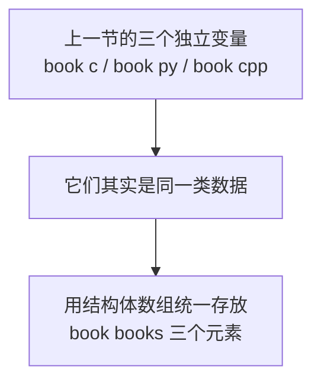
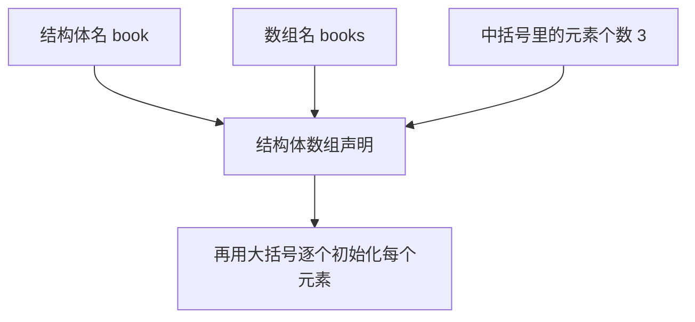
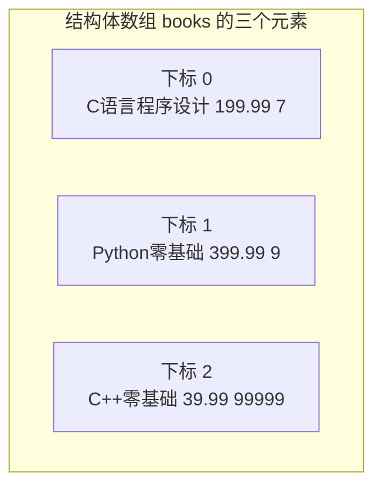
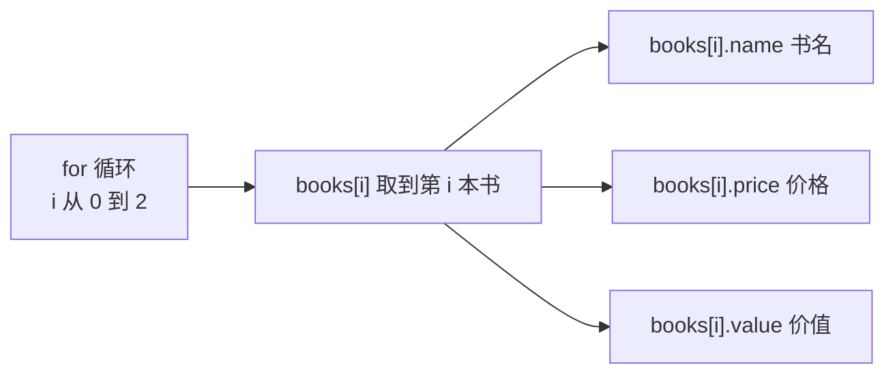
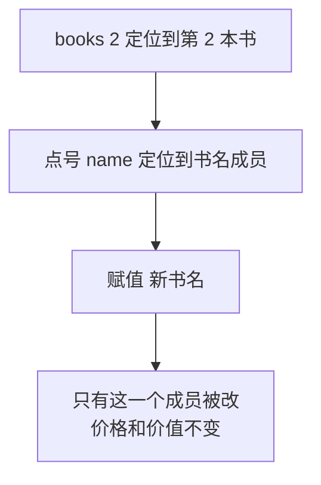

## 为什么需要结构体数组

上一节已经学会了结构体的定义，也创建出了三个结构体变量，分别代表 C 语言、Python、C++ 三本书。

但这样写有个问题：三个变量各管各的，它们是"三本书"这层关系表达不出来，想要批量处理也很麻烦。既然三本书都是同一种类型，很自然的想法就是——**把它们组织到同一个数组里面去**。

**结构体数组**就是把数组的元素类型换成结构体：数组里每一个元素，都是一个完整的结构体变量。这样一来，一个数组就能装下一整排同类型的对象。



## 结构体数组的语法

创建一个结构体数组，语法是在**结构体名**后面跟**数组名**，再用**中括号**写出**元素个数**，最后用**赋值号**接一对**大括号**进行初始化：

```cpp
结构体名 数组名[元素个数] = { 逐个元素初始化 };
```

和普通数组一样，结构体数组的**下标也是从 0 开始**的。元素个数写 3，那么合法下标就是 0、1、2。



### 声明结构体数组

按照这个语法，声明一个装三本书的结构体数组，数组名叫做 `books`：

```cpp
book books[3];
```

这一句就创建出了一个长度为 3 的数组，它的三个元素都是 `book` 类型。只写这一句的话，元素里的成员还没有值，需要接着初始化。

## 结构体数组的初始化

初始化结构体数组，是**对每一个元素单独初始化**。每个元素本身就是一个结构体，所以它也用一对大括号，里面按成员顺序写上各个成员的值；元素之间再用逗号隔开，整体套在最外层的大括号里：

```cpp
book books[3] = {
    {"C语言程序设计", 199.99, 7},
    {"Python零基础", 399.99, 9},
    {"C++零基础", 39.99, 99999}
};
```

这里第 0 个元素的书名是"C语言程序设计"，价格 199.99，价值 7；第 1 个元素的书名是"Python零基础"，价格 399.99，价值 9；第 2 个元素的书名是"C++零基础"，价格 39.99，价值 99999。每个大括号里的顺序，都对应结构体里 `name`、`price`、`value` 的定义顺序。

初始化完成之后，内存里就是这个样子：数组里并排躺着三个结构体，每个结构体里又装着三个成员。



## 用 for 循环遍历结构体数组

数组建好之后，要把里面的元素全部输出出来。因为数组的元素个数是已知的，只要**用一个 `for` 循环**从第 0 个元素遍历到最后一个元素就行。

取某一个元素用**数组名加中括号加下标**，比如 `books[i]` 就是第 `i` 本书。取到这本书之后，再用**点号**拿到它的成员：`books[i].name` 是书名，`books[i].price` 是价格，`books[i].value` 是价值。可以看到，**下标和点号是连着用的**——先靠下标从数组里定位到某一个元素，再靠点号从这个元素里取出某一个成员。

```cpp
for (int i = 0; i < 3; i++) {
    cout << books[i].name << " " << books[i].price << " " << books[i].value << endl;
}
```

循环变量 `i` 从 0 走到 2，正好覆盖三个元素。把这三样成员依次输出，中间用空格隔开，最后换行。



把前面的内容拼成一个完整程序：

```cpp
#include <iostream>
#include <string>

using namespace std;

struct book {
    string name;
    double price;
    double value;
};

int main() {
    book books[3] = {
        {"C语言程序设计", 199.99, 7},
        {"Python零基础", 399.99, 9},
        {"C++零基础", 39.99, 99999}
    };

    for (int i = 0; i < 3; i++) {
        cout << books[i].name << " " << books[i].price << " " << books[i].value << endl;
    }

    return 0;
}
```

运行结果：

```text
C语言程序设计 199.99 7
Python零基础 399.99 9
C++零基础 39.99 99999
```

输出的每一行，就对应结构体数组里的一个元素。

## 修改结构体数组里的元素

结构体数组不仅能读，还能**直接修改**里面的值。要改某个元素里的某个成员，还是那套写法：先用下标定位到元素，再用点号定位到成员，然后像普通变量一样赋值。

比如要把第 2 本书的名字改掉：

```cpp
books[2].name = "C++入门到入土";
```

`books[2]` 是第 2 个元素，`.name` 是它的书名成员，把新的字符串赋给它，这个成员就被替换掉了。改完之后再打印出来看看：

```cpp
cout << books[2].name << " " << books[2].price << " " << books[2].value << endl;
```

运行结果：

```text
C++入门到入土 39.99 99999
```

书名变了，价格和价值没有动——说明改的确实只是这一个成员，其他成员不受影响。



到这里，结构体数组的初始化、遍历和修改就都掌握了。日常说的"增删改查"里，**修改**和**查找**这两件事，都可以通过"下标加点号"的方式来完成。

## 本章小结

**其一**，上一节创建的三个结构体变量各管各的，表达不出"它们是同一类数据"这层关系。**结构体数组**就是把数组的元素类型换成结构体，数组里每个元素都是一个完整的结构体变量，这样一个数组就能装下一排同类型的对象。

**其二**，创建结构体数组的语法是**结构体名加数组名加中括号元素个数**，再用赋值号接一对大括号初始化，比如 `book books[3] = { ... };`。和普通数组一样，**下标从 0 开始**，元素个数写 3 时合法下标是 0、1、2。

**其三**，结构体数组的初始化是**对每个元素单独初始化**：每个元素用一对大括号，里面按成员顺序写值，元素之间用逗号隔开，整体再套一层大括号。大括号里的顺序对应结构体里成员的定义顺序。

**其四**，遍历结构体数组用 **`for` 循环**，循环变量从 0 走到元素个数减一。取元素用 `books[i]`，取成员用 `books[i].name`、`books[i].price`、`books[i].value`——**下标和点号连着用**，先靠下标定位到元素，再靠点号取出成员。

**其五**，结构体数组里的元素可以**直接修改**。写法是先用下标定位到元素，再用点号定位到成员，然后赋值，比如 `books[2].name = "C++入门到入土";`。修改只影响这一个成员，同一个元素里其他成员的值不受影响。

**其六**，结构体数组的**初始化、遍历、修改**掌握之后，日常说的"增删改查"里的**修改**和**查找**，都可以通过"下标加点号"的方式来完成。