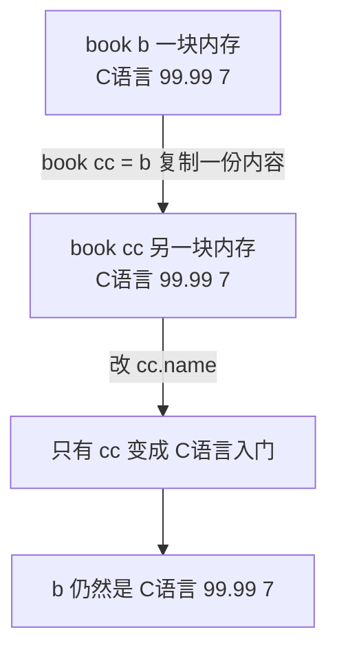
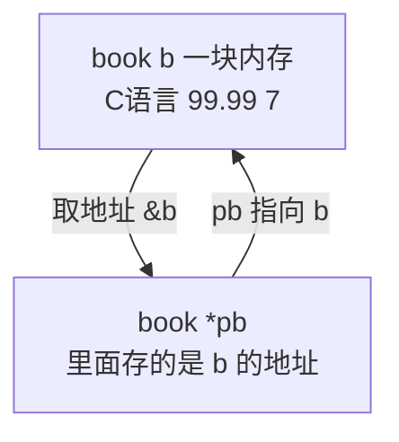
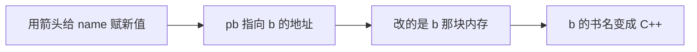
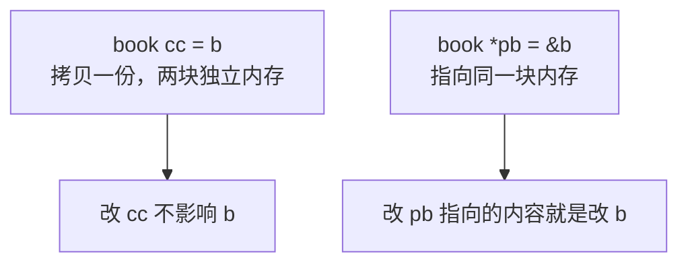

## 一个现象：改了副本，原变量却没变

上一节学了结构体数组，这一节来看**结构体指针**，以及**为什么需要它**。

先定义一个结构体变量 `b`，初始化成一本 C 语言的书：

```cpp
book b = {"C语言", 99.99, 7};
```

现在把 `b` **拷贝**一份给另一个变量 `cc`：

```cpp
book cc = b;
```

再把 `cc` 的书名改掉：

```cpp
cc.name = "C语言入门";
```

改完之后，回头把 `b` 打印出来：

```cpp
cout << b.name << " " << b.price << " " << b.value << endl;
```

结果会发现，`b` 一点都没变：

```text
C语言 99.99 7
```

变的只有 `cc` 自己。也就是说，**把 `b` 拷贝给 `cc` 之后，改 `cc` 并不会连带改掉 `b`**。

> [!TIP]
> 这一点和 Python 很不一样。在 Python 里，把 `b` 赋给 `c` 之后，`c` 和 `b` 指的是**同一个对象**，改 `c` 会连着把 `b` 一起改掉；但在 C++ 里，`book cc = b;` 做的是**拷贝**，`cc` 是一块全新的内存，和 `b` 互不相干。

为什么没改掉呢？**原因就是 `b` 和 `cc` 所在的地址不是同一个。** 它们是两块独立的内存，各自存着一份数据，改其中一块，另一块自然不受影响。



## 结构体指针：让两个变量指向同一块内存

既然改副本不影响原变量，是因为两者地址不同，那么反过来想——**如果让两个变量指向同一个地址，是不是就能一起改了？**

这正是**结构体指针**要解决的问题。

定义结构体指针的语法，是在**结构体名后面加一个星号**，再跟**指针变量名**：

```cpp
book *pb = &b;
```

这里的 `pb` 就是一个**结构体指针**，它的值是 **`b` 的地址**。右边用到的 `&b` 就是前面学过的**取地址符**，作用是取出 `b` 的地址，再把它赋给 `pb`。

这样一来，`pb` 里装的就是 `b` 的门牌号，通过 `pb` 就能找到 `b` 那块内存。



## 用箭头访问成员

有了结构体指针之后，想通过它访问成员，**就不能再用点号了**，要换成一个**箭头** `->`。箭头由**一个减号加上一个大于号**组成：

```cpp
pb->name
```

`pb->name` 的意思就是"取 `pb` 所指的那个结构体的 `name` 成员"。所以要改书名，写成：

```cpp
pb->name = "C++";
```

改完之后再把 `b` 打印出来，这次 `b` 变了：

```text
C++ 99.99 7
```

原因就在于 **`pb` 存的是 `b` 的地址，改 `pb` 指向的内容，就等于在改 `b` 本身**。



> [!TIP]
> 严格来说，`(*pb).name` 也是可以的——`*pb` 就是 `pb` 指向的那个变量（也就是 `b`）本身，再点成员名就能访问到。但因为 `*` 的优先级比 `.` 低，必须写成 `(*pb).name` 带上括号，写起来啰嗦，所以结构体指针统一用 `->`。**`pb->name` 和 `(*pb).name` 是完全等价的。**

## 拷贝和结构体指针的对比

把两种方式放在一起看，区别就很清楚了。**拷贝**是 `book cc = b;`，它会复制出一块新内存，`cc` 和 `b` 各管各的，改 `cc` 不影响 `b`。**结构体指针**是 `book *pb = &b;`，它不复制数据，只是记下 `b` 的地址，让 `pb` 和 `b` 指向同一块内存，所以改 `pb` 指向的内容，就是在改 `b`。

一个是**拷贝**，一个是**改地址**，这就是两者的本质差别。



把前面的内容拼成一个完整程序：

```cpp
#include <iostream>
#include <string>

using namespace std;

struct book {
    string name;
    double price;
    double value;
};

int main() {
    book b = {"C语言", 99.99, 7};

    book cc = b;
    cc.name = "C语言入门";
    cout << b.name << " " << b.price << " " << b.value << endl;

    book *pb = &b;
    pb->name = "C++";
    cout << b.name << " " << b.price << " " << b.value << endl;

    return 0;
}
```

运行结果：

```text
C语言 99.99 7
C++ 99.99 7
```

第一行是拷贝之后打印的 `b`，`b` 没有变化；第二行是通过结构体指针改了 `b` 的书名之后打印的，`b` 变成了 `C++`。同一个变量 `b`，两次打印结果不同，差别就在于是"拷贝"还是"指向"。

## 本章小结

**其一**，把结构体变量**拷贝**给另一个变量，比如 `book cc = b;`，`cc` 会得到一份**独立的副本**，两块内存的地址不同，改 `cc` 不会影响 `b`。

**其二**，这一点和 Python 不同。Python 里的赋值是让两个名字指向**同一个对象**，改一个会连带改另一个；而 C++ 里的 `book cc = b;` 是**拷贝**，两者互不相干。

**其三**，之所以改副本不影响原变量，根本原因是**两者的地址不同**。它们是两块独立的内存，各自存着一份数据。

**其四**，定义**结构体指针**的语法是在结构体名后面加星号，比如 `book *pb = &b;`。`pb` 里存的是 `b` 的**地址**，右边用 `&b` 这个**取地址符**取出 `b` 的地址再赋给它。

**其五**，通过结构体指针访问成员**不能用点号，要用箭头 `->`**，箭头由一个减号加一个大于号组成，比如 `pb->name`。它表示取 `pb` 所指结构体的 `name` 成员。

**其六**，因为 `pb` 存的是 `b` 的地址，所以**改 `pb` 指向的内容就等于改 `b` 本身**。给 `pb->name` 赋值之后，`b` 的书名也跟着变了。

**其七**，`pb->name` 和 `(*pb).name` **完全等价**。`*pb` 就是 `pb` 指向的那个变量本身，只是 `*` 的优先级比 `.` 低，必须加括号写成 `(*pb).name`，比较啰嗦，所以统一用箭头。

**其八**，拷贝和结构体指针的本质差别在于：**一个是拷贝，一个是改地址**。拷贝复制出一块新内存，两个变量各管各的；结构体指针不复制数据，只记下地址，让两个变量指向同一块内存，因此能通过指针去改动原变量。