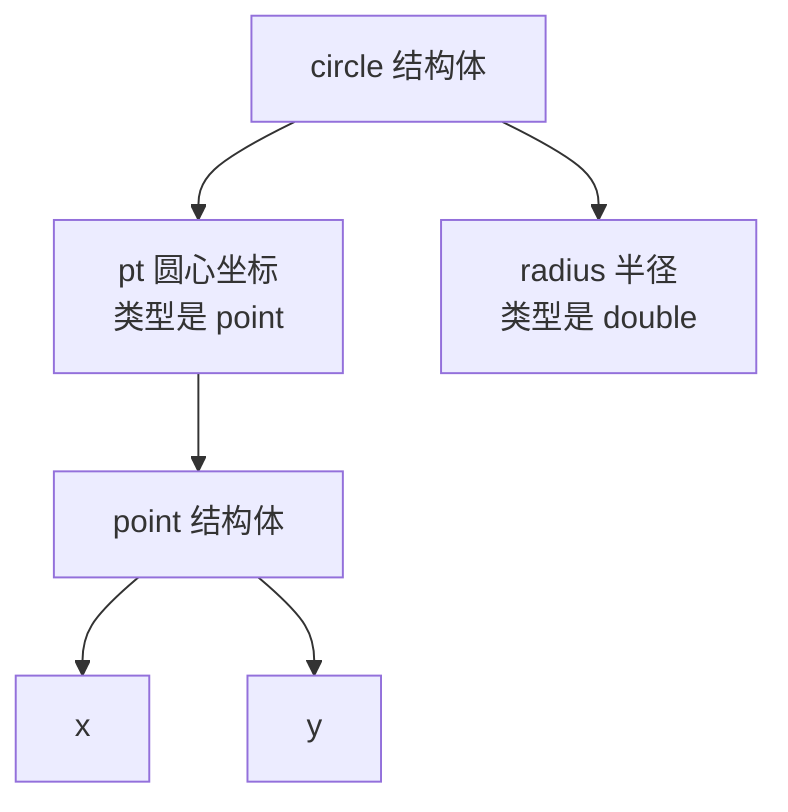
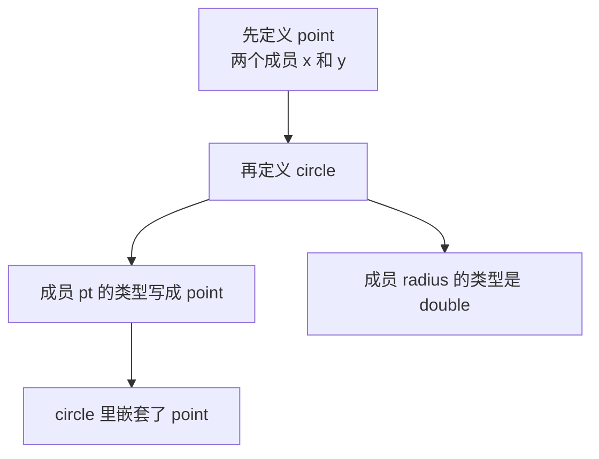
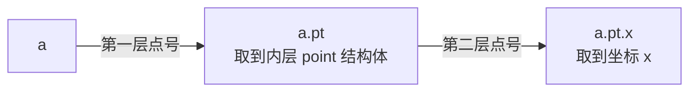
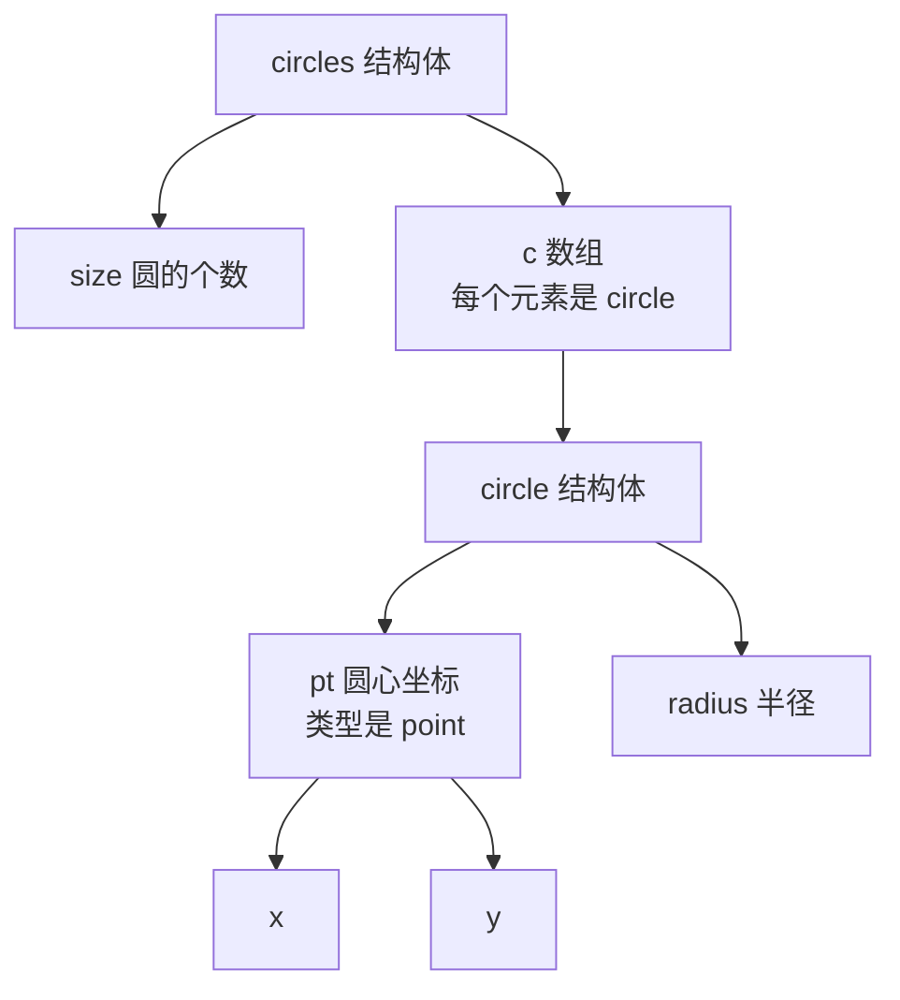
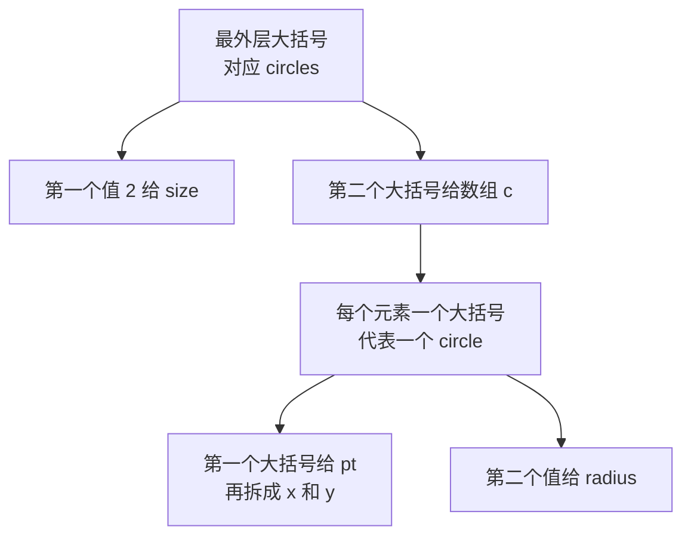

## 什么是嵌套结构体

前面定义结构体时，成员都是 `string`、`double` 这类**基本类型**。其实结构体的成员**也可以是另一个结构体**——一个结构体里面套着另一个结构体，这就是**嵌套结构体**。

拿一个圆来说，圆有**圆心坐标**和**半径**两样信息。而圆心坐标本身，又是由 x、y 两个数组成的一组数据。与其把 x 和 y 当成圆的两个平级成员，不如把"坐标"也定义成一个结构体，再把这个结构体当成圆的一个成员——这样"坐标"这层概念就表达出来了。



## 先定义 point，再嵌套进 circle

第一步，先把坐标定义成一个结构体，叫做 `point`，里面有两个成员 `x` 和 `y`：

```cpp
struct point {
    double x;
    double y;
};
```

第二步，定义圆的结构体 `circle`。它有两个成员：一个是**圆心坐标**，类型就是刚才定义的 `point`，成员名叫做 `pt`；另一个是**半径**，类型是 `double`，成员名叫做 `radius`：

```cpp
struct circle {
    point pt;
    double radius;
};
```

这样就得到了一个嵌套结构体：`circle` 结构体里面嵌套了一个 `point` 结构体。



## 用多层点号访问嵌套成员

定义一个 `circle` 类型的变量：

```cpp
circle a;
```

要访问它的圆心坐标，第一层点号写成 `a.pt`。这一层点出来拿到的是**内层的那个 `point` 结构体**，而不是一个具体的数值。因为 `point` 本身也是结构体，所以可以**继续往下点**：再点一个 `.x`，才是坐标里的 x。

```cpp
a.pt.x = 9;
a.pt.y = 8;
a.radius = 5;
```

`a.pt.x` 就是坐标的 x，`a.pt.y` 是坐标的 y，`a.radius` 是半径。可以看到，**每多嵌套一层，就要多点一次**。

之所以能一直点下去，原因就在于**点出来的对象本身还是一个结构体**，既然是结构体，就还能再点出它里面的成员。



## 更深一层：circles 嵌套 circle

再来定义一个结构体 `circles`，用来装很多个圆。它有两个成员：`size` 表示**有多少个圆**，`c` 是一个 **`circle` 类型的数组**，最多放 100 个：

```cpp
struct circles {
    int size;
    circle c[100];
};
```

这又是一个嵌套结构体，而且层级更深了：`circles` 里嵌套了 `circle`，`circle` 里又嵌套了 `point`。想要拿到某个圆的圆心 x 坐标，就要写成 `cs.c[i].pt.x`——**从外往里，一层一层点进去**。



## 初始化嵌套结构体

嵌套结构体照样可以用大括号初始化，只是**每一层都要配一对大括号**。以 `circles` 为例：

```cpp
circles cs = {
    2,
    {
        {{9, 8}, 5},
        {{2, 1}, 1}
    }
};
```

最外层的大括号对应 `circles` 这个结构体。它里面第一个值是 `2`，按成员顺序赋给了 `size`；第二个是一个大括号，用来初始化数组 `c`。

既然 `size` 是 2，数组只需要初始化两个元素。每个元素又是一个大括号，代表一个 `circle`：大括号里的第一个值是这个圆的 `pt`，因为 `pt` 是 `point` 类型，所以再套一层大括号把它拆成 `9` 和 `8`；第二个值 `5` 是半径 `radius`。

第二个圆同理，圆心坐标是 `(2, 1)`，半径是 `1`。



## 遍历输出嵌套结构体数组

初始化好之后，用 `for` 循环把每个圆输出出来。循环次数由 `cs.size` 决定，每个圆用 `cs.c[i]` 取出。

这里用一个**临时变量**接住取出来的圆，再通过临时变量去拿它的成员，会清爽一些：

```cpp
for (int i = 0; i < cs.size; i++) {
    circle tmp = cs.c[i];
    cout << "(" << tmp.pt.x << "," << tmp.pt.y << ") " << tmp.radius << endl;
}
```

输出的时候先打一个左括号，接着是 `tmp.pt.x`、一个逗号、`tmp.pt.y`、一个右括号加一个空格，最后是半径 `tmp.radius`，然后换行。

把前面的内容拼成一个完整程序：

```cpp
#include <iostream>

using namespace std;

struct point {
    double x;
    double y;
};

struct circle {
    point pt;
    double radius;
};

struct circles {
    int size;
    circle c[100];
};

int main() {
    circle a;
    a.pt.x = 9;
    a.pt.y = 8;
    a.radius = 5;
    cout << "(" << a.pt.x << "," << a.pt.y << ") " << a.radius << endl;

    circles cs = {
        2,
        {
            {{9, 8}, 5},
            {{2, 1}, 1}
        }
    };

    for (int i = 0; i < cs.size; i++) {
        circle tmp = cs.c[i];
        cout << "(" << tmp.pt.x << "," << tmp.pt.y << ") " << tmp.radius << endl;
    }

    return 0;
}
```

运行结果：

```text
(9,8) 5
(9,8) 5
(2,1) 1
```

第一行是单独定义的圆 `a` 输出来的，第二、三行是遍历结构体数组输出的两个圆。每个圆前面的括号里是圆心坐标，后面的数字是半径。

## 本章小结

**其一**，结构体的成员**也可以是另一个结构体**，一个结构体里面套着另一个结构体，这就是**嵌套结构体**。它适合用来表达"某个成员本身又是一组数据"的情况，比如圆的圆心坐标。

**其二**，定义嵌套结构体要**先定义内层的结构体，再把它当作外层的成员类型**。这里先定义了 `point`（含 `x`、`y`），再把 `circle` 的成员 `pt` 声明成 `point` 类型，同时 `circle` 还有一个 `double` 类型的 `radius`。

**其三**，访问嵌套结构体的成员要用**多层点号**，比如 `a.pt.x`。**第一层点号点出来的是内层的结构体本身**，因为它还是结构体，所以可以继续点，第二层点号才拿到具体的数值。

**其四**，嵌套可以更深。`circles` 结构体里有 `size` 和 `circle` 数组 `c`，于是形成了"`circles` 套 `circle`、`circle` 又套 `point`"的两层嵌套。要拿到某个圆的圆心 x，就要写 `cs.c[i].pt.x`，从外往里一层层点进去。

**其五**，嵌套结构体的初始化**每一层都要配一对大括号**。最外层对应最外层的结构体，往里一层对应内层结构体，直到最里面才是具体的数值，顺序都按成员的定义顺序来。

**其六**，遍历嵌套结构体数组用 `for` 循环，循环次数由 `size` 决定，每个元素用 `cs.c[i]` 取出。可以用一个**临时变量**接住取出的元素，再通过它访问 `pt.x`、`pt.y`、`radius` 这些成员，写法更清爽。

**其七**，嵌套结构体的核心就是**不断用点号往里取**——只要点出来的东西还是结构体，就可以继续往下点，直到取出最里层的成员变量为止。