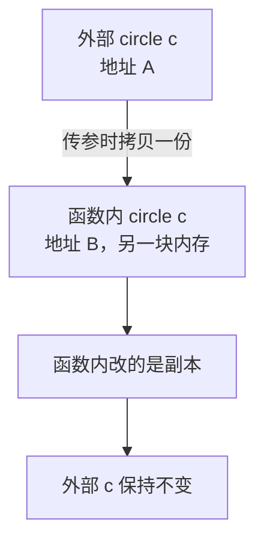
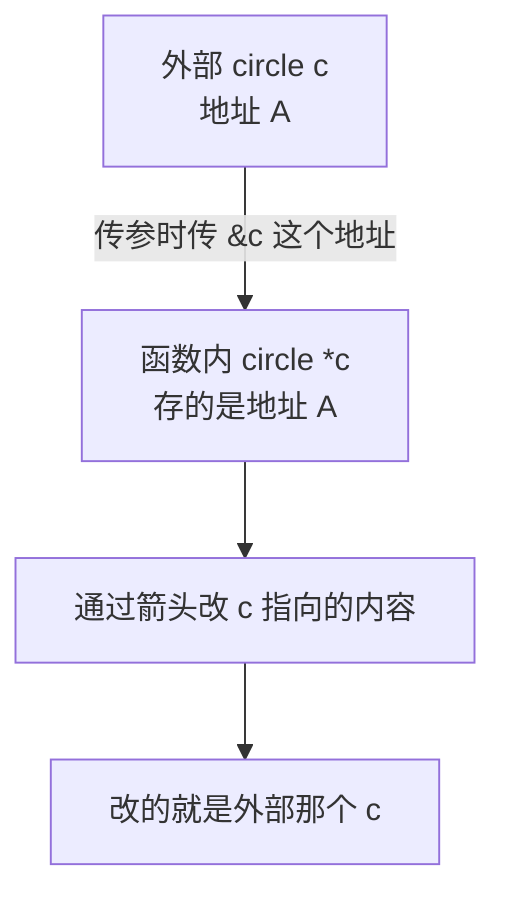
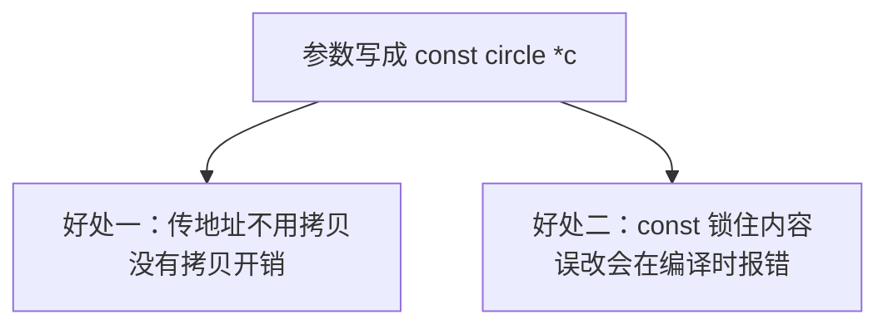

## 需求：写一个移动圆的函数

上一节做出了嵌套结构体——圆。这一节沿用这个结构体，来看**结构体作为函数参数**时要注意什么。

需求是这样的：实现一个函数，**传入一个圆，让它往 X 正方向偏移 1，往 Y 负方向偏移 2**。

## 第一版：按值传参，圆却没动

先按最自然的写法来，函数的参数就写 `circle c`，也就是**直接把结构体本身传进来**：

```cpp
void moveCircle(circle c, double dx, double dy) {
    c.pt.x += dx;
    c.pt.y += dy;
}
```

函数体里通过 `c.pt.x` 拿到圆心坐标的 x，让它加上 `dx`；`c.pt.y` 同理加上 `dy`。看起来逻辑完全正确。

然后定义一个圆，调用这个函数，再把它打印出来看看：

```cpp
circle c = {{9, 8}, 5};
moveCircle(c, 1, -2);
```

结果会发现——**圆根本没有动**，位置还是 `(9,8)`，半径还是 `5`。函数里明明加了，外面却一点变化都没有。

## 用地址验证：传参时发生了一次拷贝

为什么没动呢？把地址打印出来就一目了然了。

在调用函数之前，先把外面这个 `c` 的地址打出来：

```cpp
cout << &c << endl;
```

同时在函数内部，把传进来的 `c` 的地址也打出来：

```cpp
void moveCircle(circle c, double dx, double dy) {
    cout << &c << endl;
    c.pt.x += dx;
    c.pt.y += dy;
}
```

两个地址打印出来，结果**并不相同**：

```text
函数外 c 的地址: 0x16d693140
函数内 c 的地址: 0x16d693068
```

地址不一样，就说明**函数传参传进来的时候进行了一次拷贝**——函数里的 `c` 是外面那个 `c` 的一份**副本**，它占了另一块内存，**并不是原来那个结构体**。

所以在函数内部改了 `c`，改的只是这个副本，函数外部的那个结构体自然不受影响。**它们两个不是同一个东西。**



## 第二版：传指针，圆动了

那如果确实想改到外面那个圆，要怎么办？**把参数定义成指针**就行了：

```cpp
void moveCircle(circle *c, double dx, double dy) {
    c->pt.x += dx;
    c->pt.y += dy;
}
```

参数变成 `circle *c` 之后，调用时就要**传地址**，也就是写成 `moveCircle(&c, 1, -2);`。这时候函数里改的其实是**这个指针指向的那个对象**，也就是外面那个圆本身。

既然参数是指针，**访问成员就不能再用点号，要用箭头 `->`**，所以写成 `c->pt.x`、`c->pt.y`。

再运行一次，这次圆动了：

```text
(10,6) 5
```

原本的 `(9,8)` 变成了 `(10,6)`——x 加了 1、y 加了 -2，正是想要的结果。



## 打印函数：只读时用值传参就够了

除了移动，还想把圆打印出来，于是再写一个 `printCircle`：

```cpp
void printCircle(circle c) {
    cout << "(" << c.pt.x << "," << c.pt.y << ") " << c.radius << endl;
}
```

这个函数只是**读取**圆的信息再输出，**并不需要修改**它，所以参数直接用结构体本身（`circle c`）就没问题——反正改不到外面，也压根不打算改。

## 用 const 修饰只读的指针参数

不过 `printCircle` 也可以改成传指针。传指针不是不行，只是有个隐患：**这个函数明明只是打印、是只读的，但如果传进去一个指针，万一函数里不小心把它改了怎么办？**

这时候就可以在指针前面加上 **`const`**，表示"**我不会改它**"：

```cpp
void printCircle(const circle *c) {
    cout << "(" << c->pt.x << "," << c->pt.y << ") " << c->radius << endl;
}
```

加了 `const` 之后，函数内部就**不能再修改** `c` 指向的内容了。比如写下 `c->pt.x += 1;`，编译会直接报错：

```text
error: cannot assign to variable 'c' with const-qualified type 'const circle *'
```

意思就是"不能给 `const` 限定的变量赋值"——`const` 已经把它锁住了，改不了。

> [!TIP]
> 不同编译器对这条错误的措辞不太一样。有的编译器会提示"**表达式必须是可修改的左值**"，说的也是同一件事：这个值现在是常量、不可修改。

## 传指针加 const 的两个好处

把只读函数的参数写成 `const circle *c`，相比直接传 `circle c`，有两个好处。

**第一个好处是不用拷贝。** 如果传的是**对象**而不是指针，那么每次调用函数都会**拷贝一份**，而拷贝是有消耗的；**传地址则没有这个消耗**。

**第二个好处是防止误改。** 这个函数本来就是只读的，加上 `const` 之后，`c` 就**不能被修改**了。万一函数内部写错了想改它，**编译的时候就会直接报错**，把问题拦在编译阶段，而不是留到运行时才发现。



把前面的内容拼成一个完整程序：

```cpp
#include <iostream>

using namespace std;

struct point {
    double x;
    double y;
};

struct circle {
    point pt;
    double radius;
};

void moveCircle(circle *c, double dx, double dy) {
    c->pt.x += dx;
    c->pt.y += dy;
}

void printCircle(const circle *c) {
    cout << "(" << c->pt.x << "," << c->pt.y << ") " << c->radius << endl;
}

int main() {
    circle c = {{9, 8}, 5};
    printCircle(&c);

    moveCircle(&c, 1, -2);
    printCircle(&c);

    return 0;
}
```

运行结果：

```text
(9,8) 5
(10,6) 5
```

第一行是移动前，第二行是移动后，圆的位置确实被改动了。

## 本章小结

**其一**，结构体作为函数参数时，**默认是"按值传递"**——直接把结构体写在参数里（比如 `circle c`），函数拿到的是**一份拷贝**，占了另一块内存，和外面的结构体不是同一个东西。

**其二**，按值传参时，**在函数内部改结构体，不会影响函数外部的那个结构体**。因为改的是副本，函数一返回副本就没了。

**其三**，验证是否发生拷贝，最直接的办法就是**打印地址**。在函数外打印一次 `&c`，在函数内打印一次 `&c`，两个地址不同，就说明传参时拷贝了一份。

**其四**，如果希望函数能**改动外面的结构体**，就把参数**定义成指针**（比如 `circle *c`），调用时**传地址**（比如 `moveCircle(&c, 1, -2);`）。这时函数里改的是指针指向的那个对象，也就是外面那个结构体本身。

**其五**，参数是指针时，**访问成员不能用点号，要用箭头 `->`**，比如 `c->pt.x`、`c->pt.y`。

**其六**，如果函数**只是读取**结构体、不需要修改，参数直接用结构体本身（`circle c`）就够了，简单直观，也改不到外面。

**其七**，只读函数如果也想用指针，可以在指针前加 **`const`**，写成 `const circle *c`，表示"我不会改它"。加 `const` 后再去修改就会**编译报错**，提示类似"不能给 `const` 限定的变量赋值"或"表达式必须是可修改的左值"。

**其八**，只读参数写成 `const circle *c` 有**两个好处**：一是**传地址不用拷贝**，省掉了拷贝开销；二是 **`const` 锁住了内容**，万一误改会在**编译时**就报错，而不是拖到运行时才发现。