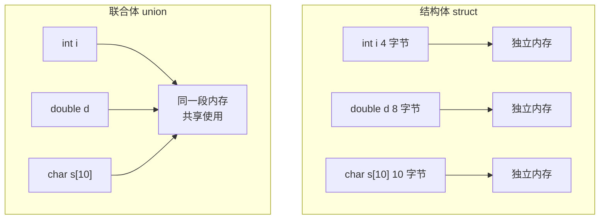
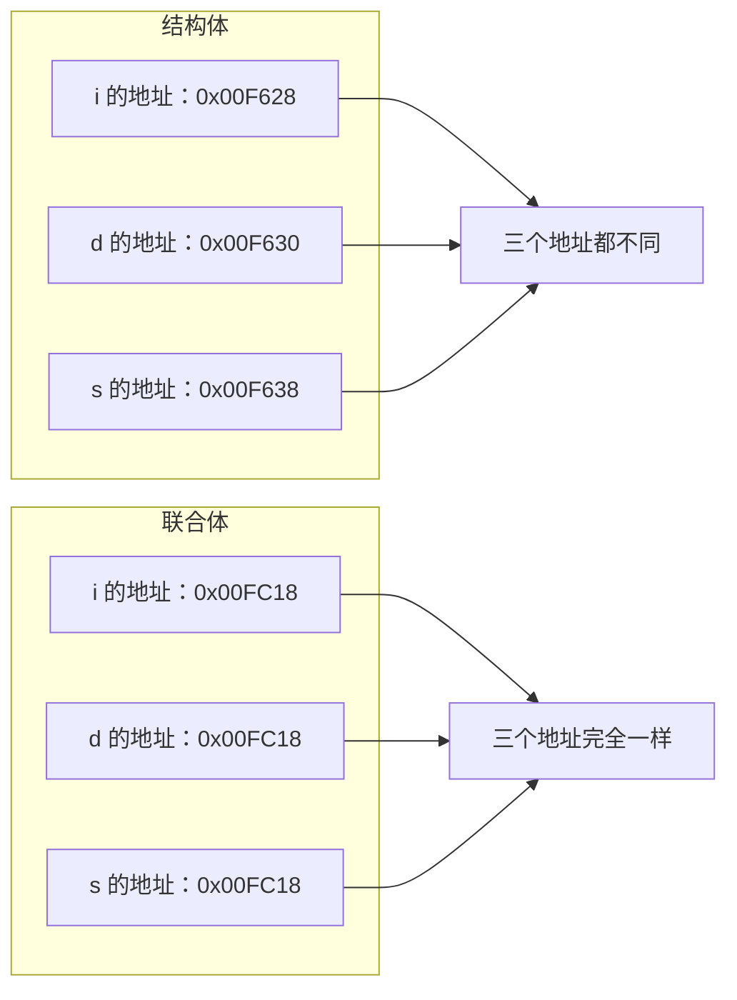
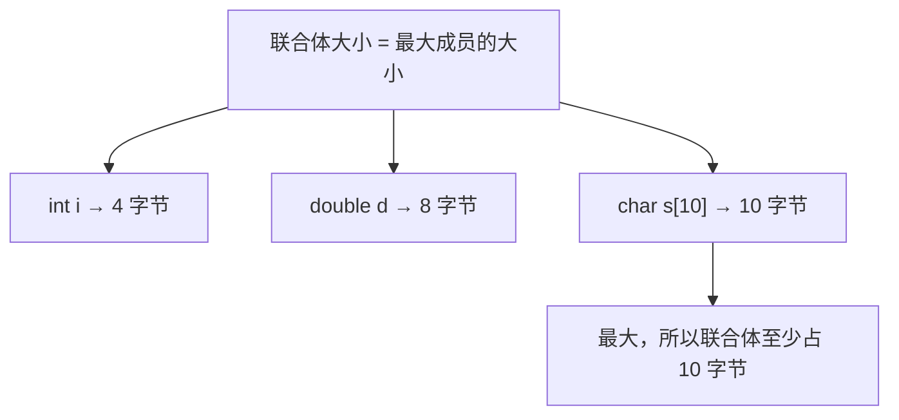
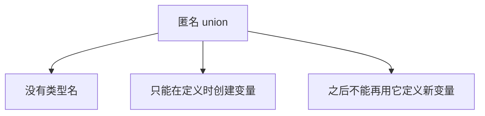

## 联合体是什么

这一节我们来学习一种新的数据类型，叫做**联合体**，又叫**共用体**，在 C++ 中用 `union` 关键字来表示。

它的写法和结构体 `struct` 非常像，我们先复习一下结构体：

```cpp
struct DataS
{
    int i;
    double d;
    char s[10];
};
```

把 `struct` 改成 `union`，联合体就定义好了：

```cpp
union DataU
{
    int i;
    double d;
    char s[10];
};
```

看起来几乎一模一样，但它们在内存上的区别可大了。

## 结构体 vs 联合体：内存的区别

**结构体**的每个成员都有**独立的内存**，相互之间不影响。你改你的，我改我的，互不干扰。

**联合体**的所有成员**共享同一段内存**，它们从相同的地址开始。修改一个成员，会影响到其他成员。



> [!NOTE]
> 联合体的核心特点就是**共用内存**——所有成员从同一个起始地址开始，大家共用一块地方。

## 验证一下：打印成员地址

光说不练假把式，我们写代码来验证一下。分别创建结构体和联合体的变量，然后把每个成员的地址打印出来对比。

```cpp
#include <iostream>
using namespace std;

struct DataS
{
    int i;
    double d;
    char s[10];
};

union DataU
{
    int i;
    double d;
    char s[10];
};

int main()
{
    DataS ds;
    cout << "结构体各成员地址：" << endl;
    cout << &ds.i << " , " << &ds.d << " , " << (void*)ds.s << endl;

    DataU du;
    cout << "联合体各成员地址：" << endl;
    cout << &du.i << " , " << &du.d << " , " << (void*)du.s << endl;

    return 0;
}
```

运行之后你会发现：

- **结构体**的三个成员地址是**不一样**的，比如一个在 F628，一个在 F630，一个在 F638，各有各的位置。
- **联合体**的三个成员地址**完全相同**，都是同一个地址，比如 FC18。



> [!TIP]
> 字符数组的名字本身就代表地址，但 `cout` 遇到 `char*` 会当成字符串来输出。想要打印地址，需要用 `(void*)` 强转一下，告诉编译器："这是个地址，别当字符串打。"

## 联合体占多大内存

联合体所有成员共用同一段内存，那它到底占多少字节呢？

答案是：**取最大的那个成员的大小**。



在我们的例子里：
- `int i` 占 4 字节
- `double d` 占 8 字节
- `char s[10]` 占 10 字节

最大的是 `char s[10]` 的 10 字节，所以联合体至少占 10 字节。

> [!NOTE]
> 实际运行时你可能发现比 10 字节要大（比如 16 字节），这是因为**字节对齐**的原因。字节对齐是另一个话题，这里先不用深究，知道有这么回事就行。

## 联合体的三种定义方式

联合体的定义和使用主要有三种方法，跟结构体很像。

### 方法一：定义和使用分开

先定义联合体类型，再用类型名去创建变量：

```cpp
union DataU
{
    int i;
    double d;
    char s[10];
};

int main()
{
    DataU a;   // 定义联合体变量 a
    DataU b;   // 定义联合体变量 b
    DataU c;   // 定义联合体变量 c
    return 0;
}
```


这是最常用、最规范的方式。

### 方法二：定义和使用结合在一起

在定义联合体类型的同时，直接在花括号后面创建变量：

```cpp
union DataU
{
    int i;
    double d;
    char s[10];
} a, b, c;   // 定义类型的同时，顺便创建三个变量
```


这种写法适合"定义完马上就要用"的场景。

### 方法三：匿名联合体

第三种是匿名方式，也就是不给联合体起名字：

```cpp
union
{
    int i;
    double d;
    char s[10];
} a, b, c;
```

因为没有类型名，所以只能在定义的时候创建变量，之后就没法再用这个类型创建新变量了。



> [!WARNING]
> 匿名联合体因为没有名字，后面没法再复用这个类型。如果只是临时用一下可以，否则还是建议给联合体起个名字，用方法一。

## 本章小结

**联合体（union）** 是一种特殊的数据类型，所有成员共享同一段内存。

**与结构体的区别**：结构体每个成员有独立内存，互不影响；联合体所有成员从同一个地址开始，共用一块内存，修改一个会影响其他。

**大小怎么算**：联合体的大小由最大的成员决定（还要考虑字节对齐）。

**三种定义方式**：
1. 先定义类型再创建变量（最常用）
2. 定义类型时顺便创建变量
3. 匿名联合体（没有类型名，只能当场用）
