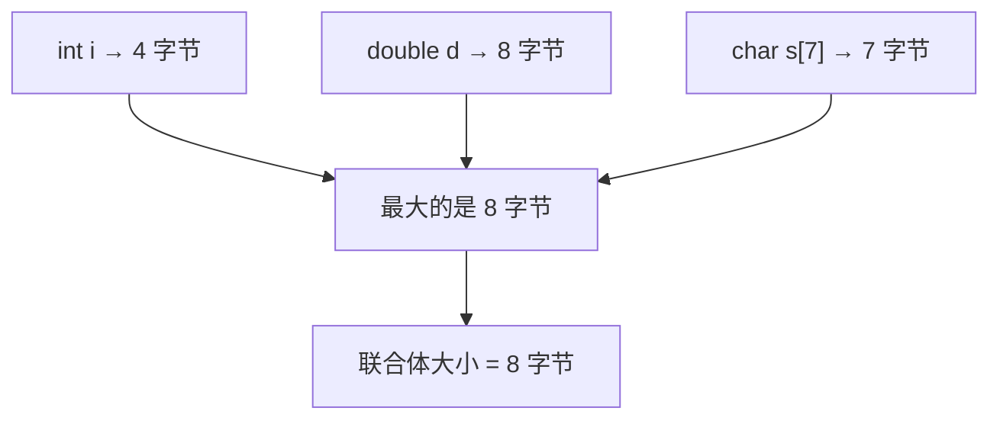
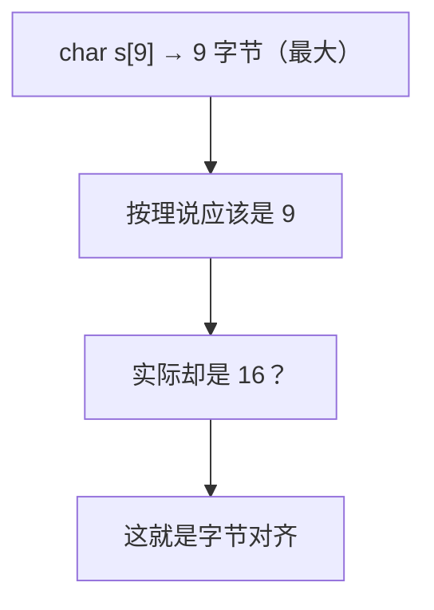
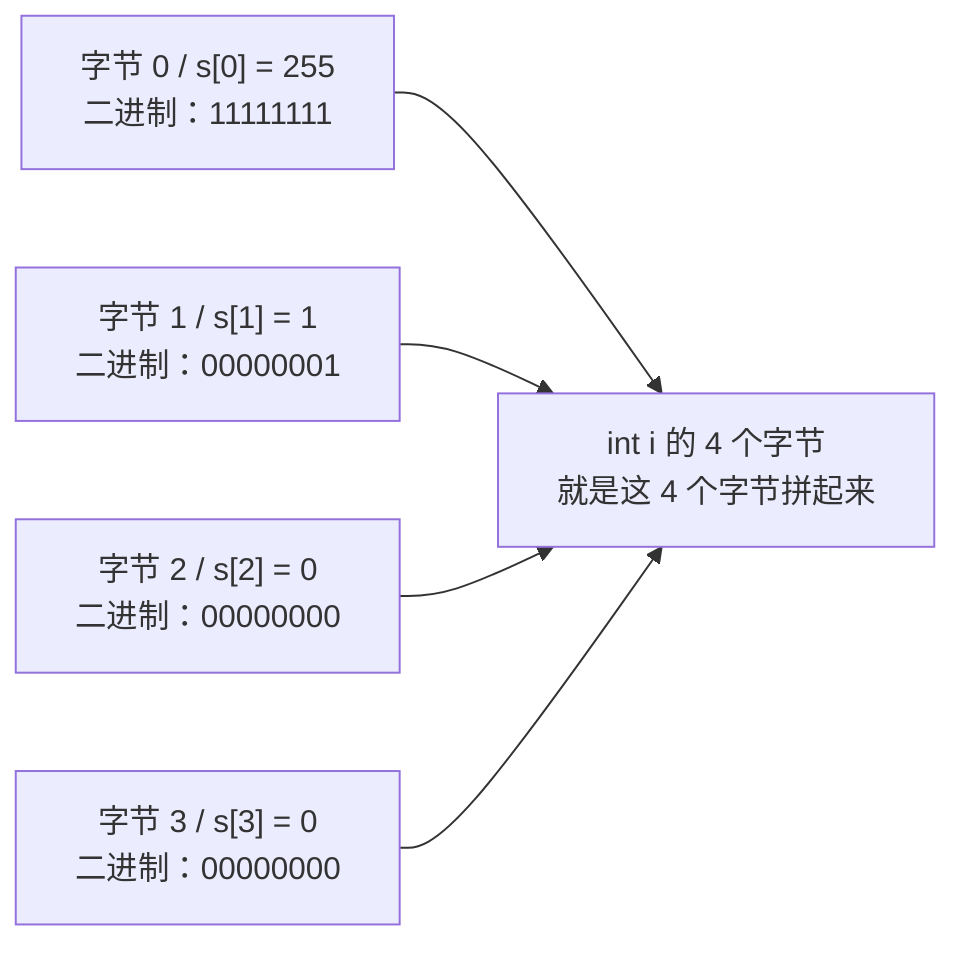
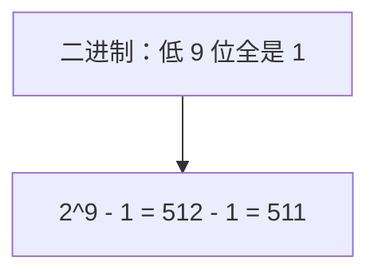
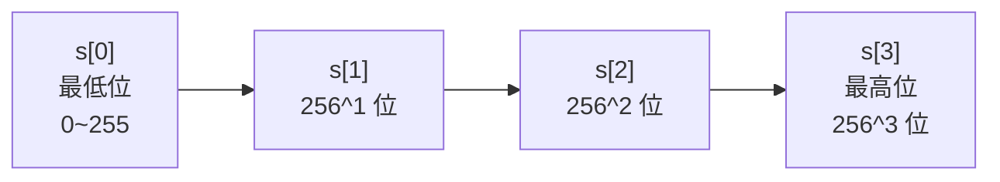
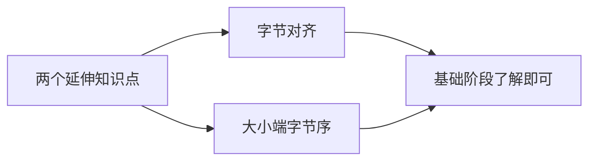

## 本节概述：揭开联合体内存的面纱

上一节我们知道了联合体的所有成员**起始地址都一样**，共享同一段内存。这一节我们深入一点，看看内存里到底是怎么排布的、一个联合体到底占多大、改一个成员对其他成员有什么具体影响。

## 联合体到底占多大

先定义一个联合体，里面放三个成员：

```cpp
union DataU
{
    int i;         // 4 字节
    double d;      // 8 字节
    char s[7];     // 7 字节
};
```

猜猜 `sizeof(DataU)` 等于多少？

答案是 **8**。



原因很简单：联合体的大小等于**最大成员的大小**。三个成员里 `double` 最大，占 8 字节，所以联合体就是 8 字节。

## 那如果字符数组是 9 个呢？

把 `char s[7]` 改成 `char s[9]`，再猜猜大小是多少？

```cpp
union DataU
{
    int i;         // 4 字节
    double d;      // 8 字节
    char s[9];     // 9 字节
};
```

你可能以为是 9，但运行一下会发现——**是 16**。



为什么多出了 7 个字节？这就涉及到一个叫**字节对齐**的技术。简单说就是 CPU 读写内存时喜欢按特定大小（比如 4 或 8 的倍数）来对齐，这样效率更高。9 不是 8 的倍数，编译器就自动补到了 16。

> [!NOTE]
> **字节对齐**是一个比较深入的话题，基础阶段不展开。有兴趣的同学可以自己搜一下"字节对齐"，网上资料很多。不想看也没关系，知道有这么回事就行。

## 动手实验：改字符数组，看 int 的变化

联合体共享内存，改一个成员会影响另一个。光说不直观，我们做个实验。

```cpp
#include <iostream>
using namespace std;

union DataU
{
    int i;
    double d;
    char s[7];
};

int main()
{
    DataU du;

    du.s[0] = 255;   // 第 0 个字符设为 255
    du.s[1] = 1;     // 第 1 个字符设为 1
    du.s[2] = 0;     // 第 2 个字符设为 0
    du.s[3] = 0;     // 第 3 个字符设为 0

    cout << du.i << endl;   // 输出 int i 的值

    return 0;
}
```

运行结果：**511**。

为什么是 511？我们来拆解一下内存。

### 内存里长什么样

`char` 占 1 个字节，`int` 占 4 个字节。它们从同一个地址开始，所以 `s[0]` 到 `s[3]` 这 4 个字节，正好就是 `int i` 的全部 4 个字节。



`255` 的二进制是 `11111111`（8 个 1），`1` 的二进制是 `00000001`。

拼起来就是：`00000000 00000000 00000001 11111111`（从高位到低位）。

这个数等于多少呢？



所以 `du.i` 输出 **511**。

> [!TIP]
> 遇到内存相关的问题，最靠谱的办法就是**逐字节分析**。搞清楚每个字节的值是多少，拼起来一算就知道了。

## 反过来：给 int 赋值，看字符数组怎么变

刚才是改字符数组看 int，现在反过来——给 int 赋值，看看字符数组变成什么样。

```cpp
du.i = 256;   // 给 int 赋值 256

cout << (int)du.s[0] << endl;   // 第 0 个字节
cout << (int)du.s[1] << endl;   // 第 1 个字节
cout << (int)du.s[2] << endl;   // 第 2 个字节
cout << (int)du.s[3] << endl;   // 第 3 个字节
```

> [!WARNING]
> 直接输出 `char` 类型可能什么都看不到，因为有些 ASCII 码是**不可见字符**。用 `(int)` 强转一下，输出成整数就能看到具体值了。

运行结果：

```
0
1
0
0
```

`s[0]` 是 0，`s[1]` 是 1，后面都是 0。

### 怎么理解：把它想成 256 进制

一个字节最多能表示 0~255，共 256 个值。你可以把 4 个字节想象成一个**256 进制的数**：



256 这个数，在 256 进制下就是：**低位 0，高位进 1**。所以：
- `s[0]` = 0（低位）
- `s[1]` = 1（进位到这一位）
- `s[2]` = 0
- `s[3]` = 0

那如果赋值 257 呢？自己可以试试——低位变成 1，高位还是 1，也就是 `s[0]=1, s[1]=1`。

> [!NOTE]
> 你可能会问：为什么低位在前、高位在后？这就涉及到**字节序**的问题了，也就是常说的**大小端**。x86 架构的 CPU 用的是小端模式（低位在前）。大小端在计算机网络里经常用到，有兴趣可以自己去了解。

## 两个延伸知识点

这节课接触到了两个进阶概念，基础阶段不展开，但你得知道它们的存在：

| 概念 | 是什么 | 什么时候用 |
|---|---|---|
| **字节对齐** | 编译器为了让 CPU 读写更快，把数据大小调整到特定对齐数的倍数 | 优化性能、理解结构体/联合体大小 |
| **大小端字节序** | 多字节数据在内存里是低位在前还是高位在前 | 网络编程、跨平台数据传输 |



> [!TIP]
> 学内存相关的东西，**验证猜想**很重要。拿不准的时候，写两行代码打印一下、调一下试，答案立刻就出来了。别光靠脑子想，动手跑一跑最靠谱。

## 本章小结

**联合体大小**：等于最大成员的大小，但实际可能因为字节对齐而更大。

**内存布局实验**：
- 改字符数组的值，int 的值也会跟着变——因为它们共用同一段内存
- `s[0]` 是 int 的最低位字节，`s[3]` 是最高位字节（小端模式）
- 可以把多字节想成"256 进制"，一个字节一位，超了就进位

**两个延伸概念**：
- **字节对齐**：编译器自动补齐到对齐数的倍数，提高 CPU 访问效率
- **大小端**：多字节数据的字节排列顺序，x86 是小端（低位在前）

**学习方法**：内存问题别死记，写代码打印调试，逐字节分析最清楚。
