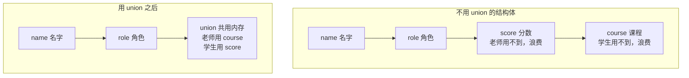
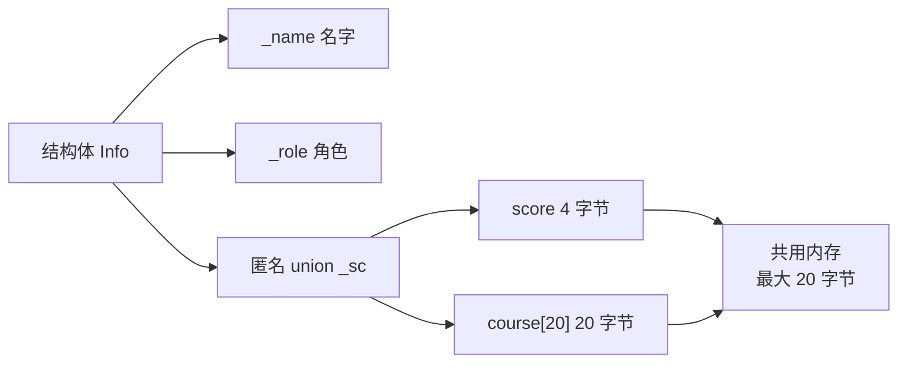
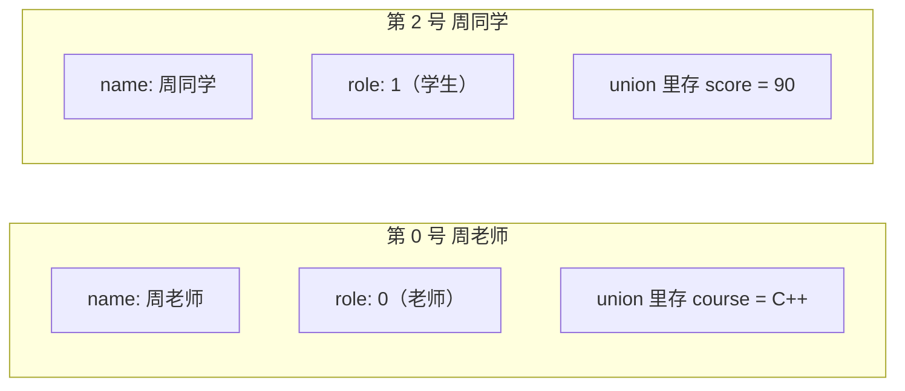
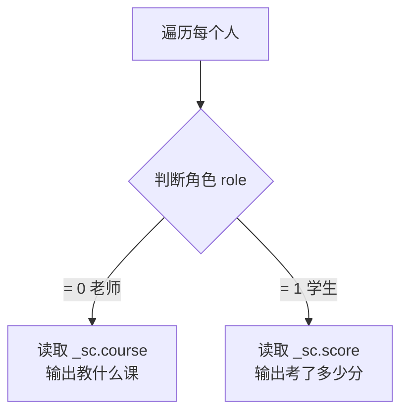
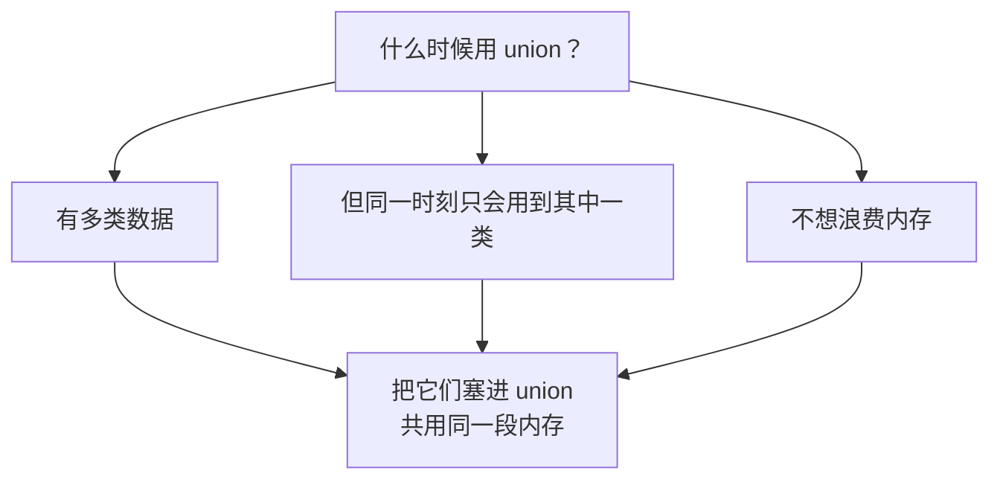

## 本节概述：联合体到底能用来干嘛

前两节我们学了联合体的定义和内存布局，这一节来个实战——看看联合体在真实场景里是怎么用的。

核心思路很简单：**有些数据不会同时用到，那就让它们共用一段内存，省空间。**

## 场景：老师和学生的信息

假设我们要存人的信息，每个人有名字、有角色（老师或学生）。但老师和学生需要存的额外信息不一样：

- **老师**：存教什么课程（course）
- **学生**：存考试分数（score）

如果用结构体硬写，大概长这样：

```cpp
struct Info
{
    char name[20];    // 名字
    int role;         // 角色：0=老师，1=学生
    int score;        // 分数（学生用）
    char course[20];  // 课程（老师用）
};
```

问题来了：如果这个人是老师，`score` 就浪费了；如果是学生，`course` 就浪费了。每个人身上都有一块永远用不到的内存。



用联合体就能解决这个浪费——让 `score` 和 `course` 共用同一段内存，谁用谁就往里写。

## 实现：结构体里嵌匿名联合体

我们在结构体内部放一个**匿名联合体**，把分数和课程塞进去：

```cpp
struct Info
{
    char _name[20];   // 名字
    int _role;        // 角色：0=老师，1=学生

    union             // 匿名联合体，没有名字
    {
        int score;       // 分数（学生用）
        char course[20]; // 课程（老师用）
    } _sc;            // 联合体变量名 _sc
};
```

因为是匿名联合体，类型没有名字，只能在定义时顺便创建变量 `_sc`。



> [!NOTE]
> 为什么用匿名联合体？因为这个联合体只在结构体内部用，外面不需要知道它的类型名，匿名就够了，代码更简洁。

## 构造函数：把数据填进去

光有结构不行，还得有办法往里塞数据。我们写一个构造函数：

```cpp
#include <iostream>
#include <cstring>   // 用 strcpy 和 strlen
using namespace std;

struct Info
{
    char _name[20];
    int _role;

    union
    {
        int score;
        char course[20];
    } _sc;

    // 构造函数
    Info(const char name[], int role, int s, const char c[])
    {
        strcpy(_name, name);      // 拷贝名字
        _role = role;              // 赋值角色

        if (s > 0)                 // 分数 > 0，说明是学生
            _sc.score = s;

        if (strlen(c) > 0)         // 课程不为空，说明是老师
            strcpy(_sc.course, c);
    }
};
```

这里用到了 `strcpy` 来拷贝字符串——因为字符数组不能直接用 `=` 赋值。判断逻辑也很简单：
- 分数大于 0，就当学生数据存进去
- 课程字符串不为空，就当老师数据存进去

> [!WARNING]
> `strcpy` 需要包含头文件 `<cstring>`（或 `<string.h>`），忘了包含会报错。

## 创建数据：老师和学生都有

接下来我们造几个人，放进数组里：

```cpp
int main()
{
    Info arr[4] = {
        Info("周老师", 0, -1, "C++"),     // 老师，教 C++
        Info("周老师", 0, -1, "Python"),  // 还是老师，教 Python
        Info("周同学", 1, 90, ""),        // 学生，分数 90
        Info("肖同学", 1, 88, ""),        // 学生，分数 88
    };

    // ... 后面打印
}
```

注意看：
- **老师**：`role=0`，分数填 `-1`（没用），课程填具体科目
- **学生**：`role=1`，分数填具体分数，课程填空字符串 `""`



## 打印输出：根据角色决定读哪个字段

数据有了，怎么打印呢？得先判断角色——是老师就读课程，是学生就读分数：

```cpp
for (int i = 0; i < 4; i++)
{
    if (arr[i]._role == 0)
    {
        // 老师：打印课程
        cout << arr[i]._name << " 是一位老师，";
        cout << "他是教 " << arr[i]._sc.course << " 的" << endl;
    }
    else if (arr[i]._role == 1)
    {
        // 学生：打印分数
        cout << arr[i]._name << " 是一位学生，";
        cout << "他的分数是 " << arr[i]._sc.score << " 分" << endl;
    }
}
```

运行结果：

```
周老师 是一位老师，他是教 C++ 的
周老师 是一位老师，他是教 Python 的
周同学 是一位学生，他的分数是 90 分
肖同学 是一位学生，他的分数是 88 分
```



## 完整代码一览

把上面所有东西拼起来，完整代码是这样的：

```cpp
#include <iostream>
#include <cstring>
using namespace std;

struct Info
{
    char _name[20];
    int _role;

    union
    {
        int score;
        char course[20];
    } _sc;

    Info(const char name[], int role, int s, const char c[])
    {
        strcpy(_name, name);
        _role = role;

        if (s > 0)
            _sc.score = s;

        if (strlen(c) > 0)
            strcpy(_sc.course, c);
    }
};

int main()
{
    Info arr[4] = {
        Info("周老师", 0, -1, "C++"),
        Info("周老师", 0, -1, "Python"),
        Info("周同学", 1, 90, ""),
        Info("肖同学", 1, 88, ""),
    };

    for (int i = 0; i < 4; i++)
    {
        if (arr[i]._role == 0)
        {
            cout << arr[i]._name << " 是一位老师，";
            cout << "他是教 " << arr[i]._sc.course << " 的" << endl;
        }
        else if (arr[i]._role == 1)
        {
            cout << arr[i]._name << " 是一位学生，";
            cout << "他的分数是 " << arr[i]._sc.score << " 分" << endl;
        }
    }

    return 0;
}
```

## 联合体应用的核心思想

这个例子虽然简单，但把联合体的用处讲透了：



**一句话总结**：多种数据不会同时用 → 放联合体里共享内存 → 省空间。

老师用课程的时候，分数那部分内存就存课程；学生用分数的时候，课程那部分内存就存分数。反正不会同时用，挤一挤就住下了。

> [!TIP]
> 联合体最常见的用法就是**"带类型标签的联合体"**——像这个例子里的 `role` 就是标签，告诉你当前联合体里存的到底是什么类型的数据。没有标签的话，你根本不知道该读哪个成员，读错了就是垃圾数据。

## 本章小结

**联合体的典型应用场景**：多类数据不同时使用，放在一起共享内存，节省空间。

**实现方式**：
- 结构体里嵌一个匿名联合体，把互斥的数据放进去
- 用一个"标签"字段（比如 `role`）记录当前存的是哪类数据
- 读数据之前先看标签，决定读联合体的哪个成员

**关键函数**：
- `strcpy(目标, 源)` —— 字符串拷贝，字符数组不能用 `=` 赋值
- `strlen(字符串)` —— 求字符串长度
- 需要包含头文件 `<cstring>`

**核心思想**：同一时刻只用一类数据 → 共享内存不浪费 → 用标签区分当前类型。
