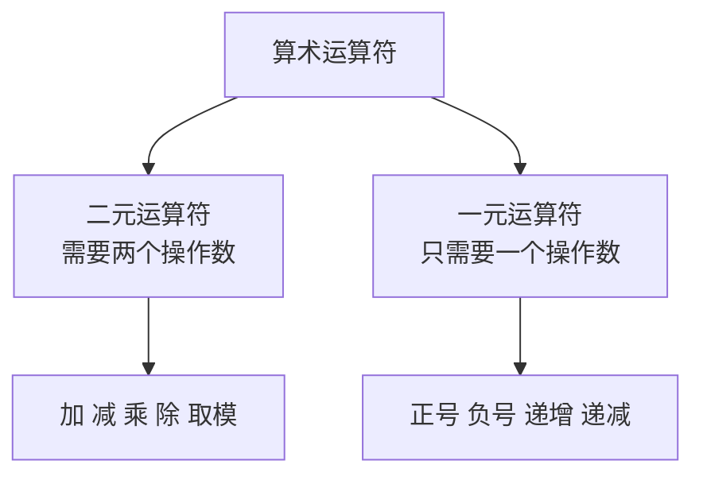
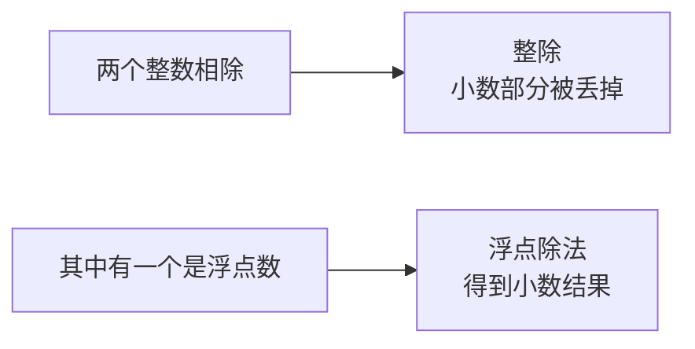
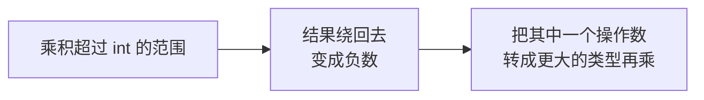
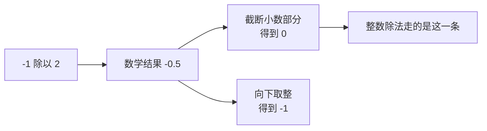
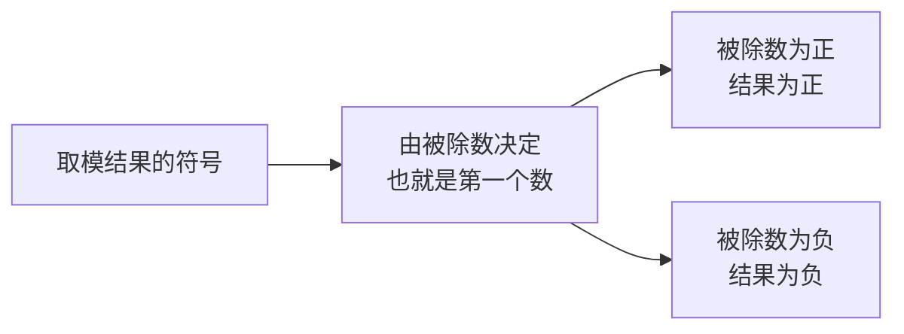
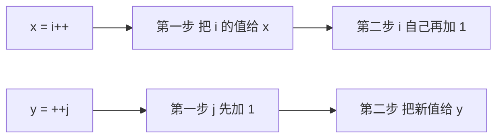

## 算术运算符有哪些

算术运算符是编程里最基础、也最常用的一类运算符。按需要的操作数个数，可以分成两组：



这一节先讲加减乘除、取模，以及递增递减。

## 加减乘除

加减乘除是**二元运算符**，需要两个操作数。定义两个变量，把四种运算都做一遍：

```cpp
#include <iostream>

using namespace std;

int main() {
    int a = 6;
    int b = 9;
    cout << a + b << endl;
    cout << a - b << endl;
    cout << a * b << endl;
    cout << a / b << endl;
    return 0;
}
```

四个符号和数学里差不多，只是乘号写成星号，除号写成斜杠：

| 运算 | 符号 | 表达式 |
| --- | --- | --- |
| 加 | `+` | `a + b` |
| 减 | `-` | `a - b` |
| 乘 | `*` | `a * b` |
| 除 | `/` | `a / b` |

运行结果：

```text
15
-3
54
0
```

前三个都在预期之内：6 加 9 是 15，6 减 9 是 -3，6 乘 9 是 54。但第四个 `6 / 9` 得到的是 **0**，而不是 0.666……，这就是下面要说的整除。

## 整数相除是整除

两个**整数**相除，结果仍然是整数，小数部分会被丢掉，这种除法叫**整除**。



所以 `6 / 9` 的结果是 0。

如果想要小数结果，就要让参与运算的数里**至少有一个是浮点数**。最简单的做法是乘上一个浮点数：

```cpp
#include <iostream>

using namespace std;

int main() {
    int a = 6;
    int b = 9;
    cout << a * 1.0 / b << endl;
    return 0;
}
```

运行结果：

```text
0.666667
```

一旦运算中出现了浮点数，两个数就都按浮点数来处理，得到的就是小数结果。

## 乘法与溢出

加法、减法相对简单，乘法有一个必须注意的问题：**容易溢出**。

```cpp
#include <iostream>

using namespace std;

int main() {
    int a = 1234567;
    int b = 12345;
    cout << a * b << endl;
    return 0;
}
```

运行结果是一个**负数**：

```text
-1939139569
```

原因在于这两个数相乘的结果大约是 1.5 乘 10 的 10 次方，远远超过了 int 能表示的范围（约 21 亿），于是结果就"绕回去"变成了负数。



> [!WARNING]
> 有符号整数溢出在 C++ 标准里属于**未定义行为**，上面这个具体数值只是当前编译器"绕回去"后的结果。换个编译器、换种优化设置，结果可能不同。所以正确的做法是别让它溢出，而不是去记溢出的结果。

## 用强制转换解决溢出

要解决乘法溢出，可以把其中一个操作数**强制转换**成一个能装下更大数值的类型，比如 long long。

```cpp
#include <iostream>

using namespace std;

int main() {
    int a = 1234567;
    int b = 12345;
    cout << (long long)a * b << endl;
    return 0;
}
```

运行结果：

```text
15240729615
```

`(long long)a` 就是把 a 强制转换成了 long long。只要两个操作数里有一个是 long long，整个乘法就会按 long long 来做，结果就不会溢出了。

加法也可能溢出，但概率比乘法小得多——**乘法是最容易溢出的**。

## 整数除法是截断，不是向下取整

除法还有一个容易踩的坑，和负号有关。把 a 设为 -1，b 设为 2：

```cpp
#include <iostream>

using namespace std;

int main() {
    int a = -1;
    int b = 2;
    cout << a / b << endl;
    return 0;
}
```

数学上 -1 除以 2 等于 -0.5。如果按"向下取整"理解，结果应该是 -1；但运行结果是：

```text
0
```

所以它**不是向下取整**，而只是简单地把小数部分**截断**掉了。



这个区别在算法题里很关键。如果确实需要向下取整，要用专门的函数，后面会讲。

## 正号与负号

加号放在一个数字前面，就不再是"相加"，而是**正号**，这时它是一元运算符：

```cpp
int a = +6;
```

`+6` 就是正六的意思，这个正号**可以省略**，写不写都是 6。

负号同理，放在前面表示取相反数：

```cpp
#include <iostream>

using namespace std;

int main() {
    int a = +6;
    int b = -a;
    cout << a << " " << b << endl;
    return 0;
}
```

运行结果：

```text
6 -6
```

a 是正 6，b 是负 a，也就是 -6。

### 负负得正

那能不能写成 `- -a` 呢？答案是**不行**——两个减号连在一起，会被编译器当成**递减运算符**（下一节要讲的 `--`），而不是"负负得正"。

想表达负负得正，要加一个括号：

```cpp
#include <iostream>

using namespace std;

int main() {
    int a = +6;
    int c = -(-a);
    cout << c << endl;
    return 0;
}
```

运行结果：

```text
6
```

加上括号之后，先算括号里的负 a 得到 -6，再对 -6 取负，就回到了 6。这就是数学里的**负负得正**。

## 字符也能参与算术运算

算术运算不只对数字有效，字符也可以参与运算。因为字符在内存里存的就是整数（ASCII 码）。

```cpp
#include <iostream>

using namespace std;

int main() {
    char a = 'A';
    a = a + 1;
    cout << a << endl;
    return 0;
}
```

运行结果：

```text
B
```

大写 A 的 ASCII 码加 1，就变成了大写 B。再改成加 2，就会得到 C。

> [!NOTE]
> 如果前面已经定义过一个叫 a 的整型变量，这里再用 `char a` 就会报"重定义"的错——同一个作用域里不能出现两个同名变量，**即使类型不同也不行**。换个变量名就好。

## 取模运算符

**取模**就是两个数相除后得到的**余数**，也叫取余，符号是百分号 `%`。

取模只能作用在**两个整数**之间。

```cpp
#include <iostream>

using namespace std;

int main() {
    int a = 100;
    int b = 9;
    cout << a % b << endl;
    return 0;
}
```

运行结果：

```text
1
```

因为 9 能整除 99，100 比 99 多出来 1，所以余数是 1。

## 取模结果的符号规律

被除数和除数都可能是正数或负数，四种组合的结果值得记一下：

```cpp
#include <iostream>

using namespace std;

int main() {
    cout << 100 % 9 << endl;
    cout << -100 % 9 << endl;
    cout << 100 % -9 << endl;
    cout << -100 % -9 << endl;
    return 0;
}
```

运行结果：

```text
1
-1
1
-1
```

把结果归一下类就能看出规律：



**取模结果的符号，和被除数（第一个数）的符号一致。** 除数是不是负数，不影响结果的符号。

手算的时候可以这么办：先把被除数的负号"提出来"，按正数算出余数，再把负号加回去。比如 `-100 % -99`，先算 `100 % 99` 得 1，再加上负号，结果就是 -1。

更严谨的理解是用这个式子：

```text
a % b = a - b * (a / b)
```

其中 `a / b` 是前面讲的**截断式整数除法**。验算一下 `-100 % -9`：`-100 / -9` 截断后是 11，`-100 - (-9 * 11)` 等于 `-100 + 99`，也就是 -1，和上面的结果一致。

零的情况单独看：零作为被除数，余数就是零；零作为除数是不合法的。

> [!TIP]
> 在算法题里，取模得到负数是很常见的情况，通常需要把它转成正数。具体做法后面学算法时会专门讲，这里先知道百分号是取余数、并且是对两个整数操作的就够了。

## 递增递减运算符

递增递减运算符就是常说的"i 加加"和"加加 i"，写作 `i++`、`++i`、`i--`、`--i`。

先看单独使用的情况：

```cpp
#include <iostream>

using namespace std;

int main() {
    int i = 6;
    i++;
    cout << i << endl;
    ++i;
    cout << i << endl;
    return 0;
}
```

运行结果：

```text
7
8
```

一开始是 6，执行一次 `i++` 变成 7，再执行一次 `++i` 变成 8。也就是说，**单独使用时，`i++` 和 `++i` 的效果完全一样**，都是把 i 加 1 再存回 i。

## 前置与后置的区别

那什么情况下不一样呢？当它们**参与其他运算**时，区别就出来了。

```cpp
#include <iostream>

using namespace std;

int main() {
    int i = 8;
    int j = 8;
    int x = i++;
    int y = ++j;
    cout << x << endl;
    cout << y << endl;
    return 0;
}
```

运行结果：

```text
8
9
```

i 和 j 都是 8，但 x 拿到的是 8，y 拿到的是 9。



区别就在这里：**后置的 `i++` 是先把值给别人，自己再加 1；前置的 `++j` 是自己先加 1，再把新值给别人。**

## 递增递减的使用建议

两条建议：

**第一，单独使用时优先写前置。** 前置的效率会稍微高一点点，因为它不需要额外保存原来的值。所以在循环里通常写成 `++i` 而不是 `i++`。当然两者的差别很小，平时写哪个问题都不大。

**第二，不要写出看不懂的代码。** 比如把前后置混在一起用：

```cpp
int z = i++ + ++i;
```

这种代码的结果**取决于编译器**，不同编译器解析出来的结果可能不一样，属于未定义行为。


自己都说不清结果是多少，同事看到了也会觉得莫名其妙，团队协作时这种代码没法维护。写代码尽量让人能看懂。

## 递减运算符

递减和递增完全对称，把加加换成减减就行：

```cpp
#include <iostream>

using namespace std;

int main() {
    int i = 8;
    i--;
    cout << i << endl;
    --i;
    cout << i << endl;
    return 0;
}
```

运行结果：

```text
7
6
```

`i--` 和 `--i` 都是把 i 减 1 之后再存回 i，前置后置的区别和递增一样：后置先给别人值自己再减，前置自己先减再把新值给别人。

## 本章小结

**其一**，算术运算符按操作数个数分为二元和一元两类。加减乘除、取模是二元运算符，正号、负号、递增、递减是一元运算符。

**其二**，乘号写作星号，除号写作斜杠。两个整数相除是**整除**，小数部分被丢掉，`6 / 9` 得到 0。想要小数结果，就让参与运算的数里至少有一个是浮点数，比如 `a * 1.0 / b`。

**其三**，乘法最容易溢出。乘积超出 int 范围后结果会"绕回去"，甚至变成负数。解决办法是把其中一个操作数**强制转换**成更大的类型，例如 `(long long)a * b`。要注意有符号整数溢出属于未定义行为，不能依赖溢出的具体结果。

**其四**，整数除法是把小数部分**截断**，不是向下取整。`-1 / 2` 的结果是 0 而不是 -1。需要向下取整时要使用专门的函数。

**其五**，加号写在数字前面是**正号**，属于一元运算符，可以省略。负号表示取相反数。`- -a` 会被当成递减运算符，想表达负负得正必须写成 `-(-a)`。

**其六**，字符也能参与算术运算，因为它在内存里就是整数。`'A' + 1` 得到 `'B'`，加 2 得到 `'C'`。注意同一作用域内不能重复定义同名变量，即使类型不同也不行。

**其七**，取模就是取余数，符号是百分号，只能对两个整数操作。**取模结果的符号由被除数决定**，除数是不是负数不影响符号。手算时可以把被除数的负号先提出来，算完再放回去；也可以用 `a % b = a - b * (a / b)` 来验算。

**其八**，递增递减单独使用时，`i++` 和 `++i` 效果一样，都是把变量加 1 存回自己。参与其他运算时才有区别：后置是先把值给别人自己再加，前置是自己先加再把新值给别人。单独使用时建议写前置，效率略高；不要在一行里混用前后置，那样的结果取决于编译器，属于未定义行为。