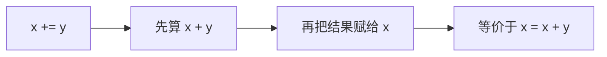
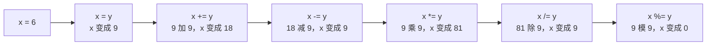
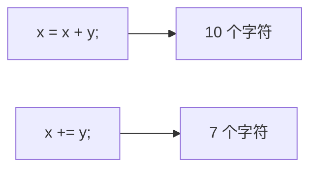

## 等号在编程里叫赋值

数学里的等号，在编程里叫做**赋值**。

赋值的意思是：**给一个东西附上一个值**。

```cpp
#include <iostream>

using namespace std;

int main() {
    int x = 6;
    int y = 9;
    x = y;
    cout << x << endl;
    return 0;
}
```

运行结果：

```text
9
```

## 赋值的方向与覆盖

为什么结果是 9？因为 `x = y;` 的含义是**把 y 的值赋值给 x**，也就是把等号**右边**的值，交给等号**左边**的变量。


x 原来存的是 6，把 y 的值赋给它之后，就变成了 9。原来的 6 被**覆盖**掉了，不会留下痕迹。

这一点和数学很不一样：数学里的等号表示"两边相等"，而编程里的等号是一个**动作**——把右边的值放进左边的变量里。

## 从 x = x + y 到 x += y

实际写代码时，更常见的是把**运算结果**再赋给变量：

```cpp
#include <iostream>

using namespace std;

int main() {
    int x = 6;
    int y = 9;
    x = x + y;
    cout << x << endl;
    return 0;
}
```

运行结果：

```text
15
```

等号右边先算出 6 加 9 得 15，再把这个结果赋给 x。

这种"自己和自己运算，再赋回自己"的写法，可以缩写成复合赋值的形式：

```cpp
#include <iostream>

using namespace std;

int main() {
    int x = 6;
    int y = 9;
    x += y;
    cout << x << endl;
    return 0;
}
```

运行结果同样是 15。

## 五种复合赋值运算符

`+=` 叫做**复合赋值运算符**。它的含义是"先运算，再赋值"：



加减乘除和取模，都能和赋值组合起来：

| 复合写法 | 等价写法 | 含义 |
| --- | --- | --- |
| `x += y` | `x = x + y` | 加完之后赋值给 x |
| `x -= y` | `x = x - y` | 减完之后赋值给 x |
| `x *= y` | `x = x * y` | 乘完之后赋值给 x |
| `x /= y` | `x = x / y` | 除完之后赋值给 x |
| `x %= y` | `x = x % y` | 取模之后赋值给 x |

## 数值变化轨迹

把这一串操作按顺序执行一遍，看 x 的值是怎么一步步变化的：

```cpp
#include <iostream>

using namespace std;

int main() {
    int x = 6;
    int y = 9;
    x = y;
    cout << x << endl;
    x += y;
    cout << x << endl;
    x -= y;
    cout << x << endl;
    x *= y;
    cout << x << endl;
    x /= y;
    cout << x << endl;
    x %= y;
    cout << x << endl;
    return 0;
}
```

运行结果：

```text
9
18
9
81
9
0
```

每一步的变化如下：



对应关系一目了然：9 加 9 得 18，18 减 9 得 9，9 乘 9 得 81，81 除 9 得 9，9 模 9 余 0。

> [!TIP]
> 这段代码一定要自己动手敲一遍、运行一遍。数字可以和我用的不一样，自己换个值走一遍，才能真正记住每种复合赋值是怎么算的。

## 复合赋值的好处

复合赋值最直接的好处是**少写字符**。

以 `x = x + y;` 为例，写下来要敲：x、空格、等号、空格、x、空格、加号、空格、y、分号，一共 10 个字符。

换成 `x += y;`，只需要 x、空格、加号、等号、空格、y、分号，一共 7 个字符。



少写三个字符，代码也更紧凑、更容易一眼看出"这是在自己身上累加"。

## 本章小结

**其一**，数学里的等号在编程里叫**赋值**，意思是给一个变量附上一个值。它表示一个动作，而不是"两边相等"。

**其二**，赋值的方向是**从右到左**：把等号右边的值交给等号左边的变量。`x = y;` 执行后 x 的值变成 y 的值。

**其三**，赋值会**覆盖**变量原来的值。x 原本是 6，执行 `x = y;` 之后就变成 9，原来的 6 不再保留。

**其四**，实际写代码时更常见的是把运算结果赋给变量，例如 `x = x + y;`。这种写法可以缩写为复合赋值 `x += y;`。

**其五**，复合赋值运算符的含义是"先运算、再赋值"。加减乘除取模都能组合，分别是 `+=`、`-=`、`*=`、`/=`、`%=`，依次等价于 `x = x + y`、`x = x - y`、`x = x * y`、`x = x / y`、`x = x % y`。

**其六**，复合赋值的好处是少写字符，代码更紧凑：`x = x + y;` 要写 10 个字符，`x += y;` 只要 7 个。