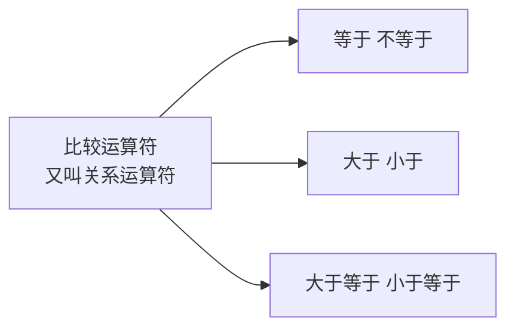
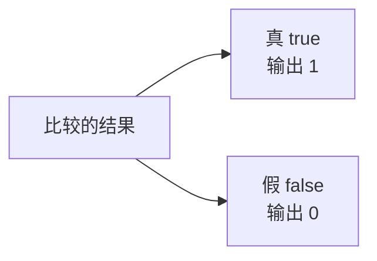

## 比较运算符又叫关系运算符

比较运算符很好理解，它描述的就是"我比你大""你比我小"这样的**关系**，所以又叫**关系运算符**。



## 六个比较运算符

一共就六个符号：

| 运算符 | 含义 |
| --- | --- |
| `==` | 等于（判断两个数是否相等） |
| `!=` | 不等于 |
| `>` | 大于 |
| `<` | 小于 |
| `>=` | 大于等于 |
| `<=` | 小于等于 |

其中"等于"要写成**两个等号**，这一点和数学里的一个等号不一样。而"不等于"是一个感叹号加一个等号。

> [!WARNING]
> 一个等号 `=` 是**赋值**，两个等号 `==` 才是**比较**。这是初学者最容易犯的错误：本来想判断相等，写成一个等号就变成了赋值，程序不会报错，但行为完全不对。

## 一个优先级陷阱

定义两个变量，试着把比较结果直接输出：

```cpp
#include <iostream>

using namespace std;

int main() {
    int a = 6;
    int b = 9;
    cout << a == b << endl;
    return 0;
}
```

这段代码**编译不通过**。

原因是 `<<` 的优先级比 `==` 高，所以编译器会先算 `cout << a`，再拿它的结果去和 b 比较，整个表达式就乱套了。


解决办法很简单：给比较运算加一对**括号**。

```cpp
    cout << (a == b) << endl;
```

这样编译器就会先算括号里的比较，再把结果交给 cout 输出。

## 比较的结果是布尔值

把六个运算符都试一遍：

```cpp
#include <iostream>

using namespace std;

int main() {
    int a = 6;
    int b = 9;
    cout << (a == b) << endl;
    cout << (a != b) << endl;
    cout << (a > b) << endl;
    cout << (a < b) << endl;
    cout << (a >= b) << endl;
    cout << (a <= b) << endl;
    return 0;
}
```

运行结果：

```text
0
1
0
1
0
1
```

输出的是 **0 和 1**，也就是布尔值——比较运算的结果天生就是布尔类型。



真用 1 表示，假用 0 表示，和上一章布尔类型讲的完全一致。

## 逐个验证

结合 a 是 6、b 是 9，逐个核对上面的输出：

| 表达式 | 含义 | 判断过程 | 结果 |
| --- | --- | --- | --- |
| `a == b` | a 等于 b | 6 不等于 9，不满足 | 0 |
| `a != b` | a 不等于 b | 6 和 9 确实不相等，满足 | 1 |
| `a > b` | a 大于 b | 6 并不大于 9，不满足 | 0 |
| `a < b` | a 小于 b | 6 小于 9，满足 | 1 |
| `a >= b` | a 大于等于 b | 6 既不大于也不等于 9，不满足 | 0 |
| `a <= b` | a 小于等于 b | 6 小于 9，满足 | 1 |

"大于等于"和"小于等于"的理解方式是：只要**大于**或者**等于**其中任意一条满足，结果就是真。所以 6 小于等于 9 成立，输出 1。

## 本章小结

**其一**，比较运算符用来描述两个数之间的大小与相等关系，又叫**关系运算符**。

**其二**，一共六个符号：`==` 等于、`!=` 不等于、`>` 大于、`<` 小于、`>=` 大于等于、`<=` 小于等于。等于必须写成两个等号，不等于是感叹号加等号。

**其三**，一个等号是赋值，两个等号是比较。把 `==` 写成 `=` 不会报错，但行为完全错误，这是初学者最常犯的错。

**其四**，在 cout 里直接写比较表达式会编译不通过，因为 `<<` 的优先级高于 `==`。必须给比较加一对括号，写成 `cout << (a == b) << endl;`。

**其五**，比较运算的结果是**布尔值**：真输出 1，假输出 0。以 a 为 6、b 为 9 为例，六个运算符的结果依次是 0、1、0、1、0、1。

**其六**，"大于等于""小于等于"只要大于或等于其中一条满足，结果就为真。所以 6 小于等于 9 成立，输出 1。