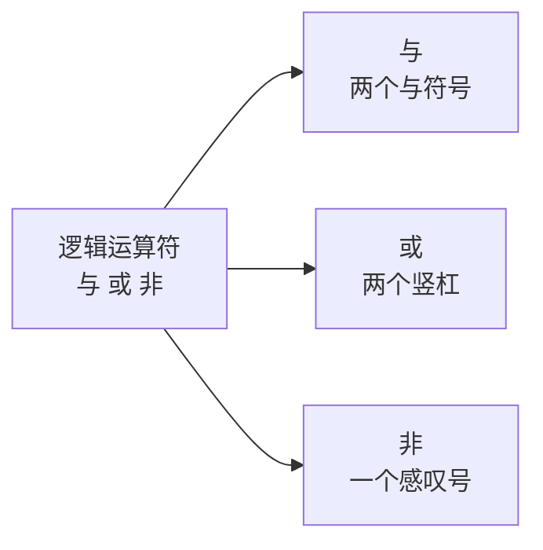
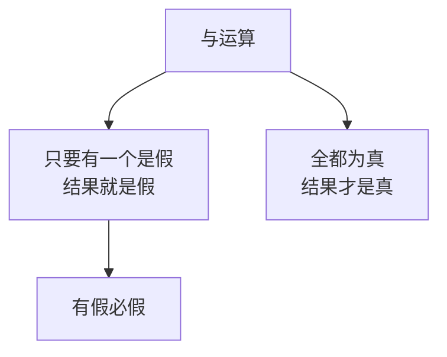
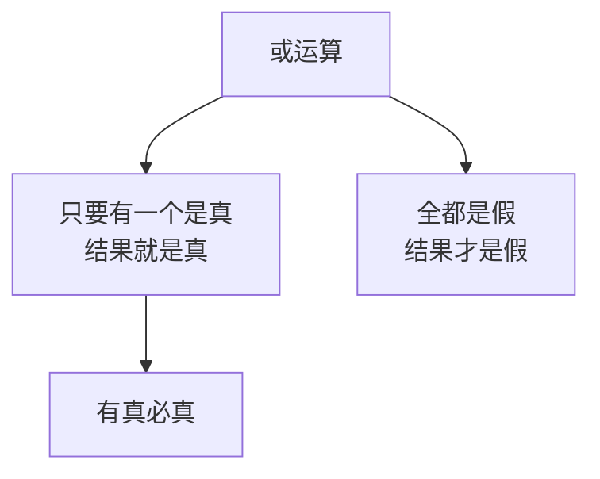
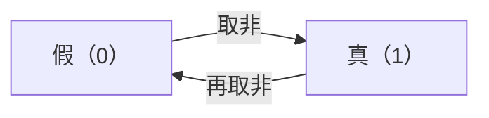

## 逻辑运算符：与、或、非

逻辑运算符用来做逻辑运算，就是我们通常说的**与、或、非**。



| 运算符 | 名称 | 写法 |
| --- | --- | --- |
| `&&` | 与 | 两个与符号 |
| `\|\|` | 或 | 两个竖杠 |
| `!` | 非 | 一个感叹号 |

这三个符号在离散数学里也有对应的表示：与是向上的箭头，或是向下的箭头，非是一条上划线。含义是相通的，只是写法不同。

顺便说一句，"不等于"用的是一个感叹号加一个等号，它里面就包含了"非"的概念，所以和逻辑非是同一个来源。

与和或都是**二元运算符**，需要两个操作数；非是一元运算符，只要一个操作数。

## 与运算：有假必假

与运算的规则是：**所有参与运算的操作数都为真时，结果才是真；否则就是假。**

真和假用 0 和 1 表示，两个操作数各有两种可能，一共四种情况：

```cpp
#include <iostream>

using namespace std;

int main() {
    cout << (0 && 0) << endl;
    cout << (0 && 1) << endl;
    cout << (1 && 0) << endl;
    cout << (1 && 1) << endl;
    return 0;
}
```

运行结果：

```text
0
0
0
1
```

| 左边 | 右边 | 结果 |
| --- | --- | --- |
| 0 | 0 | 0 |
| 0 | 1 | 0 |
| 1 | 0 | 0 |
| 1 | 1 | 1 |

只有全是真的时候结果才是真，其余都是假。所以与运算的口诀是四个字：**有假必假**。



## 操作数不一定是 0 和 1

如果把上面的 1 换成 2，结果会变吗？

```cpp
#include <iostream>

using namespace std;

int main() {
    cout << (0 && 0) << endl;
    cout << (0 && 2) << endl;
    cout << (2 && 0) << endl;
    cout << (2 && 2) << endl;
    return 0;
}
```

运行结果：

```text
0
0
0
1
```

和用 1 的时候完全一样。

这说明：**逻辑运算只关心操作数是零还是非零**，并不关心它的具体数值。零当作假，任何非零值都当作真。而且不管原来是什么数，运算**返回的结果只会是 0 或 1**。

## 或运算：有真必真

或运算的规则是：**只要有一个操作数为真，结果就是真。**

```cpp
#include <iostream>

using namespace std;

int main() {
    cout << (0 || 0) << endl;
    cout << (0 || 2) << endl;
    cout << (2 || 0) << endl;
    cout << (2 || 2) << endl;
    return 0;
}
```

运行结果：

```text
0
1
1
1
```

| 左边 | 右边 | 结果 |
| --- | --- | --- |
| 0 | 0 | 0 |
| 0 | 非零 | 1 |
| 非零 | 0 | 1 |
| 非零 | 非零 | 1 |

只有全假的时候结果才是假。所以或运算的口诀也是四个字：**有真必真**。



## 短路求值

写或运算的时候，编辑器有时会给出"这一步操作没有意义"之类的提示，原因在于或运算有一个特性：**一旦有一个操作数为真，后面的操作就不需要再计算了**。


因为左边已经是真，整体结果必然是"有真必真"，右边算不算都不影响结论，所以这一步被"跳过"了。这个特性叫**短路求值**。

与运算也有类似的性质：一旦有一个操作数为假，后面的就不用算了。

> [!TIP]
> 平时写代码时，把**最可能决定结果**的条件放在前面，可以让程序少算几步。

## 非运算：非真即假

非运算最简单，就是把真假颠倒过来。

```cpp
#include <iostream>

using namespace std;

int main() {
    cout << (!0) << endl;
    cout << (!2) << endl;
    return 0;
}
```

运行结果：

```text
1
0
```

对零取非得到 1，对非零（这里是 2）取非得到 0。



概括起来就是八个字：**非真即假，非假即真**。

## 运算符嵌套与优先级

逻辑运算符可以和其他运算符嵌套使用，这时就要注意**优先级**了。看第一个例子：

```cpp
#include <iostream>

using namespace std;

int main() {
    int a = !(5 > 4 && 7 - 8 && 0 - 1);
    cout << a << endl;
    return 0;
}
```

一步步拆开算：

```text
5 > 4        →  1        （比较运算，成立返回 1）
7 - 8        →  -1       （非零，当作真）
0 - 1        →  -1       （非零，当作真）
1 && 真 && 真  →  1        （有假必假，这里没有假）
!1           →  0        （取非）
```

运行结果：

```text
0
```

再看第二个例子，这个很容易算错：

```cpp
#include <iostream>

using namespace std;

int main() {
    int b = !(1 || 1 && 0);
    cout << b << endl;
    return 0;
}
```

如果从左往右算，会得到：`1 || 1` 是 1，`1 && 0` 是 0，取非得 1，于是以为应该输出 1。

但实际运行结果是：

```text
0
```

原因在于**与的优先级高于或**。与和或一起出现时，先算与：

```text
1 && 0   →  0        （先算与）
1 || 0   →  1        （再算或）
!1       →  0        （最后取非）
```

所以输出 0。


三个逻辑运算符的优先级顺序是：**非 > 与 > 或**。非是一元运算符，而一元运算符的优先级是最高的。

> [!WARNING]
> 优先级记不清是常态，写代码时也很容易出错。**最稳妥的办法是加括号**——括号的优先级非常高，加一对括号，含义立刻就清楚了，别人读代码也不会产生误解。

## 本章小结

**其一**，逻辑运算符就是与、或、非。与写作两个与符号 `&&`，或写作两个竖杠 `||`，非写作一个感叹号 `!`。与和或是二元运算符，非是一元运算符。

**其二**，与运算的规则是"有假必假"：所有操作数都为真时结果才为真，否则为假。四种组合的结果依次是 0、0、0、1。

**其三**，逻辑运算只关心操作数是**零还是非零**，零当作假，任何非零值都当作真。把 1 换成 2，结果完全不变。运算返回的结果只会是 0 或 1。

**其四**，或运算的规则是"有真必真"：只要有一个操作数为真，结果就是真；全假时结果才是假。四种组合的结果依次是 0、1、1、1。

**其五**，或运算具有**短路求值**的特性：一旦有一个操作数为真，后面的操作就不再计算。与运算同理，一旦有一个为假，后面的也不用算。把最可能决定结果的条件放在前面可以少算几步。

**其六**，非运算就是把真假颠倒：非真即假，非假即真。对 0 取非得到 1，对非零取非得到 0。

**其七**，三个逻辑运算符的优先级顺序是**非 > 与 > 或**，一元运算符的优先级最高。与和或同时出现时先算与，`!(1 || 1 && 0)` 的结果是 0 而不是 1。

**其八**，优先级记不清时最稳妥的办法是**加括号**，括号优先级最高，含义也更清晰，便于他人阅读。