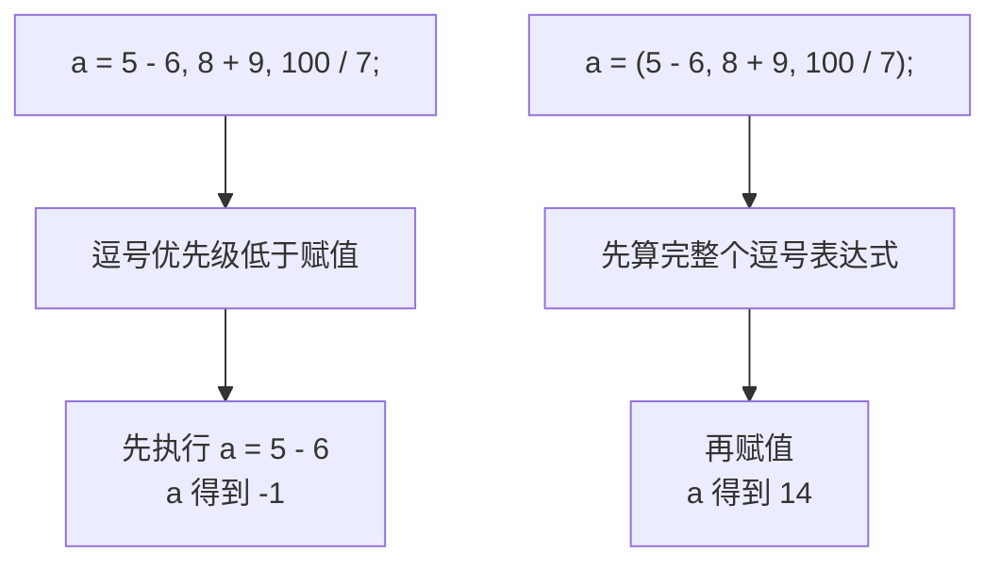
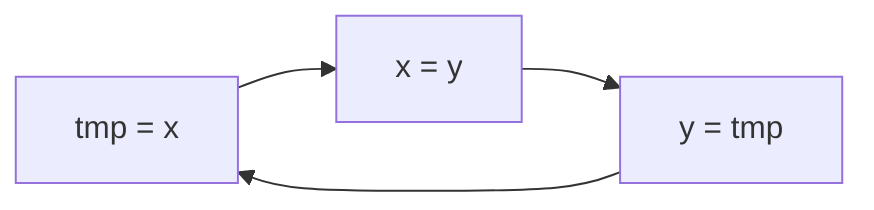

## 逗号表达式是什么

在 C++ 里，可以把多个表达式用**逗号**连接起来，构成一个表达式，这样的表达式叫**逗号表达式**。

## 逗号表达式的求值规则

逗号表达式的规则有两条：各个表达式**各自单独计算**，而整个逗号表达式的值**等于最后一个表达式的值**。

```cpp
#include <iostream>

using namespace std;

int main() {
    int a = 1;
    a = (5 - 6, 8 + 9, 100 / 7);
    cout << a << endl;
    return 0;
}
```

三个表达式分别算出来：

```text
5 - 6     →  -1
8 + 9     →  17
100 / 7   →  14      （两个整数相除是整除，小数部分被截断）
```

整个逗号表达式的值就是最后一个表达式的结果 14，所以 a 等于 14。运行结果：

```text
14
```


## 一个优先级陷阱

逗号运算符的**优先级非常低**，低到什么程度呢？**比赋值运算符还要低**。


所以和赋值运算符一起出现时，很容易出错。先看初始化的情况：

```cpp
int a = 5 - 6, 8 + 9, 100 / 7;
```

这样写**编译不通过**。因为 `int a = 5 - 6` 是**初始化**，初始化的时候不能这样乱写，逗号后面的内容没法接上去。

正确的做法是先声明变量，再用赋值的方式写逗号表达式：

```cpp
int a = 1;
a = (5 - 6, 8 + 9, 100 / 7);
```

再看另一种情况——把括号去掉：

```cpp
#include <iostream>

using namespace std;

int main() {
    int a = 1;
    a = 5 - 6, 8 + 9, 100 / 7;
    cout << a << endl;
    return 0;
}
```

运行结果：

```text
-1
```

结果不是 14，而是 -1。

原因就是逗号的优先级低于赋值，所以编译器先执行了赋值，把这句话看成了：

```text
(a = 5 - 6), 8 + 9, 100 / 7;
```

a 先被赋成 -1，后面的 `8 + 9` 和 `100 / 7` 只是两个独立的表达式，算完就丢掉了，不会影响 a。



> [!WARNING]
> 这个坑连写代码的人自己都会不经意踩到：明明想取最后一个表达式的值，结果因为漏了括号，拿到的是第一个表达式的值。**只要想取逗号表达式的值，就一定要在外面加一对括号。**

## 应用：一行完成变量交换

逗号表达式最常见的用途之一，是**变量交换**。

常规的交换写法需要借助一个临时变量，分三步走：

```cpp
#include <iostream>

using namespace std;

int main() {
    int x = 4;
    int y = 5;
    int tmp = x;
    x = y;
    y = tmp;
    cout << x << " " << y << endl;
    return 0;
}
```

运行结果：

```text
5 4
```

本来 x 是 4、y 是 5，交换之后变成 x 是 5、y 是 4。

把中间的分号换成逗号，这三步就能写在一行里：

```cpp
#include <iostream>

using namespace std;

int main() {
    int x = 4;
    int y = 5;
    int tmp;
    tmp = x, x = y, y = tmp;
    cout << x << " " << y << endl;
    return 0;
}
```

运行结果同样是：

```text
5 4
```

把这一行再执行一次，就会交换回去：

```cpp
    tmp = x, x = y, y = tmp;
    tmp = x, x = y, y = tmp;
```

运行结果：

```text
4 5
```

### 为什么好记

`tmp = x, x = y, y = tmp` 这一串很好记，因为它的赋值关系首尾相接、形成了一个**闭环**：



先看等号左边：tmp、x、y。再看等号右边：x、y、tmp。左边的头（tmp）接上了右边的尾（tmp），左边的尾（y）接上了右边的头（x），正好绕成一个圈。记住这个环形，就等于记住了变量交换的写法。

## 使用时的注意事项

用逗号表达式要记住两点：

**第一，优先级非常低，比赋值运算符还低。** 它和赋值运算符相遇时，一定要想清楚是想先算赋值、还是先算逗号表达式的内容。

**第二，想取最后一个表达式的值，就必须加括号。** 不加括号时，赋值会先把第一个表达式的结果吃掉。

只要把握好这两点，逗号表达式用起来就很顺手。

## 本章小结

**其一**，逗号表达式是把多个表达式用逗号连接起来构成的一个表达式。

**其二**，逗号表达式的求值规则是：各个表达式从左到右**各自单独计算**，整个表达式的值等于**最后一个表达式**的值。例如 `(5 - 6, 8 + 9, 100 / 7)` 的值是 14。

**其三**，逗号运算符的优先级**非常低，比赋值运算符还低**。所以 `a = 5 - 6, 8 + 9, 100 / 7;` 会先执行赋值，a 得到 -1，而不是 14。

**其四**，初始化时不能直接写逗号表达式，`int a = 5 - 6, 8 + 9, 100 / 7;` 会编译不通过。正确做法是先声明变量，再用赋值的方式书写。

**其五**，想取逗号表达式的值，必须在外面加一对**括号**，写成 `a = (5 - 6, 8 + 9, 100 / 7);`，这样 a 才能拿到 14。

**其六**，逗号表达式的一个典型应用是**变量交换**。常规写法需要 `int tmp = x; x = y; y = tmp;` 三行，用逗号表达式可以写成一行 `tmp = x, x = y, y = tmp;`。这串赋值首尾相接、构成闭环，很好记。

**其七**，使用逗号表达式要把握两点：一是它的优先级比赋值还低，与赋值相遇时要先想清楚计算顺序；二是想取最后一个表达式的值就一定要加括号。