## 位运算是什么

位运算，顾名思义，就是直接对**二进制数的每一位**进行运算。前面学的加减乘除、比较、逻辑这些运算，操作的对象是"整个数"；而位运算把数拆成二进制，从最低位到最高位一位一位地去算。

C++ 里的位运算符一共有六个：

| 运算符 | 名称 | 写法 |
| --- | --- | --- |
| `&` | 位与 | 一个与符号 |
| `\|` | 位或 | 一个竖杠 |
| `^` | 异或 | 一个尖角号 |
| `~` | 按位取反 | 一个波浪号 |
| `<<` | 左移 | 两个左尖括号 |
| `>>` | 右移 | 两个右尖括号 |

其中位与、位或、异或、左移、右移都是**二元运算符**，需要两个操作数；按位取反是**一元运算符**，只要一个操作数。

初学的时候很容易把位运算符和逻辑运算符搞混，它们长得很像，但完全是两回事：

| 逻辑运算符 | 含义 | 位运算符 | 含义 |
| --- | --- | --- | --- |
| `&&` | 逻辑与 | `&` | 位与 |
| `\|\|` | 逻辑或 | `\|` | 位或 |
| `!` | 逻辑非 | `~` | 按位取反 |

逻辑运算看的是"真或假"，结果只有 0 和 1；位运算看的是"每一位上的 0 或 1"，逐位处理，结果可以是任意整数。

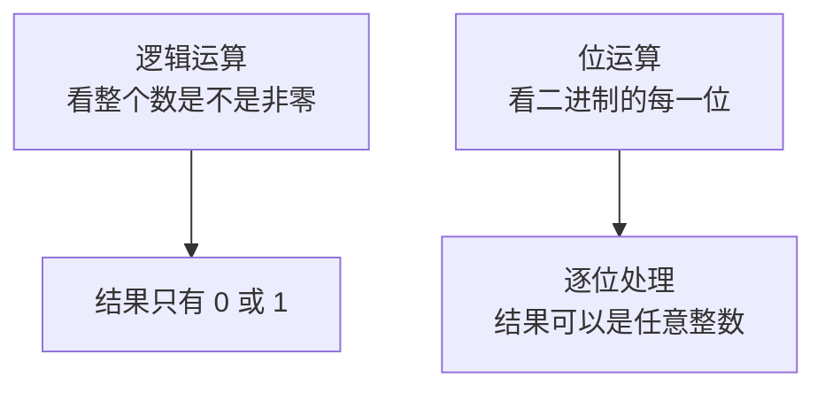

还有一个要提前记住的点：**位运算符的优先级比较低**，比算术、比较、赋值都低，和它们一起写的时候，不加括号很容易出错。所以后面凡是拿不准的地方，都给它套一对括号。

## 位与运算符

### 位与的规则

位与写作一个 `&`，它把两个数从低到高逐位比较：**只有对应的两个位都是 1，结果的这一位才是 1；只要有一个是 0，结果就是 0。** 记成四个字就是"**有零必零**"。

```cpp
#include <iostream>

using namespace std;

int main() {
    int a = 0B1010;
    int b = 0B0110;
    cout << (a & b) << endl;
    return 0;
}
```

把两个数按位对齐来看：

```text
  1010        （a，十进制的 10）
& 0110        （b，十进制的 6）
------
  0010        （结果是十进制的 2）
```

最低位 0 与 0 得 0，第二位 1 与 1 得 1，第三位 0 与 1 得 0，最高位 1 与 0 得 0，所以结果是 `0B0010`，也就是 2。运行结果：

```text
2
```

`0B` 是二进制字面量的前缀，写 `0B1010` 就表示这是一个二进制数。0B1010 的位权分别是 8 和 2，8 加 2 等于 10；0B0110 的位权分别是 4 和 2，4 加 2 等于 6。

这个性质是不是有点眼熟？逻辑与是"有假必假"，位与是"有零必零"，两者在思路上是相通的。位与也支持多个数连着写，因为两个数算完又得到一个数，再和第三个数继续算就可以了。

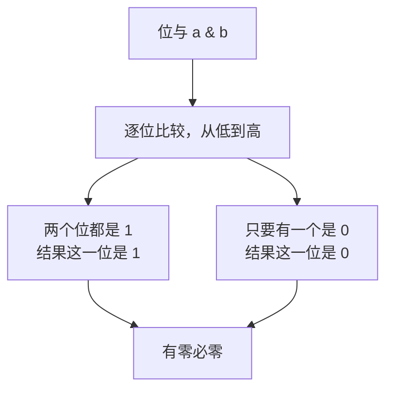

### 应用一：判断奇偶性

判断一个数是奇数还是偶数，最直接的办法是取模：

```cpp
#include <iostream>

using namespace std;

int main() {
    cout << (5 % 2) << endl;
    return 0;
}
```

运行结果：

```text
1
```

余数是 1，说明 5 是奇数。用位与也能做同一件事：

```cpp
#include <iostream>

using namespace std;

int main() {
    cout << (5 & 1) << endl;
    return 0;
}
```

运行结果同样是：

```text
1
```

为什么 `5 & 1` 也能判断奇偶？把 5 写成二进制是 `0B101`，1 写成二进制是 `0B001`：

```text
  101
& 001
-----
  001
```

1 的高位全是 0，任何数和它做位与，高位的结果一定是 0，只剩下最低位参与比较。而**奇数的二进制最低位一定是 1，偶数的二进制最低位一定是 0**，所以 `n & 1` 的结果是 1 就是奇数，是 0 就是偶数。

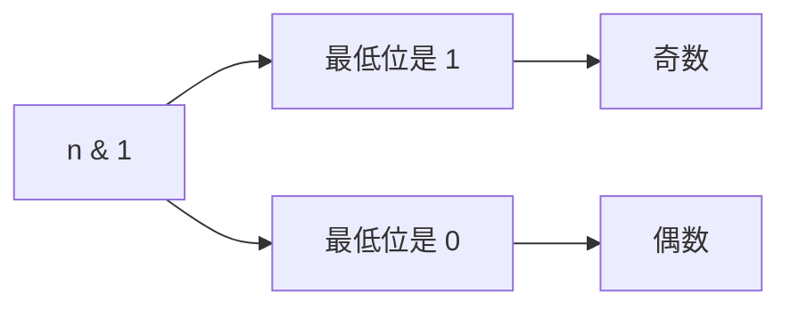

两种写法各有利弊。取模的优先级很高，写起来不容易出错；位与的效率非常高，但优先级低，不加括号容易出问题。实际写代码时，追求效率的地方常用位运算来优化。

### 应用二：获取二进制的末五位

位与还有一个常见用途：**把一个数末尾的若干位单独取出来**。

比如想取一个数二进制的后五位，只要让它和五个 1 做位与。因为 1 与任何位相与都保留原来的值，0 与任何位相与都变成 0，所以用 `0B11111` 这个"掩码"，就能只保留末五位。

```cpp
#include <iostream>

using namespace std;

int main() {
    int c = 0B10101001;
    cout << (c & 0B11111) << endl;
    return 0;
}
```

`c` 是 `0B10101001`，后五位是 `01001`：

```text
  10101001
& 00011111
----------
  00001001
```

`0B1001` 是 8 加 1 等于 9。运行结果：

```text
9
```

想取后七位、后八位，就把掩码多加几个 1，比如 `0B1111111`、`0B11111111`。取几位就用几个 1，非常直观。

### 应用三：把末五位归零

反过来，如果想把末尾的若干位清零、其余位保持不变，就要让掩码**末尾是 0、前面全是 1**。

```cpp
#include <iostream>

using namespace std;

int main() {
    int c = 0B10101001;
    cout << (c & ~0B11111) << endl;
    return 0;
}
```

`~0B11111` 就是前面全是 1、末尾五个 0 的掩码，和 `c` 相与之后，末五位被清零，前面的位原样保留：

```text
  10101001
& 11100000
----------
  10100000
```

`0B10100000` 是 128 加 32 等于 160。运行结果：

```text
160
```

原来 `c` 是 169，末五位清零后变成 160，正好少了 9——也就是被清掉的那五位原来的值。

### 应用四：消除末尾连续的一

有一个很巧妙的技巧：**把一个数和它加一之后的结果做位与，就能消除掉末尾连续的 1。**

```cpp
#include <iostream>

using namespace std;

int main() {
    int e = 0B100001111;
    cout << (e & (e + 1)) << endl;
    return 0;
}
```

`e` 是 `0B100001111`，末尾连着四个 1。它加一之后会连续进位，一直到遇到第一个 0 才停下：

```text
  100001111        （e）
+         1
-----------
  100010000        （e + 1，末尾四个 1 全部进位，它们左边那个 0 变成 1）
```

再把两者做位与：

```text
  100001111
& 100010000
-----------
  100000000
```

结果 `0B100000000` 是 256，末尾连续的一被全部消掉了。运行结果：

```text
256
```

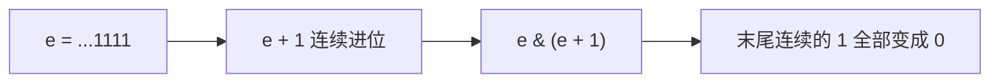

### 应用五：判断是不是二的幂

二的幂有一个很明显的特征：它的二进制里**只有一个 1**，其余全是 0，比如 8 是 `0B1000`。这样的数减一之后，那个唯一的 1 变成 0，它后面的所有位都变成 1，比如 7 是 `0B0111`。

于是两者做位与，结果必然是 0：

```text
  1000
& 0111
------
  0000
```

反过来，如果一个数不是二的幂，它的二进制里不止一个 1，减一之后至少还有一个 1 和原数重叠，位与的结果就不会是 0。比如 6 是 `0B110`，减一是 `0B101`，`110 & 101` 得 `0B100`，不是 0。

```cpp
#include <iostream>

using namespace std;

int main() {
    int f = 8;
    cout << ((f > 0) && ((f & (f - 1)) == 0)) << endl;
    return 0;
}
```

运行结果：

```text
1
```

判断的公式是 `f > 0 && (f & (f - 1)) == 0`。这里有两个细节：一是**必须加括号**，因为位与的优先级比比较运算符低，不加括号会被算错；二是**必须要求 f 大于 0**，因为 0 减一是 -1，而 `0 & -1` 也等于 0，会把 0 误判成二的幂。

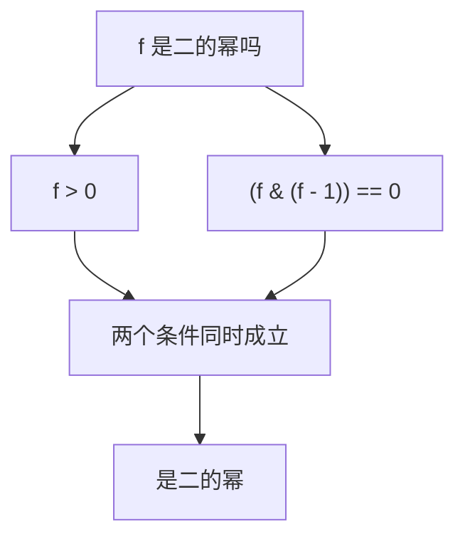

## 位或运算符

### 位或的规则

位或写作一个 `|`，它和位与是一对"好兄弟"，同样把两个数从低到高逐位比较：**只要对应的两个位里有一个是 1，结果的这一位就是 1；只有两个都是 0，结果才是 0。** 记成四个字就是"**有一即一**"。

```cpp
#include <iostream>

using namespace std;

int main() {
    int a = 0B1010;
    int b = 0B0110;
    cout << (a | b) << endl;
    return 0;
}
```

按位对齐来看：

```text
  1010        （a，十进制的 10）
| 0110        （b，十进制的 6）
------
  1110        （结果是十进制的 14）
```

最低位 0 或 0 得 0，第二位 1 或 1 得 1，第三位 0 或 1 得 1，最高位 1 或 0 得 1，结果是 `0B1110`，也就是 14。运行结果：

```text
14
```

对照着记：逻辑或是"有真必真"，位或是"有一即一"。位或同样支持多个数连着写。

### 应用一：设置标记位

位或常用来**把某个指定的位设置成 1**，其他位保持不变。

```cpp
#include <iostream>

using namespace std;

int main() {
    int c = 0B100111;
    cout << (c | 0B1000) << endl;
    return 0;
}
```

`c` 是 `0B100111`，现在想把它的倒数第四位设成 1。构造一个掩码 `0B1000`，也就是只在那一位上是 1、其他位都是 0：

```text
  100111
| 001000
--------
  101111
```

掩码为 0 的位，和原数相或的结果不变；掩码为 1 的位，无论原来是 0 还是 1，结果都变成 1。所以 `0B100111` 变成了 `0B101111`，也就是 32 加 8 加 4 加 2 加 1 等于 47。运行结果：

```text
47
```

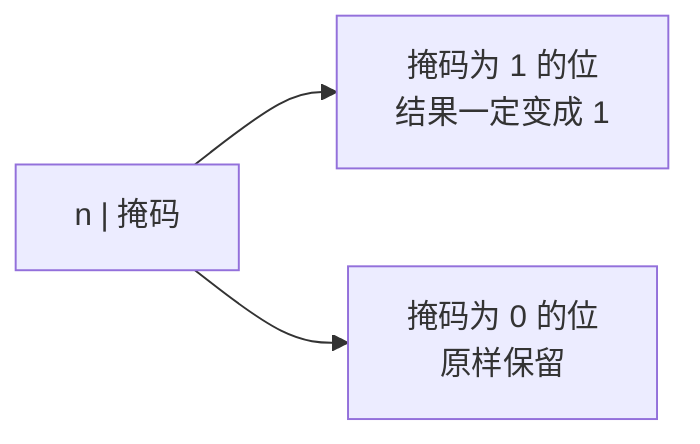

### 应用二：清空标记位

既然位或能把某一位设成 1，那反过来想把它**清成 0** 怎么办？这时候用位与更直接——让掩码在那一位上是 0、其他位是 1 就行了。

不过位或本身也能完成这件事，做法是"**先或再减**"：

```cpp
#include <iostream>

using namespace std;

int main() {
    int c = 0B100111;
    int d = 0B1;
    cout << ((c | d) - d) << endl;
    return 0;
}
```

这里的 `d` 是一个"魔法数"：**想清空哪一位，就让 `d` 在哪一位上是 1，其他位都是 0。**

先看目标位本来是 1 的情况。`c` 是 `0B100111`，最低位是 1，`d` 是 `0B1`。`c | d` 还是 `c` 本身（因为这一位已经是 1 了），再减去 `d`，这一位就从 1 变成 0：

```text
  100111
| 000001
--------
  100111        （或完之后没有变化）
- 000001
--------
  100110        （这一位被减掉了）
```

再看目标位本来是 0 的情况。假设 `c` 是 `0B100110`，最低位是 0。`c | d` 相当于把这一位先抬成 1，也就是加上了 `d`；再减去 `d`，又回到原来的值，这一位仍然是 0：

```text
  100110
| 000001
--------
  100111        （这一位被抬成了 1）
- 000001
--------
  100110        （减回去，这一位还是 0）
```

所以无论目标位原来是 0 还是 1，`(c | d) - d` 之后它都变成了 0，而其他位不受影响。这就是用位或清空标记位的思路。

> [!NOTE]
> 这个技巧的核心是先保证目标位是 1（这样相减时一定借得动），再把它减掉。理解不了也没关系，实际写代码时清空某一位更常用的是位与，位或的这招当个思路了解一下就好。

### 应用三：把低位连续的零变成一

位或还有一招：**把一个数和它减一之后的结果相或，就能把最低位那个 1 以下的连续 0 全部变成 1。**

```cpp
#include <iostream>

using namespace std;

int main() {
    int e = 0B10000000;
    cout << (e | (e - 1)) << endl;
    return 0;
}
```

`e` 是 `0B10000000`，最低位那个 1 的下面全是 0。它减一的时候会向这一位借位，借完之后这一位变成 0，下面的所有 0 都变成 1：

```text
  10000000        （e）
-        1
----------
  01111111        （e - 1）
```

再把两者相或：

```text
  10000000
| 01111111
----------
  11111111
```

前面部分和原数相同，或完还是原样；后面的部分因为 `e - 1` 全是 1，或完就都变成了 1。结果 `0B11111111` 是 255。运行结果：

```text
255
```

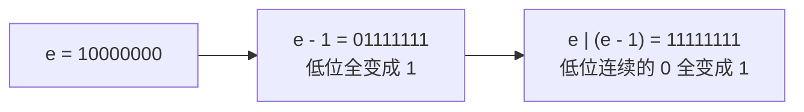

## 异或运算符

### 异或的规则

异或写作一个 `^`，它逐位比较的规则是：**两个位相同，结果这一位是 0；两个位不同，结果这一位是 1。** 也就是"**相同为 0，不同为 1**"。

```cpp
#include <iostream>

using namespace std;

int main() {
    int a = 0B1010;
    int b = 0B0110;
    cout << (a ^ b) << endl;
    return 0;
}
```

按位对齐来看：

```text
  1010        （a，十进制的 10）
^ 0110        （b，十进制的 6）
------
  1100        （结果是十进制的 12）
```

最低位 0 与 0 相同，得 0；第二位 1 与 1 相同，得 0；第三位 0 与 1 不同，得 1；最高位 1 与 0 不同，得 1。结果是 `0B1100`，也就是 8 加 4 等于 12。运行结果：

```text
12
```

逻辑运算里没有和异或对应的符号，异或只存在于位运算中。

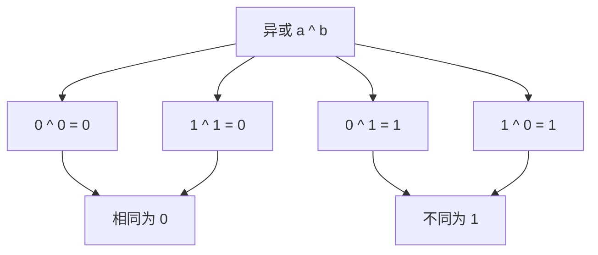

### 异或的三条性质

异或有三条性质，后面所有的用法都是从这三条推出来的，一定要记住。

**第一条：任何数和 0 异或，还是它本身。** 因为 0 和任何位都"不同"，结果就是原来的位，等于什么都没变，所以 `n ^ 0` 等于 `n`。

**第二条：两个相同的数异或，结果是 0。** 因为两个相同的数每一位都相同，异或的结果每一位都是 0，整个数自然就是 0，所以 `n ^ n` 等于 0。

**第三条：异或满足交换律和结合律。** 也就是说 `a ^ b` 和 `b ^ a` 相等，`(a ^ b) ^ c` 和 `a ^ (b ^ c)` 也相等。多个数异或时，谁先谁后都不影响结果。

其实异或的本质是**不带进位的二进制加法**。普通的二进制加法要处理进位，而异或只保留"相加后本位的值"，不往前进位，所以它的这些性质都很自然。

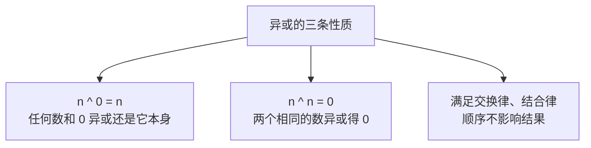

### 应用一：标记位取反

异或最直接的用途是**把某一位反复取反**：原来是 0 就变成 1，原来是 1 就变成 0。

```cpp
#include <iostream>

using namespace std;

int main() {
    int c = 0B100101;
    cout << (c ^ 0B1000) << endl;
    cout << (c ^ 0B1000 ^ 0B1000) << endl;
    return 0;
}
```

`c` 是 `0B100101`，掩码 `0B1000` 只在倒数第四位上是 1。相或的掩码为 0 的位不受影响，掩码为 1 的位则被取反：

```text
  100101
^ 001000
--------
  101101
```

这一位原来是 0，取反后变成 1，结果是 `0B101101` 也就是 45。如果对同一个掩码再异或一次：

```text
  101101
^ 001000
--------
  100101
```

这一位又被取反回去，变回了原来的 `c`。所以异或同一个掩码两次，就等于什么都没做——这是一个"反复横跳"的过程。

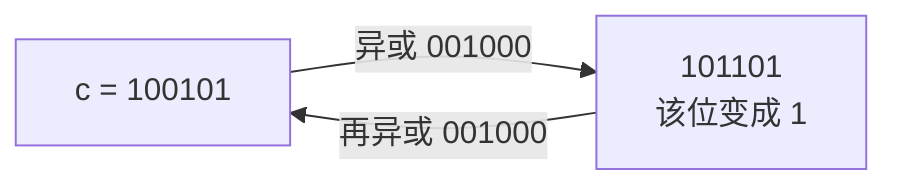

> [!WARNING]
> 这里两次异或时一定要加括号，或者像上面这样写成连乘的形式。因为位与、位或、异或的优先级都很低，不加括号容易被算错。

### 应用二：不用临时变量交换两个数

前面讲逗号表达式时，交换两个数需要一个临时变量。用异或可以**不用临时变量**就完成交换。

```cpp
#include <iostream>

using namespace std;

int main() {
    int d = 17;
    int e = 19;
    d = d ^ e;
    e = d ^ e;
    d = d ^ e;
    cout << d << " " << e << endl;
    return 0;
}
```

运行结果：

```text
19 17
```

本来 `d` 是 17、`e` 是 19，三句话之后变成 `d` 是 19、`e` 是 17，成功交换。

原理可以用性质推出来。设 `d'` 表示第一句执行后的 `d`，那么 `d'` 等于 `d ^ e`。

看第二句 `e = d ^ e`：此时等号右边的 `d` 已经是 `d'` 了，所以实际上是 `e = d' ^ e = (d ^ e) ^ e`。根据结合律，先算 `e ^ e`，由第二条性质得 0，于是 `e = d ^ 0`，由第一条性质得 `e = d`——原来的 `d` 被存进了 `e`。

再看第三句 `d = d ^ e`：此时右边的 `d` 还是 `d'`，而 `e` 已经变成了原来的 `d`，所以 `d = d' ^ d = (d ^ e) ^ d`。由交换律和结合律，先算 `d ^ d` 得 0，于是 `d = e ^ 0 = e`——原来的 `e` 被存进了 `d`。

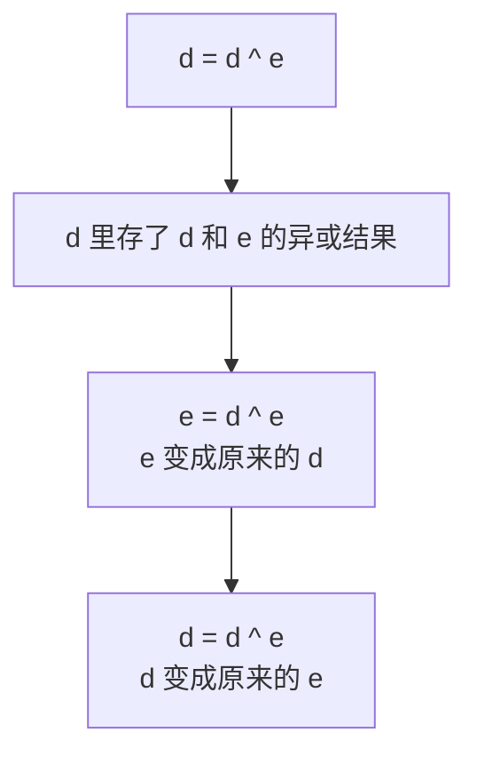

> [!NOTE]
> 这招很巧妙，但可读性差，实际工程里交换变量还是用临时变量更清楚。它的价值在于帮你理解异或的性质。

### 应用三：找出只出现奇数次的数

有一类经典问题：给出一堆数，其中除了一个数出现奇数次，其他数都出现偶数次，找出那个出现奇数次的数。

用异或可以一行解决：**把所有数全部异或起来，结果就是那个数。**

```cpp
#include <iostream>

using namespace std;

int main() {
    int nums[] = {3, 5, 3, 7, 5};
    int result = 0;
    for (int i = 0; i < 5; i++) {
        result = result ^ nums[i];
    }
    cout << result << endl;
    return 0;
}
```

运行结果：

```text
7
```

数组里 3 出现了两次、5 出现了两次、7 出现了一次，所以答案是 7。

为什么这样能行？因为出现偶数次的数，两两配对异或，由第二条性质每一对都得 0；所有的 0 再和剩下的那个数异或，由第一条性质结果就是那个数本身。

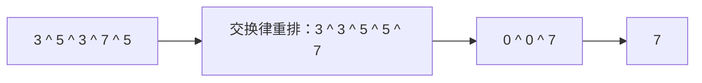

### 应用四：简单的加密与解密

异或还能用来做最简单的加密：**明文异或密钥得到密文，密文再异或同一个密钥就能还原明文。**

```cpp
#include <iostream>

using namespace std;

int main() {
    int plain = 1314;
    int key = 520;
    int cipher = plain ^ key;
    cout << cipher << endl;
    cout << (cipher ^ key) << endl;
    return 0;
}
```

运行结果：

```text
1834
1314
```

第一行输出的是密文 1834，第二行输出的是解密还原出来的明文 1314。

道理还是那三条性质：`cipher = plain ^ key`，那么 `cipher ^ key = (plain ^ key) ^ key`。先算 `key ^ key` 得 0，于是等于 `plain ^ 0`，也就是 `plain`。**异或同一个密钥两次，就回到原来的数。**

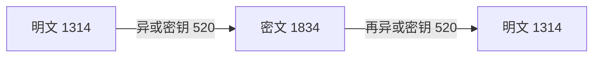

只要通信双方都知道这个密钥，第三方即使截获了密文也看不懂，而接收方用同一个密钥就能还原。这就是最朴素的对称加密思想。

## 按位取反运算符

### 按位取反的规则

按位取反写作一个 `~`，它是一个**一元运算符**，只操作一个数：**把二进制里所有的 0 变成 1、所有的 1 变成 0。**

先看一个例子：

```cpp
#include <iostream>

using namespace std;

int main() {
    int a = 0B1;
    cout << ~a << endl;
    return 0;
}
```

运行结果：

```text
-2
```

1 取反居然是 -2，这看起来很奇怪。原因在于 `int` 是**32 位整型**，1 的完整二进制不是孤零零的一个 `1`，而是前面还有 31 个 0：

```text
00000000 00000000 00000000 00000001        （1）
```

取反之后，这 31 个 0 全部变成 1，那一个 1 变成 0：

```text
11111111 11111111 11111111 11111110        （~1）
```

这个 31 个 1 加一个 0 的数，按照补码的规则读出来就是 -2。所以 **1 的按位取反不是 0，而是 -2**。

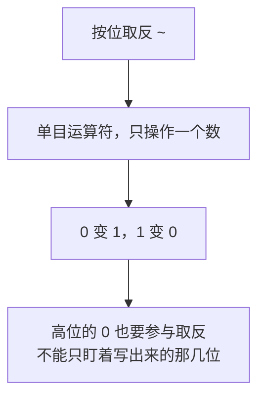

> [!WARNING]
> 这里最容易踩的坑，就是**忽略高位的 0**。看到 `~1` 时，脑子里如果只想成 `0B1` 取反变成 `0B0`，就会得到错误的答案。一定要记住：不管这个数写出来有几位，取反都是按 32 位整体进行的。

### 零取反是多少

同样地，0 的二进制是 32 个 0，取反之后就是 32 个 1：

```cpp
#include <iostream>

using namespace std;

int main() {
    int c = 0;
    cout << ~c << endl;
    return 0;
}
```

运行结果：

```text
-1
```

因为**32 个 1 这个数按补码读出来就是 -1**。这里顺便记住两个基准值：32 个 0 是 0，32 个 1 是 -1，那么把 32 个 1 再减一，自然就得到 -2。上面 `~1` 的结果就是这么来的。

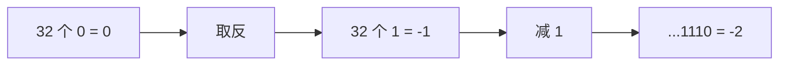

> [!NOTE]
> 为什么会得到负数，涉及**补码**的知识，而补码属于计算机组成原理的内容，不在 C++ 基础的范围里。这里先记住结论：**1 的按位取反是 -2，0 的按位取反是 -1**。等以后学了原码、反码、补码、移码这几个概念，再回头看就通了。

### 应用：求相反数

按位取反有一个很实用的用法：**对一个数取反再加一，就得到它的相反数。**

```cpp
#include <iostream>

using namespace std;

int main() {
    int d = 18;
    cout << (~d + 1) << endl;
    return 0;
}
```

运行结果：

```text
-18
```

`d` 本来是 18，取反再加一之后变成 -18，正好是它的相反数。这就是计算机里求负数的方式——**取反加一**，也就是所谓的补码。平时写代码时，直接写一个负号就够了，知道这个规律有助于理解计算机内部是怎么表示负数的。

## 左移运算符

### 左移的规则

左移写作两个左尖括号 `<<`，它是一个二元运算符，语法是 `x << y`，读作"把 x 左移 y 位"。这里的 x 和 y 都是整数。

左移就是**把二进制整体往左挪，右边空出来的位置补 0**。挪一位的效果非常直观：

```cpp
#include <iostream>

using namespace std;

int main() {
    int x = 0B11;
    x = x << 1;
    cout << x << endl;
    return 0;
}
```

`0B11` 是 3，左移一位就是把每一位往左挪一格，最右边补一个 0：

```text
  11
<< 1
-----
 110
```

`0B110` 等于 4 加 2 等于 6。运行结果：

```text
6
```

3 左移一位变成了 6，正好翻了一倍。所以左移一位相当于乘 2，左移 y 位就相当于**乘上 2 的 y 次方**：

```text
x << y   等价于   x * 2^y
```

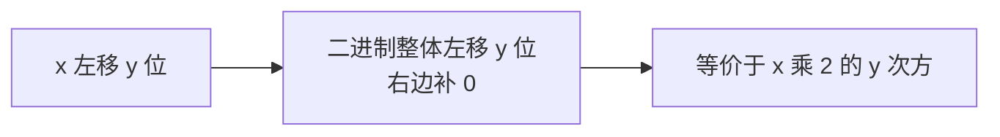

再看一个多位移的例子：

```cpp
#include <iostream>

using namespace std;

int main() {
    int x = 6;
    cout << (x << 4) << endl;
    return 0;
}
```

6 左移 4 位，相当于 6 乘 2 的 4 次方，也就是 6 乘 16 等于 96。运行结果：

```text
96
```

> [!TIP]
> 这里又用到了括号。位运算优先级低，`x << 4` 单独输出时最好套上括号，避免和其他运算符混在一起时被算错。

### 正数与负数的左移

左移的"乘 2 的 y 次方"这个规律，对负数同样成立。

```cpp
#include <iostream>

using namespace std;

int main() {
    int y = -1;
    cout << (y << 1) << endl;
    return 0;
}
```

-1 左移一位，相当于 -1 乘 2 等于 -2。运行结果：

```text
-2
```

所以不管是正数还是负数，左移都遵循同一个规律。

### 左移负数位：未定义行为

如果左移的位数是**负数**呢？比如让一个数左移 -1 位：

```cpp
#include <iostream>

using namespace std;

int main() {
    int z = 64;
    cout << (z << -1) << endl;
    return 0;
}
```

写出来编辑器会给这条语句画上绿色的波浪线，提示"左移计数为负，或者大于或等于操作数的大小"。运行结果：

```text
0
```

按"乘 2 的 y 次方"去算，`2^-1` 是二分之一，64 乘二分之一应该等于 32，可实际输出的是 0。这说明**左移负数位是不被允许的**，它的结果由编译器自己决定，不属于标准规定，换一个编译器可能又输出 32。这类"标准没有规定、各家实现不同"的情况，叫做**未定义行为**。

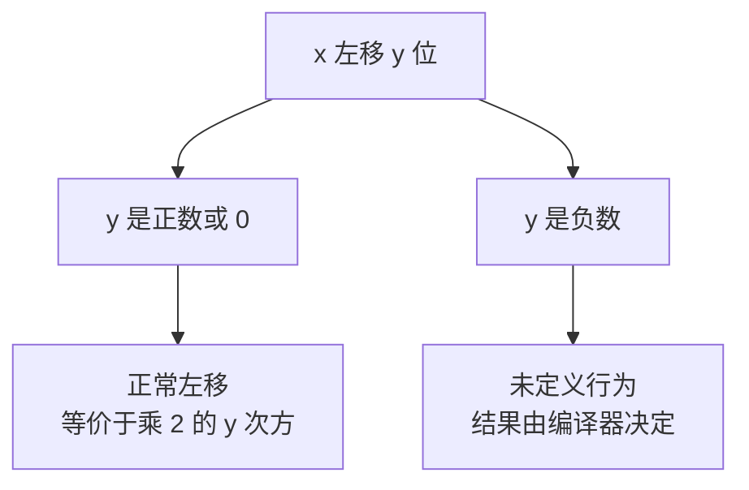

> [!WARNING]
> 左移的第二个操作数**必须是正数**。写代码时不要传负数进去，否则结果不可预测。

### 左移溢出

左移还有一个要注意的地方：**数据不能溢出**。

```cpp
#include <iostream>

using namespace std;

int main() {
    int a = 64;
    cout << (a << 31) << endl;
    return 0;
}
```

运行结果：

```text
0
```

为什么会是 0？`int` 一共只有 32 位，64 的二进制是 2 的 6 次方，也就是 1 后面跟着 6 个 0：

```text
00000000 00000000 00000000 01000000
```

把这个 1 往左挪 31 位，它就跑到第 37 位去了，超出了 32 位的范围，被**直接截断丢掉**，剩下的位全是 0，所以结果变成 0。

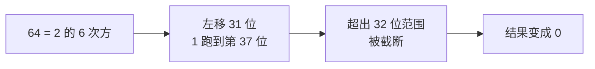

左移相当于乘 2，那么一直乘 2 本来就会遇到溢出的问题，这和普通的乘法溢出是同一个道理。所以左移的时候要盯着数据的大小，别让它超出类型的表示范围。

> [!WARNING]
> 有符号整数左移导致溢出，在标准里属于**未定义行为**，上面这个 0 只是当前编译器的实际结果，换个编译器不保证一样。写代码时不要依赖溢出之后的具体数值，而是要从一开始就避免溢出。

## 右移运算符

### 右移的规则

右移写作两个右尖括号 `>>`，是和左移相对的一个运算符，同样是二元运算符，语法是 `x >> y`。左移是乘 2，**右移就是除 2**。

```cpp
#include <iostream>

using namespace std;

int main() {
    int a = 0B111;
    a = a >> 1;
    cout << a << endl;
    return 0;
}
```

`0B111` 是 7，右移一位就是把最右边那一位截掉：

```text
  111
>>  1
------
  11
```

`0B11` 是 3。运行结果：

```text
3
```

7 除以 2 等于 3.5，右移之后得到 3，小数部分被丢掉了。所以右移的规律是：

```text
x >> y   等价于   x / 2^y，并且向下取整
```

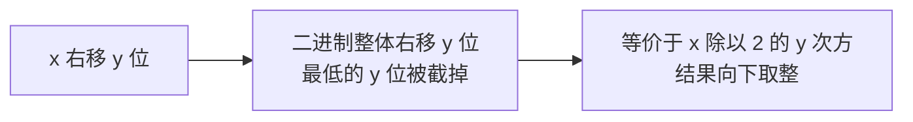

### 正数与负数的右移

正数的右移很好理解，负数就要多留意一下。看看 -1 右移一位：

```cpp
#include <iostream>

using namespace std;

int main() {
    int b = -1;
    cout << (b >> 1) << endl;
    return 0;
}
```

运行结果：

```text
-1
```

-1 右移一位还是 -1，看起来像没动。原因在于 **-1 的补码是 32 个 1**：

```text
11111111 11111111 11111111 11111111
```

右移一位，最低位被截掉，而**最高位会补上一个 1**（负数右移时补的是符号位）：

```text
11111111 11111111 11111111 11111111        （还是 32 个 1）
```

补完之后仍然是 32 个 1，所以结果还是 -1。也就是说，**负数右移时最高位补 1，正数右移时最高位补 0**。

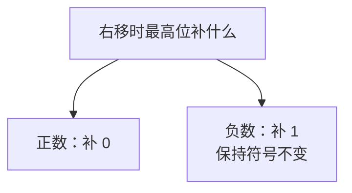

> [!NOTE]
> 右移的第二个操作数同样不能是负数，和左移一样，那属于未定义行为，这里就不去尝试了。

### 应用一：去掉低 K 位

右移可以把一个数**最低的若干位整体丢掉**。

```cpp
#include <iostream>

using namespace std;

int main() {
    int z = 0B10000000;
    cout << (z >> 7) << endl;
    return 0;
}
```

`z` 是 `0B10000000`，也就是 128。右移 7 位，把低 7 位全部丢掉，只剩下最高的那个 1：

```text
  10000000
>>       7
----------
         1
```

运行结果：

```text
1
```

想丢掉低 K 位，就右移 K 位，非常简单。

### 应用二：取出第 K 位的值

右移再配合位与，就能**单独取出某一位的值**。

```cpp
#include <iostream>

using namespace std;

int main() {
    int d = 0B10110000;
    cout << ((d >> 4) & 1) << endl;
    return 0;
}
```

`d` 是 `0B10110000`，想看它第 4 位（从 0 开始数）是 0 还是 1。做法分两步：先右移 4 位，把目标位挪到最低位：

```text
  10110000
>>       4
----------
  00001011
```

此时目标位变成了最低位。再用 `& 1` 把它单独取出来，最低位是 1 结果就是 1，是 0 结果就是 0：

```text
  1011
& 0001
------
  0001
```

运行结果：

```text
1
```

所以取出第 K 位的公式是 `(n >> K) & 1`。前面讲位与时用 `& 1` 判断奇偶，其实是这个公式 K 等于 0 的特例。

```mermaid
flowchart LR
    A["(n 右移 K 位) 再与上 1"] --> B["先右移 K 位<br/>把第 K 位挪到最低位"] --> C["再与上 1<br/>只保留最低位"]
```

## 本章小结

**其一**，位运算是直接对二进制每一位进行的运算，一共六个运算符：位与 `&`、位或 `|`、异或 `^`、按位取反 `~`、左移 `<<`、右移 `>>`。其中按位取反是一元运算符，其余都是二元运算符。位运算符和逻辑运算符长得像但是两回事：逻辑运算看整个数是不是非零、结果只有 0 和 1，位运算看每一位、结果可以是任意整数。位运算的优先级很低，不确定就加括号。

**其二**，位与的规则是"有零必零"：两个位都是 1 结果才是 1。它的用途包括：用 `n & 1` 判断奇偶（1 是奇数、0 是偶数），用 `n & 0B11111` 取出末五位，用 `n & ~0B11111` 把末五位归零，用 `n & (n + 1)` 消除末尾连续的一，以及用 `n > 0 && (n & (n - 1)) == 0` 判断是不是二的幂。

**其三**，位或的规则是"有一即一"：两个位里有一个是 1 结果就是 1。它可以用 `n | 掩码` 把指定位设成 1（设置标记位），用 `(n | d) - d` 把指定位清成 0（清空标记位），用 `n | (n - 1)` 把最低位那个 1 以下的连续 0 全部变成 1。

**其四**，异或的规则是"相同为 0，不同为 1"，本质是不带进位的二进制加法。它有三条性质：任何数和 0 异或还是它本身，两个相同的数异或得 0，异或满足交换律和结合律。异或可以用来对某一位反复取反、不用临时变量交换两个数、找出只出现奇数次的数，以及做最简单的加密解密（异或同一个密钥两次就还原）。

**其五**，按位取反 `~` 是一元运算符，把所有的 0 变 1、1 变 0。因为 `int` 是 32 位，高位的 0 也要参与取反，所以 **1 的取反是 -2 而不是 0，0 的取反是 -1**。对一个数取反再加一就得到它的相反数，也就是 `~n + 1 == -n`，这正是计算机表示负数的方式。

**其六**，左移 `x << y` 把二进制整体往左挪、右边补 0，等价于 `x * 2^y`，正数和负数都成立。左移的第二个操作数**不能是负数**，那是未定义行为，不同编译器结果不同；同时要注意**数据不能溢出**，超出 32 位的部分会被直接截断丢掉，比如 `64 << 31` 的结果是 0。

**其七**，右移 `x >> y` 把二进制整体往右挪，等价于 `x / 2^y` 并向下取整。右移时最高位补什么要看符号：**正数补 0，负数补 1**，所以 `-1 >> 1` 还是 -1。右移可以用来丢掉低 K 位（右移 K 位即可），也可以用 `(n >> K) & 1` 单独取出第 K 位的值。