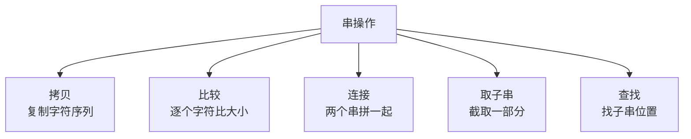
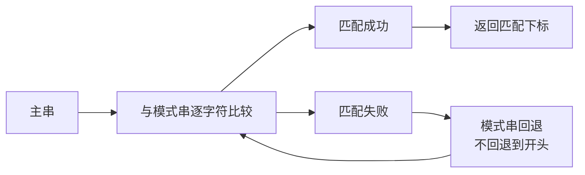

## 本节概述：字符串是什么

串，就是**字符串**（String）。

字符串是由**一系列字符组成的线性结构**，用来表示文本。你现在看到的这些文字，本质上全是字符串。

在 C++ 里，字符串用双引号括起来，比如：

```cpp
"Hello, World!"
```

> 不同语言有点小差别，比如 Python 单引号双引号都行，但 C++ 里双引号才是字符串，单引号是单个字符。

## 字符串在内存里长什么样

字符串本质上就是一个**字符数组**（顺序表的一种）——一个字符挨着一个存。

但是有一个特殊的地方：**字符串末尾有一个 `\0`（空字符，ASCII 值为 0）作为结束标志**。

```
"Hello, World!" 在内存中的存储：

  0    1    2    3    4    5    6    7    8    9   10   11   12
+----+----+----+----+----+----+----+----+----+----+----+----+----+
| H  | e  | l  | l  | o  | ,  | 空格 | W  | o  | r  | l  | d  | !  | \0 |
+----+----+----+----+----+----+----+----+----+----+----+----+----+----+
                                                              ↑
                                                          结束标志
```

> 这个 `\0` 叫"字符串结束符"，它的 ASCII 值是 0。程序读到 `\0` 就知道字符串结束了。
>
> 也叫"杠铃"——视频里老师的说法，形象好记。

## 串和顺序表的关系

| 对比项 | 顺序表 | 字符串 |
|---|---|---|
| 存储方式 | 连续内存 | 连续内存（一样） |
| 元素类型 | 任意类型 | 只能是字符 |
| 结尾标志 | 没有，靠 size | 有 `\0` 结束符 |
| 长度 | 单独存 size | 可以存 size，也可以靠 `\0` 数 |

> 一句话：**字符串就是元素为字符的顺序表，只是末尾多了个 `\0` 当结束标志。**

## 字符串的长度

字符串的长度 = 字符串中**有效字符的个数**。

注意：**不包含结尾的 `\0`**。

比如 `"Hello, World!"` 有 13 个字符（H e l l o , 空格 W o r l d !），长度就是 13。虽然内存里占了 14 个位置（多了一个 `\0`），但长度不算它。

> 每种语言都有内置的获取长度的方法，比如 C 语言的 `strlen()`、C++ string 的 `.size()`。

## 字符串的基本操作



### 1. 拷贝（Copy）

把一个字符串复制一份，生成一个副本。

怎么做？一个字符一个字符地拷过去——别忘了把结尾的 `\0` 也拷过去！

```
原串：   H e l l o \0
拷贝后： H e l l o \0 （一模一样的副本）
```

> 拷的时候如果漏了 `\0`，新字符串就没有结束标志了——程序不知道它在哪结束，会一直往后读，读到乱七八糟的东西。

### 2. 比较（Compare）

判断两个字符串是否相等。

怎么做？从头开始，一个字符一个字符地比对。

- 只要有一个位置不一样，就不相等
- 全都一样，而且同时结束（同时遇到 `\0`），才相等

```
"abc" vs "abc" → 相等
"abc" vs "abd" → 不相等（第 3 个字符不一样）
"abc" vs "abcd" → 不相等（长度不一样）
```

### 3. 拼接（Concatenate）

把两个字符串接在一起，变成一个更长的字符串。

怎么做？
1. 申请一块新内存，大小 = 串1长度 + 串2长度 + 1（多出来的 1 给 `\0`）
2. 把串 1 的字符挨个复制过去
3. 接着把串 2 的字符挨个复制过去
4. 最后加一个 `\0`

```
串 1: "Hello"
串 2: "World"

拼接后: "HelloWorld"

H e l l o W o r l d \0
← 串1 → ← 串2 →   ← 结尾
```

> 为什么要申请新内存？因为原来的两个串后面不一定有空位置——直接接上去会覆盖后面的数据。

### 4. 索引（Index）

通过下标取第几个字符，跟数组一模一样。

- 从 **0** 开始编号
- 第 0 个字符就是第一个字符
- 第 n-1 个字符就是最后一个字符（n 是长度）

```
"Hello"

下标：  0   1   2   3   4
字符：  H   e   l   l   o
```

> 字符串本身就是字符数组，所以索引操作跟数组完全一样，时间复杂度 **O(1)**。

### 模式匹配过程

在字符串中查找子串的位置，常用的优化算法是 KMP。核心思想是：匹配失败时，模式串不需要回退到开头，而是利用已匹配的信息跳过一部分。



## 字符串的时间复杂度

| 操作 | 时间复杂度 | 说明 |
|---|---|---|
| 获取长度 | O(1) 或 O(n) | 存了 size 就是 O(1)，靠 `\0` 数就是 O(n) |
| 索引（按下标取字符） | O(1) | 直接定位，跟数组一样 |
| 拷贝 | O(n) | 每个字符都要拷一遍 |
| 比较 | O(n) | 最坏情况全比一遍 |
| 拼接 | O(n+m) | 两个串都要拷一遍 |

> n 和 m 分别是两个字符串的长度。

## 本章小结

**串（字符串）** = 字符组成的线性序列，本质是字符数组，末尾有 `\0` 结束标志。

**四个基本操作**：
1. **拷贝** — 一个一个字符复制，别忘了 `\0`，O(n)
2. **比较** — 一个一个字符比对，O(n)
3. **拼接** — 申请新内存，两个串接起来，O(n+m)
4. **索引** — 跟数组一样按下标取，O(1)

**两个注意**：
- 长度**不包含**结尾的 `\0`
- 所有操作都要记得处理 `\0`，不然会出问题

