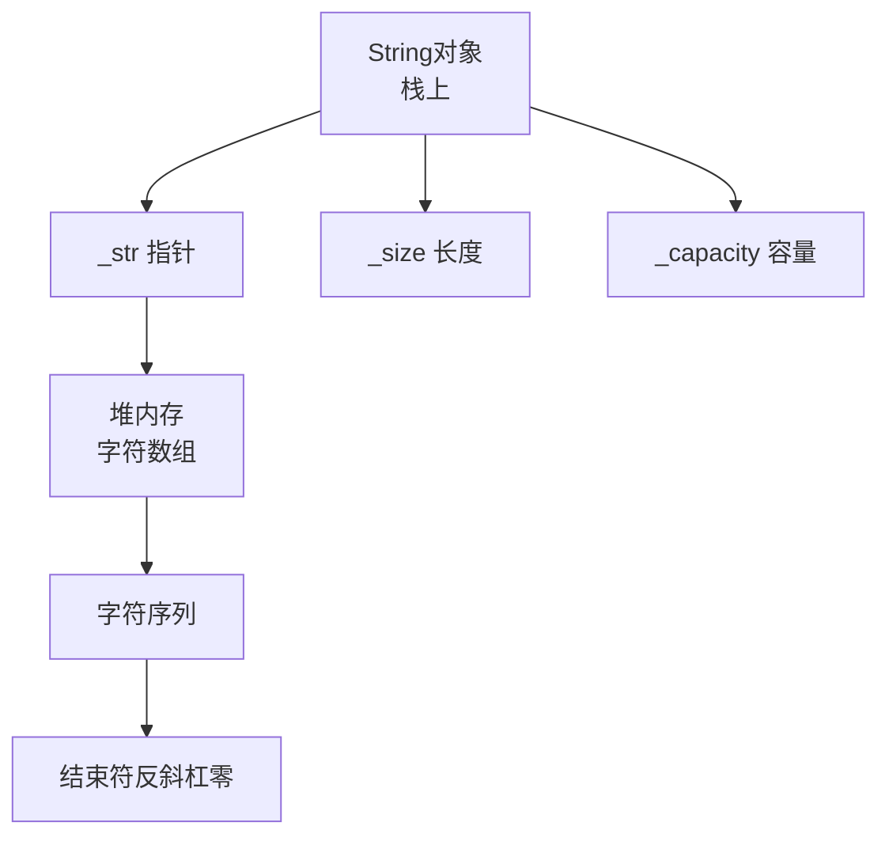

## 本节概述：手写 String 类

上节课讲了字符串的概念——本质是字符数组，末尾有 `\0`。

这节课我们用 C++ 自己封装一个 String 类，把字符串的常用操作都实现一遍。

> 虽然 C++ STL 已经有 std::string 了，但自己写一遍能深入理解字符串底层是怎么工作的。这也是面试高频题。

## 用到的 C 语言字符串函数

我们会用到 `<cstring>` 里的几个 C 语言字符串函数：

| 函数 | 作用 |
|---|---|
| `strlen(s)` | 求字符串长度（不包含 `\0`） |
| `strcpy(dest, src)` | 字符串拷贝，连 `\0` 一起拷 |
| `strcmp(s1, s2)` | 字符串比较，相等返回 0 |
| `strcat(dest, src)` | 字符串拼接，把 src 接到 dest 后面 |

> 这些都是 C 语言标准库的函数，`<cstring>` 头文件里有。

## 类的定义

```cpp
#include <iostream>
#include <cstring>
using namespace std;

class String {
private:
    char* str;           // 字符数组首地址
    size_t length;       // 字符串长度（不包含 \0）

public:
    String();                           // 构造函数（空串）
    String(const char* s);              // 构造函数（从 C 字符串初始化）
    String(const String& other);        // 拷贝构造函数
    ~String();                          // 析构函数

    size_t getLength() const;           // 获取长度
    char operator[](size_t index) const; // 下标运算符重载
    String& operator=(const String& s);  // 赋值运算符重载
    bool operator==(const String& s) const;  // 等于比较
    bool operator!=(const String& s) const;  // 不等于比较
    String copy() const;                 // 拷贝
    String operator+(const String& s) const;  // 拼接

    // 友元函数：输出运算符重载
    friend ostream& operator<<(ostream& out, const String& s);
};
```

> [!TIP]
> 几个要点：
> 1. **`size_t`** — 专门表示长度/大小的无符号整数类型
> 2. **运算符重载** — 让 String 对象能用 `[]`、`=`、`==`、`+` 等运算符，用起来跟内置类型一样
> 3. **友元函数** — `operator<<` 需要访问私有成员，所以声明成友元
> 4. **拷贝构造函数** — 非常重要！没写的话会 double free，后面详细讲

### String 类内存布局



## 构造函数（空串）

空字符串也要占 1 个字节——放 `\0`。

```cpp
String::String() {
    length = 0;
    str = new char[1];   // 申请 1 个字节
    str[0] = '\0';       // 只有一个结束符
}
```

> 空串长度是 0，但内存占 1 字节（那个 `\0`）。

## 构造函数（从 C 字符串初始化）

传进来一个 C 风格的字符串（`const char*`），我们把它复制一份。

```cpp
String::String(const char* s) {
    length = strlen(s);              // 先算长度
    str = new char[length + 1];      // 申请内存，多 1 个字节放 \0
    strcpy(str, s);                  // 拷贝内容（连 \0 一起）
}
```

> 为什么参数是 `const char*`？
> 因为我们只是读取 s 的内容，不会修改它——加 const 更安全。

## 拷贝构造函数

**这个非常重要！** 如果你不写，编译器会自动生成一个默认的——但默认的只是简单地把成员变量的值复制过去（浅拷贝）。结果就是两个对象的 `str` 指向同一块内存，析构时会 delete 两次，导致 **double free** 崩溃。

所以必须自己写拷贝构造函数，做**深拷贝**——重新申请内存，把内容复制过去。

```cpp
String::String(const String& other) {
    length = other.length;
    str = new char[length + 1];      // 申请新内存
    strcpy(str, other.str);          // 复制内容
}
```

> [!WARNING]
> 什么时候会调用拷贝构造函数？
> - 用一个对象初始化另一个对象时：`String s2 = s1;`
> - 函数传值参数时
> - 函数返回值时
>
> 只要涉及到指针成员的类，一定要写拷贝构造函数和赋值运算符重载，不然一定会出问题。

## 析构函数

释放字符数组的内存。

```cpp
String::~String() {
    delete[] str;    // 释放数组
}
```

> 用 `new[]` 申请的，要用 `delete[]` 释放。

## 获取长度

直接返回 length，O(1)。

```cpp
size_t String::getLength() const {
    return length;
}
```

> 后面加 `const` —— 因为这个函数不会修改成员变量。const 对象也能调用。

## 下标运算符重载 `operator[]`

让 String 对象能像数组一样用 `s[i]` 取字符。

```cpp
char String::operator[](size_t index) const {
    return str[index];
}
```

> 用法：`String s("hello"); cout << s[0];` — 输出 'h'。
>
> 看起来像数组访问，实际上调用了这个函数。这就是运算符重载的魔力。

## 赋值运算符重载 `operator=`

让 String 对象之间可以用 `=` 赋值。

赋值比拷贝构造复杂一点——因为目标对象可能已经有内存了，要先释放再申请新的。

```cpp
String& String::operator=(const String& s) {
    if (this == &s) {                // 自己赋值给自己？直接返回
        return *this;
    }

    delete[] str;                    // 释放旧内存
    length = s.length;               // 复制长度
    str = new char[length + 1];      // 申请新内存
    strcpy(str, s.str);              // 复制内容

    return *this;                    // 返回自身引用，支持链式赋值
}
```

> 赋值运算符四步：
> 1. **检查自赋值** — 自己 = 自己直接返回，不然释放了内存就没了
> 2. **释放旧内存** — 不然内存泄漏
> 3. **申请新内存 + 拷贝** — 跟拷贝构造一样
> 4. **返回 *this** — 返回自身引用，支持 `a = b = c` 链式赋值

## 等于比较 `operator==`

用 `strcmp` 比较两个字符串，返回值为 0 表示相等。

```cpp
bool String::operator==(const String& s) const {
    return strcmp(str, s.str) == 0;
}
```

> `strcmp` 返回值：
> - 0 — 相等
> - < 0 — 第一个串小
> - > 0 — 第一个串大

## 不等于比较 `operator!=`

跟 `==` 相反。

```cpp
bool String::operator!=(const String& s) const {
    return strcmp(str, s.str) != 0;
}
```

## 拷贝函数 copy

其实就是返回一个自己的副本——调用赋值运算符就行。

```cpp
String String::copy() const {
    String s;
    s = *this;    // 用赋值运算符
    return s;
}
```

> 其实有了拷贝构造函数，直接 `return *this;` 也行——编译器会调用拷贝构造函数生成副本。

## 拼接运算符 `operator+`

把两个字符串接起来，返回一个新的字符串。

```cpp
String String::operator+(const String& s) const {
    String result;
    result.length = length + s.length;
    result.str = new char[result.length + 1];   // 申请足够大的内存

    strcpy(result.str, str);       // 先拷第一个串
    strcat(result.str, s.str);     // 再接上第二个串

    return result;
}
```

> 三步：
> 1. 申请新内存（长度之和 + 1）
> 2. 把第一个串拷过去
> 3. 把第二个串接在后面（strcat 自动找结尾）

## 输出运算符重载 `operator<<`

让 String 对象可以直接用 `cout` 输出。

这是个友元函数——不是成员函数，所以类外面直接写。

```cpp
ostream& operator<<(ostream& out, const String& s) {
    out << s.str;
    return out;
}
```

> 返回 `ostream&` — 支持链式输出，比如 `cout << s1 << " " << s2 << endl;`。

## 完整代码汇总

```cpp
#include <iostream>
#include <cstring>
using namespace std;

class String {
private:
    char* str;
    size_t length;

public:
    String();
    String(const char* s);
    String(const String& other);
    ~String();

    size_t getLength() const;
    char operator[](size_t index) const;
    String& operator=(const String& s);
    bool operator==(const String& s) const;
    bool operator!=(const String& s) const;
    String copy() const;
    String operator+(const String& s) const;

    friend ostream& operator<<(ostream& out, const String& s);
};

// 构造函数（空串）
String::String() {
    length = 0;
    str = new char[1];
    str[0] = '\0';
}

// 构造函数（从 C 字符串）
String::String(const char* s) {
    length = strlen(s);
    str = new char[length + 1];
    strcpy(str, s);
}

// 拷贝构造函数（深拷贝）
String::String(const String& other) {
    length = other.length;
    str = new char[length + 1];
    strcpy(str, other.str);
}

// 析构函数
String::~String() {
    delete[] str;
}

// 获取长度
size_t String::getLength() const {
    return length;
}

// 下标运算符
char String::operator[](size_t index) const {
    return str[index];
}

// 赋值运算符
String& String::operator=(const String& s) {
    if (this == &s) {
        return *this;
    }
    delete[] str;
    length = s.length;
    str = new char[length + 1];
    strcpy(str, s.str);
    return *this;
}

// 等于比较
bool String::operator==(const String& s) const {
    return strcmp(str, s.str) == 0;
}

// 不等于比较
bool String::operator!=(const String& s) const {
    return strcmp(str, s.str) != 0;
}

// 拷贝
String String::copy() const {
    return *this;   // 调用拷贝构造函数
}

// 拼接
String String::operator+(const String& s) const {
    String result;
    result.length = length + s.length;
    result.str = new char[result.length + 1];
    strcpy(result.str, str);
    strcat(result.str, s.str);
    return result;
}

// 输出运算符（友元）
ostream& operator<<(ostream& out, const String& s) {
    out << s.str;
    return out;
}
```

## main 函数测试

```cpp
int main() {
    // 构造
    String s1 = "12345d";
    cout << "s1 = " << s1 << endl;              // 12345d

    // 拼接
    cout << "s1 + 45 = " << s1 + "45" << endl;  // 12345d45

    // 下标
    cout << "s1[5] = " << s1[5] << endl;         // d

    // 比较
    cout << "s1 == 12345d ? " << (s1 == "12345d") << endl;  // 1 (true)
    cout << "s1 != 12345d ? " << (s1 != "12345d") << endl;  // 0 (false)

    // 赋值
    s1 = s1 + "asd";
    cout << "s1 = " << s1 << endl;              // 12345dasd

    // 链式赋值
    String a, b, c;
    a = b = c = "ABC";
    cout << a << " " << b << " " << c << endl;  // ABC ABC ABC

    // 拷贝
    String x = s1.copy();
    cout << "x = " << x << endl;                // 12345dasd

    return 0;
}
```

## 易错点总结

> [!WARNING]
> 1. **一定要写拷贝构造函数** — 不写的话默认浅拷贝，两个对象指向同一块内存，析构时 double free 直接崩
> 2. **赋值运算符要检查自赋值** — `this == &s` 时直接返回，不然释放了自己就没了
> 3. **赋值运算符要先释放旧内存** — 不然内存泄漏
> 4. **申请内存要 length + 1** — 多出来的 1 个字节放 `\0`，别忘了
> 5. **`new[]` 要用 `delete[]` 释放** — 别用错了
> 6. **const 成员函数不能改成员变量** — 只读的函数都加 const

## 本章小结

**手写 String 类** = 字符数组指针 + 长度 + 一堆运算符重载。

**核心三巨头（必须写）**：
1. **析构函数** — 释放内存
2. **拷贝构造函数** — 深拷贝，防止 double free
3. **赋值运算符重载** — 先释放旧内存再拷贝，支持链式赋值

**常用操作**：
- **`operator[]`** — 按下标取字符，O(1)
- **`operator== / !=`** — 用 strcmp 比较
- **`operator+`** — 拼接，申请新内存 strcpy + strcat
- **`operator<<`** — 输出，友元函数

**最大的坑**：忘了写拷贝构造函数导致浅拷贝，两个对象共享同一块内存，析构时崩。

