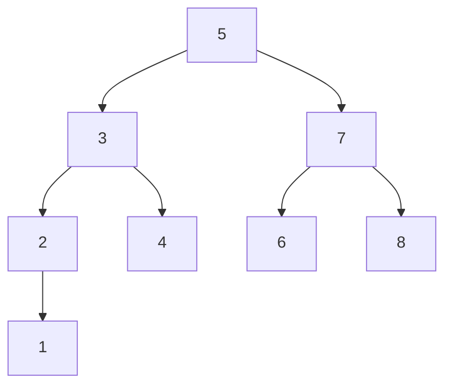
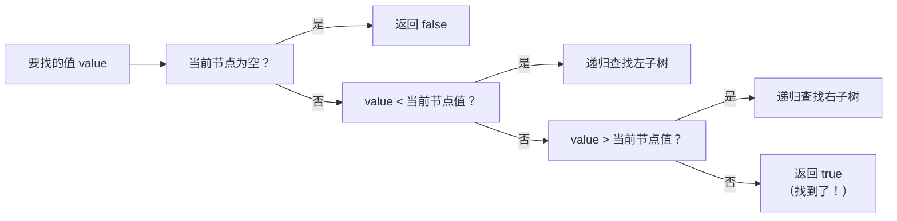
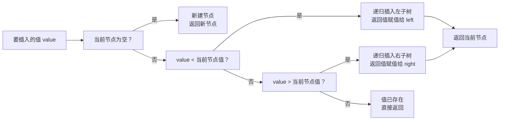

## 本节概述：二叉搜索树是什么

上节课学了普通二叉树——只限制了孩子数量，没限制值的大小。

这节课学**二叉搜索树（Binary Search Tree，BST）**——也叫**二叉排序树**或**二叉查找树**。它在二叉树的基础上加了一条规则：**左小右大**。

## 二叉搜索树的定义

二叉搜索树满足四个条件（递归定义）：

1. **空树是二叉搜索树**
2. 如果左子树不为空 → **左子树上所有节点的值都 < 根节点的值**
3. 如果右子树不为空 → **右子树上所有节点的值都 > 根节点的值**
4. 左右子树本身也都是二叉搜索树



> 检查一下是不是 BST：
> - 根是 5，左边全 < 5（3、2、4、1），右边全 > 5（7、6、8）✅
> - 再看子树 3，左边 2 < 3，右边 4 > 3 ✅
> - 再看子树 7，左边 6 < 7，右边 8 > 7 ✅
>
> 每一棵子树都满足"左小右大"，这就是一棵合法的二叉搜索树。

> [!TIP]
> 简单记：**左小右大，递归成立。**
>
> 不只是直接孩子，是**整个左子树**都比根小，**整个右子树**都比根大。

## 二叉搜索树的性质

**中序遍历结果是递增的！**

上面那棵树的中序遍历：1 → 2 → 3 → 4 → 5 → 6 → 7 → 8

正好是从小到大排列的。

> 为什么？
> 中序遍历顺序是：左 → 根 → 右
> 而 BST 的性质是：左 < 根 < 右
>
> 所以遍历出来自然就是递增序列。
>
> 这是 BST 最重要的性质之一——判断一棵树是不是 BST，中序遍历看是不是递增就行。

## 链式存储

二叉搜索树的节点跟普通二叉树一样：数据域 + 左指针 + 右指针。

```
    value
   /     \
 left    right
```

```cpp
struct TreeNode {
    int value;          // 数据域
    TreeNode* left;     // 左孩子
    TreeNode* right;    // 右孩子
};
```

> 跟普通二叉树节点结构完全一样，区别在于插入和查找的规则不同。

## 三大操作：查找、插入、删除

### 操作一：查找（Search）

在树里找一个值，存在返回 true，不存在返回 false。

**思路**：跟当前节点比大小，小了往左走，大了往右走，找到了就返回。



**四步走**：
1. 空树 → 返回 false
2. value < 当前节点 → 递归查左子树
3. value > 当前节点 → 递归查右子树
4. value == 当前节点 → 返回 true（找到了）

**举个例子**：在上面的树里找 3

1. 从根 5 开始，3 < 5 → 往左走，到 3
2. 3 == 3 → 找到了！返回 true

再举个例子：找 6

1. 6 > 5 → 往右走，到 7
2. 6 < 7 → 往左走，到 6
3. 6 == 6 → 找到了！

### 操作二：插入（Insert）

给一个新值，插到树里，插完之后还是二叉搜索树。

**思路**：跟查找一样，小了往左大了往右，走到空位置就插进去。



**四步走**：
1. 空树 → 新建节点，返回它
2. value < 当前节点 → 递归插入左子树，结果赋给 left
3. value > 当前节点 → 递归插入右子树，结果赋给 right
4. value == 当前节点 → 已存在，直接返回（不重复插入）

**举个例子**：在上面的树里插入 9

1. 9 > 5 → 往右
2. 9 > 7 → 往右
3. 9 > 8 → 往右，右边空了
4. 新建节点 9，插在 8 的右边

插入完成，树依然满足 BST 性质。

> 插入的位置一定是在叶子节点下面——新节点永远是新的叶子。

### 操作三：删除（Delete）

删除是最复杂的操作——删完之后还要保持 BST 性质。

分三种情况：

| 情况 | 处理方法 |
|---|---|
| **叶子节点**（左右都空） | 直接删除，返回 NULL |
| **只有一个孩子** | 删除自己，让孩子顶替自己的位置 |
| **两个孩子都有** | 找右子树最小值（或左子树最大值）顶替，再递归删那个值 |

#### 情况 1：删除叶子节点

最简单——直接删掉就行，不影响其他节点。

```
删 1：  2         2
       / \   →   /
      1   3     3
```

#### 情况 2：只有一个孩子

把唯一的孩子提上来，顶替被删节点的位置。

```
删 7：  5         5
       / \       / \
      3   7  →  3   8
           \
            8
```

> 7 只有右孩子 8，删了 7，让 8 接上去就行。

#### 情况 3：两个孩子都有（最复杂）

**核心思路：找右子树的最小值来顶替被删的节点。**

为什么找右子树的最小值？
- 右子树的最小值 > 左子树所有值（因为它在右子树）
- 右子树的最小值 < 右子树其他所有值（因为它最小）
- 所以它来当新根，左右两边都满足 BST 性质

```
删 5：     5            6
          / \          / \
         3   7   →    3   7
        / \ / \      / \   \
       2  4 6  8    2  4    8
```

> 步骤：
> 1. 找到右子树的最小值 → 6
> 2. 把根节点的值换成 6
> 3. 递归删除右子树里的 6（因为 6 被挪走了）

> [!TIP]
> 也可以找**左子树的最大值**来顶替，效果一样。
> 两种方法都对，看习惯。

**删除完整七步**：
1. 当前节点为空 → 返回 NULL（没找到）
2. 值 < 当前节点 → 递归删左子树，结果赋给 left
3. 值 > 当前节点 → 递归删右子树，结果赋给 right
4. 左右都空（叶子）→ 删了返回 NULL
5. 只有右孩子 → 存右孩子，删自己，返回右孩子
6. 只有左孩子 → 存左孩子，删自己，返回左孩子
7. 左右都有 → 找右子树最小值，替换当前值，递归删右子树的最小值

## 时间复杂度

| 操作 | 平均情况（接近完全二叉树） | 最坏情况（斜树） |
|---|---|---|
| 查找 | O(log n) | O(n) |
| 插入 | O(log n) | O(n) |
| 删除 | O(log n) | O(n) |

> 为什么最坏是 O(n)？
> 如果插入的数据本来就是有序的，比如 1、2、3、4、5 依次插入，树就变成了右斜树——跟链表一样，查什么都要遍历到底。
>
> 这就是为什么后面会有平衡二叉树（AVL树、红黑树）——保证树不会歪得太厉害，始终保持 O(log n)。

## 本章小结

**二叉搜索树（BST）** = 二叉树 + 左小右大 + 递归定义。

**核心性质**：中序遍历结果是递增序列。

**三大操作**：
- **查找** — 小了往左，大了往右，找到了返回
- **插入** — 小了往左，大了往右，空了就插
- **删除** — 叶子直接删，一个孩子顶替，两个孩子找右子树最小值顶替

**时间复杂度**：平均 O(log n)，最坏 O(n)（斜树退化成链表）。

