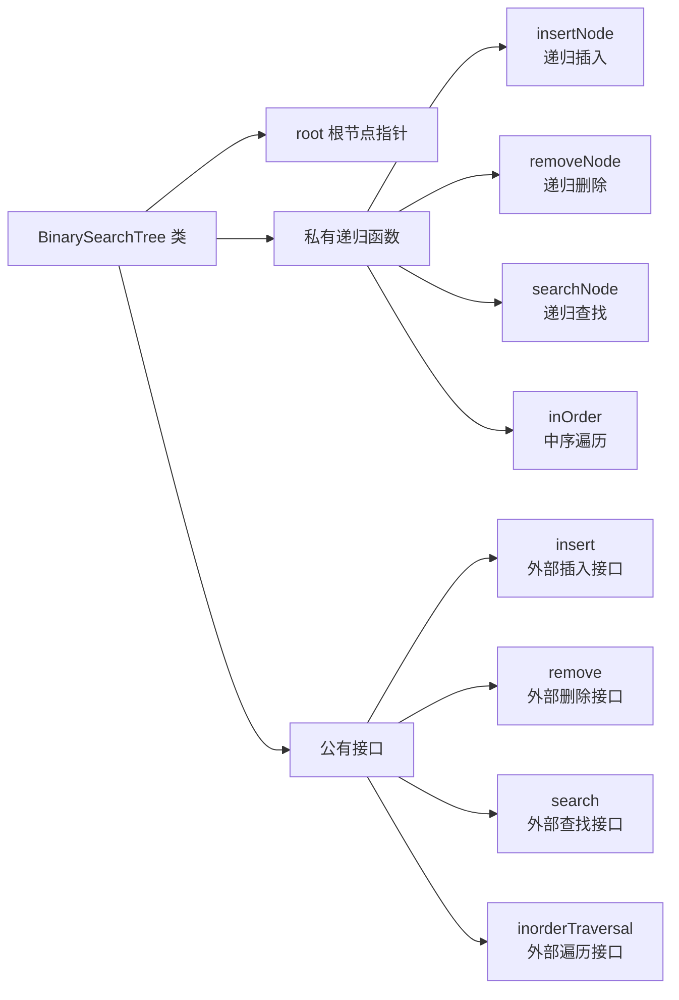
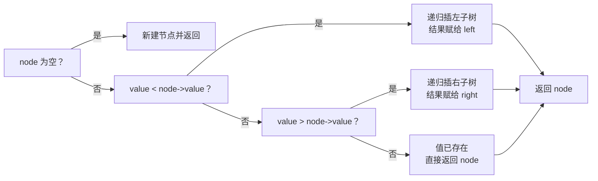
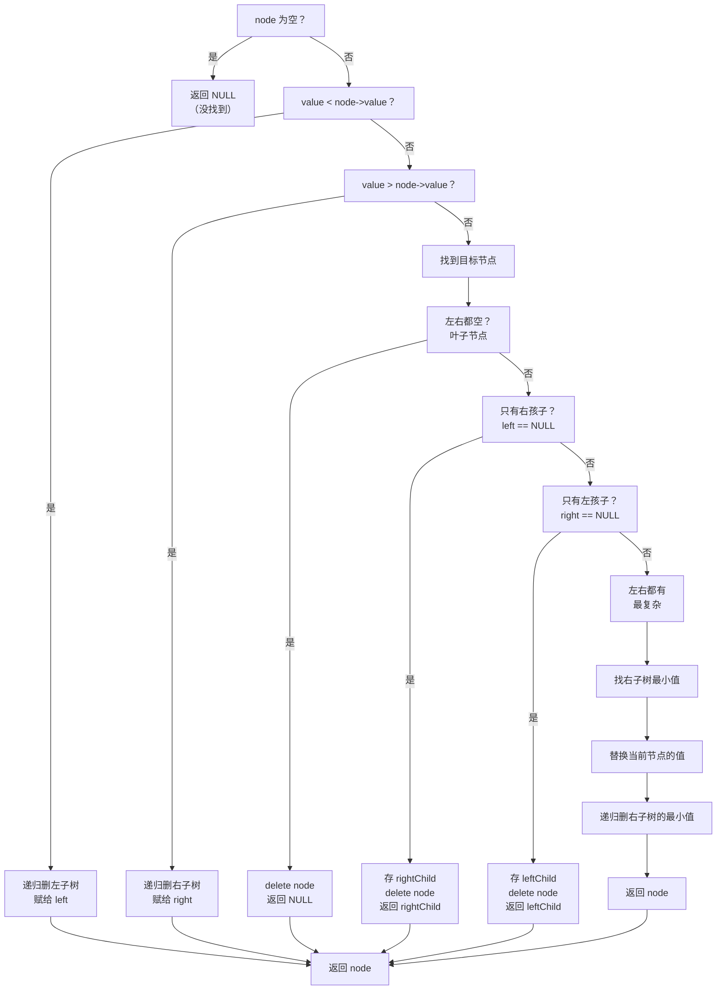

## 本节概述：手写 BinarySearchTree 类

上节课讲了二叉搜索树的概念——左小右大，中序遍历递增，查找插入删除平均 O(log n)。

这节课用 C++ 把二叉搜索树写出来，用链式存储，实现增删查三大操作。

## 整体架构



> 两层结构：
> 1. **TreeNode** — 节点，value + left + right
> 2. **BinarySearchTree** — 整棵树，root + 增删查接口
>
> 私有递归版带 node 参数，公有版无参封装，外部调用更简洁。

## 第一步：树节点 TreeNode

```cpp
template <typename T>
struct TreeNode {
    T value;
    TreeNode* left;
    TreeNode* right;

    // 无参构造
    TreeNode() : value(T()), left(NULL), right(NULL) {}

    // 带参构造
    TreeNode(T x) : value(x), left(NULL), right(NULL) {}
};
```

> 两个构造函数，初始化 left/right 为 NULL。
> **一定要写构造函数！** 不写指针是野的，崩给你看。

## 第二步：BST 类定义

```cpp
template <typename T>
class BinarySearchTree {
private:
    TreeNode<T>* root;

    // 私有递归函数
    TreeNode<T>* insertNode(TreeNode<T>* node, T value);
    TreeNode<T>* removeNode(TreeNode<T>* node, T value);
    bool searchNode(TreeNode<T>* node, T value);
    void inOrder(TreeNode<T>* node);

public:
    BinarySearchTree();    // 构造函数
    ~BinarySearchTree();   // 析构函数

    void insert(T value);            // 插入（外部接口）
    void remove(T value);            // 删除（外部接口）
    bool search(T value);            // 查找（外部接口）
    void inorderTraversal();         // 中序遍历（外部接口）
};
```

> [!TIP]
> 为什么分私有和公有两套？
> - **私有版带 node 参数** — 递归需要知道从哪开始
> - **公有版无参** — 外部不需要知道 root，直接调就行
>
> 封装的基本操作——隐藏实现细节，只暴露简洁接口。

## 构造函数

```cpp
template <typename T>
BinarySearchTree<T>::BinarySearchTree() {
    root = NULL;
}
```

> 初始是空树，root = NULL。

## 析构函数

循环删除根节点，直到树为空。

```cpp
template <typename T>
BinarySearchTree<T>::~BinarySearchTree() {
    while (root != NULL) {
        remove(root->value);   // 每次删根，删完根会更新
    }
}
```

> 思路很巧妙：
> 1. 删根节点 → remove 返回新根
> 2. root 被更新成新根
> 3. 循环直到 root == NULL
>
> 相当于一个一个把根删掉，最后树就空了。

## 插入操作（递归）

**核心思路**：小了往左，大了往右，空了就插，相等跳过。



```cpp
template <typename T>
TreeNode<T>* BinarySearchTree<T>::insertNode(TreeNode<T>* node, T value) {
    // 1. 空树 → 新建节点返回
    if (node == NULL) {
        return new TreeNode<T>(value);
    }

    // 2. 小于当前节点 → 往左插
    if (value < node->value) {
        node->left = insertNode(node->left, value);
    }
    // 3. 大于当前节点 → 往右插
    else if (value > node->value) {
        node->right = insertNode(node->right, value);
    }

    // 4. 相等 → 不重复插入，直接返回
    return node;
}
```

> **关键点**：递归的返回值要赋值给 left 或 right，这样新节点才能接上。
>
> 新节点永远插在叶子位置——走到空了才建。

## 查找操作（递归）

**核心思路**：小了往左，大了往右，找到了返回 true，空了返回 false。

```cpp
template <typename T>
bool BinarySearchTree<T>::searchNode(TreeNode<T>* node, T value) {
    // 1. 空树 → 没找到
    if (node == NULL) {
        return false;
    }

    // 2. 小于 → 去左子树找
    if (value < node->value) {
        return searchNode(node->left, value);
    }
    // 3. 大于 → 去右子树找
    else if (value > node->value) {
        return searchNode(node->right, value);
    }

    // 4. 相等 → 找到了！
    return true;
}
```

> 插入和查找的代码结构几乎一样，区别只在于：
> - 插入：空了新建，返回节点指针
> - 查找：空了返回 false，返回布尔值

## 删除操作（递归）——最复杂

删除分三种情况，加起来七步走：



### 情况 1：叶子节点（左右都空）

直接删，返回 NULL。

```cpp
if (node->left == NULL && node->right == NULL) {
    delete node;
    return NULL;
}
```

### 情况 2：只有一个孩子

把唯一的孩子提上来顶替。

```cpp
// 只有右孩子
if (node->left == NULL) {
    TreeNode<T>* rightChild = node->right;
    delete node;
    return rightChild;
}

// 只有左孩子
if (node->right == NULL) {
    TreeNode<T>* leftChild = node->left;
    delete node;
    return leftChild;
}
```

> **顺序不能反**：先存孩子，再删自己，再返回孩子。
> 删了自己再取孩子就晚了——内存已经释放了。

### 情况 3：左右都有（最复杂）

**找右子树的最小值来顶替**，然后递归删除那个最小值。

```cpp
// 左右都有 → 找右子树最小值
TreeNode<T>* replacement = node->right;
while (replacement->left != NULL) {
    replacement = replacement->left;  // 一路往左找最小
}

// 用最小值替换当前节点的值
node->value = replacement->value;

// 递归删除右子树里的那个最小值
node->right = removeNode(node->right, replacement->value);

return node;
```

> 为什么找右子树最小值？
> - 它 > 左子树所有值（因为在右边）
> - 它 < 右子树其他值（因为最小）
> - 它来当新根，两边都满足 BST 性质

### 删除完整代码

```cpp
template <typename T>
TreeNode<T>* BinarySearchTree<T>::removeNode(TreeNode<T>* node, T value) {
    // 1. 空树 → 返回空（没找到）
    if (node == NULL) {
        return NULL;
    }

    // 2. 小于 → 去左子树删
    if (value < node->value) {
        node->left = removeNode(node->left, value);
    }
    // 3. 大于 → 去右子树删
    else if (value > node->value) {
        node->right = removeNode(node->right, value);
    }
    // 4. 等于 → 找到了，开始删
    else {
        // 情况一：叶子节点 → 直接删
        if (node->left == NULL && node->right == NULL) {
            delete node;
            return NULL;
        }
        // 情况二：只有右孩子 → 右孩子顶替
        else if (node->left == NULL) {
            TreeNode<T>* rightChild = node->right;
            delete node;
            return rightChild;
        }
        // 情况三：只有左孩子 → 左孩子顶替
        else if (node->right == NULL) {
            TreeNode<T>* leftChild = node->left;
            delete node;
            return leftChild;
        }
        // 情况四：左右都有 → 找右子树最小值替换
        else {
            TreeNode<T>* replacement = node->right;
            while (replacement->left != NULL) {
                replacement = replacement->left;
            }
            node->value = replacement->value;
            node->right = removeNode(node->right, replacement->value);
        }
    }

    return node;
}
```

## 中序遍历

左 → 根 → 右，顺便打印分隔符。

```cpp
template <typename T>
void BinarySearchTree<T>::inOrder(TreeNode<T>* node) {
    if (node == NULL) return;
    inOrder(node->left);                 // 1. 中序遍历左子树
    cout << node->value << " ";          // 2. 访问根（加空格分隔）
    inOrder(node->right);                // 3. 中序遍历右子树
}
```

> BST 的中序遍历一定是递增的——用这个来验证实现对不对。

## 公有接口封装

外部调用的无参版本，内部把 root 传进去。

```cpp
// 插入
template <typename T>
void BinarySearchTree<T>::insert(T value) {
    root = insertNode(root, value);
}

// 删除
template <typename T>
void BinarySearchTree<T>::remove(T value) {
    root = removeNode(root, value);
}

// 查找
template <typename T>
bool BinarySearchTree<T>::search(T value) {
    return searchNode(root, value);
}

// 中序遍历
template <typename T>
void BinarySearchTree<T>::inorderTraversal() {
    inOrder(root);
    cout << endl;
}
```

> 外部用起来就三行：`bst.insert(5)`、`bst.remove(3)`、`bst.search(7)`。
> 干净利落。

> [!NOTE]
> **为什么没有修改（update）操作？**
>
> 改 = 先删旧值 + 再插新值。
>
> 比如把 5 改成 6：先 remove(5)，再 insert(6)。
> 直接改 value 可能破坏 BST 性质——所以修改是增和删的组合操作，不需要单独实现。

## 完整代码汇总

```cpp
#include <iostream>
using namespace std;

// ====== 树节点 ======
template <typename T>
struct TreeNode {
    T value;
    TreeNode* left;
    TreeNode* right;

    TreeNode() : value(T()), left(NULL), right(NULL) {}
    TreeNode(T x) : value(x), left(NULL), right(NULL) {}
};

// ====== 二叉搜索树 ======
template <typename T>
class BinarySearchTree {
private:
    TreeNode<T>* root;

    TreeNode<T>* insertNode(TreeNode<T>* node, T value);
    TreeNode<T>* removeNode(TreeNode<T>* node, T value);
    bool searchNode(TreeNode<T>* node, T value);
    void inOrder(TreeNode<T>* node);

public:
    BinarySearchTree();
    ~BinarySearchTree();

    void insert(T value);
    void remove(T value);
    bool search(T value);
    void inorderTraversal();
};

// 构造函数
template <typename T>
BinarySearchTree<T>::BinarySearchTree() {
    root = NULL;
}

// 析构函数：循环删根，直到空树
template <typename T>
BinarySearchTree<T>::~BinarySearchTree() {
    while (root != NULL) {
        remove(root->value);
    }
}

// 插入（递归）
template <typename T>
TreeNode<T>* BinarySearchTree<T>::insertNode(TreeNode<T>* node, T value) {
    if (node == NULL) {
        return new TreeNode<T>(value);
    }
    if (value < node->value) {
        node->left = insertNode(node->left, value);
    } else if (value > node->value) {
        node->right = insertNode(node->right, value);
    }
    return node;
}

// 查找（递归）
template <typename T>
bool BinarySearchTree<T>::searchNode(TreeNode<T>* node, T value) {
    if (node == NULL) {
        return false;
    }
    if (value < node->value) {
        return searchNode(node->left, value);
    } else if (value > node->value) {
        return searchNode(node->right, value);
    }
    return true;
}

// 删除（递归）
template <typename T>
TreeNode<T>* BinarySearchTree<T>::removeNode(TreeNode<T>* node, T value) {
    if (node == NULL) {
        return NULL;
    }
    if (value < node->value) {
        node->left = removeNode(node->left, value);
    } else if (value > node->value) {
        node->right = removeNode(node->right, value);
    } else {
        // 叶子节点
        if (node->left == NULL && node->right == NULL) {
            delete node;
            return NULL;
        }
        // 只有右孩子
        else if (node->left == NULL) {
            TreeNode<T>* rightChild = node->right;
            delete node;
            return rightChild;
        }
        // 只有左孩子
        else if (node->right == NULL) {
            TreeNode<T>* leftChild = node->left;
            delete node;
            return leftChild;
        }
        // 左右都有 → 右子树最小值顶替
        else {
            TreeNode<T>* replacement = node->right;
            while (replacement->left != NULL) {
                replacement = replacement->left;
            }
            node->value = replacement->value;
            node->right = removeNode(node->right, replacement->value);
        }
    }
    return node;
}

// 中序遍历
template <typename T>
void BinarySearchTree<T>::inOrder(TreeNode<T>* node) {
    if (node == NULL) return;
    inOrder(node->left);
    cout << node->value << " ";
    inOrder(node->right);
}

// ====== 公有接口 ======
template <typename T>
void BinarySearchTree<T>::insert(T value) {
    root = insertNode(root, value);
}

template <typename T>
void BinarySearchTree<T>::remove(T value) {
    root = removeNode(root, value);
}

template <typename T>
bool BinarySearchTree<T>::search(T value) {
    return searchNode(root, value);
}

template <typename T>
void BinarySearchTree<T>::inorderTraversal() {
    inOrder(root);
    cout << endl;
}
```

## main 函数测试

```cpp
int main() {
    BinarySearchTree<int> bst;

    // 插入一批数据（乱序插入）
    bst.insert(50);
    bst.insert(30);
    bst.insert(70);
    bst.insert(20);
    bst.insert(40);
    bst.insert(60);
    bst.insert(80);

    cout << "初始中序遍历：";
    bst.inorderTraversal();
    // 输出：20 30 40 50 60 70 80

    // 查找测试
    cout << "查找 60：" << (bst.search(60) ? "存在" : "不存在") << endl;
    cout << "查找 90：" << (bst.search(90) ? "存在" : "不存在") << endl;

    // 删除叶子节点 20
    bst.remove(20);
    cout << "删除 20 后：";
    bst.inorderTraversal();
    // 输出：30 40 50 60 70 80

    // 删除只有一个孩子的节点 30
    bst.remove(30);
    cout << "删除 30 后：";
    bst.inorderTraversal();
    // 输出：40 50 60 70 80

    // 删除有两个孩子的节点 50
    bst.remove(50);
    cout << "删除 50 后：";
    bst.inorderTraversal();
    // 输出：40 60 70 80

    // 再插入一个
    bst.insert(55);
    cout << "插入 55 后：";
    bst.inorderTraversal();
    // 输出：40 55 60 70 80

    return 0;
}
```

> 运行后中序遍历始终递增——说明 BST 性质保持正确。
> 三种删除情况（叶子、单孩子、双孩子）都测到了。

## 易错点总结

> [!WARNING]
> 1. **TreeNode 必须写构造函数** — left/right 初始化为 NULL，野指针直接崩
> 2. **递归返回值要接上** — insertNode/removeNode 的返回值要赋给 left/right，不然新节点接不上
> 3. **删除单孩子时先存再删** — 先把孩子指针存下来，再 delete 自己，不然取不出孩子
> 4. **双孩子删除是替换值不是替换节点** — 只改 value，然后递归删右子树里的最小值
> 5. **析构函数循环删根** — 每次删完 root 会自动更新，直到空树
> 6. **修改操作不用单独写** — 先删后插就是改，直接改 value 会破坏 BST 性质
> 7. **值相等不插入** — BST 里不允许重复值，相等直接返回

## 本章小结

**手写 BST** = 链式节点 + 递归增删查 + 中序遍历验证。

**三大操作**：
- **insert** — 小往左大往右，空了新建节点接上
- **search** — 小往左大往右，空返 false 等返 true
- **remove** — 叶子直接删，单孩子顶替，双孩子找右子树最小值替换后递归删

**设计要点**：
- 递归函数返回节点指针，用返回值接回父节点的 left/right
- 公有接口无参封装，隐藏 root 和递归细节
- 中序遍历是天然的验证工具——输出递增就对了

