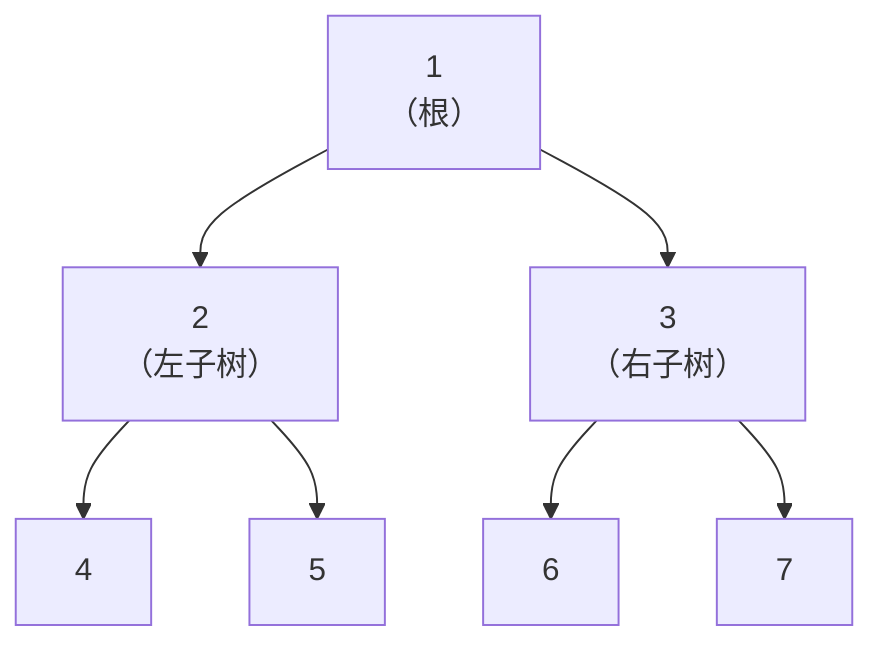
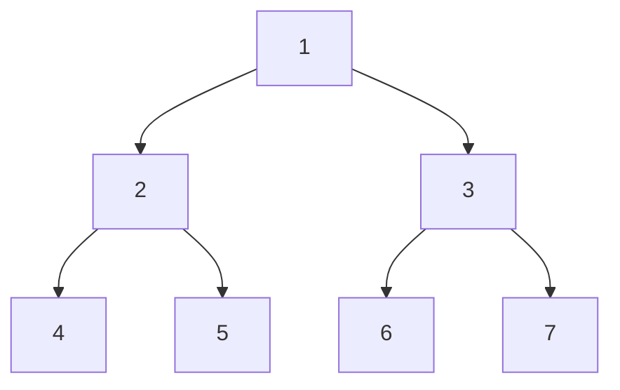
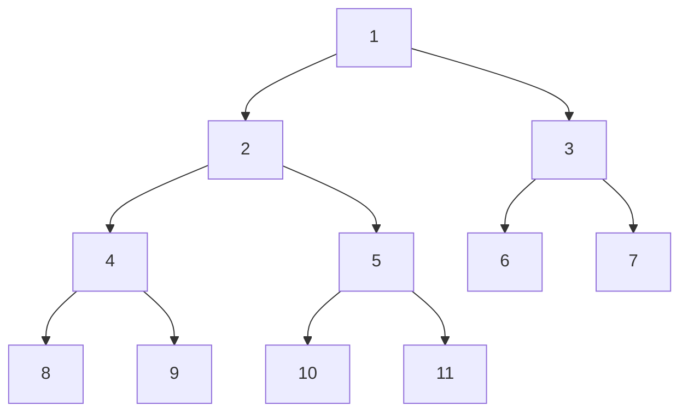
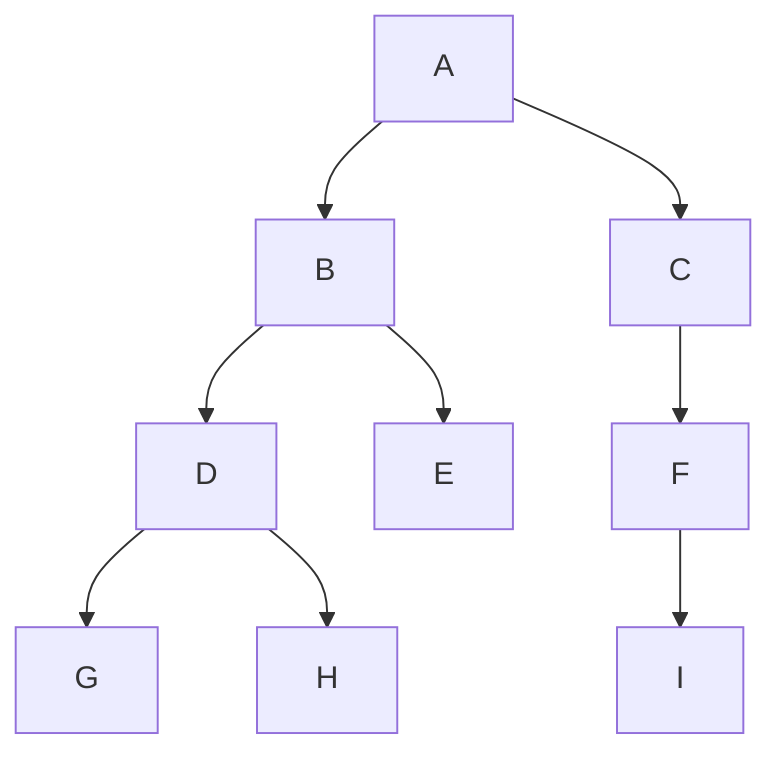
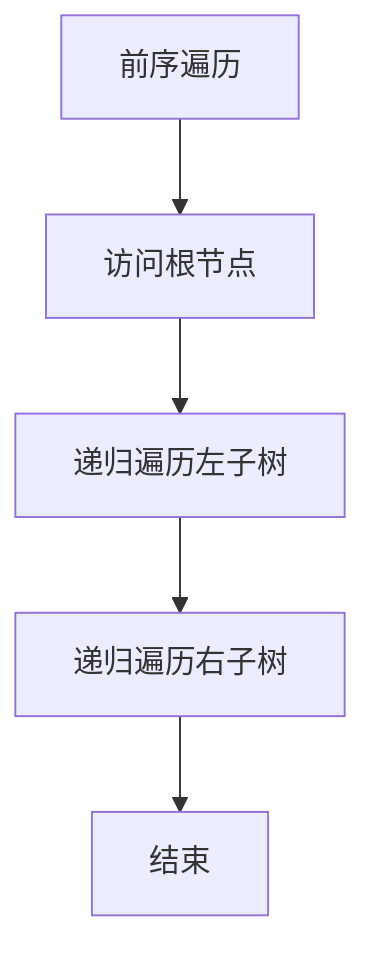
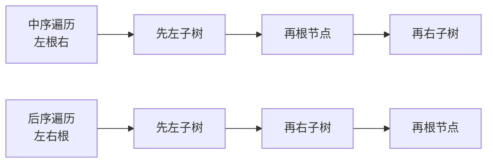

## 本节概述：二叉树是什么

上节课学了普通的树——一个节点可以有任意多个孩子。

这节课学**二叉树（Binary Tree）**——每个节点最多只有两个孩子，分别叫**左孩子**和**右孩子**，而且左右是有顺序的，不能颠倒。

## 二叉树的定义

二叉树是 N 个节点的有限集合：
- N = 0 时，叫**空二叉树**
- N > 0 时，由一个**根节点** + 两棵互不相交的二叉树组成，分别叫**左子树**和**右子树**



> 二叉树的定义也是递归的——左子树和右子树本身也是二叉树。

## 二叉树的特点

1. **每个节点最多 2 个孩子** — 度只能是 0、1、2
2. **左右子树有顺序** — 左就是左，右就是右，像左手右手不能颠倒
3. **只有一棵子树也要区分** — 只有左子树和只有右子树是两棵不同的二叉树

> 举个例子：
> - 只有左孩子的树 ≠ 只有右孩子的树
> - 虽然都只有一个孩子，但左右不同，就是不同的树

## 特殊的二叉树

### 1. 左斜树

所有节点都只有左子树，一路向左斜下去。

```
      A
     /
    B
   /
  C
 /
D
```

### 2. 右斜树

所有节点都只有右子树，一路向右斜下去。

```
A
  \
    B
      \
        C
          \
            D
```

> 斜树其实跟链表差不多——线性表可以理解为一种特殊的树。

### 3. 满二叉树

所有非叶子节点都有左右子树，所有叶子节点都在同一层——完美对称，非常漂亮。



**满二叉树的特点**：
- 叶子节点全部在最后一层
- 非叶子节点的度都是 2
- 深度相同的二叉树中，满二叉树节点数最多
- 深度为 h 的满二叉树有 2<sup>h</sup> - 1 个节点（等比数列求和）

### 4. 完全二叉树

有 N 个节点的二叉树，按层序编号后，如果编号为 i 的节点和同样深度的满二叉树中编号为 i 的节点位置完全相同，就叫**完全二叉树**。

> 简单说：**除了最后一层，其他层都是满的，最后一层的节点都靠左排列。**



> 上图就是一棵完全二叉树——前 3 层全满，第 4 层从左开始排，右边可以缺。

**完全二叉树的特点**：
- 叶子节点只能出现在最下面两层
- 最下层的叶子一定集中在左边连续位置
- 倒数第二层如果有叶子，一定集中在右边连续位置
- 度为 1 的节点只有左孩子（没有只有右孩子的情况）
- 同样节点数的二叉树中，完全二叉树深度最小

> [!TIP]
> **满二叉树 vs 完全二叉树**：
> - 满二叉树一定是完全二叉树
> - 完全二叉树不一定是满二叉树
>
> 满二叉树是完全二叉树的"完美版"。

## 二叉树的性质

| 性质 | 公式 |
|---|---|
| 第 i 层最多节点数 | 2<sup>i-1</sup> 个 |
| 深度为 h 的二叉树最多节点数 | 2<sup>h</sup> - 1 个 |
| N 个节点的完全二叉树深度 | ⌊log₂N⌋ + 1 |

> 第三个性质里的 ⌊⌋ 表示向下取整（floor）。
>
> 这些性质都可以用数学归纳法证明，感兴趣可以自己推一推。

## 二叉树的存储方式

### 方式一：顺序存储（数组）

用一个数组来存二叉树，按层序编号放进去。

**完全二叉树的顺序存储**非常完美——刚好填满，没有浪费。

```
下标：  0   1   2   3   4   5   6   7   8   9  10  11  12
      +---+---+---+---+---+---+---+---+---+---+---+---+---+
      | 空| 1 | 2 | 3 | 4 | 5 | 6 | 7 | 8 | 9 | 10| 11| 12|
      +---+---+---+---+---+---+---+---+---+---+---+---+---+
            A   B   C   D   E   F   G   H   I   J   K   L
```

> 下标 0 故意留空，这样方便计算：
> - 父节点下标 x，左孩子 = **2x**，右孩子 = **2x + 1**
> - 孩子节点下标 x，父节点 = **x / 2**（向下取整）

**非完全二叉树的顺序存储**——不存在的位置填空（- 或 NULL）。

但问题来了：**稀疏的二叉树用顺序存储会非常浪费内存**。比如一棵右斜树，深度为 h 就要申请 2<sup>h</sup> 的空间，但实际只用了 h 个位置。

| 存储方式 | 优点 | 缺点 |
|---|---|---|
| 顺序存储 | 下标计算方便，找父子快 | 稀疏树浪费空间 |
| 链式存储 | 不浪费空间，灵活 | 找父节点麻烦 |

### 方式二：链式存储

每个节点存三个东西：数据 + 左孩子指针 + 右孩子指针。

```
    data
   /    \
left    right
```

结构体定义大概长这样：

```cpp
struct TreeNode {
    int data;           // 数据域
    TreeNode* left;     // 左孩子指针
    TreeNode* right;    // 右孩子指针
};
```

> 没有左孩子就 left = NULL，没有右孩子就 right = NULL。
>
> 链式存储不会浪费空间——有多少节点就申请多少。

## 二叉树的遍历

遍历 = 按照某种次序把所有节点都访问一遍，每个节点访问且只访问一次。

线性表的遍历很简单——从头到尾就行。但二叉树有两个分支，所以遍历方式更多。

常用的有四种：**前序遍历、中序遍历、后序遍历、层序遍历**。

用这棵树来举例：



### 1. 前序遍历（根 → 左 → 右）



顺序：**先访问根节点，再遍历左子树，最后遍历右子树。**

一步步走：
1. 访问 A（根）
2. 遍历左子树 B：
   - 访问 B（根）
   - 遍历左子树 D：
     - 访问 D（根）
     - 遍历左子树 G → 访问 G
     - 遍历右子树 H → 访问 H
   - 遍历右子树 → 空，跳过
3. 遍历右子树 C：
   - 访问 C（根）
   - 遍历左子树 E → 访问 E
   - 遍历右子树 F：
     - 访问 F（根）
     - 遍历左子树 I → 访问 I
     - 遍历右子树 → 空，跳过

结果：**A B D G H C E F I**

### 2. 中序遍历（左 → 根 → 右）

顺序：**先遍历左子树，再访问根节点，最后遍历右子树。**

结果：**G D H B A E C I F**

> 中序遍历有个特点：根节点的左边全是左子树的节点，右边全是右子树的节点。

### 3. 后序遍历（左 → 右 → 根）

顺序：**先遍历左子树，再遍历右子树，最后访问根节点。**

结果：**G H D B E I F C A**

> 后序遍历有个特点：**最后一个一定是根节点**。

### 4. 层序遍历（一层一层来）

从上到下、从左到右，一层一层地访问。

- 第 1 层：A
- 第 2 层：B、C
- 第 3 层：D、E、F
- 第 4 层：G、H、I

结果：**A B C D E F G H I**

> 层序遍历用**队列**实现（广度优先搜索 BFS），后面学算法的时候再详细讲。

### 中序遍历与后序遍历对比



## 四种遍历对比

| 遍历方式 | 顺序 | 结果（示例树） | 实现方式 |
|---|---|---|---|
| **前序** | 根 → 左 → 右 | A B D G H C E F I | 递归 / 栈 |
| **中序** | 左 → 根 → 右 | G D H B A E C I F | 递归 / 栈 |
| **后序** | 左 → 右 → 根 | G H D B E I F C A | 递归 / 栈 |
| **层序** | 从上到下，从左到右 | A B C D E F G H I | 队列（BFS） |

> [!TIP]
> 怎么记住前中后序？
> 前中后说的是**根节点的访问时机**：
> - **前**序 — 根在最前面
> - **中**序 — 根在中间
> - **后**序 — 根在最后面
>
> 左右顺序永远不变，都是先左后右。

## 本章小结

**二叉树** = 每个节点最多两个孩子，分左右，有顺序，递归定义。

**特殊二叉树**：
- **斜树** — 全往左或全往右，跟链表差不多
- **满二叉树** — 每层全满，完美对称
- **完全二叉树** — 除最后一层全满，最后一层靠左排

**存储方式**：
- **顺序存储** — 数组存，找父子快（2x / 2x+1），稀疏树浪费空间
- **链式存储** — 每个节点 left + right，不浪费空间，最常用

**四种遍历**：
- **前序** — 根左右
- **中序** — 左根右
- **后序** — 左右根
- **层序** — 一层一层来（BFS）

