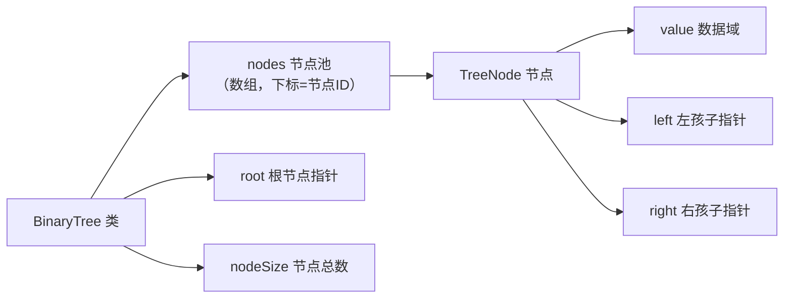

## 本节概述：手写 BinaryTree 类

上节课讲了二叉树的概念——每个节点最多两个孩子，分左右，四种遍历方式。

这节课用 C++ 把二叉树的数据结构写出来，用**节点池（数组）**存节点，用**链式结构**（left / right 指针）连起来。

## 整体架构



> 两层结构：
> 1. **BinaryTree** — 整棵树，管节点池 + 根节点
> 2. **TreeNode** — 树节点，存数据 + 左指针 + 右指针

## 第一步：树节点 TreeNode

每个节点三部分：数据 + 左孩子指针 + 右孩子指针。

```cpp
template <typename T>
struct TreeNode {
    T value;           // 数据域
    TreeNode* left;    // 左孩子指针
    TreeNode* right;   // 右孩子指针

    // 无参构造函数
    TreeNode() : value(T()), left(NULL), right(NULL) {}

    // 带参构造函数
    TreeNode(T x) : value(x), left(NULL), right(NULL) {}
};
```

> 两个构造函数：
> - 无参的 — value 用默认值，左右指针都置空
> - 带参的 — value 赋值为 x，左右指针都置空
>
> **一定要写构造函数！** 不写的话 left 和 right 是野指针，遍历时会崩。

## 第二步：BinaryTree 类定义

```cpp
template <typename T>
class BinaryTree {
private:
    TreeNode<T>* nodes;    // 节点池（数组）
    TreeNode<T>* root;     // 根节点指针
    int nodeSize;          // 节点总数

    // 私有辅助函数
    TreeNode<T>* create(T a[], int n, int nodeId, T nonNode);
    void visit(TreeNode<T>* node);   // 访问节点
    void preOrder(TreeNode<T>* node);  // 前序遍历（内部）
    void inOrder(TreeNode<T>* node);   // 中序遍历（内部）
    void postOrder(TreeNode<T>* node); // 后序遍历（内部）

public:
    BinaryTree();                    // 默认构造函数
    BinaryTree(int maxNodes);        // 指定大小的构造函数
    ~BinaryTree();                   // 析构函数

    TreeNode<T>* getTreeNode(int id);  // 通过 ID 获取节点指针
    void createTree(T a[], int n, T nonNode);  // 创建树

    void preOrder();   // 前序遍历（外部接口）
    void inOrder();    // 中序遍历（外部接口）
    void postOrder();  // 后序遍历（外部接口）
};
```

> [!TIP]
> 为什么遍历函数分两套（公有 + 私有）？
> - **私有版有参数** — 递归时需要知道从哪个节点开始
> - **公有版无参数** — 外部调用不需要知道根节点，直接从根开始遍历
>
> 这是一种封装——外部只需要知道"遍历这棵树"，不需要关心根节点在哪。

## 构造函数

默认构造函数：申请 1024 个节点的空间（够用就行）。

```cpp
template <typename T>
BinaryTree<T>::BinaryTree() {
    nodeSize = 1024;
    nodes = new TreeNode<T>[nodeSize];
    root = NULL;
}
```

指定大小的构造函数：

```cpp
template <typename T>
BinaryTree<T>::BinaryTree(int maxNodes) {
    nodeSize = maxNodes;
    nodes = new TreeNode<T>[nodeSize];
    root = NULL;
}
```

## 析构函数

释放节点池数组。

```cpp
template <typename T>
BinaryTree<T>::~BinaryTree() {
    delete[] nodes;
}
```

> 用 `new[]` 申请的，用 `delete[]` 释放。
>
> 注意：这里只释放了节点池，TreeNode 里的 left / right 指向的就是节点池里的元素，不需要单独释放。

## 通过 ID 获取节点 getTreeNode

直接按下标取，取地址返回指针。

```cpp
template <typename T>
TreeNode<T>* BinaryTree<T>::getTreeNode(int id) {
    return &nodes[id];
}
```

> 时间复杂度：**O(1)**
>
> 节点池是数组，下标就是节点 ID，直接索引。

## 访问节点 visit

遍历的时候"访问"一个节点具体做什么？这里我们就简单地打印它的值。

```cpp
template <typename T>
void BinaryTree<T>::visit(TreeNode<T>* node) {
    cout << node->value;
}
```

> visit 函数是可扩展的——你可以改成把节点塞进一个列表，或者做其他处理。
> 这里为了调试方便，直接打印。

## 前序遍历（根 → 左 → 右）

**先访问根节点，再递归左子树，最后递归右子树。**

```cpp
template <typename T>
void BinaryTree<T>::preOrder(TreeNode<T>* node) {
    if (node == NULL) {
        return;                          // 空节点直接返回
    }
    visit(node);                        // 1. 访问根
    preOrder(node->left);               // 2. 前序遍历左子树
    preOrder(node->right);              // 3. 前序遍历右子树
}
```

> 三句话搞定前序遍历——这就是递归的力量！
>
> 终止条件：node == NULL（空树/空孩子）。

## 中序遍历（左 → 根 → 右）

**先递归左子树，再访问根节点，最后递归右子树。**

```cpp
template <typename T>
void BinaryTree<T>::inOrder(TreeNode<T>* node) {
    if (node == NULL) {
        return;
    }
    inOrder(node->left);                // 1. 中序遍历左子树
    visit(node);                        // 2. 访问根
    inOrder(node->right);               // 3. 中序遍历右子树
}
```

> 跟前序遍历几乎一模一样，只是 visit 挪到了中间。

## 后序遍历（左 → 右 → 根）

**先递归左子树，再递归右子树，最后访问根节点。**

```cpp
template <typename T>
void BinaryTree<T>::postOrder(TreeNode<T>* node) {
    if (node == NULL) {
        return;
    }
    postOrder(node->left);              // 1. 后序遍历左子树
    postOrder(node->right);             // 2. 后序遍历右子树
    visit(node);                        // 3. 访问根
}
```

> visit 挪到了最后面。
>
> 三种遍历的代码结构几乎完全一样，区别只在于 visit 的位置。

## 创建树 create（私有，递归）

从顺序存储的数组生成一棵二叉树。

参数：
- `a[]` — 顺序存储的数组
- `n` — 数组大小
- `nodeId` — 当前要创建的节点编号（从 1 开始）
- `nonNode` — 空节点的标记值（比如 '-'）

```cpp
template <typename T>
TreeNode<T>* BinaryTree<T>::create(T a[], int n, int nodeId, T nonNode) {
    // 1. 越界 或 是空节点 → 返回 NULL
    if (nodeId >= n || a[nodeId] == nonNode) {
        return NULL;
    }

    // 2. 获取当前节点，设置数据
    TreeNode<T>* node = getTreeNode(nodeId);
    node->value = a[nodeId];

    // 3. 递归创建左子树（编号 2 * nodeId）
    node->left = create(a, n, 2 * nodeId, nonNode);

    // 4. 递归创建右子树（编号 2 * nodeId + 1）
    node->right = create(a, n, 2 * nodeId + 1, nonNode);

    // 5. 返回当前节点
    return node;
}
```

> 编号规则就是顺序存储的公式：
> - 父节点编号 x → 左孩子 = **2x**，右孩子 = **2x + 1**
>
> 递归思想：先建自己，再建左子树，再建右子树。

## 创建树 createTree（公有接口）

外部调用的版本——不需要传 nodeId，默认从 1 号节点（根）开始建。

```cpp
template <typename T>
void BinaryTree<T>::createTree(T a[], int n, T nonNode) {
    root = create(a, n, 1, nonNode);
}
```

> 根节点编号是 1（下标 0 留空，方便计算 2x 和 2x+1）。

## 外部调用的遍历接口

三个无参版本，内部直接调用私有版，把 root 传进去。

```cpp
// 前序遍历
template <typename T>
void BinaryTree<T>::preOrder() {
    preOrder(root);
}

// 中序遍历
template <typename T>
void BinaryTree<T>::inOrder() {
    inOrder(root);
}

// 后序遍历
template <typename T>
void BinaryTree<T>::postOrder() {
    postOrder(root);
}
```

> 外部使用很简单：`tree.preOrder()` 就完事了，不需要传任何参数。

## 完整代码汇总

```cpp
#include <iostream>
using namespace std;

// ====== 二叉树节点 ======
template <typename T>
struct TreeNode {
    T value;
    TreeNode* left;
    TreeNode* right;

    TreeNode() : value(T()), left(NULL), right(NULL) {}
    TreeNode(T x) : value(x), left(NULL), right(NULL) {}
};

// ====== 二叉树类 ======
template <typename T>
class BinaryTree {
private:
    TreeNode<T>* nodes;
    TreeNode<T>* root;
    int nodeSize;

    TreeNode<T>* create(T a[], int n, int nodeId, T nonNode);
    void visit(TreeNode<T>* node);
    void preOrder(TreeNode<T>* node);
    void inOrder(TreeNode<T>* node);
    void postOrder(TreeNode<T>* node);

public:
    BinaryTree();
    BinaryTree(int maxNodes);
    ~BinaryTree();

    TreeNode<T>* getTreeNode(int id);
    void createTree(T a[], int n, T nonNode);

    void preOrder();
    void inOrder();
    void postOrder();
};

// 默认构造函数
template <typename T>
BinaryTree<T>::BinaryTree() {
    nodeSize = 1024;
    nodes = new TreeNode<T>[nodeSize];
    root = NULL;
}

// 指定大小的构造函数
template <typename T>
BinaryTree<T>::BinaryTree(int maxNodes) {
    nodeSize = maxNodes;
    nodes = new TreeNode<T>[nodeSize];
    root = NULL;
}

// 析构函数
template <typename T>
BinaryTree<T>::~BinaryTree() {
    delete[] nodes;
}

// 通过 ID 获取节点
template <typename T>
TreeNode<T>* BinaryTree<T>::getTreeNode(int id) {
    return &nodes[id];
}

// 访问节点
template <typename T>
void BinaryTree<T>::visit(TreeNode<T>* node) {
    cout << node->value;
}

// 前序遍历（内部）
template <typename T>
void BinaryTree<T>::preOrder(TreeNode<T>* node) {
    if (node == NULL) return;
    visit(node);
    preOrder(node->left);
    preOrder(node->right);
}

// 中序遍历（内部）
template <typename T>
void BinaryTree<T>::inOrder(TreeNode<T>* node) {
    if (node == NULL) return;
    inOrder(node->left);
    visit(node);
    inOrder(node->right);
}

// 后序遍历（内部）
template <typename T>
void BinaryTree<T>::postOrder(TreeNode<T>* node) {
    if (node == NULL) return;
    postOrder(node->left);
    postOrder(node->right);
    visit(node);
}

// 创建树（内部，递归）
template <typename T>
TreeNode<T>* BinaryTree<T>::create(T a[], int n, int nodeId, T nonNode) {
    if (nodeId >= n || a[nodeId] == nonNode) {
        return NULL;
    }
    TreeNode<T>* node = getTreeNode(nodeId);
    node->value = a[nodeId];
    node->left = create(a, n, 2 * nodeId, nonNode);
    node->right = create(a, n, 2 * nodeId + 1, nonNode);
    return node;
}

// 创建树（外部接口）
template <typename T>
void BinaryTree<T>::createTree(T a[], int n, T nonNode) {
    root = create(a, n, 1, nonNode);
}

// 前序遍历（外部接口）
template <typename T>
void BinaryTree<T>::preOrder() {
    preOrder(root);
}

// 中序遍历（外部接口）
template <typename T>
void BinaryTree<T>::inOrder() {
    inOrder(root);
}

// 后序遍历（外部接口）
template <typename T>
void BinaryTree<T>::postOrder() {
    postOrder(root);
}
```

## main 函数测试

构建这棵树：

```
      A
    /   \
   B     C
  / \   / \
 D   E F   G
/ \     \
H I     J
```

顺序存储数组（下标 0 留空，'-' 表示空节点）：

```
下标： 0  1  2  3  4  5  6  7  8  9  10 11 12 13 14
值：   -  A  B  C  D  E  F  G  H  I  -  -  -  J  -
```

```cpp
int main() {
    char nonNode = '-';

    // 顺序存储的数组（下标 0 留空）
    char a[] = {'-', 'A', 'B', 'C', 'D', 'E',
                       'F', 'G', 'H', 'I', '-', '-',
                       '-', 'J', '-'};
    int n = 15;

    BinaryTree<char> tree(n);
    tree.createTree(a, n, nonNode);

    cout << "前序遍历：";
    tree.preOrder();
    cout << endl;

    cout << "中序遍历：";
    tree.inOrder();
    cout << endl;

    cout << "后序遍历：";
    tree.postOrder();
    cout << endl;

    return 0;
}
```

运行结果：

```
前序遍历：ABDHICEFJG
中序遍历：HDIBEAJFCG
后序遍历：HIDBJFGCA
```

> 可以自己对照着树画一遍，看看对不对。

## 易错点总结

> [!WARNING]
> 1. **TreeNode 一定要写构造函数** — 不写 left/right 是野指针，遍历时崩（老师反复强调的）
> 2. **根节点编号从 1 开始** — 下标 0 留空，这样 2x 和 2x+1 的公式才成立
> 3. **遍历递归要有终止条件** — node == NULL 直接返回，不然会无限递归栈溢出
> 4. **三种遍历代码结构几乎一样** — 区别只在于 visit 的位置（前/中/后）
> 5. **create 的返回值要赋值给 left/right** — 创建完子树要把指针接回来
> 6. **公有和私有两套函数** — 公有无参封装，私有带参递归，别搞混了
> 7. **空节点标记 nonNode 要传对** — 数组里不存在的节点位置要填上 nonNode 的值

## 本章小结

**手写 BinaryTree 类** = 节点池（数组） + 链式结构（left/right） + 递归遍历。

**核心操作**：
- **create** — 从顺序存储数组递归建二叉树，左孩子 2x，右孩子 2x+1
- **preOrder** — 根 → 左 → 右，三行代码
- **inOrder** — 左 → 根 → 右，三行代码
- **postOrder** — 左 → 右 → 根，三行代码

**设计要点**：
- 遍历函数分公有（无参）和私有（带参）两套，封装性更好
- TreeNode 必须写构造函数，初始化 left/right 为 NULL
- 递归的终止条件都是 node == NULL

