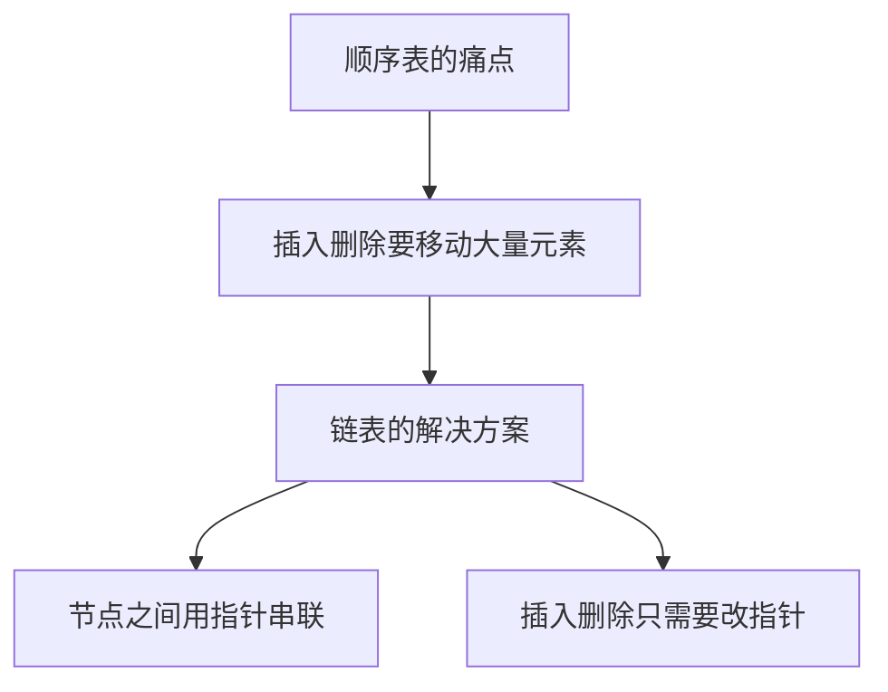
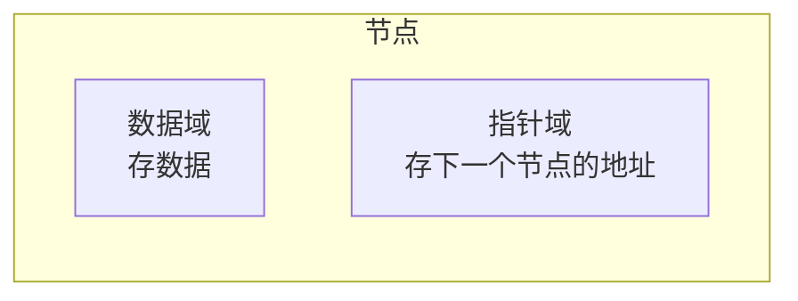
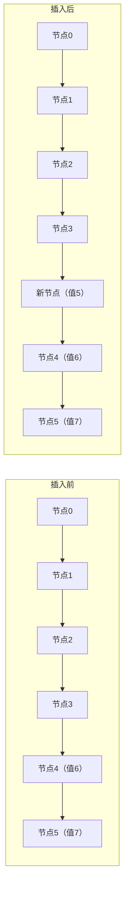
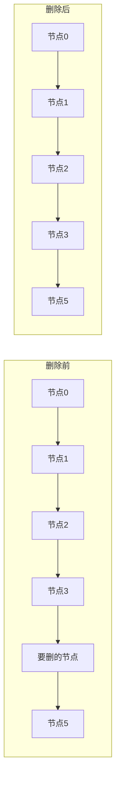
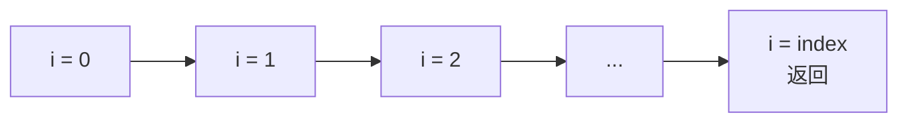
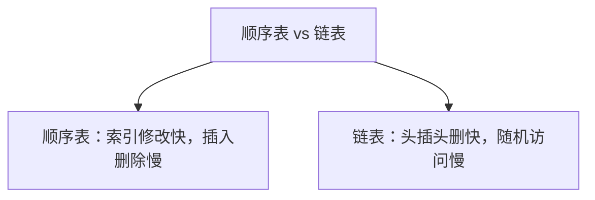

## 本节概述：链表是什么

上一章学了顺序表——优点是下标访问快，缺点是插入删除要挪一大堆元素，O(n) 很慢。

那有没有办法让插入删除变快？有——**链表**。

链表的核心思路：数据不连续存了，每个节点存一个指针指向下一个节点。这样插入删除只要改改指针就行，不用挪元素。

## 链表的结构

链表由一个个**节点**组成，节点之间通过指针串起来。

每个节点有两部分：
- **数据域** — 存数据，可以是任意类型
- **指针域** — 存下一个节点的地址（指向后继节点）

链表有很多种：单向链表、双向链表、循环链表……这节课先讲最基础的——**单向链表**。

## 单向链表长什么样

单向链表，顾名思义——只能往一个方向走。

几个基本概念：
- **头节点** — 链表的第一个节点
- **后继节点** — 一个节点的下一个节点
- **前驱节点** — 一个节点的前一个节点
- **最后一个节点** — 它的后继是 NULL（空）

> 单向链表只能从前往后遍历，不能从后往前走——因为每个节点只知道下一个是谁，不知道前一个是谁。

## 操作一：插入元素

链表插入的核心思路：**找到插入位置的前一个节点，然后改两个指针**。

举个例子：在索引 4 的位置插入值为 5 的节点。

### 过程图解

### 插入四步走

**第一步：判断位置是否合法**
- index < 0 或者 index > size → 非法，抛异常
- 插入可以插到最后（index == size），跟顺序表一样

**第二步：生成新节点**
- new 一个节点，数据域填好，指针域先不管

**第三步：找到前驱节点，改两个指针**

这是最关键的一步，有两种情况：

**情况 A：插在最前面（index == 0）**
- 新节点的 next 指向原来的头节点
- 头节点更新成新节点

**情况 B：插在中间或末尾（index > 0）**
- 先遍历找到 index 前面那个节点（叫 pre）
- 新节点的 next = pre 的 next（先连后面）
- pre 的 next = 新节点（再连前面）

> 注意顺序！先让新节点连上后面，再让前面连上后节点——不然前面的链断了，后面就找不到了。

**第四步：size 加一**

## 操作二：删除元素

删除的核心思路：**找到要删的节点的前一个，让它直接指向下下个**。

举个例子：删除索引 4 的节点。

### 过程图解

让 pre 的 next 直接跳过要删的节点，指向下下个——要删的节点就从链上掉下来了。

### 删除四步走

**第一步：判断位置是否合法**
- index < 0 或者 index >= size → 非法

**第二步：分两种情况**

**情况 A：删头节点（index == 0）**
- 把头节点改成它的下一个节点
- 原来的头节点释放掉

**情况 B：删中间或末尾（index > 0）**
- 遍历找到 index 前面那个节点（pre）
- pre 的 next = pre 的 next 的 next（跳过要删的）
- 被删的节点释放掉

**第三步：size 减一**

## 操作三：元素查找

跟顺序表一样，遍历一个一个比。

- 找到了 → 返回那个节点
- 没找到 → 返回 NULL

因为要遍历，**查找的时间复杂度是 O(n)**。

## 操作四：元素索引（按位置取）

给定一个下标，找到对应的节点。

跟查找类似——也是遍历，数着数走，走到第 index 个就返回。

因为也要遍历，**索引访问的时间复杂度也是 O(n)**。

> 这就是链表最大的缺点——不能随机访问，想找第几个必须从头一个一个数过去。

## 操作五：元素修改

先通过索引找到节点（O(n)），然后改数据域就行（O(1)）。

主要时间花在找节点上，所以**修改的时间复杂度也是 O(n)**。

## 时间复杂度对比

来一张顺序表 vs 链表的对比表：

| 操作 | 顺序表 | 单向链表 | 说明 |
|---|---|---|---|
| 插入 | O(n) | O(n) | 链表不用挪元素，但找位置要遍历 |
| 头插 | O(n) | **O(1)** | 链表插第一个飞快 |
| 删除 | O(n) | O(n) | 同样，找位置要遍历 |
| 头删 | O(n) | **O(1)** | 链表删第一个飞快 |
| 查找 | O(n) | O(n) | 都要遍历比较 |
| 索引 | **O(1)** | O(n) | 顺序表下标直接定位，链表要遍历 |
| 修改 | **O(1)** | O(n) | 同上 |

> 没有最好的数据结构，只有最合适的。看你的场景更需要什么——频繁随机访问用顺序表，频繁头插头删用链表。

## 本章小结

**单向链表**由节点组成，每个节点有数据域 + 指针域，通过指针串联起来。

**五大操作**：
1. **插入** — 找前驱、改两个指针，O(n)（找位置花时间）
2. **删除** — 找前驱、跳过被删节点，O(n)
3. **查找** — 遍历比较，O(n)
4. **索引** — 遍历数位置，O(n)
5. **修改** — 先索引再改，O(n)

**核心优缺点**：
- 优点：插入删除不用挪元素（只改指针），头插头删 O(1)
- 缺点：不能随机访问，找第 n 个要遍历 O(n)

