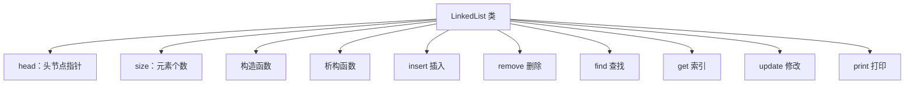
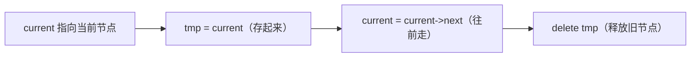

## 本节概述：手写一个单向链表

上节课讲了单向链表的概念，这节课我们用 C++ 把它真正写出来。

这次我们用**类**来封装——节点是结构体，链表是一个类，里面包含头节点指针和 size。



## 第一步：定义节点结构体

每个节点有两部分：数据域 + 指针域。

```cpp
typedef int ElemType;  // 元素类型，想改只改这里

struct ListNode
{
    ElemType data;       // 数据域
    ListNode* next;      // 指针域，指向下一个节点

    // 构造函数
    ListNode(ElemType x) : data(x), next(NULL) {}
};
```

> 用了初始化列表——`data(x)` 就是把 x 赋值给 data，`next(NULL)` 就是 next 初始化为空。结构体也能写构造函数，C++ 的 struct 和 class 几乎一样，只是默认访问权限不同。

## 第二步：定义链表类

链表类只需要两个东西：头节点指针 + 元素个数。

```cpp
class LinkedList
{
private:
    ListNode* head;   // 头节点指针
    int size;         // 元素个数

public:
    // 构造函数
    LinkedList();

    // 析构函数
    ~LinkedList();

    // 插入：在 index 位置插入 value
    void insert(int index, ElemType value);

    // 删除：删除 index 位置的节点
    void remove(int index);

    // 查找：找值为 value 的节点
    ListNode* find(ElemType value);

    // 索引：获取第 index 个节点
    ListNode* get(int index);

    // 修改：把第 index 个改成 value
    void update(int index, ElemType value);

    // 打印整个链表（调试用）
    void print();
};
```

类里面先写声明，实现放在外面——这是 C++ 的标准写法。

## 第三步：构造和析构

### 构造函数

初始时空链表——头节点为空，size 为 0。

```cpp
LinkedList::LinkedList()
{
    head = NULL;
    size = 0;
}
```

### 析构函数

链表的析构要小心——每个节点都是 new 出来的，必须一个一个 delete 掉，不然内存泄漏。

```cpp
LinkedList::~LinkedList()
{
    ListNode* current = head;
    while (current != NULL)
    {
        ListNode* tmp = current;     // 先把当前节点存起来
        current = current->next;     // 走到下一个
        delete tmp;                  // 再删除存的那个
    }
}
```

> 注意顺序！不能先 delete current——delete 之后 current 就没了，没法找 next 了。所以要先存起来，再往前走，再删。



## 第四步：插入操作

插入是链表最核心的操作，也是最容易写错的。

```cpp
void LinkedList::insert(int index, ElemType value)
{
    // 1. 判断位置是否合法
    if (index < 0 || index > size)
    {
        throw out_of_range("无效位置");
    }

    // 2. 生成新节点
    ListNode* newNode = new ListNode(value);

    // 3. 分两种情况
    if (index == 0)
    {
        // 情况 A：插在头部
        newNode->next = head;    // 新节点连上原来的头
        head = newNode;          // 更新头节点
    }
    else
    {
        // 情况 B：插在中间或尾部
        ListNode* current = head;
        for (int i = 0; i < index - 1; i++)  // 遍历 index-1 次
        {
            current = current->next;        // 找到前驱节点
        }
        newNode->next = current->next;      // 先连后面
        current->next = newNode;            // 再连前面
    }

    // 4. size 加一
    size++;
}
```

### 头插法图解


### 中间插入图解


> [!WARNING]
> **改指针的顺序不能反！**
>
> 必须先让新节点连上后面（`newNode->next = current->next`），再让前面连上后节点（`current->next = newNode`）。
>
> 如果反了——先改 current->next，那原来的后继节点就找不到了，新节点不知道该连谁。会形成自环，直接崩掉。
>
> **记不住就画图——链表的问题，画张图就清楚了。**

## 第五步：删除操作

删除跟插入思路很像——找到前驱节点，让它跳过被删节点。

```cpp
void LinkedList::remove(int index)
{
    // 1. 判断位置是否合法
    if (index < 0 || index >= size)
    {
        throw out_of_range("无效位置");
    }

    if (index == 0)
    {
        // 情况 A：删头节点
        ListNode* tmp = head;      // 存起来
        head = head->next;         // 头节点往后移一个
        delete tmp;                // 释放旧头
    }
    else
    {
        // 情况 B：删中间或尾部
        ListNode* current = head;
        for (int i = 0; i < index - 1; i++)  // 找到前驱
        {
            current = current->next;
        }
        ListNode* tmp = current->next;       // 存要删的节点
        current->next = current->next->next; // 跳过被删节点
        delete tmp;                           // 释放
    }

    // 2. size 减一
    size--;
}
```

> 注意：删除的合法性判断是 `index >= size`，插入是 `index > size`——因为删除不能删到 size 那个位置（没元素），插入可以插到 size（插末尾）。

## 第六步：查找操作

遍历一遍，找到就返回节点，找不到返回 NULL。

```cpp
ListNode* LinkedList::find(ElemType value)
{
    ListNode* current = head;
    while (current != NULL && current->data != value)
    {
        current = current->next;
    }
    return current;  // 找到了就是节点地址，没找到就是 NULL
}
```

循环退出有两种可能：
1. current 变成 NULL → 遍历完了，没找到
2. current->data == value → 找到了

直接返回 current 就行，两种情况都对。

## 第七步：索引操作（按位置取）

给定下标，找到对应的节点。

```cpp
ListNode* LinkedList::get(int index)
{
    if (index < 0 || index >= size)
    {
        throw out_of_range("无效位置");
    }

    ListNode* current = head;
    for (int i = 0; i < index; i++)
    {
        current = current->next;
    }
    return current;
}
```

从头开始走 index 步，走到的就是第 index 个节点。

因为要遍历，**时间复杂度 O(n)**——这就是链表最大的缺点，不能随机访问。

## 第八步：修改操作

先找到节点，再改数据。

```cpp
void LinkedList::update(int index, ElemType value)
{
    ListNode* node = get(index);  // 复用 get 函数
    node->data = value;           // 改数据域
}
```

直接调用 get 拿到节点，然后改 data 就行。代码复用，不用重复写遍历。

## 第九步：打印函数（调试用）

写个 print 函数，把整个链表打出来，方便调试。

```cpp
void LinkedList::print()
{
    ListNode* current = head;
    while (current != NULL)
    {
        cout << current->data << " ";
        current = current->next;
    }
    cout << endl;
}
```

## 完整代码汇总

把上面所有内容拼起来：

```cpp
#include <iostream>
#include <stdexcept>
using namespace std;

typedef int ElemType;

struct ListNode
{
    ElemType data;
    ListNode* next;
    ListNode(ElemType x) : data(x), next(NULL) {}
};

class LinkedList
{
private:
    ListNode* head;
    int size;

public:
    LinkedList();
    ~LinkedList();
    void insert(int index, ElemType value);
    void remove(int index);
    ListNode* find(ElemType value);
    ListNode* get(int index);
    void update(int index, ElemType value);
    void print();
};

// 构造函数
LinkedList::LinkedList()
{
    head = NULL;
    size = 0;
}

// 析构函数
LinkedList::~LinkedList()
{
    ListNode* current = head;
    while (current != NULL)
    {
        ListNode* tmp = current;
        current = current->next;
        delete tmp;
    }
}

// 插入
void LinkedList::insert(int index, ElemType value)
{
    if (index < 0 || index > size)
        throw out_of_range("无效位置");

    ListNode* newNode = new ListNode(value);

    if (index == 0)
    {
        newNode->next = head;
        head = newNode;
    }
    else
    {
        ListNode* current = head;
        for (int i = 0; i < index - 1; i++)
            current = current->next;

        newNode->next = current->next;
        current->next = newNode;
    }
    size++;
}

// 删除
void LinkedList::remove(int index)
{
    if (index < 0 || index >= size)
        throw out_of_range("无效位置");

    if (index == 0)
    {
        ListNode* tmp = head;
        head = head->next;
        delete tmp;
    }
    else
    {
        ListNode* current = head;
        for (int i = 0; i < index - 1; i++)
            current = current->next;

        ListNode* tmp = current->next;
        current->next = current->next->next;
        delete tmp;
    }
    size--;
}

// 查找
ListNode* LinkedList::find(ElemType value)
{
    ListNode* current = head;
    while (current != NULL && current->data != value)
        current = current->next;
    return current;
}

// 索引
ListNode* LinkedList::get(int index)
{
    if (index < 0 || index >= size)
        throw out_of_range("无效位置");

    ListNode* current = head;
    for (int i = 0; i < index; i++)
        current = current->next;
    return current;
}

// 修改
void LinkedList::update(int index, ElemType value)
{
    get(index)->data = value;
}

// 打印
void LinkedList::print()
{
    ListNode* current = head;
    while (current != NULL)
    {
        cout << current->data << " ";
        current = current->next;
    }
    cout << endl;
}
```

## 测试一下

```cpp
int main()
{
    LinkedList list;

    // 插入 5 个元素：10, 20, 30, 40, 50
    list.insert(0, 10);
    list.insert(1, 20);
    list.insert(2, 30);
    list.insert(3, 40);
    list.insert(4, 50);
    list.print();  // 输出：10 20 30 40 50

    // 删除第 0 个元素
    list.remove(0);
    list.print();  // 输出：20 30 40 50

    // 修改第 2 个元素为 60
    list.update(2, 60);
    list.print();  // 输出：20 30 60 50

    // 查找值为 30 的节点
    ListNode* found = list.find(30);
    if (found != NULL)
    {
        cout << "找到了：" << found->data << endl;  // 输出：找到了：30
    }

    // 获取第 3 个元素
    ListNode* node = list.get(2);
    cout << "第2个元素：" << node->data << endl;  // 输出：第2个元素：60

    return 0;
}
```

> 建议大家别照着抄，理解了之后自己默写出来——写链表出错是正常的，查 bug 的过程就是成长的过程。

## 本章小结

**单向链表**用类封装：头节点指针 + size，核心操作五大类。

**五个易错点**：
1. **插入删除都要分情况** — 头节点单独处理
2. **插入指针顺序不能反** — 先连后面，再连前面
3. **析构要一个一个删** — 先存再走再删，不能直接删当前节点
4. **index 合法性判断不一样** — 插入是 `index > size`，删除是 `index >= size`
5. **链表遍历的固定写法** — `current = current->next`，到处都在用

**一句话：** **链表插入删除只改指针不挪元素，但找位置要遍历；头插头删最快（O1），随机访问最慢（On）。**
