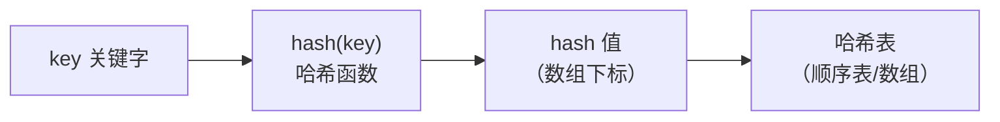

## 本节概述：哈希表是什么

前面学过的查找：
- **线性查找** — 遍历整个表，O(n)
- **二分查找** — 有序顺序表才能用，O(log n)

有没有更快的？有——**哈希表（Hash Table）**，也叫**散列表**，平均查找复杂度 **O(1)**。

## 哈希表的核心思想

把**关键字（key）**通过一个**哈希函数**算出一个**哈希值**，然后映射到数组的一个位置（下标）。存的时候算一次放进去，找的时候再算一次直接定位。



> 核心就是一句话：**用函数算位置，直接索引，不用遍历。**

几个基本概念：
- **关键字（key）** — 要查找的数据本身
- **哈希函数（hash function）** — 把 key 转成哈希值的函数
- **哈希值（hash value）** — 哈希函数算出来的整数，当数组下标用
- **哈希地址** — 实际存储的位置（解决冲突后的数组下标）
- **哈希表** — 存数据的那张表，底层是数组，每个位置叫一个**槽位（slot）**
- **哈希冲突** — 不同的 key 算出相同的哈希值，抢同一个位置

## 键值对（Key-Value）

哈希表存的不是单个值，而是**键值对**——由 key 和 value 两部分组成。

| 结构 | 说明 |
|---|---|
| **key 键** | 用来计算哈希值，必须唯一（不重复） |
| **value 值** | 实际存储的数据，可以是任意类型 |

> 比如学生信息：
> - key = 学号（唯一）
> - value = 学生信息（姓名、年龄、成绩等）
>
> 给一个学号，O(1) 就能查到这个学生的全部信息。

哈希函数的作用就是把**非整型的 key**（比如字符串）转换成**整数**，这样才能当数组下标用。

## 哈希函数

哈希函数就是 `y = f(x)`——x 是 key，y 是哈希值。

**好的哈希函数两个特征**：

1. **单射** — 尽量不同的 key 对应不同的哈希值，减少冲突
2. **雪崩效应** — key 稍微变一点，哈希值变化很大，让分布更随机更均匀

> 分布越均匀，冲突越少，哈希表效率越高。

### 常用的哈希函数

| 方法 | 公式 | 特点 |
|---|---|---|
| **直接定址法** | f(key) = key | 简单，只适合小范围非负整数（计数排序就是这个思路） |
| **平方取中法** | key 平方后取中间几位 | 适合不清楚分布、位数不大的情况 |
| **折叠法** | key 分成几段相加 | 适合位数多的 key |
| **除留余数法** | f(key) = key % m | 最常用，m 是哈希表长度 |
| **位与法** | f(key) = key & (m-1) | m 要是 2 的幂，比取模快，位运算高效 |

**除留余数法**是最经典的——key 模上表长，得到的余数就是下标。

**位与法**是除留余数法的优化版：
- 表长 m 取 2 的幂（如 4、8、16、32...）
- `key % m` 等价于 `key & (m - 1)`
- 位运算比取模快得多
- 原理：m 是 2 的幂，二进制是 1 后面跟 k 个 0；m-1 就是 0 后面跟 k 个 1；位与上 m-1 就是取低 k 位，跟取模效果一样

> [!TIP]
> 除了直接定址法，其他方法都可能产生哈希冲突。
> 冲突不可避免，关键是怎么解决。

## 哈希冲突

不同的 key 经过哈希函数算出相同的哈希值，就叫**哈希冲突**。

比如哈希函数是 `key % 3`：
- 3 % 3 = 0
- 6 % 3 = 0
- 9 % 3 = 0

3、6、9 三个不同的 key，哈希值都是 0——冲突了。

冲突不可怕，有办法解决。主要两种方案：**开放地址法**和**链地址法**。

## 冲突解决一：开放地址法

**思路**：冲突了就往后找，找到下一个空位置放进去。

公式：`hi = (hash(key) + di) % m`

di 是增量序列，可以是：
- **线性探测** — di = 0, 1, 2, 3...（一个一个往后找）
- **二次探测** — di = 0², 1², -1², 2², -2²...（左右跳着找）

举个例子，表长 8，插入 11、12、13、20、19、28（线性探测）：

```
插入 11: 11%8=3 → 放 3 号位置    [_, _, _, 11, _, _, _, _]
插入 12: 12%8=4 → 放 4 号位置    [_, _, _, 11, 12, _, _, _]
插入 13: 13%8=5 → 放 5 号位置    [_, _, _, 11, 12, 13, _, _]
插入 20: 20%8=4 → 4 号被占了 → 往后找 → 5 也被占了 → 6 号空 → 放 6 号
                                              [_, _, _, 11, 12, 13, 20, _]
插入 19: 19%8=3 → 3 号被占 → 4 被占 → 5 被占 → 6 被占 → 7 号空 → 放 7 号
                                              [_, _, _, 11, 12, 13, 20, 19]
插入 28: 28%8=4 → 4 被占 → 5 被占 → 6 被占 → 7 被占 → 0 号空 → 放 0 号
                                              [28, _, _, 11, 12, 13, 20, 19]
```

> 从 4 号位置开始，一路往后找，跨过 12、13、20、19，一直找到 0 号才放下。
> 冲突越多，往后找的路越长，效率越低。

开放地址法的问题：
- 数据量不能超过表长，不然找不到空位会死循环
- 删除比较麻烦（删了之后会断了"探测链"）
- 优点是实现简单，纯数组，没有指针

> 竞赛/刷题快速实现哈希表常用开放地址法，因为代码短。

## 冲突解决二：链地址法（拉链法）

**思路**：每个槽位挂一条链表，冲突的元素都串在同一条链上。

同样的例子，表长 8，插入 11、12、13、20、19、28：

```
  0: 24...? 不，28%8=4，28 在 4 号链
  0: （空）
  1: （空）
  2: （空）
  3: → 11 → 19 → NULL   （11%8=3，19%8=3）
  4: → 12 → 20 → 28 → NULL   （12%8=4，20%8=4，28%8=4）
  5: → 13 → NULL   （13%8=5）
  6: （空）
  7: （空）
```

> 同一个哈希值的元素串在一条链上，谁冲突了就往链上加一个节点。
> 查找的时候：先算哈希值定位到槽位，再在链上遍历找。

链地址法的特点：
- 元素数量可以超过表长（链表无限接）
- 删除方便（链表删除节点即可）
- 大多数开源实现（如 C++ unordered_map）都用链地址法
- 跟邻接表结构一模一样——顺序表 + 链表

## 哈希表的增删改查

以链地址法为例：

### 插入
1. 用哈希函数算 key 的哈希值 → 定位到槽位
2. 遍历这条链，看 key 是否已存在
3. 不存在 → 头插/尾插新节点
4. 已存在 → 更新 value（或跳过）

### 删除
1. 用哈希函数算 key 的哈希值 → 定位到槽位
2. 遍历链，找到目标节点
3. 从链表上删除该节点

### 查找
1. 用哈希函数算 key 的哈希值 → 定位到槽位
2. 遍历链，比较 key
3. 找到了 → 返回 value；没找到 → 返回空

> 都是**先算哈希定位槽位（O(1)）**，再**在链上遍历（O(冲突数)）**。
> 哈希函数好、冲突少的时候，平均就是 O(1)。

## 哈希表 vs 其他查找方式

| 查找方式 | 时间复杂度 | 前提条件 |
|---|---|---|
| 线性查找 | O(n) | 任意顺序表/链表 |
| 二分查找 | O(log n) | 必须有序，且是顺序表 |
| 二叉搜索树 | O(log n) 平均 | 树不能退化成链表 |
| **哈希表** | **O(1) 平均** | 哈希函数好，冲突少 |

## 本章小结

**哈希表** = 数组 + 哈希函数 + 冲突解决方案，平均查找 O(1)。

**核心概念**：
- **键值对** — key 唯一，value 是数据
- **哈希函数** — 把 key 转成整数（数组下标），好的哈希函数单射 + 雪崩
- **哈希冲突** — 不同 key 同哈希值，不可避免

**常用哈希函数**：直接定址法、平方取中法、折叠法、除留余数法（最常用）、位与法（2 的幂优化）。

**冲突解决方案**：
- **开放地址法** — 冲突了往后找空位，实现简单，数据量不能超表长
- **链地址法** — 每个槽位挂链表，冲突了串起来，最常用（STL 就是这个）

**增删改查流程**：先哈希定位槽位（O(1)），再在链上操作。
哈希表和邻接表结构相似——都是顺序表 + 链表。
