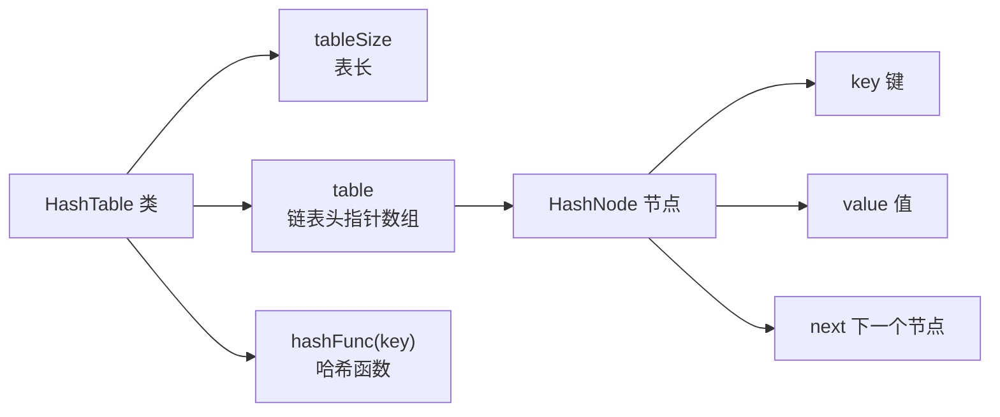
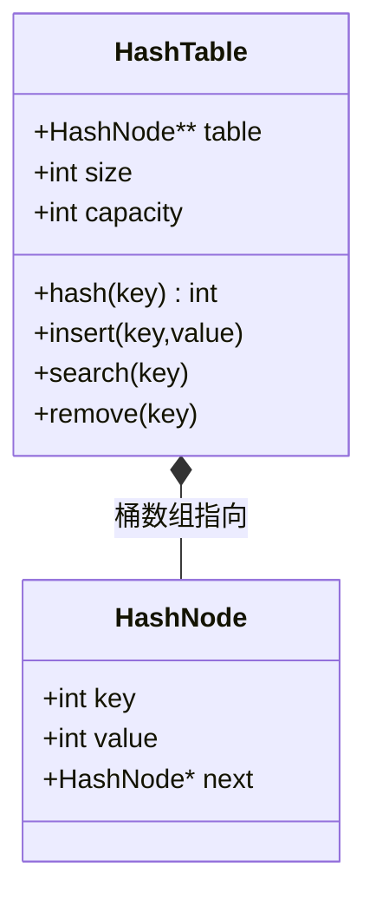
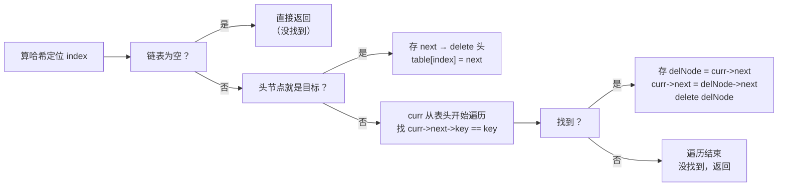

## 本节概述：手写 HashTable 类

上节课讲了哈希表的概念——数组 + 哈希函数 + 链地址法解决冲突，平均 O(1) 查找。

这节课用 C++ 写一个模板化的哈希表类，哈希函数用除留余数法，冲突用链地址法。

## 整体架构



> 三层结构：
> 1. **HashTable** — 表长 + 链表头数组 + 哈希函数
> 2. **HashNode** — 键值对 + next 指针，链表节点
>
> 结构跟邻接表几乎一模一样——顺序表 + 链表。

## 第一步：哈希节点 HashNode

每个节点存 key、value 和 next 指针，用模板支持任意类型。

```cpp
template <typename KeyType, typename ValueType>
struct HashNode {
    KeyType key;
    ValueType value;
    HashNode* next;

    HashNode(const KeyType& k, const ValueType& v)
        : key(k), value(v), next(NULL) {}
};
```

> 两个模板参数：
> - **KeyType** — 键的类型
> - **ValueType** — 值的类型
>
> 构造函数参数用 **const 引用**——避免拷贝大对象，同时保证不被修改。
> next 初始化为 NULL。

## 第二步：HashTable 类定义

```cpp
template <typename KeyType, typename ValueType>
class HashTable {
private:
    int tableSize;               // 哈希表大小
    HashNode<KeyType, ValueType>** table;  // 链表头指针数组（二级指针）

    int hashFunc(const KeyType& key) const;  // 哈希函数

public:
    HashTable(int size);   // 构造函数
    ~HashTable();          // 析构函数

    void insert(const KeyType& key, const ValueType& value);  // 插入
    void remove(const KeyType& key);                           // 删除
    bool find(const KeyType& key, ValueType& value) const;    // 查找
};
```

> 两个私有成员：
> - **tableSize** — 表的长度（槽位数）
> - **table** — 二级指针，每个元素是链表头指针
>
> 三个核心操作：insert / remove / find。

### HashTable 类图



## 哈希函数 hashFunc

除留余数法：key 对表长取模。

```cpp
template <typename KeyType, typename ValueType>
int HashTable<KeyType, ValueType>::hashFunc(const KeyType& key) const {
    int hashKey = key % tableSize;
    if (hashKey < 0) {
        hashKey += tableSize;   // 负数转正数
    }
    return hashKey;
}
```

> 两个 const：
> - `const KeyType& key` — key 不能被修改
> - 函数末尾 `const` — 这个函数不会修改成员变量
>
> 为什么要处理负数？key 可能是负数，取模结果也是负的，但数组下标不能为负。
> 加上 tableSize 偏移一下，保证结果在 [0, tableSize-1] 范围内。

> [!NOTE]
> 这里的 key 直接参与取模运算，所以 KeyType 得是整型（int/long 等）。
> 如果是字符串等非整型，需要先转成整数（字符串哈希），再取模。
> 这节课先讲最简单的整型 key 版本。

## 构造函数

两步：申请指针数组 + 每个头指针置空。

```cpp
template <typename KeyType, typename ValueType>
HashTable<KeyType, ValueType>::HashTable(int size) {
    tableSize = size;
    table = new HashNode<KeyType, ValueType>*[tableSize];
    for (int i = 0; i < tableSize; i++) {
        table[i] = NULL;
    }
}
```

> 初始状态：所有槽位都是空链表（NULL）。
>
> 结构跟邻接表一模一样——数组存头指针，每个头指针管一条链表。

## 析构函数

两步：先释放每条链表，再释放指针数组。

```cpp
template <typename KeyType, typename ValueType>
HashTable<KeyType, ValueType>::~HashTable() {
    // 1. 释放每条链表
    for (int i = 0; i < tableSize; i++) {
        HashNode<KeyType, ValueType>* curr = table[i];
        while (curr != NULL) {
            HashNode<KeyType, ValueType>* next = curr->next;
            delete curr;
            curr = next;
        }
        table[i] = NULL;  // 置空，防止野指针
    }

    // 2. 释放指针数组
    delete[] table;
    table = NULL;
}
```

> [!WARNING]
> 标准释放链表操作：**先存下一个，再删当前**。
> - 先把 curr->next 存到 next
> - delete curr
> - curr = next
>
> 顺序不能反——删了 curr 再取 curr->next 就晚了。
>
> 释放完链表后 table[i] 要置 NULL，不然是野指针。

## 插入 insert

三步：算哈希 → 新建节点 → 头插法插入。

```cpp
template <typename KeyType, typename ValueType>
void HashTable<KeyType, ValueType>::insert(const KeyType& key, const ValueType& value) {
    // 1. 算哈希值，定位槽位
    int index = hashFunc(key);

    // 2. 新建节点
    HashNode<KeyType, ValueType>* newNode =
        new HashNode<KeyType, ValueType>(key, value);

    // 3. 头插法插入
    newNode->next = table[index];
    table[index] = newNode;
}
```

> 头插法两步走：
> 1. 新节点的 next 指向原来的头
> 2. 头指针指向新节点
>
> **头插的好处**：插入永远 O(1)，不需要遍历到链表尾部。
>
> 注意：这个版本允许 key 重复——如果插入相同 key，链上会有两个相同 key 的节点。
> 实际使用中通常要先检查 key 是否已存在，存在就更新 value。这里先简化处理。

## 删除 remove

删除分两种情况：删头节点 / 删中间节点。



```cpp
template <typename KeyType, typename ValueType>
void HashTable<KeyType, ValueType>::remove(const KeyType& key) {
    int index = hashFunc(key);

    // 空链表 → 直接返回
    if (table[index] == NULL) return;

    // 情况一：删头节点
    if (table[index]->key == key) {
        HashNode<KeyType, ValueType>* next = table[index]->next;
        delete table[index];
        table[index] = next;
        return;
    }

    // 情况二：删中间/尾部节点
    HashNode<KeyType, ValueType>* curr = table[index];
    while (curr->next != NULL && curr->next->key != key) {
        curr = curr->next;
    }

    // 找到了
    if (curr->next != NULL) {
        HashNode<KeyType, ValueType>* delNode = curr->next;
        curr->next = delNode->next;
        delete delNode;
    }
}
```

> 删除的标准操作：
> - **删头** — 直接改头指针
> - **删中间** — 前驱节点 curr 跳过要删的节点（curr->next = delNode->next）
>
> 遍历的时候始终站在**前驱位置**检查后继，找到了直接跳过去。

## 查找 find

找到返回 true 并通过引用传出 value，没找到返回 false。

```cpp
template <typename KeyType, typename ValueType>
bool HashTable<KeyType, ValueType>::find(const KeyType& key, ValueType& value) const {
    int index = hashFunc(key);

    // 空链表 → 没找到
    if (table[index] == NULL) return false;

    // 头节点就是目标
    if (table[index]->key == key) {
        value = table[index]->value;
        return true;
    }

    // 遍历链表找
    HashNode<KeyType, ValueType>* curr = table[index];
    while (curr->next != NULL && curr->next->key != key) {
        curr = curr->next;
    }

    // 找到了
    if (curr->next != NULL) {
        value = curr->next->value;
        return true;
    }

    return false;  // 没找到
}
```

> 跟删除的遍历逻辑一样——curr 站在前面，检查 curr->next。
>
> 注意 value 参数是**引用**——找到之后把值填进去，调用者就能拿到了。
> 函数返回 bool 表示找没找到。

> [!TIP]
> 为什么 value 参数没有 const？
> 因为找到之后要给 value 赋值，它是输出参数，会被修改。
> 但函数本身不修改哈希表，所以函数末尾还是有 const。

## 完整代码汇总

```cpp
#include <iostream>
using namespace std;

// ====== 哈希节点 ======
template <typename KeyType, typename ValueType>
struct HashNode {
    KeyType key;
    ValueType value;
    HashNode* next;

    HashNode(const KeyType& k, const ValueType& v)
        : key(k), value(v), next(NULL) {}
};

// ====== 哈希表 ======
template <typename KeyType, typename ValueType>
class HashTable {
private:
    int tableSize;
    HashNode<KeyType, ValueType>** table;

    int hashFunc(const KeyType& key) const;

public:
    HashTable(int size);
    ~HashTable();

    void insert(const KeyType& key, const ValueType& value);
    void remove(const KeyType& key);
    bool find(const KeyType& key, ValueType& value) const;
};

// 哈希函数（除留余数法）
template <typename KeyType, typename ValueType>
int HashTable<KeyType, ValueType>::hashFunc(const KeyType& key) const {
    int hashKey = key % tableSize;
    if (hashKey < 0) hashKey += tableSize;
    return hashKey;
}

// 构造函数
template <typename KeyType, typename ValueType>
HashTable<KeyType, ValueType>::HashTable(int size) {
    tableSize = size;
    table = new HashNode<KeyType, ValueType>*[tableSize];
    for (int i = 0; i < tableSize; i++) {
        table[i] = NULL;
    }
}

// 析构函数
template <typename KeyType, typename ValueType>
HashTable<KeyType, ValueType>::~HashTable() {
    for (int i = 0; i < tableSize; i++) {
        HashNode<KeyType, ValueType>* curr = table[i];
        while (curr != NULL) {
            HashNode<KeyType, ValueType>* next = curr->next;
            delete curr;
            curr = next;
        }
        table[i] = NULL;
    }
    delete[] table;
    table = NULL;
}

// 插入（头插法）
template <typename KeyType, typename ValueType>
void HashTable<KeyType, ValueType>::insert(const KeyType& key, const ValueType& value) {
    int index = hashFunc(key);
    HashNode<KeyType, ValueType>* newNode =
        new HashNode<KeyType, ValueType>(key, value);
    newNode->next = table[index];
    table[index] = newNode;
}

// 删除
template <typename KeyType, typename ValueType>
void HashTable<KeyType, ValueType>::remove(const KeyType& key) {
    int index = hashFunc(key);
    if (table[index] == NULL) return;

    // 删头节点
    if (table[index]->key == key) {
        HashNode<KeyType, ValueType>* next = table[index]->next;
        delete table[index];
        table[index] = next;
        return;
    }

    // 删中间节点
    HashNode<KeyType, ValueType>* curr = table[index];
    while (curr->next != NULL && curr->next->key != key) {
        curr = curr->next;
    }
    if (curr->next != NULL) {
        HashNode<KeyType, ValueType>* delNode = curr->next;
        curr->next = delNode->next;
        delete delNode;
    }
}

// 查找
template <typename KeyType, typename ValueType>
bool HashTable<KeyType, ValueType>::find(const KeyType& key, ValueType& value) const {
    int index = hashFunc(key);
    if (table[index] == NULL) return false;

    // 头节点就是
    if (table[index]->key == key) {
        value = table[index]->value;
        return true;
    }

    // 遍历找
    HashNode<KeyType, ValueType>* curr = table[index];
    while (curr->next != NULL && curr->next->key != key) {
        curr = curr->next;
    }
    if (curr->next != NULL) {
        value = curr->next->value;
        return true;
    }
    return false;
}
```

## main 函数测试

```cpp
int main() {
    HashTable<int, char> ht(10);  // key=int, value=char，表长 10

    // 插入 6 个键值对
    ht.insert(1, 'A');
    ht.insert(4, 'D');
    ht.insert(14, 'N');  // 14%10=4，跟 4 冲突
    ht.insert(7, 'G');
    ht.insert(17, 'Q'); // 17%10=7，跟 7 冲突
    ht.insert(23, 'X'); // 23%10=3

    // 查找测试
    char val;

    if (ht.find(43, val)) {
        cout << "43: " << val << endl;
    } else {
        cout << "43 not found" << endl;  // 没插过 43
    }

    if (ht.find(4, val)) {
        cout << "4: " << val << endl;    // 4: D
    }

    if (ht.find(14, val)) {
        cout << "14: " << val << endl;   // 14: N
    }

    if (ht.find(17, val)) {
        cout << "17: " << val << endl;   // 17: Q
    }

    // 删除测试
    ht.remove(14);
    if (ht.find(14, val)) {
        cout << "14: " << val << endl;
    } else {
        cout << "14 not found (after remove)" << endl;  // 删了，找不到了
    }

    return 0;
}
```

运行结果：

```
43 not found
4: D
14: N
17: Q
14 not found (after remove)
```

> 验证一下：
> - 43 没插过 → not found ✅
> - 4 存在 → D ✅
> - 14 存在（虽然冲突了，但是在链上）→ N ✅
> - 17 存在 → Q ✅
> - 删了 14 之后再找 → not found ✅

## 易错点总结

> [!WARNING]
> 1. **模板类的函数定义要加 template** — 每个成员函数前面都要写 `template <...>`，类名后面也要带 `<KeyType, ValueType>`
> 2. **构造函数参数用 const 引用** — key 和 value 传引用避免拷贝，加 const 保证不修改
> 3. **哈希函数要处理负数** — key 为负时取模结果也是负的，加 tableSize 转正
> 4. **头插法顺序不能反** — 先让新节点 next 指向旧头，再让头指针指向新节点
> 5. **删除要分删头和删中间** — 删头直接改 table[index]，删中间要找前驱
> 6. **释放链表要先存后跳再删** — next = curr->next; delete curr; curr = next;
> 7. **find 的 value 参数是输出参数** — 传引用，找到后赋值，返回 bool 表示成功与否

## 本章小结

**手写哈希表** = 模板化的链表节点（key + value + next）+ 头指针数组 + 除留余数法哈希 + 链地址法。

**核心操作**：
- **hashFunc** — key % tableSize，负数转正，保证下标合法
- **insert** — 算哈希定位，头插法插入新节点，O(1)
- **remove** — 算哈希定位，分删头和删中间两种情况
- **find** — 算哈希定位，遍历链表找，找到通过引用返回 value

**设计要点**：
- 双模板参数，支持任意 key/value 类型
- 二级指针 table 存链表头，结构跟邻接表完全一致
- 哈希函数加 const，find 函数也加 const（不修改成员变量）
- insert/remove 的 key 和 value 都用 const 引用传参
