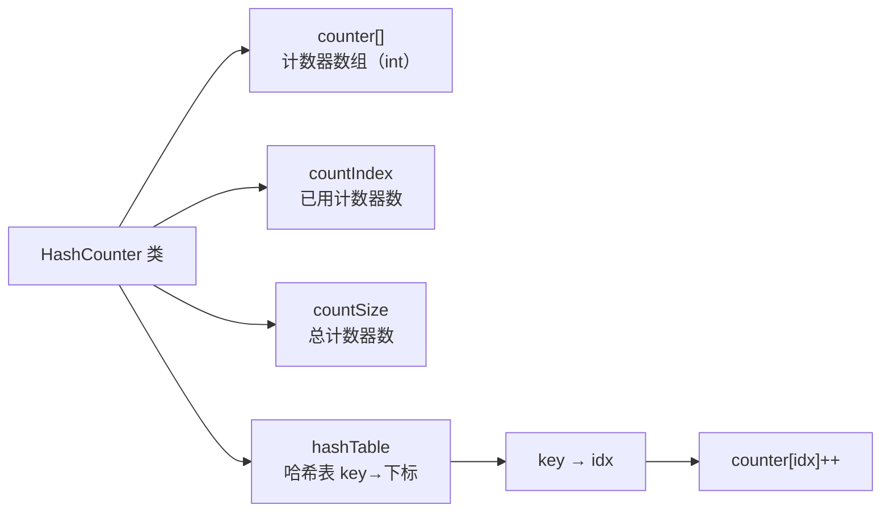
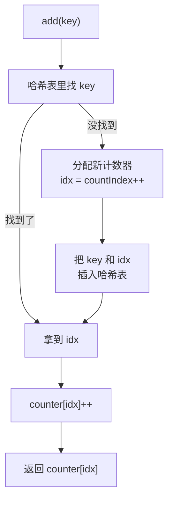

## 本节概述：哈希计数器是什么

哈希计数器 = 哈希表 + 计数器数组。

**核心思路**：用哈希表把 key 映射成数组下标，然后直接用下标操作计数器。这样 key 可以是任意类型，但计数操作却是纯数组的 O(1) 速度。

## 整体架构



> 三层映射：
> 1. **key** → 哈希表 → **数组下标 idx**
> 2. **idx** → 计数器数组 → **counter[idx]**（计数值）
>
> 哈希表负责把任意类型的 key 转成整数下标，计数器数组负责真正存计数。
> 为什么不直接把 value 设成 int 的哈希表？
> 因为计数器数组用起来更直接更高效，而且可以批量清零、批量操作。

## HashNode 和 HashTable 复用

直接复用上节课写的哈希表类，把 ValueType 设成 int 就行（存的是计数器数组的下标）。

```cpp
// 哈希节点（跟上节课一样）
template <typename KeyType, typename ValueType>
struct HashNode {
    KeyType key;
    ValueType value;
    HashNode* next;
    HashNode(const KeyType& k, const ValueType& v)
        : key(k), value(v), next(NULL) {}
};

// 哈希表（跟上节课一样）
template <typename KeyType, typename ValueType>
class HashTable {
    // ... 跟上节课完全一样 ...
};
```

> 哈希表的 key 是计数器的 key，value 是计数器数组的下标（int）。
> 相当于一个**翻译器**——把任意 key 翻译成数组下标。

## HashCounter 类定义

```cpp
template <typename KeyType>
class HashCounter {
private:
    int* counter;            // 计数器数组
    int countIndex;          // 已使用的计数器数量
    int countSize;           // 计数器总数（容量）
    HashTable<KeyType, int>* hashTable;  // key → 下标的哈希表

    void reset();  // 重置哈希表（内部辅助）

public:
    HashCounter(int size);   // 构造函数
    ~HashCounter();          // 析构函数

    void resetAll();         // 重置所有计数器
    int add(const KeyType& key);    // key 的计数 +1，返回新值
    int sub(const KeyType& key);    // key 的计数 -1，返回新值
    int get(const KeyType& key);    // 获取 key 的计数值
};
```

> 只有一个模板参数 **KeyType** —— value 固定是 int（计数器嘛）。
>
> 四个核心操作：
> - **add** — 给某个 key 的计数 +1
> - **sub** — 给某个 key 的计数 -1
> - **get** — 查某个 key 的计数是多少
> - **resetAll** — 全部清零重来

## 辅助函数 reset

重新申请哈希表，清空计数器。

```cpp
template <typename KeyType>
void HashCounter<KeyType>::reset() {
    // 1. 如果之前有哈希表，先删掉
    if (hashTable != NULL) {
        delete hashTable;
        hashTable = NULL;
    }

    // 2. 新建一个哈希表，大小跟计数器数组一样
    hashTable = new HashTable<KeyType, int>(countSize);

    // 3. 所有计数器清零
    for (int i = 0; i < countSize; i++) {
        counter[i] = 0;
    }

    // 4. 已用计数器归零
    countIndex = 0;
}
```

> 构造函数和 resetAll 都会调用它。
> 每次 reset 相当于"格式化"——全部清零，重新开始计数。

## 构造函数

```cpp
template <typename KeyType>
HashCounter<KeyType>::HashCounter(int size) {
    countSize = size;                // 总容量
    countIndex = 0;                  // 一开始一个都没用
    counter = new int[countSize];    // 申请计数器数组
    hashTable = NULL;                // 哈希表先置空
    reset();                         // 调用 reset 完成初始化
}
```

> 初始化三步：设总容量 → 申请数组 → reset 清零。
> 哈希表的大小跟计数器数组一样大——最多有 countSize 个不同的 key。

## 析构函数

```cpp
template <typename KeyType>
HashCounter<KeyType>::~HashCounter() {
    delete[] counter;     // 释放计数器数组
    delete hashTable;     // 释放哈希表
    counter = NULL;
    hashTable = NULL;
}
```

> 两个东西要释放：计数器数组 + 哈希表对象。

## 重置全部 resetAll

```cpp
template <typename KeyType>
void HashCounter<KeyType>::resetAll() {
    reset();
}
```

> 外部调用的重置接口，直接调用私有 reset 就行。
> 调用之后所有计数器清零，哈希表清空，相当于全新的。

## add — 给 key 的计数 +1

三步：找 key → 没找到分配新计数器 → 计数自增返回。



```cpp
template <typename KeyType>
int HashCounter<KeyType>::add(const KeyType& key) {
    int idx;

    // 1. 去哈希表里找
    if (!hashTable->find(key, idx)) {
        // 2. 没找到 → 分配新计数器
        idx = countIndex++;
        hashTable->insert(key, idx);
    }

    // 3. 计数自增，返回新值
    counter[idx]++;
    return counter[idx];
}
```

> 流程很清晰：
> 1. 先在哈希表里找 key，看有没有分配过计数器
> 2. 没找到 → 用 countIndex 当下标，分配一个新的，然后 countIndex++
> 3. 找到了 → 直接用之前的 idx
> 4. counter[idx]++，返回新值

> [!TIP]
> **第一次遇到某个 key 时**：
> - 自动分配一个计数器（从 0 开始递增分配）
> - 把 key → idx 的映射插进哈希表
>
> **以后再遇到同一个 key**：
> - 哈希表里直接查到 idx
> - 操作 counter[idx] 就行
>
> 这就是"懒分配"——用到了才分配，不用不占。

## sub — 给 key 的计数 -1

跟 add 类似，只是找不到就直接返回 0（没加过就减不了）。

```cpp
template <typename KeyType>
int HashCounter<KeyType>::sub(const KeyType& key) {
    int idx;

    // 找不到 → 直接返回 0
    if (!hashTable->find(key, idx)) {
        return 0;
    }

    // 找到了 → 自减返回
    counter[idx]--;
    return counter[idx];
}
```

> 比 add 简单——不用分配新计数器。
> 没找到说明这个 key 从来没加过，返回 0 就行。

## get — 获取 key 的计数值

跟 sub 几乎一样，只是不减。

```cpp
template <typename KeyType>
int HashCounter<KeyType>::get(const KeyType& key) {
    int idx;

    if (!hashTable->find(key, idx)) {
        return 0;
    }

    return counter[idx];
}
```

> 查找而已，不修改计数。
> 没找到返回 0（没出现过就是 0 次）。

## 完整代码汇总

```cpp
// ====== 哈希节点 ======
template <typename KeyType, typename ValueType>
struct HashNode {
    KeyType key;
    ValueType value;
    HashNode* next;

    HashNode(const KeyType& k, const ValueType& v)
        : key(k), value(v), next(NULL) {}
};

// ====== 哈希表 ======
template <typename KeyType, typename ValueType>
class HashTable {
private:
    int tableSize;
    HashNode<KeyType, ValueType>** table;
    int hashFunc(const KeyType& key) const;

public:
    HashTable(int size);
    ~HashTable();

    void insert(const KeyType& key, const ValueType& value);
    void remove(const KeyType& key);
    bool find(const KeyType& key, ValueType& value) const;
};

// ... HashTable 实现跟上节课完全一样 ...
// （为了节省篇幅这里省略，直接复用上节课的代码）

// ====== 哈希计数器 ======
template <typename KeyType>
class HashCounter {
private:
    int* counter;
    int countIndex;
    int countSize;
    HashTable<KeyType, int>* hashTable;

    void reset();

public:
    HashCounter(int size);
    ~HashCounter();

    void resetAll();
    int add(const KeyType& key);
    int sub(const KeyType& key);
    int get(const KeyType& key);
};

// 重置（私有辅助）
template <typename KeyType>
void HashCounter<KeyType>::reset() {
    if (hashTable != NULL) {
        delete hashTable;
        hashTable = NULL;
    }
    hashTable = new HashTable<KeyType, int>(countSize);
    for (int i = 0; i < countSize; i++) {
        counter[i] = 0;
    }
    countIndex = 0;
}

// 构造函数
template <typename KeyType>
HashCounter<KeyType>::HashCounter(int size) {
    countSize = size;
    countIndex = 0;
    counter = new int[countSize];
    hashTable = NULL;
    reset();
}

// 析构函数
template <typename KeyType>
HashCounter<KeyType>::~HashCounter() {
    delete[] counter;
    delete hashTable;
    counter = NULL;
    hashTable = NULL;
}

// 重置全部
template <typename KeyType>
void HashCounter<KeyType>::resetAll() {
    reset();
}

// 自增
template <typename KeyType>
int HashCounter<KeyType>::add(const KeyType& key) {
    int idx;
    if (!hashTable->find(key, idx)) {
        idx = countIndex++;
        hashTable->insert(key, idx);
    }
    counter[idx]++;
    return counter[idx];
}

// 自减
template <typename KeyType>
int HashCounter<KeyType>::sub(const KeyType& key) {
    int idx;
    if (!hashTable->find(key, idx)) {
        return 0;
    }
    counter[idx]--;
    return counter[idx];
}

// 获取
template <typename KeyType>
int HashCounter<KeyType>::get(const KeyType& key) {
    int idx;
    if (!hashTable->find(key, idx)) {
        return 0;
    }
    return counter[idx];
}
```

> [!NOTE]
> HashTable 的完整代码跟上节课一模一样，这里就不重复贴了。
> 实际使用时把上节课的 HashTable 完整代码放前面就行。

## main 函数测试

```cpp
int main() {
    HashCounter<int> hc(100);  // 最多 100 个不同的 key

    // 14 自增 5 次
    hc.add(14);  // 1
    hc.add(14);  // 2
    hc.add(14);  // 3
    hc.add(14);  // 4
    hc.add(14);  // 5

    // 14 自减 1 次
    hc.sub(14);  // 4

    cout << "14 的计数：" << hc.get(14) << endl;  // 4
    cout << "99 的计数：" << hc.get(99) << endl;  // 0（没出现过）

    // 其他 key 也试试
    hc.add(7);
    hc.add(7);
    cout << "7 的计数：" << hc.get(7) << endl;   // 2

    // 重置
    hc.resetAll();
    cout << "重置后 14 的计数：" << hc.get(14) << endl;  // 0

    return 0;
}
```

运行结果：

```
14 的计数：4
99 的计数：0
7 的计数：2
重置后 14 的计数：0
```

> 验证：
> - 14 加了 5 次减了 1 次 → 4 ✅
> - 99 没出现过 → 0 ✅
> - 7 加了 2 次 → 2 ✅
> - 重置后 14 变成 0 ✅

## 易错点总结

> [!WARNING]
> 1. **HashTable 的 ValueType 是 int** — 哈希表存的是计数器数组的下标，不是计数本身，别搞混了
> 2. **countIndex 从 0 开始分配** — 每次新 key 用 countIndex，用完再 ++，跟 top 指针逻辑一样
> 3. **add 才分配计数器** — sub 和 get 找不到直接返回 0，不会自动分配
> 4. **counter 数组要先清零** — 新申请的内存是垃圾值，必须手动 memset 或循环清零
> 5. **析构要释放两部分** — counter 数组 + hashTable 对象，一个都不能少
> 6. **reset 先删旧的再建新的** — 不然旧哈希表内存泄漏

## 本章小结

**哈希计数器** = 哈希表（key→下标）+ 计数器数组（存实际计数），是哈希表的经典应用。

**核心映射**：key → 哈希表 → idx → counter[idx]

**四个操作**：
- **add** — 查哈希表，没找到就分配新计数器，然后 counter[idx]++
- **sub** — 查哈希表，找不到返回 0，找到了 counter[idx]--
- **get** — 查哈希表，找不到返回 0，找到了返回 counter[idx]
- **resetAll** — 哈希表清空，计数器全部清零，重新开始

**设计思想**：
- 用哈希表解决"任意类型 key → 整数下标"的翻译问题
- 用纯数组存计数，操作高效且方便批量清零
- 计数器懒分配——遇到了才分配，不用不占
