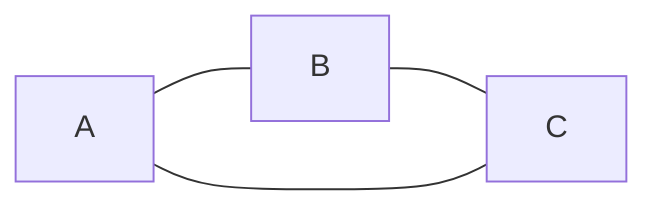
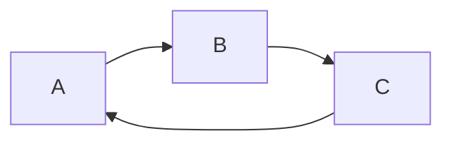
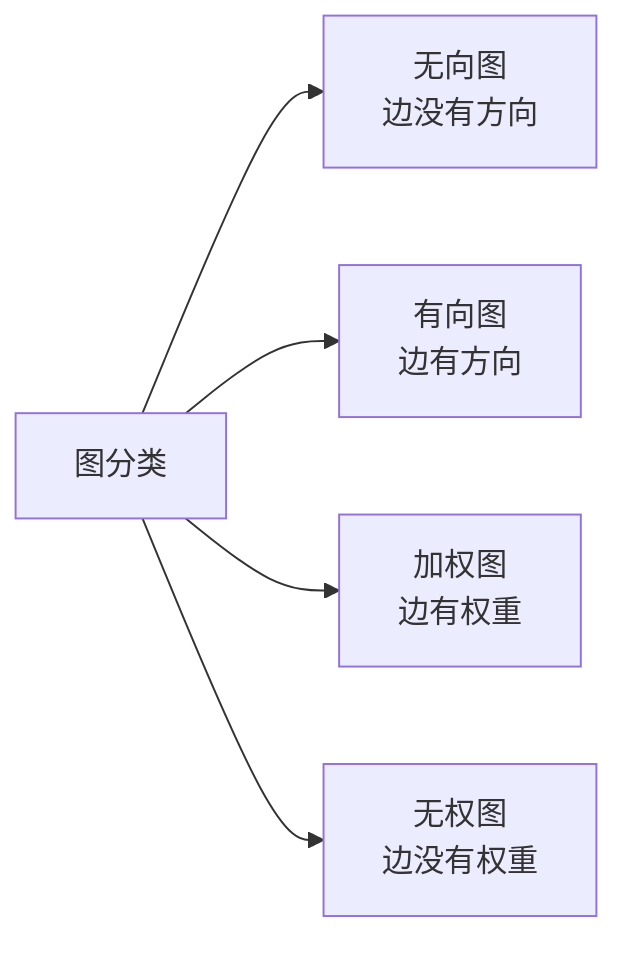
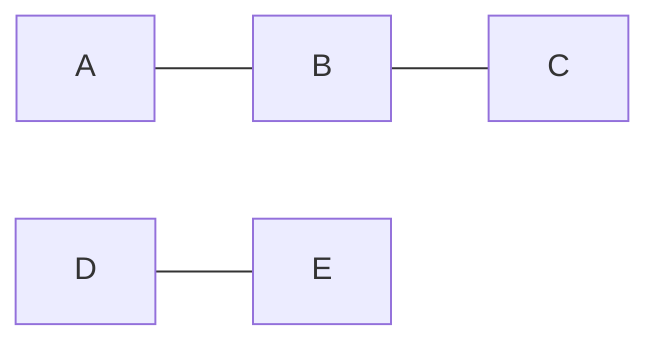

## 本节概述：图是什么

前面学了线性表、树，都是一对多的关系。这节课学**图（Graph）**——多对多的关系，任意两个顶点之间都可以相连。

图是数据结构里最复杂也最有用的结构之一，很多实际问题都可以抽象成图来解决。

## 图的定义

图由**顶点（Vertex）**和**边（Edge）**组成。

表示方法：**G = (V, E)**
- **V** — 顶点的有穷非空集合（顶点不能是空的）
- **E** — 边的集合（边可以是空的）

| 数据结构 | 数据元素叫什么 | 关系 |
|---|---|---|
| 线性表 | 元素 | 一对一（前后） |
| 树 | 节点 | 一对多（父子） |
| 图 | 顶点 | 多对多（任意连） |

> 图里不叫元素也不叫节点，叫**顶点**，注意区分。

## 有向图 vs 无向图

### 无向图

边没有方向，表示**双向关系**。



> 比如朋友关系：我是你的朋友，你也是我的朋友。双向的。

无向边的表示：**(A, B)** — 用小括号，A 和 B 之间有条无向边。

### 有向图

边有方向（箭头），表示**单向关系**。有向边也叫**弧（Arc）**。



> 比如关注关系：我关注你，不代表你关注我。单向的。

有向边的表示：**<A, B>** — 用尖括号，从 A 指向 B。
- **弧头** — 箭头指向的那端（终点 B）
- **弧尾** — 箭头出发的那端（起点 A）

| 类型 | 边的方向 | 表示方式 | 例子 |
|---|---|---|---|
| 无向图 | 无方向，双向 | (v, w) | 朋友、邻居 |
| 有向图 | 有方向，单向 | <v, w> | 关注、引用 |

### 图的分类对比



## 稀疏图 vs 稠密图 vs 完全图

按边的多少来分：

- **稀疏图** — 边很少，顶点之间连接稀疏
- **稠密图** — 边很多，顶点之间连接紧密
- **完全图** — 边最多的情况，每个顶点都和其他所有顶点相连

**无向完全图** — n 个顶点，有 n(n-1)/2 条边。
**有向完全图** — n 个顶点，有 n(n-1) 条边（双向都要有）。

> 完全图一定是稠密图——边已经满了，不能再多了。

## 简单图

满足两个条件的图叫简单图：
1. **没有自环** — 顶点不会有一条边连回自己
2. **没有重边** — 两个顶点之间不会有多条相同的边

> 我们平时讨论的图基本都是简单图。
> 有自环或重边的图叫多重图，用得比较少。

## 度（Degree）

顶点的度 = 与该顶点直接相连的边的数量。

### 无向图的度

就是连接这个顶点的边数，记为 **TD(v)**。

```
  A --- B
 / \
C   D
```
- A 的度 = 3（连了 B、C、D）
- B 的度 = 1
- C 的度 = 1
- D 的度 = 1

> 无向图中，所有顶点的度数之和 = 边数 × 2
> 因为每条边贡献两个度（两个端点各算一个）。

### 有向图的度

分两种：
- **入度（ID）** — 指向该顶点的边数（进来的箭头）
- **出度（OD）** — 从该顶点指出去的边数（出去的箭头）

总度数 = 入度 + 出度

```
  A --> B
  ^     |
  |     v
  D <-- C
```
- A：入度 1，出度 1，总度 2
- B：入度 1，出度 1，总度 2
- C：入度 1，出度 1，总度 2
- D：入度 1，出度 1，总度 2

> 有向图中，所有顶点入度之和 = 所有顶点出度之和 = 边数
> 因为每条边贡献一个出度和一个入度。

> [!TIP]
> 度的概念在拓扑排序里非常重要——入度为 0 的点就是起点。

## 权（Weight）

有些图的边上会附带信息，叫**权**或**权重**。

权可以表示：
- 距离（两地之间的公里数）
- 成本（走这条路要花多少钱）
- 时间（需要多久）
- 容量（最多能通过多少流量）

带权的图叫**网（Network）**。

```
  A --10-- B
  |        |
  5        8
  |        |
  C --15-- D
```

> 边上的数字就是权，比如 A 到 B 距离是 10。

## 路径（Path）

路径 = 从一个顶点到另一个顶点，经过的一系列连续的边。

比如上面的图，A 到 D 就有两条路径：
- A → B → D（长度 10+8 = 18）
- A → C → D（长度 5+15 = 20）

最短路径问题就是找总权重最小的那条路。

常见最短路径算法：Dijkstra、Bellman-Ford、Floyd、SPFA 等等。

## 连通图和连通分量

### 无向图

- **连通图** — 图中任意两个顶点之间都存在路径
- **连通分量** — 图中的极大连通子图。一张不连通的图可以分成好几块，每块就是一个连通分量



> 上面这张图有两个连通分量：{A, B, C} 和 {D, E}。

**极大连通子图**的"极大"——不能再往里加顶点了，再加就不连通了。

### 有向图

- **强连通图** — 任意两个顶点 A 和 B，A 到 B 有路径，B 到 A 也有路径（双向都通）
- **强连通分量** — 有向图中的极大强连通子图

> 注意区分：无向图说"连通"，有向图说"强连通"。

## 生成树（Spanning Tree）

连通图的生成树 = 包含所有顶点 + 是一棵树（n 个顶点 n-1 条边 + 无环）。

简单说：**从连通图里挑出 n-1 条边，把所有顶点连起来，而且不能有环。**

生成树的应用：
- 图的遍历（DFS、BFS 生成树）
- 最小生成树（总权重最小的生成树）

常见最小生成树算法：Kruskal（克鲁斯卡尔，用到并查集）、Prim（普里姆）。

## 图的相关算法一览

| 算法类别 | 代表算法 | 用途 |
|---|---|---|
| 图的遍历 | DFS、BFS | 遍历所有顶点 |
| 最短路径 | Dijkstra、Bellman-Ford、Floyd、SPFA | 求两点间最短路径 |
| 最小生成树 | Kruskal、Prim | 求总权最小的生成树 |
| 拓扑排序 | Kahn 算法、DFS | 有向无环图排序 |
| 强连通分量 | Tarjan、Kosaraju | 找强连通分量 |
| 并查集 | Union-Find | 判断连通性、Kruskal 辅助 |

> [!NOTE]
> 这些概念不用死记硬背——学图算法的时候自然而然就记住了。
> 现在先有个印象，知道图是怎么回事就行。

## 本章小结

**图** = 顶点 + 边，多对多关系，表示为 G = (V, E)。

**分类**：
- **有向图 / 无向图** — 边有没有方向，单向 vs 双向
- **稀疏图 / 稠密图 / 完全图** — 边少、边多、边最多
- **简单图** — 没有自环和重边

**核心概念**：
- **度** — 无向图就一个度；有向图分入度和出度
- **权** — 边上的附加信息（距离、成本等），带权图叫网
- **路径** — 顶点之间的通路，最短路径是经典问题
- **连通图 / 连通分量** — 任意两点都有路叫连通；分成几块每块叫一个分量
- **生成树** — 包含所有顶点的树，n 个顶点 n-1 条边

**常见算法**：DFS/BFS 遍历、Dijkstra 最短路径、Kruskal/Prim 最小生成树、拓扑排序、强连通分量等。
