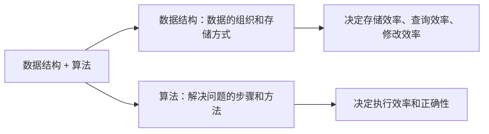
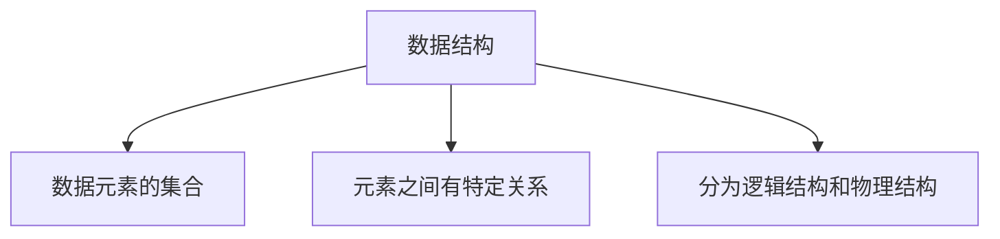
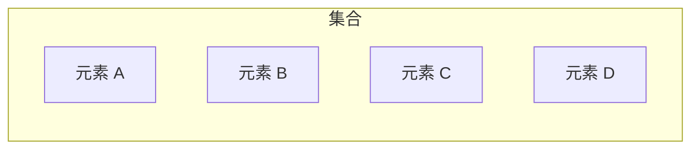
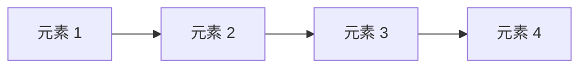
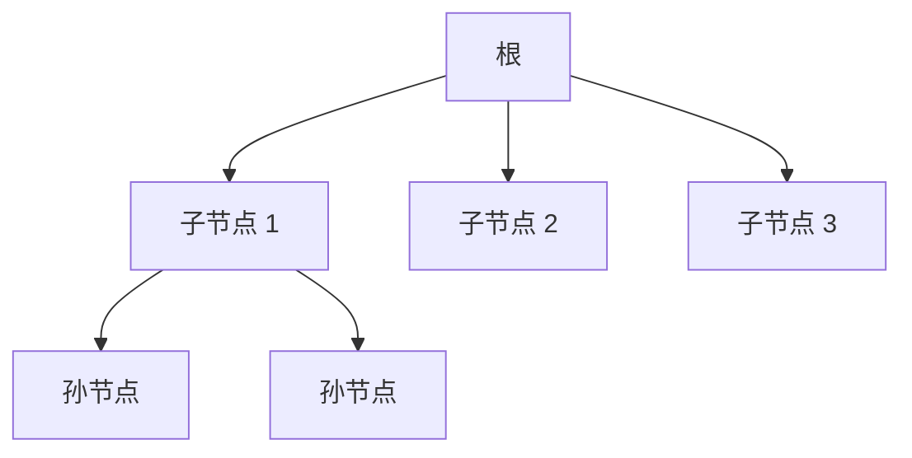
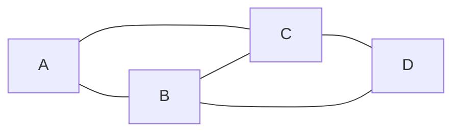
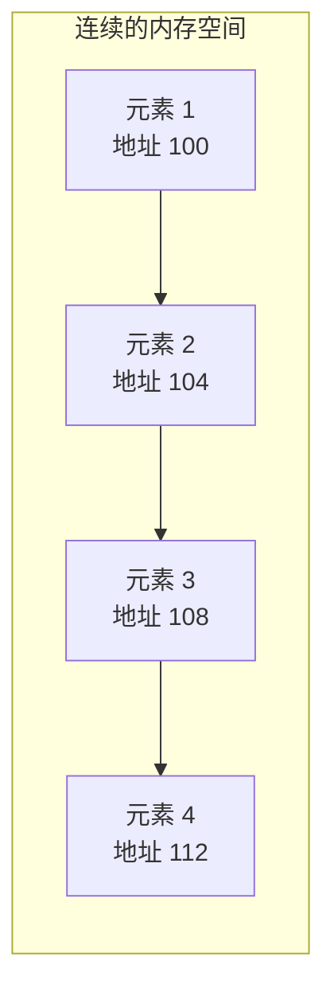
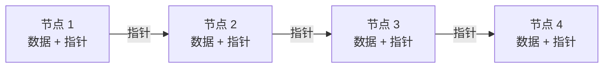

## 本节概述：数据结构到底学什么

数据结构和算法是计算机科学里两个最重要的概念——相辅相成，缺一不可。

简单说：
- **数据结构** = 数据怎么存（容器）
- **算法** = 对数据怎么操作（增删改查的过程）

## 数据是什么

**数据**是描述客观事物的符号，是计算机中可以操作的对象。

不只是数字——整数、小数、字符是数据，声音、图像、视频也是数据（通过编码转成字符处理）。

数据满足两个特点：
1. 可以输入到计算机中
2. 能被计算机程序处理

## 结构是什么

**结构**简单理解就是**关系**。

比如分子结构——说的是原子之间的排列方式。

那**数据结构**就是：**不同数据相互之间存在一种或多种特定关系的元素的集合**。

说人话就是——数据不是乱七八糟堆在一起的，它们之间有组织、有联系。

数据结构分两大类：
- **逻辑结构** — 数据之间的逻辑关系（用户看到的样子）
- **物理结构** — 数据在计算机里怎么存（实际存储方式）

## 四种逻辑结构

逻辑结构描述的是数据元素之间的逻辑关系，跟实际怎么存储无关。

一共有四种基本类型：

### 1. 集合结构

数据元素之间没有固定顺序，只是属于同一个集合。

特点：除了"同属一个集合"，没啥别的关系。

### 2. 线性结构

数据元素之间是**一对一**的线性关系。

特点：一个跟着一个，像排队一样。比如数组、链表、栈、队列都是线性结构。

### 3. 树状结构

数据元素之间是**一对多**的层次关系。

特点：一个父节点可以有多个子节点，像一棵倒过来的树。

### 4. 图形结构

数据元素之间是**多对多**的任意关系。

特点：任何节点之间都可能有关系，像一张网。

## 两种物理结构（存储结构）

物理结构又叫存储结构——指的是数据在计算机内存中实际怎么存。

只有两种：**顺序存储**和**链式存储**。

### 1. 顺序存储

数据元素按顺序存在**连续的内存空间**里。

C/C++ 里的**数组**就是典型的顺序存储。

**优点**：通过下标（索引）可以直接找到数据，访问速度快。
**缺点**：插入删除麻烦，要移动一大堆数据。

### 2. 链式存储

数据元素存在**任意**的内存位置，无所谓连不连续——然后用指针把它们串起来。

**链表**就是典型的链式存储。

**优点**：插入删除方便，只要改指针就行。
**缺点**：访问数据得从头一个一个找，不能直接定位。

## 数据结构和算法的关系

最后再总结一下两者的关系：

| | 数据结构 | 算法 |
|---|---|---|
| 是什么 | 数据怎么存（容器） | 数据怎么操作（步骤） |
| 解决什么 | 存储效率 | 执行效率 |
| 关系 | 算法要选择合适的数据结构 | 数据结构为算法服务 |

> 用老师的话说：**数据结构就像是一个容器，对容器里的元素执行增删改查的过程，我们称之为算法。**

所以学数据结构的时候，你也在学算法——两者是绑定在一起的。

## 本章小结

**数据结构**是数据的组织和存储方式，分为逻辑结构和物理结构。

**四种逻辑结构**：
1. **集合结构** — 同属一个集合，没有其他关系
2. **线性结构** — 一对一，像排队
3. **树状结构** — 一对多，像倒过来的树
4. **图形结构** — 多对多，像一张网

**两种物理结构**：
1. **顺序存储** — 连续内存，数组为代表，下标访问快
2. **链式存储** — 任意位置用指针串，链表为代表，插入删除快

后续我们先学两种最基础的数据结构——**顺序表和链表**，深入理解顺序存储和链式存储。

