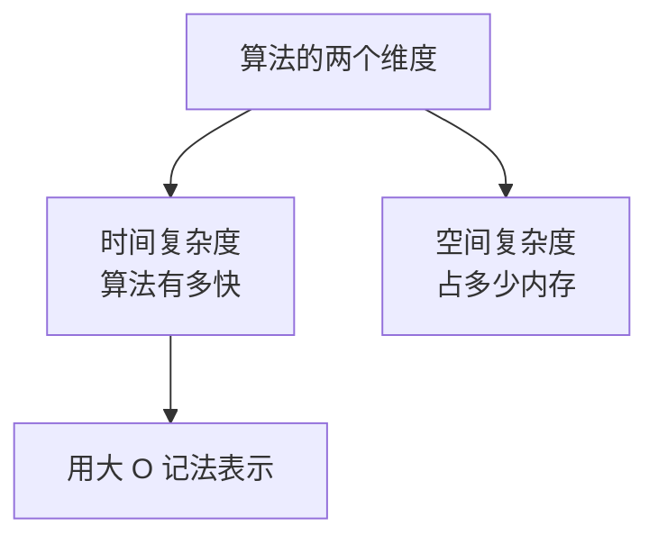
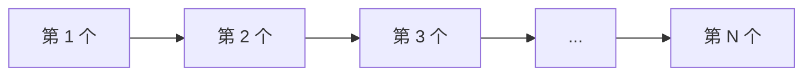
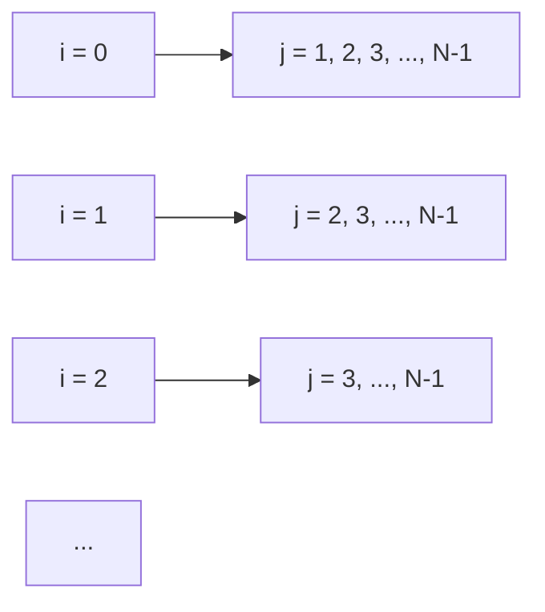
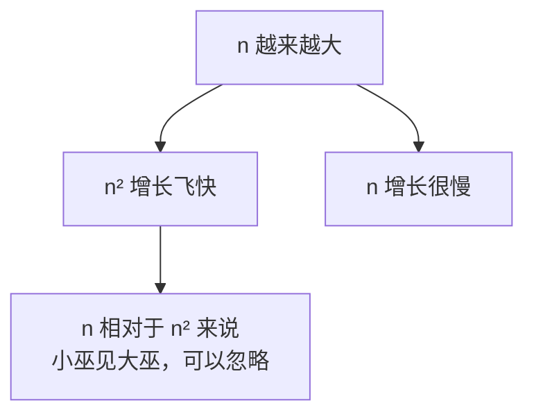
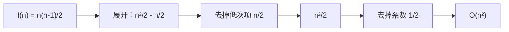
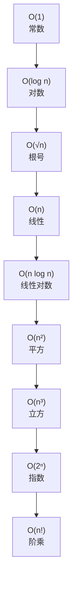

## 本节概述：算法快慢怎么衡量

很多人觉得算法难——难就难在被困在了时间和空间两个维度上。如果不考虑时间和空间，所有问题都能用穷举法暴力解决。

但现实是，时间和空间都是有限的。所以我们需要**时间复杂度**来衡量一个算法的快慢。



## 从穷举法说起

**穷举法**（也叫枚举法）就是把所有情况都遍历一遍，一个一个检查。

最简单的例子：给定 N 个元素，求其中有多少个奇数。

思路很简单：
1. 遍历所有数
2. 每个数判断是不是奇数
3. 是就计数器加一
4. 最后返回计数器

```cpp
int countOdd(int a[], int n)
{
    int count = 0;
    for (int i = 0; i < n; i++)
    {
        if (a[i] % 2 == 1)  // 判断是不是奇数
        {
            count++;
        }
    }
    return count;
}
```

这就是最简单的穷举——一层循环，遍历 N 个元素。

**时间复杂度：O(N)** — N 越大，越耗时。



## 二重循环：O(N²)

问题升级：给定 N 个元素，求有多少个二元组满足 A[i] + A[j] 是奇数。

还是穷举的思路：
- 第一层循环确定 A[i]
- 第二层循环确定 A[j]
- 判断两数之和是不是奇数

```cpp
// 只是示意，不用纠结细节
for (int i = 0; i < n; i++)
    for (int j = i + 1; j < n; j++)
        if ((a[i] + a[j]) % 2 == 1)
            count++;
```

执行次数大约是 N×(N-1)/2，也就是大概 N²/2 次。

**时间复杂度：O(N²)** — 平方级别。



## 三重循环：O(N³)

再升级：三元组的和是不是奇数。

三层循环嵌套，执行次数大约是 N³/6。

**时间复杂度：O(N³)** — 立方级别。

> 发现规律了吗？几层循环，就是 N 的几次方。嵌套是乘法关系。

## 大 O 记法

时间复杂度用**大 O 记法**来表示，记作 O(f(n))。

| 循环层数 | 执行次数约为 | 时间复杂度 | 级别 |
|---|---|---|---|
| 1 层 | N | O(N) | 线性 |
| 2 层 | N²/2 | O(N²) | 平方 |
| 3 层 | N³/6 | O(N³) | 立方 |

你可能会问：二重循环是 N²/2，为什么不写 O(N²/2)，而是 O(N²)？

好问题——这就涉及到一个核心概念：**高阶无穷小**。

## 为什么要忽略系数和低阶项

以二重循环为例，精确的执行次数是：

```
f(n) = n(n-1)/2 = (n² - n)/2 = n²/2 - n/2
```

这里有两部分：n² 的部分和 n 的部分。

当 n 越来越大的时候，哪个更大？



n = 100 时：n² = 10000，n = 100，差 100 倍
n = 10000 时：n² = 1亿，n = 10000，差 10000 倍

n 越大，n 这部分相对于 n² 就越微不足道——所以直接忽略掉。

同样，前面的系数 1/2 也可以忽略——因为时间复杂度描述的是**数量级**，不是精确时间。

> 通俗理解：时间复杂度只关心"最高次的那一项"，低次项和系数全部可以丢掉。

所以：
- n²/2 - n/2 → **O(n²)**
- n³/6 - ... → **O(n³)**
- 2n + 3 → **O(n)**



## 常见的时间复杂度

从小到大排个序：



越往左越快，越往右越慢。

### 1. O(1) — 常数级

没有循环，直接返回结果。

```cpp
int getFirst(int a[])
{
    return a[0];  // 不管数组多大，一步搞定
}
```

最简单，最快。

### 2. O(log n) — 对数级

经典例子：**二分查找**。

在有序数组里找一个数，每次猜中间，不对就砍掉一半——每次搜索范围除以 2。

n = 100 万，也只需要查 20 次左右。

> 可以先不用理解具体怎么实现，只要知道：**二分查找是 O(log n)，非常快。**

### 3. O(√n) — 根号级

经典例子：**判断一个数是不是素数**。

朴素做法从 2 遍历到 n，O(n)。

优化后只需要遍历到 √n——因为如果 n 有一个因子 s，那另一个因子就是 n/s，其中必有一个 ≤ √n。所以只需要查到 √n 就行。

```cpp
bool isPrime(int n)
{
    if (n <= 1) return false;
    for (int i = 2; i * i <= n; i++)  // 只查到根号 n
        if (n % i == 0) return false;
    return true;
}
```

### 4. O(n) — 线性级

一层循环，遍历一遍。前面的"统计奇数个数"就是 O(n)。

### 5. O(n log n) — 线性对数级

比如快速排序、归并排序。后面学排序的时候会详细讲。

### 6. O(n²) — 平方级

二重循环，冒泡排序、选择排序都是这个级别。

### 7. O(n³) — 立方级

三重循环。

### 8. O(2ⁿ) — 指数级

比如子集枚举——每个元素选或不选，总共 2ⁿ 种情况。

n = 20 就有 100 万，n = 30 就有 10 亿——非常慢。

### 9. O(n!) — 阶乘级

比如全排列问题。n 个元素的排列有 n! 种。

n = 12 就已经接近 5 亿了——基本只能暴力枚举很小的 n。

## 怎么判断算法能不能过

做算法题有个经验法则：**10⁶ 次操作是个坎**。

超过 10⁶（一百万）次，时间复杂度就偏高了，很可能超时。

根据题目给的数据规模 N，可以反推大概需要什么级别的算法：

| N 的范围 | 可能的时间复杂度 |
|---|---|
| N ≤ 12 | O(n!) 阶乘级 |
| N ≤ 16 | O(2ⁿ) 指数级 |
| N ≤ 30 | O(n⁴) 四次方 |
| N ≤ 100 | O(n³) 立方级 |
| N ≤ 1000 | O(n²) 平方级 |
| N ≤ 10 万 | O(n log n) 线性对数 |
| N ≤ 100 万 | O(n) 线性 / O(√n) 根号 |

> 这只是经验值，不是绝对的。具体还要看题目时间限制和代码写得好不好。但刷题刷多了，你自然就有感觉了。

## 本章小结

**时间复杂度**用来衡量算法的快慢，用大 O 记法表示。

**核心规则**：
- 只看最高次项，忽略低次项和系数
- 一层循环 O(n)，两层 O(n²)，三层 O(n³)
- 几重循环就是 n 的几次方

**常见复杂度排序**（从快到慢）：
O(1) < O(log n) < O(√n) < O(n) < O(n log n) < O(n²) < O(n³) < O(2ⁿ) < O(n!)

**经验法则**：10⁶ 次操作是个坎，超过了就容易超时。

