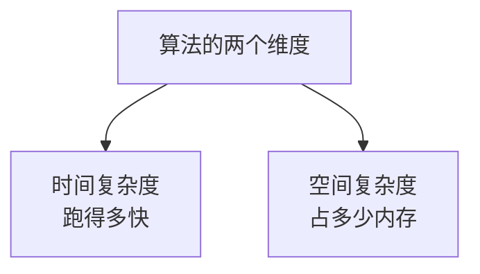
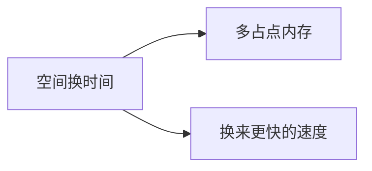
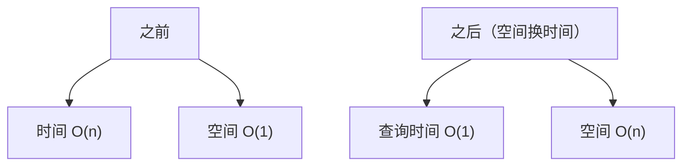

## 本节概述：算法占多少内存

上节课我们学了时间复杂度——衡量算法有多快。

这节课学**空间复杂度**——衡量算法要占多少内存。

算法难，就难在时间和空间这两个维度上。两者合在一起，就是衡量算法好坏的核心指标。



## 空间复杂度是什么

**空间复杂度**是指算法在执行过程中，**额外**需要的存储空间。

注意"额外"两个字——题目给你的数据（比如输入的数组）不算，算法自己额外开辟的才算。


举个例子：题目给了你一个 N 个元素的数组，让你做一些操作。如果你只用几个变量，不需要其他额外空间——空间复杂度就是 **O(1)**。

> 输入数据的空间不算，因为那是题目给的，不是你算法多占的。你自己额外开的才算。

空间复杂度包括：
- 算法运行时使用的变量
- 额外开的数组、链表等数据结构
- 递归调用栈的深度（后面学递归会讲）

## 常见数据结构的空间复杂度

| 数据结构 | 空间复杂度 | 说明 |
|---|---|---|
| 顺序表（数组） | O(n) | n 是元素个数 |
| 链表 | O(n) | n 是节点个数 |
| 栈 / 队列 | O(n) | n 是元素个数 |
| 哈希表 | O(n) | n 是元素个数 |
| 树 | O(n) | n 是节点个数 |
| 图 | O(n + m) | n 是顶点数，m 是边数 |

> 大部分数据结构都是 O(n) 的——有多少数据就占多少空间。图特殊一点，因为顶点和边都要存。

## 空间换时间

空间复杂度里有个非常重要的思想——**空间换时间**。

什么意思？就是**用更多的内存，来换取更快的速度**。



最经典的例子就是动态规划。比如求斐波那契数列第 N 项：

### 不用额外空间

每次要的时候现算，用循环从前往后推：

```cpp
int fib(int n)
{
    if (n <= 1) return n;
    int a = 0, b = 1;
    for (int i = 2; i <= n; i++)
    {
        int c = a + b;
        a = b;
        b = c;
    }
    return b;
}
```

- 时间复杂度：O(n)
- 空间复杂度：O(1)（只用了几个变量）

查一次的话这样就够了。但如果要查很多次呢？每次都从第 2 项算到第 n 项，就很慢了。

### 用数组存结果（空间换时间）

提前把所有结果都算出来存在数组里，以后要查直接拿：

```cpp
int fib[10000];  // 预先存好所有结果

void preFib(int n)
{
    fib[0] = 0;
    fib[1] = 1;
    for (int i = 2; i <= n; i++)
    {
        fib[i] = fib[i-1] + fib[i-2];
    }
}

int getFib(int n)
{
    return fib[n];  // 直接返回，O(1)
}
```

- 时间复杂度：预处理 O(n)，查询 O(1)
- 空间复杂度：O(n)（多开了一个数组）



看到了吗？多花了 O(n) 的空间，把查询时间从 O(n) 降到了 O(1)——这就是**空间换时间**。

> 实际开发中，内存通常是比较充足的，而时间是用户能直接感受到的。所以很多时候我们愿意多花点内存，让程序跑得更快。

## 时间和空间怎么选

设计算法的时候，时间和空间往往是一对矛盾——你想更快，可能就得占更多内存；你想省内存，可能就得更慢。

| 策略 | 优点 | 缺点 |
|---|---|---|
| 时间优先 | 跑得快 | 占内存多 |
| 空间优先 | 省内存 | 跑得慢 |

具体怎么选，要看场景：
- 手机 App — 内存紧张，可能要优先省空间
- 服务器 — 内存充足，优先追求速度
- 嵌入式 — 内存极小，必须精打细算

> 算法题里一般时间更"金贵"——超时了直接零分，内存超了还能想办法优化优化。所以做题时更常见的思路是**空间换时间**。

## 本章小结

**空间复杂度**衡量算法需要的额外存储空间，用大 O 记法表示。

- **额外空间才算** — 题目给的输入数据不算
- **常见数据结构** — 大多是 O(n)，图是 O(n+m)
- **空间换时间** — 用额外空间换取时间效率，动态规划是经典例子
- **时间和空间是一对矛盾** — 根据具体场景做权衡

