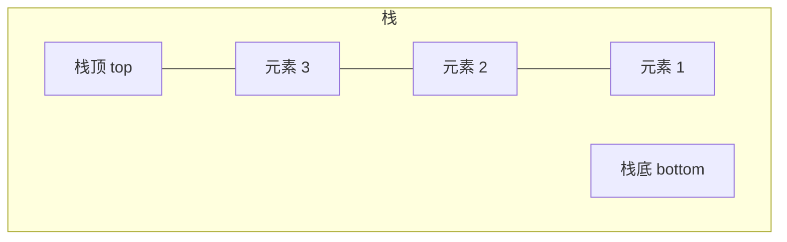
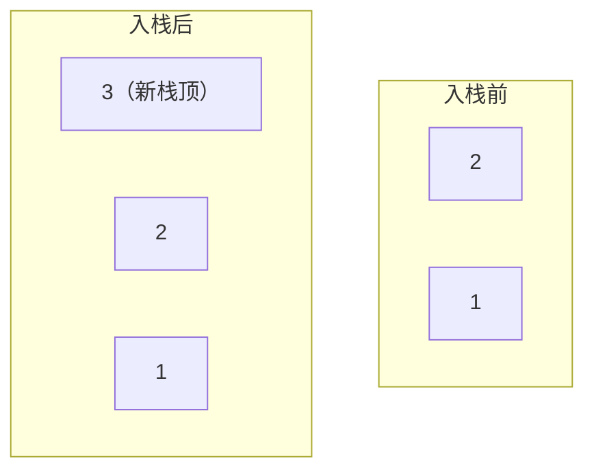
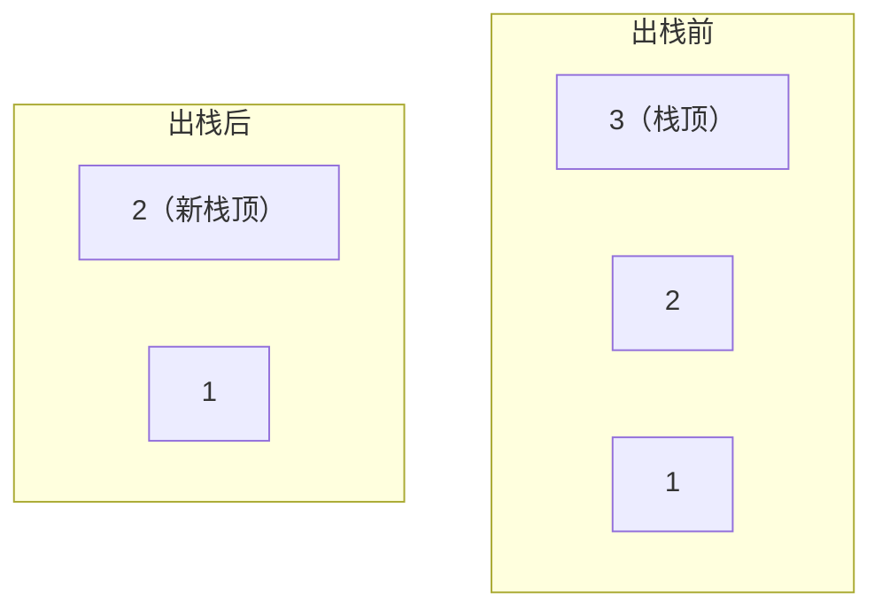
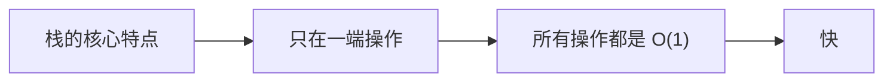

## 本节概述：后进先出的栈

栈（Stack）是一种**特殊的线性表**——特殊在哪儿呢？它只允许在一端进行插入和删除操作。

这一端有个专门的名字，叫**栈顶**。另一端叫**栈底**，平时不动。

> 栈的核心原则：**后进先出**（Last In First Out，简称 **LIFO**）。
>
> 最后放进去的，最先拿出来——就像一摞盘子，你只能拿最上面的，放也只能放在最上面。

## 栈可以用什么实现

栈是一种逻辑结构——底层既可以用顺序表实现，也可以用链表实现。

| 实现方式 | 优点 | 缺点 |
|---|---|---|
| 顺序表实现 | 随机访问快，缓存友好 | 可能有空间浪费 |
| 链表实现 | 灵活，要多少用多少 | 每个节点多一个指针的开销 |

两种都可以，效果差不多。后面代码篇我们两种都写。

## 操作一：入栈（push）

往栈里加元素，叫**入栈**（也叫进栈、压栈）。

只能在栈顶加——新元素变成新的栈顶。

举个例子：依次入栈 1、2、3。

### 入栈两步走

1. **把新元素放到栈顶**
   - 顺序表实现：尾部加一个元素
   - 链表实现：头插一个节点

2. **栈顶指针指向新元素，大小加一**

> 链表实现的话，入栈其实就是头插法——因为栈顶就是链表头，头插 O(1) 搞定。

## 操作二：出栈（pop）

从栈里删元素，叫**出栈**（也叫弹栈）。

只能删栈顶的元素——删完之后，下面那个变成新的栈顶。

举个例子：栈里有 1、2、3，出栈一次。

出栈是入栈的逆操作。

### 出栈三步走

1. **删掉栈顶元素**
   - 顺序表实现：尾部删一个
   - 链表实现：头删一个节点

2. **栈顶指针指向新的栈顶**
3. **大小减一**

> 链表实现的话，出栈就是头删——也是 O(1) 搞定。

## 操作三：获取栈顶（top / peek）

获取栈顶元素的值——只是看看，不拿走。

- 顺序表实现：返回最后一个元素
- 链表实现：返回头节点的数据

不管哪种实现，都是直接拿，**时间复杂度 O(1)**。

> [!TIP]
> 注意区分：
> - **top / peek** — 看栈顶，栈不变（只是查）
> - **pop** — 拿栈顶，栈变小了（是删）
>
> 一个是"看看"，一个是"拿走"，别搞混了。

## 栈的操作时间复杂度

| 操作 | 时间复杂度 | 说明 |
|---|---|---|
| 入栈 push | O(1) | 只在栈顶操作 |
| 出栈 pop | O(1) | 只在栈顶操作 |
| 看栈顶 top | O(1) | 直接拿 |
| 判空 empty | O(1) | 看 size 就行 |
| 获取大小 size | O(1) | 直接拿 |

发现了吗？栈的所有常用操作全是 O(1)——因为都只在栈顶这一头操作，不用遍历，不用挪元素。

## 栈的应用场景

栈虽然简单，但用处非常大：

1. **函数调用栈** — 程序里调用函数就是用栈实现的，调用一个压一层，返回就弹一层
2. **递归** — 递归本质就是函数调用栈
3. **表达式求值** — 比如中缀转后缀、计算后缀表达式
4. **括号匹配** — 左括号入栈，右括号出栈匹配
5. **浏览器后退** — 点后退就是出栈
6. **撤销操作** — Ctrl+Z 就是弹出上一步操作

> 简单说：凡是"后做的事情先撤销"这种场景，用栈就对了。

## 本章小结

**栈**是特殊的线性表，只在栈顶操作，遵循**后进先出（LIFO）**原则。

**三大操作**：
1. **入栈 push** — 往栈顶加元素，O(1)
2. **出栈 pop** — 从栈顶删元素，O(1)
3. **看栈顶 top** — 获取栈顶元素但不删，O(1)

**两种实现**：顺序表实现、链表实现，效果差不多。

**特点**：所有常用操作都是 O(1)，非常快。

