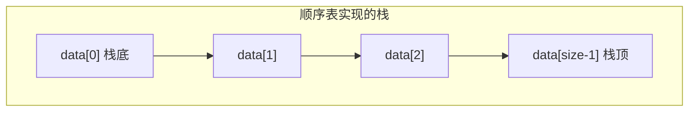

## 本节概述：用顺序表实现栈

上节课说了栈的概念——只在栈顶操作，后进先出。

这节课用**顺序表（动态数组）**来实现一个栈。底层其实就是个数组，栈顶就在数组的尾部——因为尾部插入和删除都是 O(1)。



> 为什么栈顶放尾部？因为尾部插删不需要挪动元素，都是 O(1)。如果放头部的话，每次入栈出栈都要挪所有元素，就变成 O(n) 了。

## 类的定义

用模板实现，元素类型可以自己定——就像 STL 的 vector 一样。

```cpp
#include <iostream>
#include <string>
#include <stdexcept>    // 异常处理
using namespace std;

template <typename T>
class Stack {
private:
    T* data;          // 顺序表首地址
    int size;         // 当前元素个数
    int capacity;     // 实际容量
    void resize();    // 扩容函数

public:
    Stack();          // 构造函数
    ~Stack();         // 析构函数

    void push(T element);   // 入栈
    T pop();                // 出栈（返回弹出的元素）
    T top() const;          // 获取栈顶元素
    int getSize() const;    // 获取栈的大小
};
```

> [!TIP]
> 三个要点：
> 1. **模板 `template <typename T>`** — 元素类型自己定，想存 int 存 int，想存 string 存 string
> 2. **私有成员** — data、size、capacity 都藏起来，外部不能乱改
> 3. **const 成员函数** — top() 和 getSize() 只是读，不修改栈，所以加 const

## 构造函数

初始化：申请默认容量的数组，size 设为 0。

```cpp
template <typename T>
Stack<T>::Stack() {
    capacity = 10;           // 默认容量 10
    data = new T[capacity];  // 申请内存
    size = 0;                // 初始为空
}
```

> 注意：类外面实现模板函数时，每个函数前面都要加 `template <typename T>`，类名后面还要加 `<T>`。

## 扩容函数 resize

当栈满了（size == capacity），就扩容成原来的两倍。

```cpp
template <typename T>
void Stack<T>::resize() {
    capacity *= 2;                      // 容量翻倍
    T* newData = new T[capacity];       // 申请新的更大的内存
    for (int i = 0; i < size; i++) {    // 把旧数据复制过去
        newData[i] = data[i];
    }
    delete[] data;                      // 释放旧内存
    data = newData;                     // 指向新内存
}
```

> 扩容四步走：**翻倍 → 申请新内存 → 复制数据 → 释放旧内存换指针**。
>
> 跟顺序表的扩容一模一样——因为栈的底层本来就是顺序表。

## 析构函数

释放数组内存，防止内存泄漏。

```cpp
template <typename T>
Stack<T>::~Stack() {
    delete[] data;    // 释放整个数组
}
```

## 入栈 push

把元素放到栈顶（数组尾部），size 加一。满了就先扩容。

```cpp
template <typename T>
void Stack<T>::push(T element) {
    if (size == capacity) {   // 满了，先扩容
        resize();
    }
    data[size] = element;     // 放到尾部
    size++;                   // 大小加一
}
```

> 入栈就是顺序表的**尾插**——只不过只能尾插，不能插别的地方。

## 出栈 pop

把栈顶元素弹出来，返回它的值，size 减一。

空栈不能弹，要抛异常。

```cpp
template <typename T>
T Stack<T>::pop() {
    if (size == 0) {                              // 空栈不能弹
        throw underflow_error("Stack is empty");  // 抛出下溢异常
    }
    size--;                   // 先减一，定位到栈顶
    return data[size];        // 返回栈顶元素
}
```

> [!WARNING]
> 注意 size 和栈顶下标的关系：
> - 栈顶元素的下标是 **size - 1**
> - 入栈时：`data[size] = 新元素; size++`
> - 出栈时：`size--; return data[size];`
>
> 别搞反了——size 永远比栈顶下标大一。

## 获取栈顶 top

只是看看栈顶元素，不拿走，size 不变。

```cpp
template <typename T>
T Stack<T>::top() const {
    if (size == 0) {
        throw underflow_error("Stack is empty");
    }
    return data[size - 1];    // 返回最后一个元素
}
```

> top() 和 pop() 的区别：
> - **top** — 看一眼，栈不变（只读）
> - **pop** — 拿走，栈变小了（删）

## 获取大小 getSize

直接返回 size，简单粗暴。

```cpp
template <typename T>
int Stack<T>::getSize() const {
    return size;
}
```

## 完整代码汇总

```cpp
#include <iostream>
#include <string>
#include <stdexcept>
using namespace std;

template <typename T>
class Stack {
private:
    T* data;
    int size;
    int capacity;
    void resize();

public:
    Stack();
    ~Stack();

    void push(T element);
    T pop();
    T top() const;
    int getSize() const;
};

// 构造函数
template <typename T>
Stack<T>::Stack() {
    capacity = 10;
    data = new T[capacity];
    size = 0;
}

// 析构函数
template <typename T>
Stack<T>::~Stack() {
    delete[] data;
}

// 扩容
template <typename T>
void Stack<T>::resize() {
    capacity *= 2;
    T* newData = new T[capacity];
    for (int i = 0; i < size; i++) {
        newData[i] = data[i];
    }
    delete[] data;
    data = newData;
}

// 入栈
template <typename T>
void Stack<T>::push(T element) {
    if (size == capacity) {
        resize();
    }
    data[size] = element;
    size++;
}

// 出栈
template <typename T>
T Stack<T>::pop() {
    if (size == 0) {
        throw underflow_error("Stack is empty");
    }
    size--;
    return data[size];
}

// 获取栈顶
template <typename T>
T Stack<T>::top() const {
    if (size == 0) {
        throw underflow_error("Stack is empty");
    }
    return data[size - 1];
}

// 获取大小
template <typename T>
int Stack<T>::getSize() const {
    return size;
}
```

## main 函数测试

```cpp
int main() {
    Stack<int> st;

    // 入栈：4、7、13
    st.push(4);
    st.push(7);
    st.push(13);

    cout << "栈顶：" << st.top() << endl;     // 13
    cout << "大小：" << st.getSize() << endl; // 3

    // 再入栈一个 17
    st.push(17);
    cout << "栈顶：" << st.top() << endl;     // 17

    // 出栈两次
    st.pop();    // 弹出 17
    st.pop();    // 弹出 13

    cout << "栈顶：" << st.top() << endl;     // 7
    cout << "大小：" << st.getSize() << endl; // 2

    return 0;
}
```

运行结果：

```
栈顶：13
大小：3
栈顶：17
栈顶：7
大小：2
```

## 易错点总结

> [!WARNING]
> 1. **模板函数的写法** — 类外实现每个函数都要加 `template <typename T>`，类名后面加 `<T>`
> 2. **栈顶下标是 size-1** — size 是元素个数，不是栈顶下标
> 3. **空栈不能 pop 和 top** — 要检查并抛异常，否则越界
> 4. **扩容要先释放旧内存** — 否则内存泄漏
> 5. **析构函数要用 delete[]** — 数组释放用 `delete[]`，不是 `delete`

## 本章小结

**顺序表实现栈**的本质：用数组存数据，**栈顶在数组尾部**，所有操作都在尾部进行。

**核心函数**：
- **push** — 尾插，满了就两倍扩容，O(1) 均摊
- **pop** — 尾删，返回元素，空栈抛异常，O(1)
- **top** — 看尾部元素，不删，O(1)
- **getSize** — 直接返回 size，O(1)

**为什么用尾部当栈顶？** 因为尾插尾删都是 O(1)，不用挪元素。

