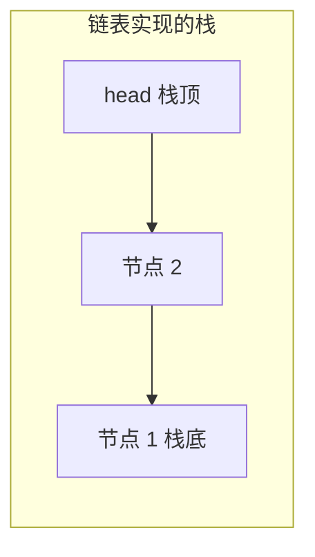
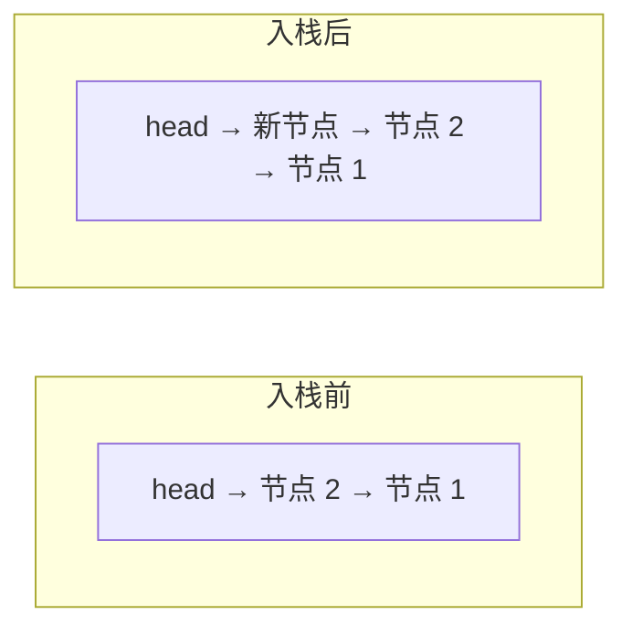

## 本节概述：用链表实现栈

上节课用顺序表实现了栈，这节课换一种——用**链表**实现。

链表实现的栈，**栈顶就在链表头部**。为什么放头部？因为头插头删都是 O(1)，放尾部的话还要找尾节点，反而麻烦。



> 入栈 = 头插，出栈 = 头删，看栈顶 = 看头节点的数据。全都是 O(1)。

## 类的定义

节点结构体定义在类的私有部分——因为节点只有栈内部才用，外部不需要知道。

```cpp
#include <iostream>
#include <string>
#include <stdexcept>
using namespace std;

template <typename T>
class Stack {
private:
    // 链表节点结构体
    struct Node {
        T data;       // 数据域
        Node* next;   // 指针域
        Node(T d) : data(d), next(NULL) {}  // 构造函数
    };

    Node* head;   // 栈顶指针（链表头）
    int size;     // 元素个数

public:
    Stack();          // 构造函数
    ~Stack();         // 析构函数

    void push(T element);   // 入栈
    T pop();                // 出栈
    T top() const;          // 获取栈顶元素
    int getSize() const;    // 获取栈的大小
};
```

> [!TIP]
> 两个要点：
> 1. **Node 定义在 private 里** — 内部实现细节，外部看不到，封装得更好
> 2. **head 就是栈顶** — 链表头 = 栈顶，头插头删都方便

## 构造函数

空栈——head 指向 NULL，size 为 0。

```cpp
template <typename T>
Stack<T>::Stack() {
    head = NULL;
    size = 0;
}
```

## 析构函数

遍历链表，逐个释放节点——从头节点开始，一个一个删。

```cpp
template <typename T>
Stack<T>::~Stack() {
    while (head != NULL) {      // 只要还有节点
        Node* temp = head;      // 先存下当前头节点
        head = head->next;      // 头指针往后移
        delete temp;            // 释放旧头节点
    }
}
```

> 析构三步：**存节点 → 移指针 → 释放**。
>
> 不能直接 `delete head` 就完事——删了 head 就找不到下一个节点了。

## 入栈 push

入栈就是头插法——新节点插在链表最前面，变成新的栈顶。

```cpp
template <typename T>
void Stack<T>::push(T element) {
    Node* newNode = new Node(element);  // 新建节点
    newNode->next = head;               // 新节点指向原来的栈顶
    head = newNode;                     // 更新栈顶指针
    size++;                             // 大小加一
}
```



> 入栈两步：
> 1. 新节点的 next 指向原来的 head
> 2. head 指向新节点
>
> 顺序不能反！先改新节点的指针，再改 head——反了就找不到原来的链表了。

## 出栈 pop

出栈就是头删——删掉头节点，返回它的值，下一个节点变成新的栈顶。

空栈不能弹，要抛异常。

```cpp
template <typename T>
T Stack<T>::pop() {
    if (head == NULL) {                           // 空栈不能弹
        throw underflow_error("Stack is empty");
    }

    T result = head->data;                        // 先存下栈顶数据
    Node* temp = head;                            // 存下旧头节点地址
    head = head->next;                            // 头指针往后移
    delete temp;                                  // 释放旧头节点
    size--;                                       // 大小减一

    return result;                                // 返回弹出的值
}
```

> [!WARNING]
> 出栈的顺序很重要：
> 1. **先存数据** — 不然删了节点就拿不到值了
> 2. **再存节点地址** — 不然移了指针就找不到要释放的节点了
> 3. **移指针** — head 跳到下一个
> 4. **释放内存** — delete 旧节点
> 5. **size 减一** — 别忘了！
>
> 老师视频里就踩了这个坑——pop 里忘了 `size--`，结果 getSize 返回不对。

## 获取栈顶 top

直接返回头节点的数据，不删节点，size 不变。

```cpp
template <typename T>
T Stack<T>::top() const {
    if (head == NULL) {
        throw underflow_error("Stack is empty");
    }
    return head->data;   // 头节点的数据就是栈顶
}
```

## 获取大小 getSize

直接返回 size。

```cpp
template <typename T>
int Stack<T>::getSize() const {
    return size;
}
```

## 完整代码汇总

```cpp
#include <iostream>
#include <string>
#include <stdexcept>
using namespace std;

template <typename T>
class Stack {
private:
    struct Node {
        T data;
        Node* next;
        Node(T d) : data(d), next(NULL) {}
    };

    Node* head;
    int size;

public:
    Stack();
    ~Stack();

    void push(T element);
    T pop();
    T top() const;
    int getSize() const;
};

// 构造函数
template <typename T>
Stack<T>::Stack() {
    head = NULL;
    size = 0;
}

// 析构函数
template <typename T>
Stack<T>::~Stack() {
    while (head != NULL) {
        Node* temp = head;
        head = head->next;
        delete temp;
    }
}

// 入栈（头插法）
template <typename T>
void Stack<T>::push(T element) {
    Node* newNode = new Node(element);
    newNode->next = head;
    head = newNode;
    size++;
}

// 出栈（头删）
template <typename T>
T Stack<T>::pop() {
    if (head == NULL) {
        throw underflow_error("Stack is empty");
    }

    T result = head->data;
    Node* temp = head;
    head = head->next;
    delete temp;
    size--;

    return result;
}

// 获取栈顶
template <typename T>
T Stack<T>::top() const {
    if (head == NULL) {
        throw underflow_error("Stack is empty");
    }
    return head->data;
}

// 获取大小
template <typename T>
int Stack<T>::getSize() const {
    return size;
}
```

## main 函数测试

```cpp
int main() {
    Stack<int> st;

    // 入栈：4、7、13
    st.push(4);
    st.push(7);
    st.push(13);

    cout << "栈顶：" << st.top() << endl;     // 13
    cout << "大小：" << st.getSize() << endl; // 3

    // 再入栈一个 17
    st.push(17);
    cout << "栈顶：" << st.top() << endl;     // 17

    // 出栈两次
    st.pop();    // 弹出 17
    st.pop();    // 弹出 13

    cout << "栈顶：" << st.top() << endl;     // 7
    cout << "大小：" << st.getSize() << endl; // 2

    return 0;
}
```

运行结果：

```
栈顶：13
大小：3
栈顶：17
栈顶：7
大小：2
```

## 两种实现对比

| 对比项 | 顺序表实现 | 链表实现 |
|---|---|---|
| 入栈 | O(1) 均摊（可能扩容） | O(1) |
| 出栈 | O(1) | O(1) |
| 看栈顶 | O(1) | O(1) |
| 空间 | 可能有浪费 | 每个节点多一个指针 |
| 扩容 | 需要两倍扩容 | 不需要，来一个加一个 |
| 缓存友好 | 好（连续内存） | 一般（节点分散） |

> 两种实现各有优劣，实际开发中用哪种都行——STL 的 stack 默认用 deque 实现。

## 易错点总结

> [!WARNING]
> 1. **入栈指针顺序不能反** — 先让新节点指向旧 head，再改 head，反了链表就断了
> 2. **出栈别忘了 size--** — 老师视频里就踩了这个坑
> 3. **出栈要先存数据再删节点** — 删了就拿不到值了
> 4. **空栈不能 pop 和 top** — 要抛异常，否则空指针访问直接崩
> 5. **析构要逐个释放** — 不能只删 head，要遍历整个链表

## 本章小结

**链表实现栈**的本质：用链表存数据，**栈顶在链表头部**，入栈=头插，出栈=头删。

**核心函数**：
- **push** — 头插法，新节点变栈顶，O(1)
- **pop** — 头删，返回弹出值，O(1)
- **top** — 看头节点数据，O(1)
- **getSize** — 直接返回 size，O(1)

**Node 定义在类的 private 里** — 封装更好，外部看不到内部实现。

