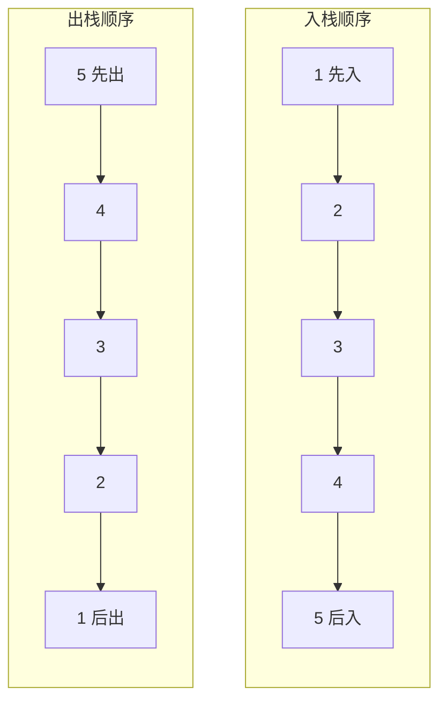

## 本节概述：STL 中的 stack

前两节课我们自己手写了栈——顺序表实现、链表实现都写过了。

实际开发中不用自己写，C++ STL 已经给我们封装好了，直接用就行。它叫 **`std::stack`**。

> 学了原理再用库，你就知道底层发生了什么，用起来心里有底。

## 引入头文件

要用 stack，先包含头文件：

```cpp
#include <stack>
#include <iostream>
using namespace std;
```

## 定义一个栈

stack 是模板类，尖括号里填元素类型。

```cpp
stack<int> stk;          // 存 int 的栈
stack<double> dstk;      // 存 double 的栈
stack<string> sstk;      // 存 string 的栈
```

想存什么类型就填什么类型，跟 vector 一样。

## 四大核心接口

STL 的 stack 就四个常用操作，记住就行：

| 操作 | 函数 | 说明 |
|---|---|---|
| 入栈 | `push(元素)` | 把元素压到栈顶 |
| 出栈 | `pop()` | 弹出栈顶元素（不返回值） |
| 看栈顶 | `top()` | 获取栈顶元素（不弹出） |
| 判空 | `empty()` | 栈为空返回 true |

> [!TIP]
> 还有两个常用的：
> - **`size()`** — 返回栈中元素个数
>
> 注意：STL 的 `pop()` **不返回值**，只是弹出。要拿值先用 `top()` 看，再 `pop()` 弹。

## 入栈和遍历

依次入栈 1、2、3、4、5，然后遍历打印。

栈没有下标，不能像数组那样 `for (int i = 0; i < n; i++)` 遍历——要遍历只能**一个一个弹出来**。

```cpp
#include <iostream>
#include <stack>
using namespace std;

int main() {
    stack<int> stk;

    // 入栈：1、2、3、4、5
    stk.push(1);
    stk.push(2);
    stk.push(3);
    stk.push(4);
    stk.push(5);

    // 遍历打印（边弹边打）
    while (!stk.empty()) {            // 栈非空就继续
        cout << stk.top() << " ";     // 先看栈顶
        stk.pop();                    // 再弹出
    }
    cout << endl;

    return 0;
}
```

运行结果：

```
5 4 3 2 1
```

> 入栈顺序是 1、2、3、4、5，出来的顺序是 5、4、3、2、1。
>
> 这就是**后进先出（LIFO）**——最后进去的 5 最先出来，最先进去的 1 最后出来。



## 用 double 类型也一样

换成 double 类型试试：

```cpp
stack<double> dstk;

dstk.push(1.1);
dstk.push(2.2);
dstk.push(3.3);
dstk.push(4.4);

while (!dstk.empty()) {
    cout << dstk.top() << " ";
    dstk.pop();
}
```

运行结果：

```
4.4 3.3 2.2 1.1
```

> 模板的好处：什么类型都能存，用法一模一样。

## 完整示例：栈的常用操作

```cpp
#include <iostream>
#include <stack>
#include <string>
using namespace std;

int main() {
    stack<string> stk;

    // 判空
    cout << "空栈？" << (stk.empty() ? "是" : "否") << endl;  // 是

    // 入栈
    stk.push("苹果");
    stk.push("香蕉");
    stk.push("橙子");

    // 大小
    cout << "大小：" << stk.size() << endl;   // 3

    // 看栈顶
    cout << "栈顶：" << stk.top() << endl;    // 橙子

    // 出栈一个
    stk.pop();
    cout << "弹出后栈顶：" << stk.top() << endl;  // 香蕉

    // 全部弹出
    while (!stk.empty()) {
        cout << stk.top() << " ";
        stk.pop();
    }
    cout << endl;   // 香蕉 苹果

    cout << "弹完大小：" << stk.size() << endl;  // 0

    return 0;
}
```

运行结果：

```
空栈？是
大小：3
栈顶：橙子
弹出后栈顶：香蕉
香蕉 苹果
弹完大小：0
```

## 注意事项

> [!WARNING]
> 1. **空栈不能调用 top() 和 pop()** — 会直接崩溃！调用前一定要用 `empty()` 检查
> 2. **pop() 不返回值** — STL 的 pop 只弹不返回，要取值先 top() 再 pop()
> 3. **栈不能随机访问** — 没有 `[]` 运算符，不能直接拿第几个元素，只能从栈顶一个一个来
> 4. **栈不能遍历** — 想遍历只能弹，弹完栈就空了（会破坏原栈）
> 5. **栈没有迭代器** — 跟 vector 不一样，stack 不支持 begin()/end()

## 什么时候用栈

凡是"后进先出"的场景，用 stack 就对了：

1. **括号匹配** — 左括号入栈，右括号出栈匹配
2. **表达式求值** — 后缀表达式计算
3. **浏览器后退** — 每访问一个页面入栈，点后退就弹出
4. **函数调用栈** — 程序底层就是用栈实现的
5. **递归转非递归** — 手动模拟递归栈

## 本章小结

**STL 的 `std::stack`** — 开箱即用的栈，头文件 `<stack>`。

**四大接口**：
- **push** — 入栈，O(1)
- **pop** — 出栈（不返回值），O(1)
- **top** — 看栈顶，O(1)
- **empty** — 判空，O(1)

**还有 size()** — 获取元素个数。

**注意**：栈不能随机访问、不能遍历、没有迭代器——只能在栈顶操作。空栈不能 top/pop，否则崩溃。

