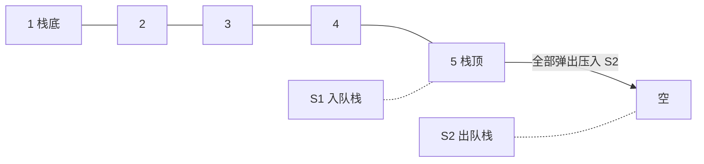
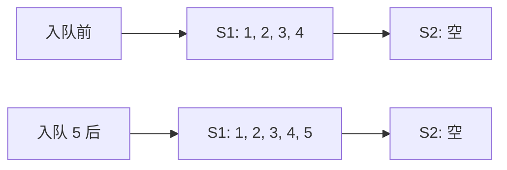
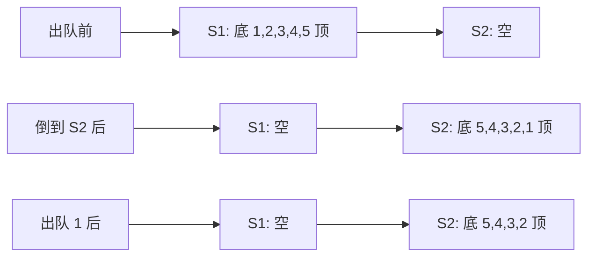

## 本节概述：用两个栈实现队列

这是一道经典面试题——**用栈实现队列**。

栈是后进先出，队列是先进先出，两个东西是反的。怎么用"后进先出"实现"先进先出"呢？

答案是：**用两个栈，一个负责入队，一个负责出队，倒一次手就反过来了。**



> 两个栈一倒，顺序就反过来了——原来的栈底变成了栈顶，正好就是队头。

## 核心思路

需要两个栈：

- **S1（入队栈 / 主栈）** — 入队操作直接往里 push
- **S2（出队栈 / 辅助栈）** — 出队操作从这里 pop

**入队**：直接往 S1 里 push，简单粗暴。

**出队**：分两步：
1. 如果 S2 是空的，就把 S1 里的元素**全部弹出来，依次压进 S2**
2. 然后从 S2 的栈顶 pop 一个元素，就是队头

> 为什么要等 S2 空了才倒？因为 S2 里还有元素的话，栈顶就是队头，直接用就行——倒过来的顺序不能乱。

## 入队操作 push

入队最简单——直接往 S1 里压。

```
入队 1、2、3、4、5：

S1: 底 [1, 2, 3, 4, 5] 顶
S2: 空
```

时间复杂度：**O(1)**



## 出队操作 pop

出队稍微复杂一点——要把 S1 的元素倒到 S2 里（但只在 S2 空的时候倒）。

**举个例子**：S1 里有 1、2、3、4、5（1 在底，5 在顶），S2 是空的。现在要出队。

第一步：S2 是空的，把 S1 全倒进 S2：

```
S1 弹出 5 → 压入 S2
S1 弹出 4 → 压入 S2
S1 弹出 3 → 压入 S2
S1 弹出 2 → 压入 S2
S1 弹出 1 → 压入 S2

结果：
S1: 空
S2: 底 [5, 4, 3, 2, 1] 顶
```

第二步：弹出 S2 的栈顶（也就是 1），返回：

```
S2 pop 1 → 返回 1

S2: 底 [5, 4, 3, 2] 顶
```

> 神奇吧？入栈顺序 1、2、3、4、5，从 S2 出来的顺序是 1、2、3、4、5——正好是先进先出！



> [!TIP]
> 为什么不在每次出队都倒一次？
> - 因为 S2 里还有元素时，栈顶就是队头，直接 pop 就行
> - 如果 S2 还有元素就倒，顺序会乱——新倒进来的会盖在上面，队头就不对了
> - 等 S2 空了再倒，这样效率最高，均摊下来还是 O(1)

## 获取队头 peek / front

跟出队几乎一样——也要先判断 S2 空不空，空了就倒。区别是：**只看栈顶，不弹出来**。

```cpp
// 伪代码
if (S2 为空) {
    把 S1 全部倒进 S2
}
返回 S2.top()
```

> 获取队头和出队的区别：一个是 top()，一个是 pop()。仅此而已。

## 判空 empty

两个栈都空，队列才是空。

```
S1 空 且 S2 空 → 队列为空
```

> 因为元素可能在 S1 里，也可能在 S2 里，也可能两边都有。只有两边都空，才是真的空。

## 完整流程演示

我们从头到尾走一遍，加深理解：

```
初始：S1=[], S2=[]

push(1) → S1=[1]
push(2) → S1=[1,2]
push(3) → S1=[1,2,3]

现在：S1=[1,2,3], S2=[]

pop() → S2 空，把 S1 全倒进 S2
       S1=[], S2=[3,2,1]
       弹出 S2 栈顶 1 → 返回 1

现在：S1=[], S2=[3,2]

push(4) → S1=[4]（直接进 S1，不用管 S2）

现在：S1=[4], S2=[3,2]

pop() → S2 不为空，直接弹 S2 栈顶 2 → 返回 2

现在：S1=[4], S2=[3]

pop() → S2 不为空，直接弹 S2 栈顶 3 → 返回 3

现在：S1=[4], S2=[]

pop() → S2 空了，把 S1 全倒进 S2
       S1=[], S2=[4]
       弹出 S2 栈顶 4 → 返回 4

现在：S1=[], S2=[] → 队列为空
```

> 整个过程出队顺序：1 → 2 → 3 → 4
> 入队顺序：1 → 2 → 3 → 4
>
> 完美的先进先出！

## 时间复杂度分析

| 操作 | 时间复杂度 | 说明 |
|---|---|---|
| 入队 push | O(1) | 直接压 S1 |
| 出队 pop | O(1) 均摊 | 每个元素最多被倒一次，平摊下来 O(1) |
| 看队头 peek | O(1) 均摊 | 同上 |
| 判空 empty | O(1) | 看两个栈 |

> 为什么出队是均摊 O(1)？
> 因为每个元素**最多被压两次、弹两次**——进 S1 压一次，倒到 S2 弹一次压一次，出队弹一次。总共 4 次操作，平摊到每个元素上就是常数。

## 易错点总结

> [!WARNING]
> 1. **S2 非空时不能倒元素** — 直接用 S2 的栈顶就行，倒了顺序就乱了
> 2. **倒的时候要倒干净** — S1 里的元素要全部倒进 S2，不能剩
> 3. **判空要看两个栈** — 不能只看一个，元素可能在 S1 也可能在 S2
> 4. **入队永远进 S1** — 不管 S2 有没有元素，入队都直接往 S1 压
> 5. **出队永远从 S2 出** — S2 空了就从 S1 倒过来，不空直接用

## 本章小结

**用栈实现队列** = 两个栈配合，一进一出。

- **S1（入队栈）** — 入队直接往里压
- **S2（出队栈）** — 出队从这里弹，空了就从 S1 全倒过来

**四个操作**：
1. **push** — 压 S1，O(1)
2. **pop** — S2 空就全倒过来，再弹 S2 栈顶，均摊 O(1)
3. **peek** — S2 空就全倒过来，再看 S2 栈顶，均摊 O(1)
4. **empty** — 两个栈都空才是空，O(1)

核心思想：**倒一次手，后进先出就变成了先进先出。**

