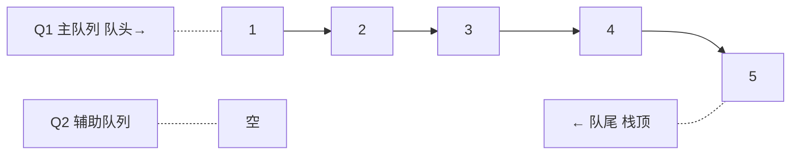
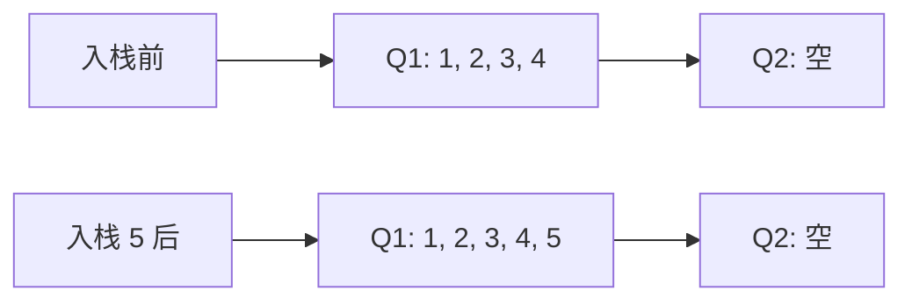
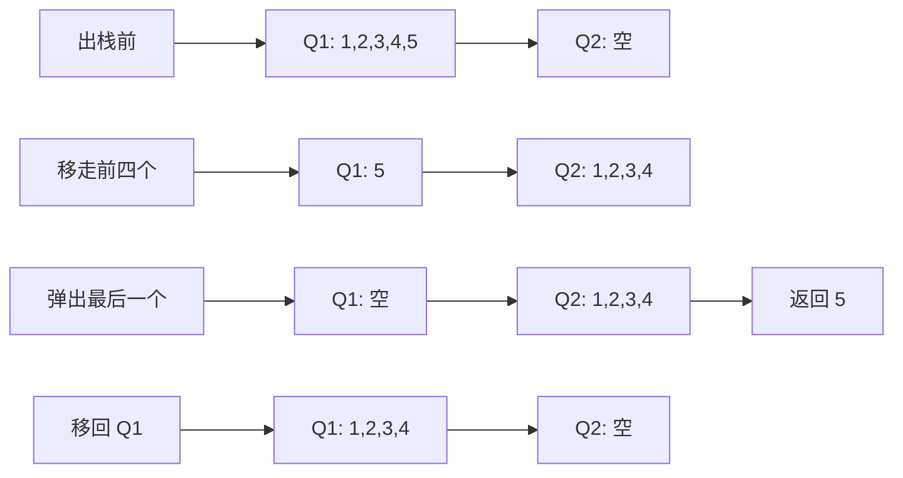

## 本节概述：用两个队列实现栈

这是另一道经典面试题——**用队列实现栈**。

队列是先进先出，栈是后进先出，两个东西是反的。怎么用"先进先出"实现"后进先出"呢？

答案是：**用两个队列，一个主队列一个辅助队列，出栈时把前面的元素都移走，剩下最后一个就是栈顶。**



> 记住一个核心规则：**辅助队列 Q2 每次操作完毕后一定是空的。** 元素永远都在 Q1 里，Q2 只是临时用一下。

## 核心思路

需要两个队列：

- **Q1（主队列）** — 元素都存在这里，入栈直接往里加
- **Q2（辅助队列）** — 出栈时临时存放用的，用完就空

**入栈**：直接往 Q1 队尾入队，简单粗暴。

**出栈**：
1. 把 Q1 里除了最后一个元素，前面的全都出队，依次入队到 Q2
2. Q1 剩下的最后一个元素，就是栈顶——把它出队并返回
3. 把 Q2 里的元素全部移回 Q1（Q2 又变空了）

> 为什么要移回去？因为下次操作元素还是要从 Q1 开始——Q2 永远是辅助的，用完就空。

## 入栈操作 push

入栈最简单——直接往 Q1 队尾入队。

```
入栈 1、2、3、4、5：

Q1: 队头 [1, 2, 3, 4, 5] 队尾（栈顶）
Q2: 空
```

时间复杂度：**O(1)**



## 出栈操作 pop

出栈是最复杂的操作——要把最后一个元素"逼"出来。

**举个例子**：Q1 里有 1、2、3、4、5（1 队头，5 队尾），Q2 是空的。现在要出栈（弹出 5）。

第一步：把 Q1 前面的元素全部移到 Q2，只留最后一个：

```
Q1 出队 1 → 入队 Q2
Q1 出队 2 → 入队 Q2
Q1 出队 3 → 入队 Q2
Q1 出队 4 → 入队 Q2

结果：
Q1: [5]    （只剩最后一个）
Q2: [1, 2, 3, 4]
```

第二步：把 Q1 剩下的那个元素出队，存起来（这就是栈顶）：

```
Q1 出队 5 → 保存为 result = 5

结果：
Q1: 空
Q2: [1, 2, 3, 4]
```

第三步：把 Q2 里的元素全部移回 Q1：

```
Q2 出队 1 → 入队 Q1
Q2 出队 2 → 入队 Q1
Q2 出队 3 → 入队 Q1
Q2 出队 4 → 入队 Q1

结果：
Q1: [1, 2, 3, 4]
Q2: 空    （辅助队列又空了）
```

第四步：返回 result = 5。

> 完美！入栈顺序 1、2、3、4、5，出栈弹出的是 5——正好是后进先出！



时间复杂度：**O(n)** — 每次出栈都要把所有元素挪来挪去。

> [!TIP]
> 为什么要移回 Q1？不移回去行不行？
> 也行——你可以交换 Q1 和 Q2 的角色（把 Q2 当新的主队列）。
> 但视频里的做法是移回去，保持 Q1 永远是主队列、Q2 永远是空的辅助队列——逻辑更清晰。

## 获取栈顶 top / peek

跟出栈几乎一样——也要把前面的元素移到 Q2，找到最后一个元素。

区别是：**最后那个元素不删，也存到 Q2 里，然后一起移回 Q1**。

```
步骤：
1. Q1 前 n-1 个元素移到 Q2
2. Q1 最后一个元素 = 栈顶，先存下来 result
3. 把这个元素也入队到 Q2（不删！）
4. 把 Q2 所有元素移回 Q1
5. 返回 result
```

> 跟出栈的区别就一步：出栈是删掉最后一个，获取栈顶是把最后一个也移到 Q2，然后整体搬回去——元素一个都没少。

## 判空 empty

只看 Q1 空不空就行——因为 Q2 每次操作完一定是空的。

```
Q1 空 → 栈为空
```

> 为什么不用看 Q2？因为 Q2 永远是辅助的，用完就空。元素要么全在 Q1，要么正在出栈/获取栈顶的过程中——但操作完 Q2 一定是空的。

## 完整流程演示

我们从头到尾走一遍，加深理解：

```
初始：Q1=[], Q2=[]

push(1) → Q1=[1]
push(2) → Q1=[1,2]
push(3) → Q1=[1,2,3]

现在：Q1=[1,2,3], Q2=[]

pop() → Q1 前两个移到 Q2
       Q1=[3], Q2=[1,2]
       弹出 Q1 最后一个 3 → 保存
       Q2 全部移回 Q1
       Q1=[1,2], Q2=[]
       返回 3

现在：Q1=[1,2], Q2=[]

push(4) → Q1=[1,2,4]

现在：Q1=[1,2,4], Q2=[]

pop() → Q1 前两个移到 Q2
       Q1=[4], Q2=[1,2]
       弹出 Q1 最后一个 4 → 保存
       Q2 全部移回 Q1
       Q1=[1,2], Q2=[]
       返回 4

现在：Q1=[1,2], Q2=[]

top() → Q1 前 1 个移到 Q2
       Q1=[2], Q2=[1]
       保存 2，也入队到 Q2
       Q2 全部移回 Q1
       Q1=[1,2], Q2=[]
       返回 2

现在：Q1=[1,2], Q2=[] （元素没变！）
```

> 出栈顺序：3 → 4
> 入栈顺序：1 → 2 → 3 → (出3) → 4 → (出4)
>
> 完美的后进先出！

## 时间复杂度分析

| 操作 | 时间复杂度 | 说明 |
|---|---|---|
| 入栈 push | O(1) | 直接入队 Q1 |
| 出栈 pop | O(n) | 要把所有元素挪来挪去 |
| 看栈顶 top | O(n) | 跟出栈一样要挪 |
| 判空 empty | O(1) | 只看 Q1 |

> 对比一下"用栈实现队列"是均摊 O(1)，"用队列实现栈"出栈是 O(n)——后者更费一些。
>
> 为什么？因为栈倒一次可以用很久，队列每次出栈都要全挪一遍。

## 易错点总结

> [!WARNING]
> 1. **Q2 每次操作完必须是空的** — 这是核心规则，元素永远回到 Q1
> 2. **出栈要留最后一个** — 前 n-1 个移走，最后一个才是栈顶
> 3. **获取栈顶不删元素** — 最后那个也要进 Q2，然后一起搬回去
> 4. **判空只看 Q1** — Q2 永远是空的（操作完毕后）
> 5. **出栈时间复杂度是 O(n)** — 不是 O(1)，每次都要全挪一遍
> 6. **元素顺序不能乱** — 移来移去的时候要按顺序，不能倒

## 用栈实现队列 vs 用队列实现栈

| 对比项 | 用栈实现队列 | 用队列实现栈 |
|---|---|---|
| 数据结构 | 两个栈 | 两个队列 |
| 入操作 | O(1) | O(1) |
| 出操作 | 均摊 O(1) | O(n) |
| 辅助容器特点 | S2 不空时直接用 | Q2 用完必须空 |
| 核心思想 | 倒一次手，用很久 | 每次出栈都要全挪 |

## 本章小结

**用队列实现栈** = 两个队列配合，主队列存元素，辅助队列打辅助。

- **Q1（主队列）** — 元素都在这，入栈直接入队
- **Q2（辅助队列）** — 出栈时临时用，用完一定是空的

**四个操作**：
1. **push** — 入队 Q1，O(1)
2. **pop** — Q1 前 n-1 个移到 Q2，最后一个弹出返回，Q2 移回 Q1，O(n)
3. **top** — 类似 pop，但最后一个也进 Q2，全部移回 Q1，O(n)
4. **empty** — 只看 Q1 空不空，O(1)

核心思想：**把最后一个元素露出来，它就是栈顶。**

