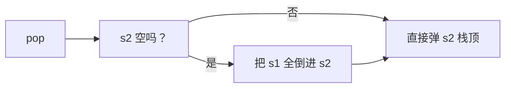

## 本节概述：用两个栈实现队列（代码篇）

上节课讲了原理——两个栈，S1 主栈入队，S2 辅助栈出队，倒一次手顺序就反过来了。

这节课把代码写出来。我们用之前自己写的 Stack 类作为底层容器，在外面再包一层 MyQueue。

> 用 STL 的 stack 也行，思路完全一样。这里用我们手写的 Stack，更能看清底层。

## 先给 Stack 加个 empty 接口

写队列之前，先给 Stack 补一个 `empty()` 接口——判断栈是否为空。之前没写，现在需要用。

```cpp
// 在 Stack 类的 public 里加一个
bool empty() const {
    return size == 0;
}
```

> 很简单——size 等于 0 就是空的。

## 类的定义

MyQueue 类里有两个 Stack 成员变量：s1（主栈）和 s2（辅助栈）。

```cpp
template <typename T>
class MyQueue {
private:
    Stack<T> s1;    // 主栈（入队栈）
    Stack<T> s2;    // 辅助栈（出队栈）

public:
    MyQueue();           // 构造函数
    ~MyQueue();          // 析构函数

    void push(T x);      // 入队
    T pop();             // 出队
    T peek();            // 获取队头元素
    bool empty();        // 判断是否为空
};
```

> [!TIP]
> 四个接口：
> - **push** — 入队
> - **pop** — 出队（返回队头元素并删除）
> - **peek** — 获取队头元素（只看不删）
> - **empty** — 判断队列是否为空
>
> 这也是 LeetCode 上 232 题 "Implement Queue using Stacks" 的标准接口。

## 构造函数和析构函数

s1 和 s2 都是对象，会自动调用它们自己的构造和析构函数，所以 MyQueue 的构造和析构都是空的。

```cpp
template <typename T>
MyQueue<T>::MyQueue() {
    // 什么都不用做，s1 和 s2 自动初始化
}

template <typename T>
MyQueue<T>::~MyQueue() {
    // 什么都不用做，s1 和 s2 自动销毁
}
```

## 入队 push

最简单——直接往主栈 s1 里压。

```cpp
template <typename T>
void MyQueue<T>::push(T x) {
    s1.push(x);
}
```

时间复杂度：**O(1)**

> 入队永远进 s1，不管 s2 有没有元素。

## 出队 pop

稍微复杂一点——先判断 s2 空不空，空了就从 s1 全倒过来，然后弹 s2 的栈顶。

```cpp
template <typename T>
T MyQueue<T>::pop() {
    if (s2.empty()) {                    // 辅助栈空了
        while (!s1.empty()) {            // 把主栈元素全倒过来
            s2.push(s1.pop());
        }
    }
    return s2.pop();                     // 弹出辅助栈的栈顶，就是队头
}
```



> 核心逻辑：**s2 空才倒，不空直接用。**
>
> 每个元素最多被倒一次，所以均摊时间复杂度是 **O(1)**。

## 获取队头 peek

跟出队几乎一模一样——只是最后一步用 `top()` 而不是 `pop()`。

```cpp
template <typename T>
T MyQueue<T>::peek() {
    if (s2.empty()) {                    // 辅助栈空了
        while (!s1.empty()) {            // 把主栈元素全倒过来
            s2.push(s1.pop());
        }
    }
    return s2.top();                     // 看辅助栈的栈顶，就是队头
}
```

> peek 和 pop 的区别只有最后一行：
> - pop 用 `s2.pop()` — 弹出并返回
> - peek 用 `s2.top()` — 只看不弹

## 判空 empty

两个栈都空，队列才是空。

```cpp
template <typename T>
bool MyQueue<T>::empty() {
    return s1.empty() && s2.empty();
}
```

> 元素可能在 s1 里，也可能在 s2 里，也可能两边都有。
>
> 只有两个栈都空了，队列才真的空。

## 完整代码汇总

```cpp
// ====== 前置：Stack 类（之前写的，加了 empty 接口）======
template <typename T>
class Stack {
private:
    struct Node {
        T data;
        Node* next;
        Node(T d) : data(d), next(NULL) {}
    };

    Node* head;
    int size;

public:
    Stack();
    ~Stack();

    void push(T element);
    T pop();
    T top() const;
    int getSize() const;
    bool empty() const;    // 新增：判空
};

template <typename T>
Stack<T>::Stack() {
    head = NULL;
    size = 0;
}

template <typename T>
Stack<T>::~Stack() {
    while (head != NULL) {
        Node* temp = head;
        head = head->next;
        delete temp;
    }
}

template <typename T>
void Stack<T>::push(T element) {
    Node* newNode = new Node(element);
    newNode->next = head;
    head = newNode;
    size++;
}

template <typename T>
T Stack<T>::pop() {
    if (head == NULL) {
        throw underflow_error("Stack is empty");
    }
    T result = head->data;
    Node* temp = head;
    head = head->next;
    delete temp;
    size--;
    return result;
}

template <typename T>
T Stack<T>::top() const {
    if (head == NULL) {
        throw underflow_error("Stack is empty");
    }
    return head->data;
}

template <typename T>
int Stack<T>::getSize() const {
    return size;
}

template <typename T>
bool Stack<T>::empty() const {
    return size == 0;
}

// ====== MyQueue 类：用两个栈实现队列 ======
template <typename T>
class MyQueue {
private:
    Stack<T> s1;
    Stack<T> s2;

public:
    MyQueue();
    ~MyQueue();

    void push(T x);
    T pop();
    T peek();
    bool empty();
};

template <typename T>
MyQueue<T>::MyQueue() {}

template <typename T>
MyQueue<T>::~MyQueue() {}

// 入队
template <typename T>
void MyQueue<T>::push(T x) {
    s1.push(x);
}

// 出队
template <typename T>
T MyQueue<T>::pop() {
    if (s2.empty()) {
        while (!s1.empty()) {
            s2.push(s1.pop());
        }
    }
    return s2.pop();
}

// 获取队头
template <typename T>
T MyQueue<T>::peek() {
    if (s2.empty()) {
        while (!s1.empty()) {
            s2.push(s1.pop());
        }
    }
    return s2.top();
}

// 判空
template <typename T>
bool MyQueue<T>::empty() {
    return s1.empty() && s2.empty();
}
```

## main 函数测试

```cpp
int main() {
    MyQueue<int> q;

    // 入队：1、2、3
    q.push(1);
    q.push(2);
    q.push(3);

    cout << "队头：" << q.peek() << endl;     // 1
    cout << "空？" << (q.empty() ? "是" : "否") << endl;  // 否

    // 出队一个
    cout << "出队：" << q.pop() << endl;     // 1
    cout << "队头：" << q.peek() << endl;     // 2

    // 再入队 4
    q.push(4);

    // 连续出队
    cout << "出队：" << q.pop() << endl;     // 2
    cout << "出队：" << q.pop() << endl;     // 3
    cout << "出队：" << q.pop() << endl;     // 4

    cout << "空？" << (q.empty() ? "是" : "否") << endl;  // 是

    return 0;
}
```

运行结果：

```
队头：1
空？否
出队：1
队头：2
出队：2
出队：3
出队：4
空？是
```

> 入队顺序 1 → 2 → 3 → 4
> 出队顺序 1 → 2 → 3 → 4
>
> 完美的先进先出！

## 易错点总结

> [!WARNING]
> 1. **s2 非空时不能倒元素** — s2 还有元素就直接用，倒了顺序会乱
> 2. **倒的时候要用 while 全倒干净** — 不是 if，是 while，s1 一个不剩全倒进 s2
> 3. **判空要看两个栈** — 不能只看一个，元素可能在 s1 也可能在 s2
> 4. **peek 和 pop 逻辑几乎一样** — 区别只是 top() 和 pop()，别写混了
> 5. **入队永远进 s1** — 不管 s2 状态如何，入队都直接压 s1
> 6. **Stack 要有 empty 接口** — 手写的 Stack 记得加上，不然没法判断

## 本章小结

**用栈实现队列**的代码核心就是三句话：

1. **push 直接压 s1** — O(1)
2. **pop 和 peek 先看 s2 空不空，空了就把 s1 全倒过来** — 均摊 O(1)
3. **empty 两个栈都空才是空** — O(1)

最精妙的地方在于**"倒一次，用很久"**——s2 里的元素可以连续出队，直到 s2 空了才需要再倒一次。平摊下来每个元素只被倒一次，所以出队也是均摊 O(1)。


