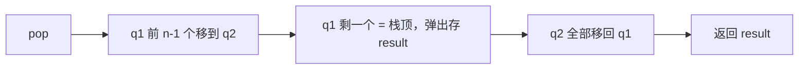

## 本节概述：用两个队列实现栈（代码篇）

上节课讲了原理——两个队列，Q1 主队列存元素，Q2 辅助队列打辅助，Q2 用完一定是空的。

这节课把代码写出来。我们用之前自己写的 Queue 类作为底层容器，在外面再包一层 MyStack。

> 用 STL 的 queue 也行，思路完全一样。这里用我们手写的 Queue，更能看清底层。

## 先给 Queue 加个 empty 接口

写栈之前，先给 Queue 补一个 `empty()` 接口——判断队列是否为空。

```cpp
// 在 Queue 类的 public 里加一个
bool empty() const {
    return size == 0;
}
```

> 很简单——size 等于 0 就是空的。

## 类的定义

MyStack 类里有两个 Queue 成员变量：q1（主队列）和 q2（辅助队列）。

```cpp
template <typename T>
class MyStack {
private:
    Queue<T> q1;    // 主队列（元素都在这）
    Queue<T> q2;    // 辅助队列（打辅助，用完就空）

public:
    MyStack();           // 构造函数
    ~MyStack();          // 析构函数

    void push(T x);      // 入栈
    T pop();             // 出栈
    T top();             // 获取栈顶元素
    bool empty();        // 判断是否为空
};
```

> [!TIP]
> 四个接口：
> - **push** — 入栈
> - **pop** — 出栈（返回栈顶元素并删除）
> - **top** — 获取栈顶元素（只看不删）
> - **empty** — 判断栈是否为空
>
> 这也是 LeetCode 上 225 题 "Implement Stack using Queues" 的标准接口。

## 构造函数和析构函数

q1 和 q2 都是对象，自动初始化自动销毁，所以 MyStack 的构造和析构都是空的。

```cpp
template <typename T>
MyStack<T>::MyStack() {
    // 什么都不用做，q1 和 q2 自动初始化
}

template <typename T>
MyStack<T>::~MyStack() {
    // 什么都不用做，q1 和 q2 自动销毁
}
```

## 入栈 push

最简单——直接往主队列 q1 里入队。

```cpp
template <typename T>
void MyStack<T>::push(T x) {
    q1.enqueue(x);
}
```

时间复杂度：**O(1)**

> 入栈永远进 q1，不管 q2 状态如何。

## 出栈 pop

出栈是最复杂的操作——要把 q1 里除了最后一个元素，前面的全都移到 q2，最后一个弹出返回，然后再移回 q1。

```cpp
template <typename T>
T MyStack<T>::pop() {
    // 第一步：把 q1 前 n-1 个元素移到 q2
    while (q1.getSize() > 1) {
        q2.enqueue(q1.dequeue());
    }

    // 第二步：q1 只剩最后一个元素，就是栈顶
    T result = q1.dequeue();

    // 第三步：把 q2 的元素全部移回 q1（q2 又变空了）
    while (!q2.empty()) {
        q1.enqueue(q2.dequeue());
    }

    // 第四步：返回栈顶元素
    return result;
}
```



> 核心逻辑：**把最后一个元素露出来，它就是栈顶。**
>
> 时间复杂度：**O(n)** — 每次出栈都要把所有元素挪来挪去两遍。

## 获取栈顶 top

跟出栈几乎一模一样——区别是：最后那个元素不删，也放进 q2，然后一起移回 q1。

```cpp
template <typename T>
T MyStack<T>::top() {
    // 第一步：把 q1 前 n-1 个元素移到 q2
    while (q1.getSize() > 1) {
        q2.enqueue(q1.dequeue());
    }

    // 第二步：q1 只剩最后一个元素，就是栈顶
    T result = q1.dequeue();

    // 第三步：这个元素也要进 q2（不删！）
    q2.enqueue(result);

    // 第四步：把 q2 的元素全部移回 q1
    while (!q2.empty()) {
        q1.enqueue(q2.dequeue());
    }

    // 第五步：返回栈顶元素
    return result;
}
```

> top 和 pop 的区别只有一步：
> - pop 弹出最后一个元素，直接返回（删掉了）
> - top 弹出最后一个元素，先存下来，再放进 q2，然后一起移回 q1（元素一个没少）

## 判空 empty

只看 q1 空不空就行——因为 q2 每次操作完一定是空的。

```cpp
template <typename T>
bool MyStack<T>::empty() {
    return q1.empty();
}
```

> 为什么不用看 q2？
> 因为 q2 永远是辅助的，每次操作完毕都会把元素移回 q1，q2 一定是空的。
> 所以只要 q1 空了，整个栈就是空的。

## 完整代码汇总

```cpp
// ====== 前置：Queue 类（之前写的，加了 empty 接口）======
template <typename T>
class Queue {
private:
    struct Node {
        T data;
        Node* next;
        Node(T d) : data(d), next(NULL) {}
    };

    Node* front;
    Node* rear;
    int size;

public:
    Queue();
    ~Queue();

    void enqueue(T element);
    T dequeue();
    T getFront() const;
    int getSize() const;
    bool empty() const;    // 新增：判空
};

template <typename T>
Queue<T>::Queue() {
    front = NULL;
    rear = NULL;
    size = 0;
}

template <typename T>
Queue<T>::~Queue() {
    while (front != NULL) {
        Node* temp = front;
        front = front->next;
        delete temp;
    }
}

template <typename T>
void Queue<T>::enqueue(T element) {
    Node* newNode = new Node(element);
    if (rear == NULL) {
        front = newNode;
        rear = newNode;
    } else {
        rear->next = newNode;
        rear = newNode;
    }
    size++;
}

template <typename T>
T Queue<T>::dequeue() {
    if (front == NULL) {
        throw underflow_error("Queue is empty");
    }
    T result = front->data;
    Node* temp = front;
    front = front->next;
    delete temp;
    size--;
    if (front == NULL) {
        rear = NULL;
    }
    return result;
}

template <typename T>
T Queue<T>::getFront() const {
    if (front == NULL) {
        throw underflow_error("Queue is empty");
    }
    return front->data;
}

template <typename T>
int Queue<T>::getSize() const {
    return size;
}

template <typename T>
bool Queue<T>::empty() const {
    return size == 0;
}

// ====== MyStack 类：用两个队列实现栈 ======
template <typename T>
class MyStack {
private:
    Queue<T> q1;
    Queue<T> q2;

public:
    MyStack();
    ~MyStack();

    void push(T x);
    T pop();
    T top();
    bool empty();
};

template <typename T>
MyStack<T>::MyStack() {}

template <typename T>
MyStack<T>::~MyStack() {}

// 入栈
template <typename T>
void MyStack<T>::push(T x) {
    q1.enqueue(x);
}

// 出栈
template <typename T>
T MyStack<T>::pop() {
    // 前 n-1 个移到 q2
    while (q1.getSize() > 1) {
        q2.enqueue(q1.dequeue());
    }
    // 弹出最后一个（栈顶）
    T result = q1.dequeue();
    // q2 元素移回 q1
    while (!q2.empty()) {
        q1.enqueue(q2.dequeue());
    }
    return result;
}

// 获取栈顶
template <typename T>
T MyStack<T>::top() {
    // 前 n-1 个移到 q2
    while (q1.getSize() > 1) {
        q2.enqueue(q1.dequeue());
    }
    // 取出最后一个（栈顶）
    T result = q1.dequeue();
    // 这个元素也要进 q2（不删）
    q2.enqueue(result);
    // q2 元素移回 q1
    while (!q2.empty()) {
        q1.enqueue(q2.dequeue());
    }
    return result;
}

// 判空
template <typename T>
bool MyStack<T>::empty() {
    return q1.empty();
}
```

## main 函数测试

```cpp
int main() {
    MyStack<int> stk;

    // 入栈：1、2、3
    stk.push(1);
    stk.push(2);
    stk.push(3);

    cout << "栈顶：" << stk.top() << endl;     // 3
    cout << "空？" << (stk.empty() ? "是" : "否") << endl;  // 否

    // 出栈一个
    cout << "出栈：" << stk.pop() << endl;     // 3
    cout << "栈顶：" << stk.top() << endl;     // 2

    // 再入栈 4
    stk.push(4);

    // 连续出栈
    cout << "出栈：" << stk.pop() << endl;     // 4
    cout << "出栈：" << stk.pop() << endl;     // 2
    cout << "出栈：" << stk.pop() << endl;     // 1

    cout << "空？" << (stk.empty() ? "是" : "否") << endl;  // 是

    return 0;
}
```

运行结果：

```
栈顶：3
空？否
出栈：3
栈顶：2
出栈：4
出栈：2
出栈：1
空？是
```

> 入栈顺序 1 → 2 → 3 → (出3) → 4
> 出栈顺序 3 → 4 → 2 → 1
>
> 完美的后进先出！

## 易错点总结

> [!WARNING]
> 1. **Q2 每次操作完必须是空的** — 元素一定要移回 q1，不能留在 q2
> 2. **出栈前 n-1 个元素移到 q2** — 用 `getSize() > 1` 判断，不是 `>= 1`
> 3. **获取栈顶不删元素** — 最后那个也要进 q2，然后一起搬回去
> 4. **判空只看 q1** — q2 永远是空的（操作完毕后）
> 5. **出栈时间复杂度是 O(n)** — 不是 O(1)，每次都要全挪两遍
> 6. **元素顺序不能乱** — 移来移去的时候要按顺序入队，不能倒

## 用栈实现队列 vs 用队列实现栈

| 对比项 | 用栈实现队列 | 用队列实现栈 |
|---|---|---|
| 数据结构 | 两个栈 | 两个队列 |
| 入操作 | O(1) | O(1) |
| 出操作 | 均摊 O(1) | O(n) |
| 辅助容器特点 | S2 不空直接用，不用倒回去 | Q2 用完必须倒回去，保持空 |
| 核心思想 | 倒一次手，用很久 | 每次出栈都要全挪一遍 |
| 对应 LeetCode | 232 题 | 225 题 |

## 本章小结

**用队列实现栈**的代码核心就是：

1. **push 直接入队 q1** — O(1)
2. **pop 把 q1 前 n-1 个移到 q2，最后一个弹出，q2 移回 q1** — O(n)
3. **top 跟 pop 类似，但最后一个也进 q2，全部移回 q1** — O(n)
4. **empty 只看 q1 空不空** — O(1)

核心规则：**辅助队列 Q2 每次操作完毕一定是空的。**

跟"用栈实现队列"对比，队列实现栈的出栈更贵——每次都要把元素全挪两遍，是 O(n)。而栈实现队列的出队是均摊 O(1)。


