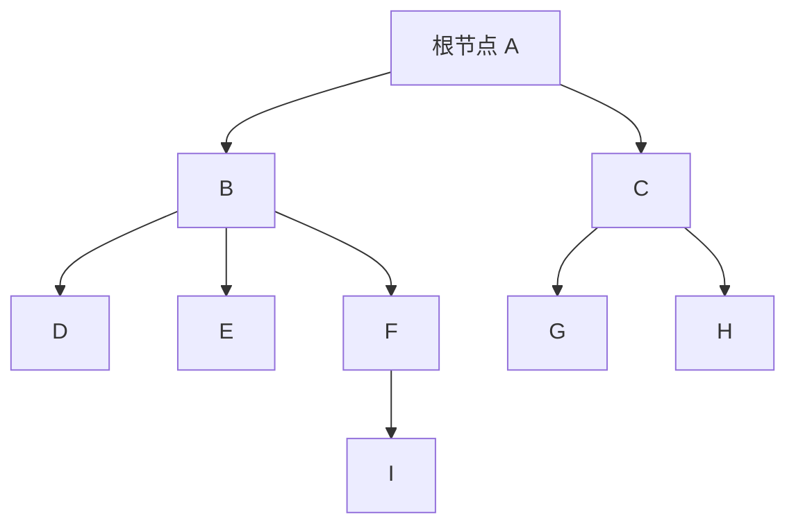
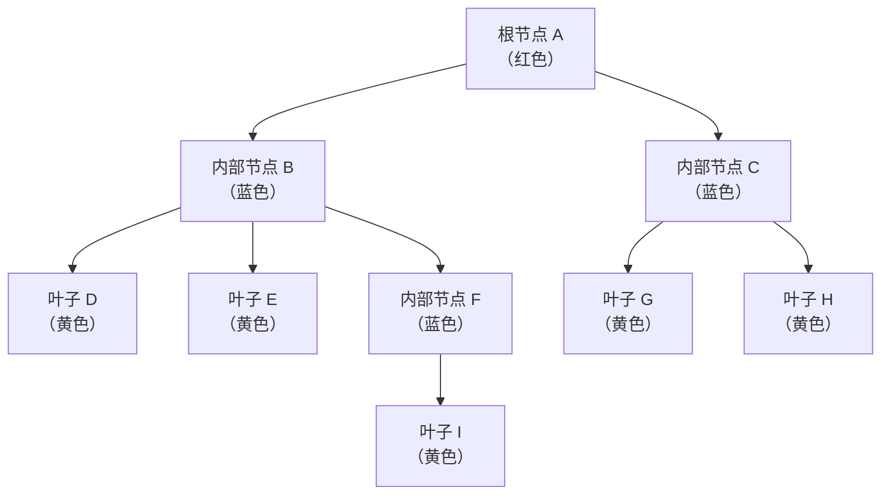
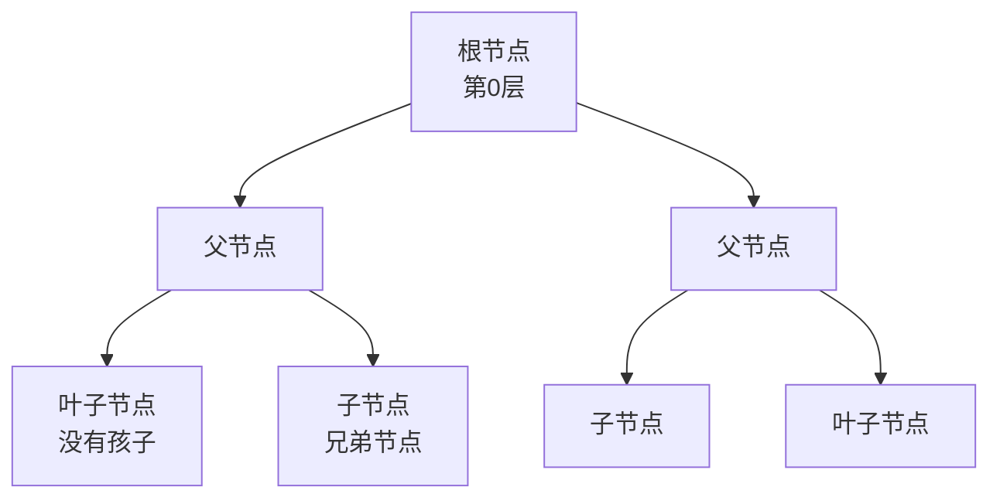
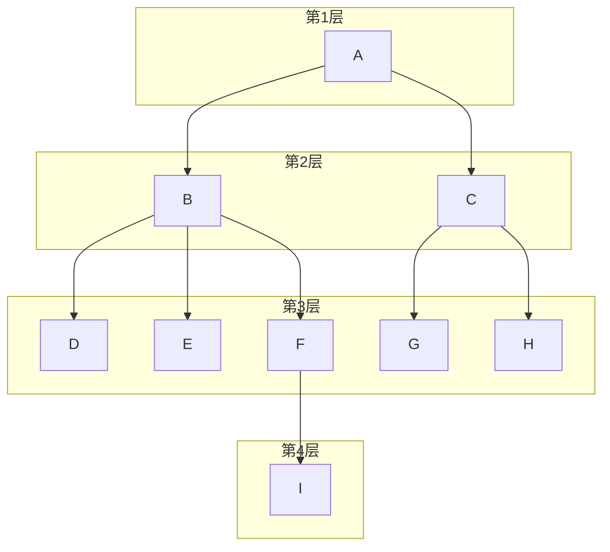
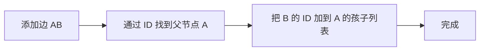

## 本节概述：树是什么

前面学的顺序表、栈、队列都是**线性结构**——一个接一个，一条线。

从这节课开始学**树（Tree）**——一种**非线性结构**，一个节点可以有多个后继，像一棵倒过来的树。

## 树的定义

树是 **N 个节点的有序集合**。

- 当 N = 0 时，叫**空树**
- 当 N > 0 时，满足两个条件：
  1. **有且仅有一个根节点（Root）**——最顶上那个节点
  2. 当 N > 1 时，其余节点分成 M 个**互不相交**的有限集合，每个集合本身又是一棵树，叫根节点的**子树**



> 图中：
> - A 是根节点
> - B 和 C 是 A 的两棵子树
> - D、E、F 是 B 的三棵子树
> - G、H 是 C 的两棵子树
> - I 是 F 的一棵子树

> [!TIP]
> **树的定义是递归的**——树的定义里又用到了树的概念（子树本身也是树）。
>
> 递归是树的核心思想，后面学遍历的时候会反复用到。

## 怎么判断是不是树

最简单的判断方法：**有环就不是树**。

| 结构 | 是不是树 | 原因 |
|---|---|---|
| 无环的连通图 | ✅ 是树 | 符合树的定义 |
| 有环的图 | ❌ 不是树 | 有环，子树相交了 |
| 不连通的图 | ❌ 不是树 | 那叫森林（多棵树） |

> 一句话：**树 = 无环 + 连通**。

## 节点的组成

树的每个节点包含：
- **数据域** — 存数据（可以是任意类型）
- **指针域** — M 个指针，指向它的子树

## 节点的分类

| 类型 | 定义 | 特点 |
|---|---|---|
| **根节点** | 最顶层的节点 | 有且只有一个，没有父节点 |
| **叶子节点** | 度为 0 的节点 | 没有子节点，在最底层 |
| **内部节点** | 除了根和叶子以外的节点 | 既有父节点又有子节点 |



> 根节点 1 个（A），内部节点 3 个（B、C、F），叶子节点 5 个（D、E、G、H、I）。

## 节点的度和树的度

**节点的度**：一个节点拥有的子树的个数。

- 叶子节点的度 = 0（没有子树）
- 内部节点的度 ≥ 1

**树的度**：树中所有节点的度的最大值。

比如上面那棵树：
- A 的度 = 2（两个子节点 B、C）
- B 的度 = 3（三个子节点 D、E、F）
- C 的度 = 2（两个子节点 G、H）
- F 的度 = 1（一个子节点 I）
- D、E、G、H、I 的度 = 0

最大的度是 3，所以**这棵树的度是 3**。

## 节点之间的关系

| 关系 | 定义 | 例子 |
|---|---|---|
| **孩子节点** | 子树的根节点 | D 是 B 的孩子 |
| **父节点** | 孩子节点的上一级 | B 是 D 的父节点 |
| **兄弟节点** | 同一个父节点的孩子之间 | B 和 C 互为兄弟 |

> 父子关系是相互的——你是我的孩子，我就是你的父节点。

### 树的术语标注



## 节点的层次和树的深度

**层次**：从根节点开始数，根是第 1 层，孩子是第 2 层，以此类推。

- 如果某个节点在第 i 层，它的孩子就在第 i+1 层

**深度（高度）**：树中节点的最大层次数。



> 这棵树有 4 层，所以**深度是 4**。

> [!NOTE]
> 有的教材根节点从第 0 层开始算，深度也相应减 1。
> 我们这里按视频里讲的，根是第 1 层。

## 森林

**森林** = M 棵互不相交的树的集合。

对于树的每个节点来说，它的所有子树放在一起就是一个森林。

比如上面那棵树中：
- A 的子树有两棵（B 为根的树、C 为根的树），这两棵组成一个森林
- B 的子树有三棵（D、E、F），这三棵也是一个森林

> 树和森林就差一个根——给森林加一个共同的根节点，就变成了一棵树。

## 树的存储表示

### 1. 节点 ID

为了方便操作，每个节点都有一个**唯一的 ID 编号**。

比如上面的树可以这样编号：
- A → ID 0
- B → ID 1
- C → ID 2
- D → ID 3
- E → ID 4
- F → ID 5
- G → ID 6
- H → ID 7
- I → ID 8

> 节点 ID 是唯一的，每个节点不一样。

### 2. 节点池（顺序表存储）

因为节点 ID 是从 0 开始连续的，所以可以把所有节点存在一个**顺序表（数组）**里——下标就是节点 ID。

```
节点池（数组）：
  0    1    2    3    4    5    6    7    8
+----+----+----+----+----+----+----+----+----+
| A  | B  | C  | D  | E  | F  | G  | H  | I  |
+----+----+----+----+----+----+----+----+----+
```

这样通过节点 ID 取节点就是**O(1)**——直接按下标索引。

### 3. 孩子节点列表

每个节点还要存一个**孩子节点列表**——记录它有哪些孩子。

- 叶子节点的孩子列表是空的
- 孩子列表可以用顺序表实现，也可以用链表实现

比如节点 A（ID 0）的孩子列表 = [1, 2]（B 和 C）
节点 B（ID 1）的孩子列表 = [3, 4, 5]（D、E、F）

### 4. 怎么添加一条边

添加边 AB（A 是父，B 是子）：
1. 通过父节点 ID 找到父节点 A
2. 把孩子节点 B 的 ID 添加到 A 的孩子列表里

所有边都加完了，这棵树就建好了。



> 添加边的时候，只需要在父节点的孩子列表里加一条记录就行——不需要在孩子节点里也记父节点（当然也可以记，看需求）。

## 树的遍历

树的遍历就是把树里所有节点都访问一遍。

因为树是递归结构，所以遍历也是用**递归**来做的——访问根节点，然后递归遍历每一棵子树。

> 遍历的详细内容后面学算法的时候再深入讲，现在先知道：**树是递归的，遍历用递归**。

## 本章小结

**树** = N 个节点的层次结构，根节点唯一，子树互不相交，递归定义。

**核心概念**：
1. **节点分类** — 根节点（1个）、内部节点、叶子节点（度为0）
2. **度** — 节点的子树个数；树的度 = 最大节点度
3. **关系** — 父子、兄弟
4. **层次和深度** — 根是第 1 层，最大层次是深度
5. **森林** — 多棵互不相交的树

**存储方式**：
- 节点用顺序表存（节点池），ID 当下标，O(1) 访问
- 每个节点存一个孩子列表（顺序表或链表）
- 添加边 = 把孩子 ID 加到父节点的孩子列表

