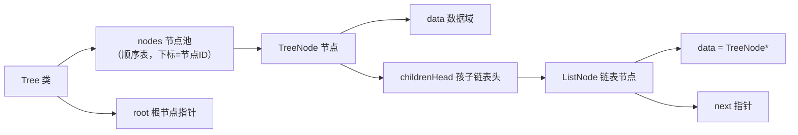

## 本节概述：手写 Tree 类

上节课讲了树的概念——根节点、子树、孩子列表、节点池。

这节课用 C++ 把树的数据结构写出来。孩子列表用**链表**实现，节点池用**顺序表**实现。

## 整体架构



> 三层结构：
> 1. **Tree** — 整棵树，管节点池和根节点
> 2. **TreeNode** — 树节点，存数据 + 孩子链表头
> 3. **ListNode** — 链表节点，存的是 TreeNode*（指向子节点的指针）

## 第一步：链表节点 ListNode

孩子列表用链表实现，所以先写链表节点。

链表节点存的不是普通数据，而是**树节点的指针**（TreeNode\*）——所以用模板。

```cpp
template <typename T>
struct ListNode {
    T data;             // 数据域（存的是 TreeNode*）
    ListNode* next;     // 指针域

    ListNode(T d) : data(d), next(NULL) {}
};
```

> 构造函数用初始化列表，data 赋值，next 置空。

## 第二步：树节点 TreeNode

树节点有两部分：
- **数据域** — 存节点的数据（模板 T，可以是任意类型）
- **孩子链表头** — 指向孩子链表的第一个节点

```cpp
template <typename T>
struct TreeNode {
    T data;                              // 数据域
    ListNode<TreeNode<T>*>* childrenHead; // 孩子链表头指针

    TreeNode() : childrenHead(NULL) {}   // 构造函数，孩子链表初始为空
};
```

> [!WARNING]
> **TreeNode 一定要写构造函数！**
>
> 不写的话，`childrenHead` 是未初始化的野指针，遍历时访问会崩溃（VS 会直接报错，在线编译器可能侥幸通过）。
>
> 老师视频里就踩了这个坑——后面补上了构造函数才正常运行。

## 第三步：TreeNode 添加子节点 addChild

给当前节点添加一个子节点——就是往孩子链表里头插一个节点。

```cpp
template <typename T>
void TreeNode<T>::addChild(TreeNode<T>* node) {
    // 1. 新建一个链表节点，存的是子节点指针
    ListNode<TreeNode<T>*>* childNode = new ListNode<TreeNode<T>*>(node);

    // 2. 头插法
    if (childrenHead == NULL) {
        childrenHead = childNode;                    // 链表为空，直接当第一个
    } else {
        childNode->next = childrenHead;              // 新节点的 next 指向原来的头
        childrenHead = childNode;                    // 头指针前移到新节点
    }
}
```

> 为什么用头插法？
> 因为头插是 **O(1)** —— 不需要遍历到尾部，直接在最前面插。
>
> 孩子的顺序不重要的话，头插最省事。

## 第四步：Tree 类定义

Tree 类管整棵树，包含：
- **nodes** — 节点池（顺序表，下标就是节点 ID）
- **root** — 根节点指针

```cpp
template <typename T>
class Tree {
private:
    TreeNode<T>* nodes;    // 节点池（数组）
    TreeNode<T>* root;     // 根节点指针

public:
    Tree();                       // 默认构造函数
    Tree(int maxNodes);           // 指定最大节点数的构造函数
    ~Tree();                      // 析构函数

    TreeNode<T>* getTreeNode(int id);   // 通过 ID 获取节点指针
    void setRoot(int rootId);           // 设置根节点
    void addChild(int parentId, int sonId);  // 添加边（父子关系）
    void assignData(int nodeId, T data);     // 设置节点数据
    void print(TreeNode<T>* node = NULL);    // 深度优先遍历打印
};
```

> 节点池用数组存，所以节点 ID 从 0 开始连续编号。
> 通过 ID 取节点就是按下标取，O(1)。

## 构造函数

默认构造函数：申请 1024 个节点的空间（够用就行）。

```cpp
template <typename T>
Tree<T>::Tree() {
    nodes = new TreeNode<T>[1024];   // 默认 1024 个节点
    root = NULL;
}
```

指定最大节点数的构造函数：

```cpp
template <typename T>
Tree<T>::Tree(int maxNodes) {
    nodes = new TreeNode<T>[maxNodes];   // 指定大小
    root = NULL;
}
```

## 析构函数

释放节点池数组。

```cpp
template <typename T>
Tree<T>::~Tree() {
    delete[] nodes;   // 释放整个节点池
}
```

> 用 `new[]` 申请的，用 `delete[]` 释放。
>
> 这里只释放了节点池，孩子链表的节点没释放——更完整的实现需要递归释放每个节点的孩子链表。初学阶段先理解核心结构。

## 通过 ID 获取节点 getTreeNode

直接按下标取，然后取地址返回指针。

```cpp
template <typename T>
TreeNode<T>* Tree<T>::getTreeNode(int id) {
    return &nodes[id];    // 取下标为 id 的节点，返回地址
}
```

> 时间复杂度：**O(1)**
>
> 节点池是数组，按下标直接访问，这也是用节点池的最大好处。

## 设置根节点 setRoot

通过 ID 拿到节点，赋值给 root。

```cpp
template <typename T>
void Tree<T>::setRoot(int rootId) {
    root = getTreeNode(rootId);
}
```

> 根节点就是整棵树的入口，有了根就能遍历整棵树。

## 添加子节点 addChild

添加一条边——把父节点和子节点连起来。

```cpp
template <typename T>
void Tree<T>::addChild(int parentId, int sonId) {
    // 1. 通过 ID 拿到父节点和子节点
    TreeNode<T>* parentNode = getTreeNode(parentId);
    TreeNode<T>* sonNode = getTreeNode(sonId);

    // 2. 调用父节点的 addChild，把子节点加进孩子链表
    parentNode->addChild(sonNode);
}
```

> 思路：
> - 先通过两个 ID 找到两个节点
> - 然后调用父节点的 addChild 方法（就是第二步写的那个头插法）
> - 时间复杂度：**O(1)**（头插法）

## 设置节点数据 assignData

给指定 ID 的节点设置数据。

```cpp
template <typename T>
void Tree<T>::assignData(int nodeId, T data) {
    TreeNode<T>* node = getTreeNode(nodeId);
    node->data = data;
}
```

> 指针用箭头 `->` 访问成员变量。

## 深度优先遍历 print

这是最精彩的部分——**递归遍历**。

传 NULL（默认值）表示从根节点开始遍历。

```cpp
template <typename T>
void Tree<T>::print(TreeNode<T>* node) {
    // 1. 如果 node 是 NULL，从根节点开始
    if (node == NULL) {
        node = root;
    }

    // 2. 先打印当前节点
    cout << node->data;

    // 3. 遍历孩子链表，递归打印每个孩子
    ListNode<TreeNode<T>*>* tmp = node->childrenHead;
    while (tmp != NULL) {
        print(tmp->data);          // 递归！tmp->data 就是孩子节点指针
        tmp = tmp->next;
    }
}
```

> 这就是**深度优先搜索（DFS）**——一条路走到黑，走到底了再回溯。
>
> 过程：
> 1. 打印当前节点
> 2. 递归遍历第一个孩子（一条路走到底）
> 3. 第一个孩子遍历完了，回来遍历第二个孩子
> 4. ...以此类推

## 完整代码汇总

```cpp
#include <iostream>
using namespace std;

// ====== 链表节点 ======
template <typename T>
struct ListNode {
    T data;
    ListNode* next;
    ListNode(T d) : data(d), next(NULL) {}
};

// ====== 树节点 ======
template <typename T>
struct TreeNode {
    T data;
    ListNode<TreeNode<T>*>* childrenHead;

    TreeNode() : childrenHead(NULL) {}

    void addChild(TreeNode<T>* node) {
        ListNode<TreeNode<T>*>* childNode = new ListNode<TreeNode<T>*>(node);
        if (childrenHead == NULL) {
            childrenHead = childNode;
        } else {
            childNode->next = childrenHead;
            childrenHead = childNode;
        }
    }
};

// ====== 树类 ======
template <typename T>
class Tree {
private:
    TreeNode<T>* nodes;
    TreeNode<T>* root;

public:
    Tree();
    Tree(int maxNodes);
    ~Tree();

    TreeNode<T>* getTreeNode(int id);
    void setRoot(int rootId);
    void addChild(int parentId, int sonId);
    void assignData(int nodeId, T data);
    void print(TreeNode<T>* node = NULL);
};

// 默认构造函数
template <typename T>
Tree<T>::Tree() {
    nodes = new TreeNode<T>[1024];
    root = NULL;
}

// 指定大小的构造函数
template <typename T>
Tree<T>::Tree(int maxNodes) {
    nodes = new TreeNode<T>[maxNodes];
    root = NULL;
}

// 析构函数
template <typename T>
Tree<T>::~Tree() {
    delete[] nodes;
}

// 通过 ID 获取节点
template <typename T>
TreeNode<T>* Tree<T>::getTreeNode(int id) {
    return &nodes[id];
}

// 设置根节点
template <typename T>
void Tree<T>::setRoot(int rootId) {
    root = getTreeNode(rootId);
}

// 添加边
template <typename T>
void Tree<T>::addChild(int parentId, int sonId) {
    TreeNode<T>* parentNode = getTreeNode(parentId);
    TreeNode<T>* sonNode = getTreeNode(sonId);
    parentNode->addChild(sonNode);
}

// 设置节点数据
template <typename T>
void Tree<T>::assignData(int nodeId, T data) {
    TreeNode<T>* node = getTreeNode(nodeId);
    node->data = data;
}

// 深度优先遍历打印
template <typename T>
void Tree<T>::print(TreeNode<T>* node) {
    if (node == NULL) {
        node = root;
    }
    cout << node->data;

    ListNode<TreeNode<T>*>* tmp = node->childrenHead;
    while (tmp != NULL) {
        print(tmp->data);
        tmp = tmp->next;
    }
}
```

## main 函数测试

构建这棵树：

```
      A
    /   \
   B     C
  /|\   / \
 D E F G   H
     |
     I
```

```cpp
int main() {
    Tree<char> t(9);   // 9 个节点

    // 设置根节点
    t.setRoot(0);

    // 设置每个节点的数据
    t.assignData(0, 'A');
    t.assignData(1, 'B');
    t.assignData(2, 'C');
    t.assignData(3, 'D');
    t.assignData(4, 'E');
    t.assignData(5, 'F');
    t.assignData(6, 'G');
    t.assignData(7, 'H');
    t.assignData(8, 'I');

    // 添加边（父节点 -> 子节点）
    t.addChild(0, 1);    // A -> B
    t.addChild(0, 2);    // A -> C
    t.addChild(1, 3);    // B -> D
    t.addChild(2, 4);    // C -> E
    t.addChild(2, 5);    // C -> F
    t.addChild(3, 6);    // D -> G
    t.addChild(3, 7);    // D -> H
    t.addChild(3, 8);    // D -> I

    // 深度优先遍历打印
    t.print();
    cout << endl;

    return 0;
}
```

运行结果：

```
ABDIGHICEF
```

> 遍历顺序（深度优先）：
> A → B → D → I → G → H → 回溯到 B → E → 回溯到 A → C → F
>
> 因为用的是头插法，孩子顺序是反的——先加的在后面。

## 易错点总结

> [!WARNING]
> 1. **TreeNode 一定要写构造函数** — 不写 childrenHead 就是野指针，遍历时崩（老师视频里踩过的坑）
> 2. **孩子列表用头插法，顺序是反的** — 先 add 的孩子反而在后面，遍历时从最后一个孩子开始
> 3. **节点池是数组，ID 就是下标** — 从 0 开始连续编号，不能跳
> 4. **print 的默认参数是 NULL** — 不传参数就从根节点开始遍历
> 5. **递归遍历要注意终止条件** — 孩子链表遍历完（tmp == NULL）就回溯
> 6. **析构函数只释放了节点池** — 孩子链表的 ListNode 没释放，完整实现需要递归释放

## 本章小结

**手写 Tree 类** = 节点池（顺序表） + 孩子链表（链表） + 递归遍历。

**三层结构**：
1. **Tree** — 管节点池和根节点
2. **TreeNode** — 数据域 + 孩子链表头
3. **ListNode** — 存 TreeNode\* 的链表节点

**核心操作**：
- **getTreeNode** — 按下标取节点，O(1)
- **addChild** — 头插法加孩子，O(1)
- **print** — 深度优先遍历，递归实现

**最大的坑**：TreeNode 没写构造函数导致 childrenHead 是野指针。

