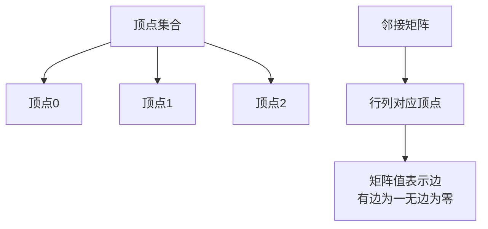
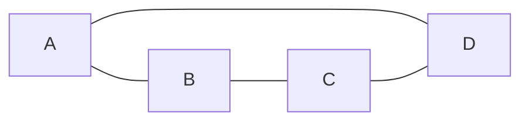
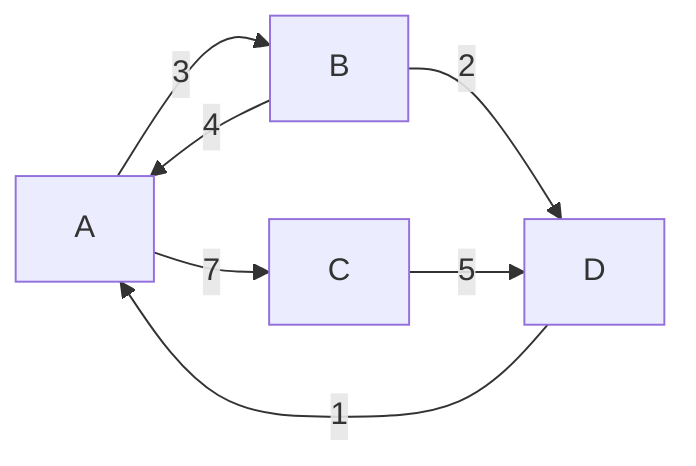

## 本节概述：邻接矩阵是什么

图的存储方式最常用的有两种：**邻接矩阵**和**邻接表**。这节课学第一种——邻接矩阵。

顶点用一维顺序表存，边是顶点和顶点之间的关系，一维存不下，所以用**二维顺序表（矩阵）**来存。

## 邻接矩阵的定义

n 个顶点的图，邻接矩阵是一个 **n × n 的方阵**（行数 = 列数 = 顶点数）。

- 行号 = 起点顶点
- 列号 = 终点顶点
- `adj[i][j]` 的值表示顶点 i 到顶点 j 有没有边

> 邻接矩阵统一按**有向**来理解——有向图可以兼容无向图。
> 无向图的邻接矩阵就是**沿主对角线对称**的（A到B有边则B到A也有边）。

### 图到矩阵的对应关系

## 无权图的邻接矩阵

无权图的邻接矩阵只有两种值：
- **1** — 有边
- **0** — 没边

举个例子，4 个顶点的无向图：

顶点表：

| 下标 | 0 | 1 | 2 | 3 |
|---|---|---|---|---|
| 顶点 | A | B | C | D |

邻接矩阵：

|  | A(0) | B(1) | C(2) | D(3) |
|---|---|---|---|---|
| **A(0)** | 0 | 1 | 0 | 1 |
| **B(1)** | 1 | 0 | 1 | 0 |
| **C(2)** | 0 | 1 | 0 | 1 |
| **D(3)** | 1 | 0 | 1 | 0 |

> 来检查几个：
> - `adj[0][1] = 1` → A 到 B 有边 ✅
> - `adj[2][0] = 0` → C 到 A 没边 ✅
> - 主对角线 `adj[i][i]` 全是 0 → 没有自环 ✅
> - 沿对角线对称 → 无向图 ✅

### 从邻接矩阵能看出什么

| 想知道什么 | 怎么做 | 时间复杂度 |
|---|---|---|
| 两点之间有没有边 | 直接看 `adj[i][j]` 是 0 还是 1 | **O(1)** |
| 顶点 i 的度（无向图） | 第 i 行所有元素求和 | O(n) |
| 顶点 i 的出度（有向图） | 第 i 行所有元素求和 | O(n) |
| 顶点 i 的入度（有向图） | 第 i 列所有元素求和 | O(n) |
| 顶点 i 的所有邻居 | 扫描第 i 行，值为 1 的列号就是邻居 | O(n) |

> 邻接矩阵查边是 O(1)，这是它最大的优势。

## 带权图的邻接矩阵

带权图（网）的邻接矩阵里存的不是 0/1，而是**边的权值**。

- 有边 → 存**权值**
- 没边 → 存一个**特殊标记值**

特殊标记怎么选？

| 情况 | 用什么表示"无边" |
|---|---|
| 权值都是正数 | 0 或 -1 |
| 权值可能为 0 | 用 -1 |
| 权值可能为负数 | 用一个不可能取到的特殊值（如 INF 无穷大） |

> 核心原则：标记值不能跟合法权值冲突。
> 实际算法题里最常用的是 **INF（无穷大）**，一般用 `0x3f3f3f3f` 或 `INT_MAX` 表示。

举个例子，4 个顶点的有向带权图：

邻接矩阵（无边用 INF 表示）：

|  | A(0) | B(1) | C(2) | D(3) |
|---|---|---|---|---|
| **A(0)** | 0 | 3 | 7 | INF |
| **B(1)** | 4 | 0 | INF | 2 |
| **C(2)** | INF | INF | 0 | 5 |
| **D(3)** | 1 | INF | INF | 0 |

> `adj[0][1] = 3` → A 到 B 的边权重是 3
> `adj[1][0] = 4` → B 到 A 的边权重是 4
> `adj[0][3] = INF` → A 到 D 没有直接边
>
> 有向图的矩阵不对称——这是跟无向图最直观的区别。

> [!NOTE]
> 主对角线 `adj[i][i]` 存 0 还是 INF？
> 视情况而定。一般认为自己到自己距离为 0，但有些算法里为了统一处理会设成 INF。
> 大多数场景下设 0 更自然。

## 邻接矩阵的优缺点

| 优点 | 缺点 |
|---|---|
| **简单直观** — 二维数组，一看就懂 | **空间复杂度高** — O(n²)，大图浪费严重 |
| **查边 O(1)** — 直接索引，速度最快 | **不适合稀疏图** — 大量位置是 0/INF，浪费空间 |
| **算法实现简单** — 遍历、连通性检测等写起来方便 | 找所有邻居要扫一整行，O(n) |

> 什么时候用邻接矩阵？
> - 顶点数不多（比如 n ≤ 1000）
> - 稠密图（边比较多）
> - 需要频繁查询两点之间有没有边
>
> 顶点很多的稀疏图 → 用邻接表更合适（下节课学）。

## 本章小结

**邻接矩阵** = 用 n × n 的二维数组表示图，行是起点，列是终点。

**无权图**：`adj[i][j] = 1` 表示有边，`0` 表示没边。
**带权图**：`adj[i][j]` = 权值，无边用特殊标记（0 / -1 / INF）。

**无向图**的邻接矩阵沿主对角线对称；**有向图**不对称。

**核心操作效率**：
- 查边：**O(1)** — 最大优势
- 算度：O(n) — 行/列求和
- 找邻居：O(n) — 扫一行

**适用场景**：顶点少、稠密图、需要频繁查边。
稀疏大图用邻接表更省空间。
