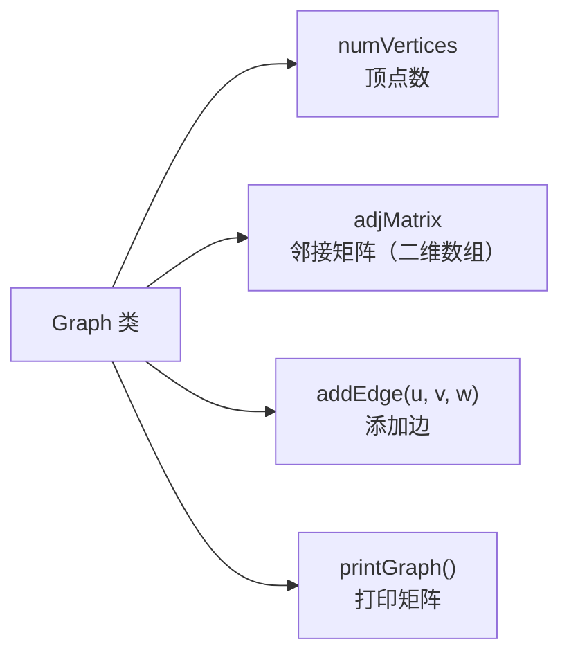

## 本节概述：手写 Graph 邻接矩阵类

上节课讲了邻接矩阵的概念——n × n 的二维数组，行起点列终点，存边权。

这节课用 C++ 写一个邻接矩阵的图类，实现建图、加边、打印。

## 整体架构



> 非常简单的结构：存顶点数 + 二维数组，提供加边和打印两个核心操作。

## INF 宏定义

用 `INF` 表示"两个顶点之间没有边"，值设为 -1。

```cpp
#define INF -1
```

> 为什么用 -1？
> 因为这节课的边权都是正数，-1 不会跟合法权值冲突。
> 如果边权可能为负数，就得换成其他不可能取到的值（比如 INT_MAX 表示无穷大）。

## Graph 类定义

```cpp
class Graph {
private:
    int numVertices;    // 顶点个数
    int** adjMatrix;    // 邻接矩阵（二级指针，二维数组）

public:
    Graph(int vertices);   // 构造函数
    ~Graph();              // 析构函数

    void addEdge(int u, int v, int w);  // 添加一条 u 到 v 的边，权为 w
    void printGraph();                  // 打印邻接矩阵
};
```

> `int** adjMatrix` — 二级指针，指向一个指针数组。
> 每个指针又指向一个一维数组，合起来就是二维数组。

## 构造函数

两步：申请行 + 申请每一行 + 初始化为 INF。

```cpp
Graph::Graph(int vertices) {
    numVertices = vertices;

    // 1. 申请行（指针数组）
    adjMatrix = new int*[numVertices];

    // 2. 为每一行申请列空间，并初始化为 INF
    for (int i = 0; i < numVertices; i++) {
        adjMatrix[i] = new int[numVertices];
        for (int j = 0; j < numVertices; j++) {
            adjMatrix[i][j] = INF;   // 初始无边
        }
    }
}
```

> 三层循环结构：
> - 外层：遍历每一行
> - 内层：遍历每一列，赋值为 INF
>
> 初始化完成后，矩阵里全是 -1，表示任意两个顶点之间都没有边。

## 析构函数

跟申请反过来：先删每一行，再删行数组本身。

```cpp
Graph::~Graph() {
    // 1. 释放每一行
    for (int i = 0; i < numVertices; i++) {
        delete[] adjMatrix[i];
    }

    // 2. 释放行指针数组
    delete[] adjMatrix;
}
```

> [!WARNING]
> **释放顺序不能反！**
> 先释放每一行（内层数组），再释放行指针数组。
> 如果先删了 adjMatrix，就找不到每一行的地址了——内存泄漏。

## 添加边 addEdge

直接给对应位置赋值，O(1)。

```cpp
void Graph::addEdge(int u, int v, int w) {
    adjMatrix[u][v] = w;
}
```

> 就是这么简单——一行搞定。
>
> 如果是无向图，要加两行：
> ```cpp
> adjMatrix[u][v] = w;
> adjMatrix[v][u] = w;
> ```
> 这节课实现的是有向图版本。

## 打印邻接矩阵 printGraph

两层循环打印二维数组。

```cpp
void Graph::printGraph() {
    for (int i = 0; i < numVertices; i++) {
        for (int j = 0; j < numVertices; j++) {
            cout << adjMatrix[i][j] << "\t";
        }
        cout << endl;
    }
}
```

> 用 `\t`（制表符）对齐，输出的矩阵整整齐齐。

## 完整代码汇总

```cpp
#include <iostream>
using namespace std;

#define INF -1   // 表示无边

class Graph {
private:
    int numVertices;
    int** adjMatrix;

public:
    Graph(int vertices);
    ~Graph();

    void addEdge(int u, int v, int w);
    void printGraph();
};

// 构造函数
Graph::Graph(int vertices) {
    numVertices = vertices;
    adjMatrix = new int*[numVertices];

    for (int i = 0; i < numVertices; i++) {
        adjMatrix[i] = new int[numVertices];
        for (int j = 0; j < numVertices; j++) {
            adjMatrix[i][j] = INF;
        }
    }
}

// 析构函数
Graph::~Graph() {
    for (int i = 0; i < numVertices; i++) {
        delete[] adjMatrix[i];
    }
    delete[] adjMatrix;
}

// 添加边
void Graph::addEdge(int u, int v, int w) {
    adjMatrix[u][v] = w;
}

// 打印邻接矩阵
void Graph::printGraph() {
    for (int i = 0; i < numVertices; i++) {
        for (int j = 0; j < numVertices; j++) {
            cout << adjMatrix[i][j] << "\t";
        }
        cout << endl;
    }
}
```

## main 函数测试

构建一个 5 个顶点的有向带权图：

```
    0 →1 (权1)
    0 →2 (权3)
    1 →2 (权2)
    2 →3 (权7)
    3 →4 (权9)
    4 →0 (权4)
    4 →2 (权5)
```

```cpp
int main() {
    Graph g(5);   // 5 个顶点

    // 添加 7 条边
    g.addEdge(0, 1, 1);
    g.addEdge(0, 2, 3);
    g.addEdge(1, 2, 2);
    g.addEdge(2, 3, 7);
    g.addEdge(3, 4, 9);
    g.addEdge(4, 0, 4);
    g.addEdge(4, 2, 5);

    // 打印邻接矩阵
    g.printGraph();

    return 0;
}
```

运行结果：

```
-1      1       3       -1      -1
-1      -1      2       -1      -1
-1      -1      -1      7       -1
-1      -1      -1      -1      9
4       -1      5       -1      -1
```

> 来验证几个：
> - 第 0 行第 1 列 = 1 → 0→1 权 1 ✅
> - 第 0 行第 2 列 = 3 → 0→2 权 3 ✅
> - 第 2 行第 3 列 = 7 → 2→3 权 7 ✅
> - 第 4 行第 0 列 = 4 → 4→0 权 4 ✅
> - 第 4 行第 2 列 = 5 → 4→2 权 5 ✅
> - 对角线全是 -1 → 无自环 ✅

## 易错点总结

> [!WARNING]
> 1. **二级指针申请和释放顺序** — 申请先建行再建列，释放先删列再删行，顺序不能反
> 2. **INF 值的选择** — 要跟合法权值不冲突，正权用 -1，有负权用 INF 特殊值
> 3. **有向图只赋值一次** — `adj[u][v] = w`，无向图要双向赋值
> 4. **下标从 0 开始** — 顶点编号从 0 到 n-1，别越界
> 5. **new 和 delete 配对** — 用 `new[]` 申请的用 `delete[]` 释放，别漏括号

## 本章小结

**邻接矩阵图类** = 顶点数 + 二维数组（二级指针实现）+ 加边 + 打印。

**核心操作**：
- **构造** — 先申请行数组，再给每行列申请空间，全部初始化为 INF
- **析构** — 先释放每一行，再释放行数组（跟申请反着来）
- **addEdge** — 直接赋值 `adj[u][v] = w`，O(1)
- **printGraph** — 两层循环打印二维数组

**设计要点**：
- 用 `int**` 二级指针动态申请二维数组
- 用 INF 宏定义表示无边，方便统一修改
- 有向图版本，无向图只需双向加边即可
